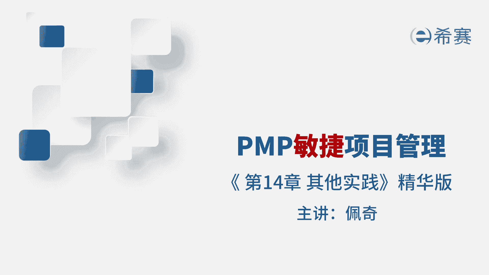
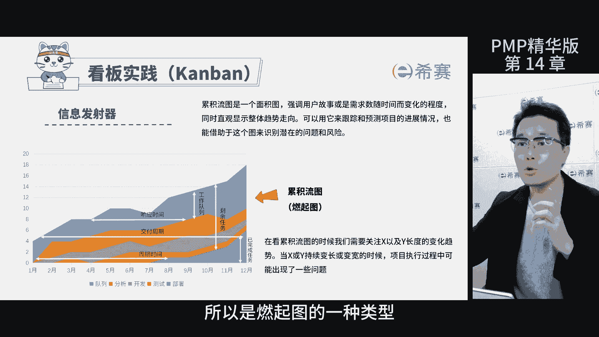
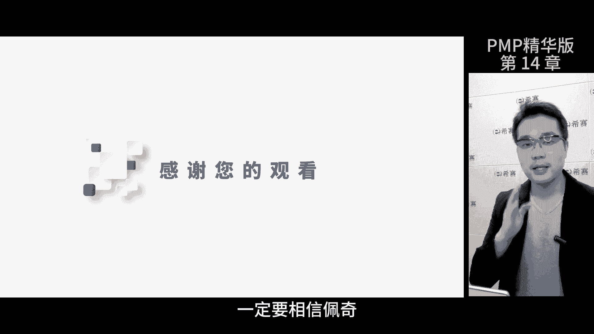

# 强！pmp高效备考，136分钟快速通关PMP项目管理考试精华版课程 - P18：第14章 敏捷其他实践 精华版 - 不爱哭的美少女 - BV1US411P71U

我是佩奇，本期讲解敏捷其他实验计划版内容，那这是考评目录啊，暂停回忆再继续，极限编程呢简称XP是一种软件开发方式，他把复杂的开发过程，拆分成了一个一个相对简单的迭代，那这里的极限主要有两层意思。

一个是追求质量的极限，就是在开发过程中就要考虑质量，而不是等到最后测试环节，第二个呢是反馈周期的极限，实现实时反馈，在XP中有五个核心实践，大家要掌握，一是结对编程，两个人一起编程，一个人写代码。

一个人观察，以便实时反馈，第二持续集成，把写好的代码及时地集成到应用程序中去，提前发现问题并改正，第3TDD先编写测试代码，然后围绕测试代码进行编程，第四重构在不改变代码功能的前提下，优化代码结构。

五自动化测试，在持续集成过程中引入自动化测试程序，提高测试的效率，来说一说XP和gram的区别，scram更注重管理，所以它是管理实践，关注框架和流程，而XP更偏向于技术。

那下面这张表呢从四个方面对比了两者的区别，重点是要了解迭代内需求的变更，SCM原则上是不允许迭代内变更的，而XP可以进行置换，所以XP更彻底的拥抱了变化，所以也是一种极限。

另外迭代内对用户故事的优先级排序，两者的态度完全不同，原因在于gram提供的是管理框架，而XP覆盖了完整的技术开发流程，那这点在工程实践这一栏里面也得到了体现，看板是传递信息的一种形式。

是为了将信息进行可视化管理，那这张图呢是一块看板，每一列称为甬道，通过看板可以清晰地展现出项目的状态，比如说当工作不均衡的时候，出现瓶颈等项目执行问题的时候，就可以通过看板管理来发现看板。

核心实践的第二条限制在制品，什么意思呢，就是在每个甬道上面这个红色数字啊，代表了这个流程的工作任务数不能超过它，原因在于过多的任务会拖慢团队的效率，同时会导致问题的出现，出现团队能力的瓶颈。

为了避免这种情况，就要对于任务的数量进行限制，这一点也吻合了敏捷中可持续开发这个原则，累积流图通过不同颜色表示不同的环节，这里的队列就是代办，从代办到部署，展现了项目不同环节的任务数，用图来展示。

方便查看，最大的优势是可以对项目进行预测，因为随着时间的推移，可以展现出完成的情况，所以是燃起图的一种类型。

那这里只要知道累积流图的概念就行了，精益是将精益生产方法用于软件开发，本质其实就是消除浪费嘛，那重点要了解精益的七个核心原则，其中晚做决策说的不是时间的晚，而是空间上的晚。

应该在决策前尽量找到所有可能的方案，充分的讨论沟通评估各种选择，以此呢达到团队的共识，在共识的基础之上再进行最终决策，这样以确保做出最佳的决定，其他几条都比较好理解，在此就不啰嗦了啊。

价值流图通过分析信息和材料的流通环节，进而找到其中的浪费的地方，比如说时间浪费，人员浪费，资金浪费等等，由团队共同完成一起定义，并指出浪费的环节，其目的就是在于减少过程的浪费。

到现在所有的精华版内容就已经讲完了，建议大家按照我第一节课说的，四次复习的时间进行，既轻松呢又高效，除了考试，咱们更多的还是希望获得经验，尤其是技术转管理的经验，我会更新到我的账号里面。

大家感兴趣的可以关注一下，希望大家在成长的道路上，顺便拿几个证，成长和考试一样，要找对方法，不要太苛责自己，那学好一项能力呢需要多次的反复啊，就像敏捷管理是一样的，高频迭代，祝大家3A通过。

一定要相信自己。

相信佩奇体验课到此结束。