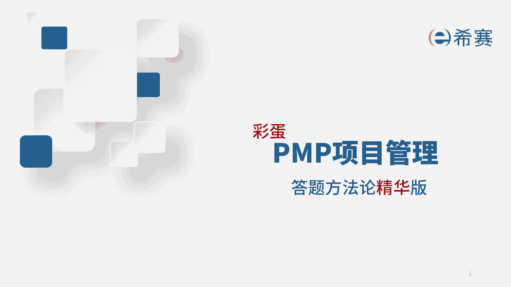
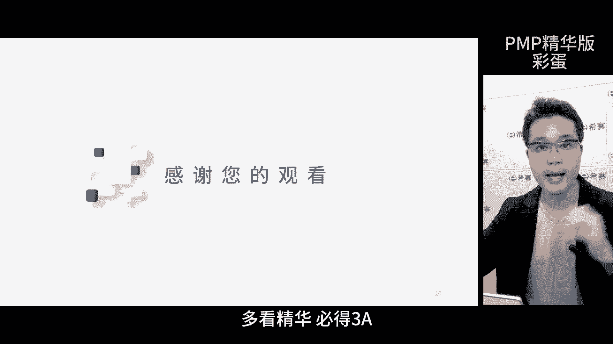
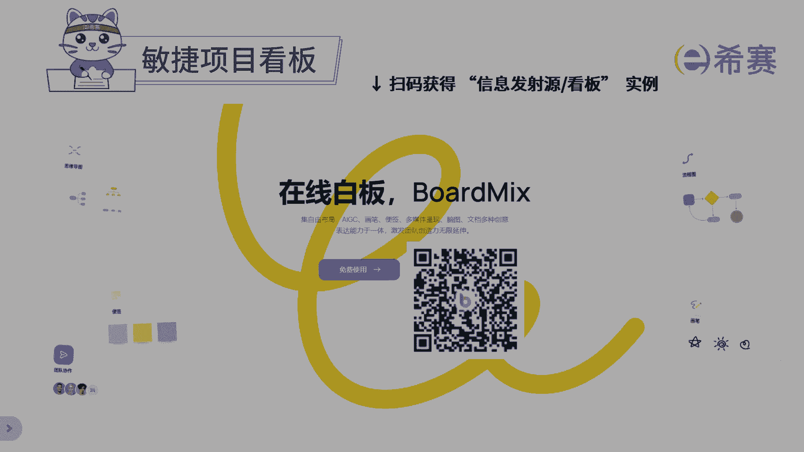

# 强！pmp高效备考，136分钟快速通关PMP项目管理考试精华版课程 - P19：第15章 答题方法论 精华版new - 不爱哭的美少女 - BV1US411P71U

我是佩奇，今天讲解PMP的考试如何做透，在考试的时候，我们一分半内就要完成一道题，今天我们把这一分半放慢，非常非常的慢，进行刻意练习，做题的过程啊，分为三步，阅读思考决策，阅读的时候千万不要逐字阅读。

否则时间不够，你肯定过不了，要找关键词，即便是一开始找不对啊，也没关系，继续找，不要放弃，那接着呢就是思考环节要进行流程化思考，不要逐层的思考，例如在图书馆里面借书，先看楼层，再找区域和书架。

最后才看具体的书名儿，去医院时也是一样的，咱们不可能在门诊楼里面找到住院部的科室吧，做决策不要凭感觉，要通过推导来找出考点，即使真的想不出来，也要排除两个，然后二选一，那解题的关键在于把握三个方面。

关键词，知识点和坑点，这三个点搞清楚就能避免选错了，PNP考试呢不是非黑即白，而是寻找最佳实践，大多数情况下，两个或者三个选项都可能是对的，在这里面选择一个最好的，所以务必要掌握它们仨啊，解题步骤如下。

首先看清问题，尤其是一些混合题型题目中，可能会问你是在预测还是在敏捷，所以一定要先看清楚问题，其次看选项，快速找出答案，如果还对答案不确定，那再看几个，比如看到问题是项目经理下一步做什么，直接看选项。

看看有没有前后顺序之分，有的话就直接四部曲，五秒钟就搞定这道题了，PMP考试呢大体分成三种考内容，考流程，考最佳实践，用我精华版里的解题技巧就可以了啊，能确保你顺利通过考试，每次做题都要有心法。

明确这道题的知识点在哪儿，出题人想考哪个点，具体的考法和解法也就出来了，那实战一下这道题，先看问题啊，问项目经理应该做些什么，有应该俩字儿，考法是最佳实践，接着看选项，发现它们之间没有什么规律和顺序哈。

最后看题干这一圈，我们看完了，大家能回忆起哪些知识点，可以先暂停视频，好好想想，能想出来多少就想出多少啊，然后再继续，这是本题对应的知识点，回忆起来后呢，要在这里面找到本题的考点。

考点一定是题干中有的选项中也有，并且之间有联系的那个知识点，选项A和D讲的是变更，题干中没有提变更，所以排除选项B和C比较难区分了，看一下题干中的一句话，项目经理发现一些要求。

似乎与项目章程中规定的要求不同，项目章程已经批准了，而且文件中有清晰的描述了客户的要求，现在发现要求与批准的文件不一致，我举个例子啊，比如说文件中规定，本项目系统需要集成CRM工具。

但是在项目范围管理过程中，客户希望系统能够支持第三方社交平台，唉这就是要求不同，那到底按哪个来啦，若是调整项目章程的话，项目经理是没权限的，因为有一个知识点，项目章程谁签发谁修改。

所以和B的选项就匹配上了，要得到发行的授权，所以要和他沟通，这就是题干知识点和选项知识点是同一个，并且有联系，正确答案是B那小结一下，做题做透的核心就是把所有的知识点回忆起来，并找出它们的联系。

比如说这张图，我们先从项目章程考点回忆，一步一步就能画出这个知识图谱，若每道题你都这样操作，肯定能做透最多100道题，所有的知识点你都能回顾一遍，你再去做其他的题的时候，基本没什么难度了。

那这个图呢刚开始呢你可能要画一下，那后期做题多了，在大脑里面划出去，那考试的时候一分半瞬间回忆完了，大家一定要掌握，还为大家做了解题助手啊，可以去用一下这个24小时的助教，一将功成万骨枯啊。

方向已经指明了，未来路怎么走，你们自己选，那今天的课到此结束。

