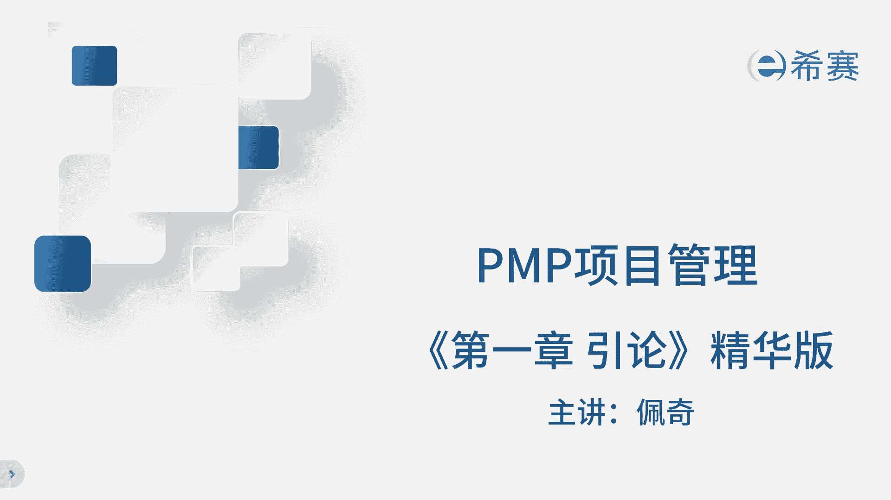
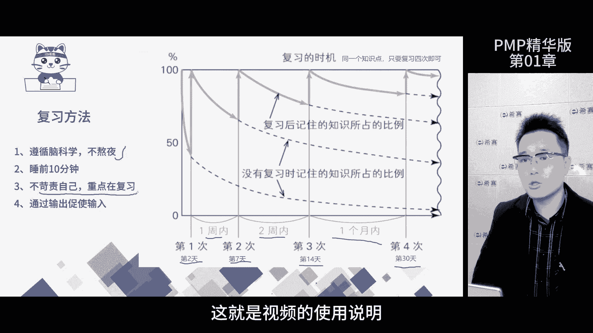
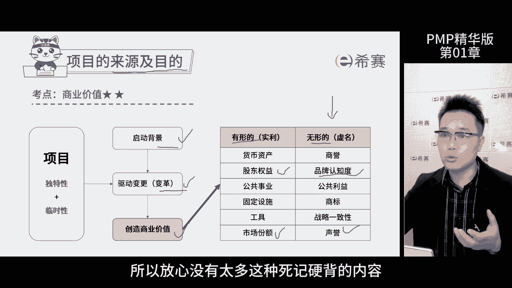
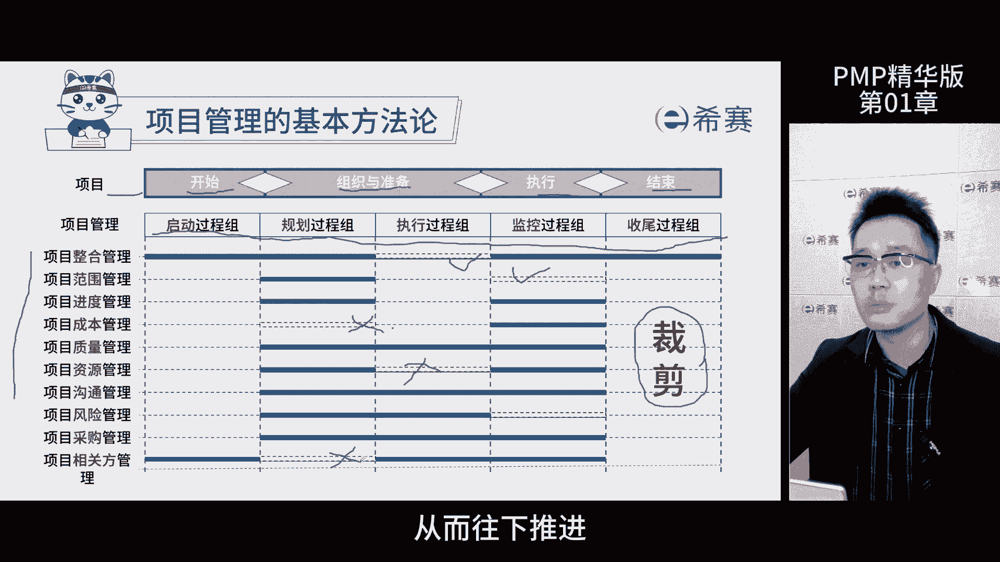
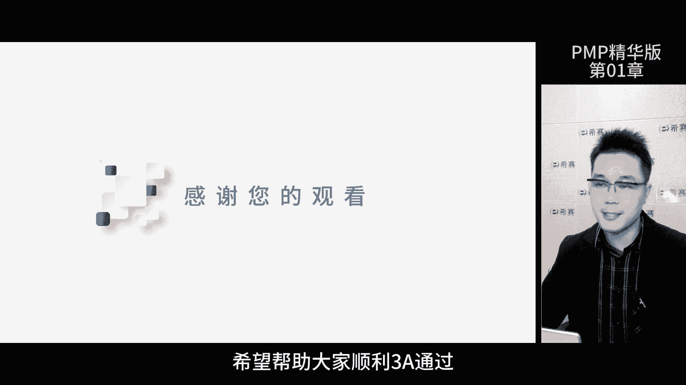

# 强！pmp高效备考，136分钟快速通关PMP项目管理考试精华版课程 - P2：第01章 项目管理基础-精华版 - 不爱哭的美少女 - BV1US411P71U

好我是佩奇，这个视频系列呢是PMP项目管理的精华版，那方便大家复习，我就简单说一下怎么使用这套课程，学习知识要经过预习，学习和复习三个阶段，那时间投入呢是一比四比16，那也就是说你预习的时候投入一分钟。

学一个知识点，学习需要投入4分钟，复习就需要投入16分钟，那别急啊，这16分钟是分四次，每次4分钟，那这样就能牢牢掌握这个知识点了，这就是学霸公式，那复习的时候特别重要，要结合艾宾浩斯的遗忘曲线。

那比如说你昨天听了佩奇老师的直播课，那第二天第七天，第14天都需要复习这个知识点，那这样你就完全掌握这个知识点了，那不用费其他的时间和精力了，那因为你已经掌握了96%的内容。

那4%呢其实你就没必要投入了，有段时间你不如去谈个恋爱，看个电影啥的啊，有人如果说没参加直播课也没关系，从你回看那一天开始算，按照这个时间复习就好了啊，还有啊，别熬夜学习。

因为睡觉的时候大脑会处理当天学习的信息，那太晚了，熬夜的话都不利于我们去记忆，那如果上课听不懂呢也没关系，因为我们重点在复习前面的公式，大家也能从里面感受到，第一次可能会很难。

那后面呢学起来会越来越轻松，你只要坚持下去啊，那未来的你一定会感谢现在一直坚持的你啊，这是我们整个视频的使用说明。

那希望能帮大家拿到一个好成绩，好了，我们开始今天的正式内容，第一章啊，我们先聊聊项目管理的一些基本知识，那这一页呢是汇总图，你可以试着暂停下来，用自己的话把这个知识点呢解释一遍。

或者讲给你的朋友或同学听，如果你能讲明白，就说明你真的懂了啊，这就是我们所谓的输出倒逼输入的方法啊，如果你说你没朋友啊，那没关系，那说给自己听呗，你录个语音说清楚就OK了。

那咱们要学习PMP项目管理的认证，那首先就得知道项目是啥吧，好项目呢是为了创造独特性的产品服务成果，而进行的临时性工作，从概念上我们就能看到他有两个特点，第一个是独特性，第二个是临时性。

那项目管理就是把一个事儿，办成了一套知识体系，所以不管是什么事，那都可以用项目管理的方法来解决，那现在是一个乌卡时代，环境变化莫测，能学习项目管理呢是一个非常明智的选择，那提到项目管理。

那这套完整的体系化的思维方式，那不仅在工作中可以用到，那生活中也是处处可见，比如说亲子关系，夫妻关系，那项目到底是啥呢，它的特点就体现在哪里呢，那咱们来一起探讨一下，那首先呢项目有一个临时性的特点。

这意味着每个项目都有明确的开始和结束时间，跟项目的长短没有关系，那不管是三个月，3年，30年还是300年啊，甚至3000年啊啊他们都有临时性这个标签，那重要的是这两个时间节点就是开始和结束。

项目是在这个时间段内运行的，其次项目具有独特性，就是说每个项目的生产过程或成果，都有所不同啊，哪怕是看起来这个结果完全一模一样，比如说深圳和北京的万达广场，那虽然用同样的技术材料图纸。

甚至可能用同样的管理团队，但他们依然具有独特的地方，那这个独特性不仅仅是成果本身，还包括项目地点，创造时间，材料的采购批次啊，甚至遇到的天气，遇到的风险问题等等啊，那最后呢项目还有个特点叫渐进明细。

随着项目的推进，信息越来越清晰，项目的计划方案也需要不断的细化和完善，总共这三个加起来就是项目的三个特点了，那咱们得了解一下，那才能更好的去理解项目管理这套思维方式，项目经理这个决策啊。

其实就是负责整个项目顺利进行，他的盯着项目的范围，成本质量啊，要确保这个是在控制范围之内，那同时呢他还得考虑资源的分配，采购团队沟通以及其他相关方的协调，别忘了啊，风险也是项目经理得时刻关注的。

因为风险随时都有可能影响到项目的进展，那项目经理得展现出这个整合能力，那这样才能推动项目顺利进行，那最终呢实现项目目标，这就是项目管理要关注的十大知识领域，那以后我们会详细讲。

那今天大家先有个印象就好了，那项目完成后，我们就拿到了产品，那接下来到底把这个产品交给谁，这个产品能派上什么用场啊，就要提到运营这个概念，要明白项目和运营既有联系又有区别，运营就是不断地开展活动。

生产同样的产品或者提高效率，提供重复的服务，它的重点呢是在于持续运作，而这里面的共同点和区别就是我们的考点，项目是什么，临时性的目标达成之后就结束了一锤子买卖，而运营是持续的经营业务。

比如说一个人现在是创造1万块钱的价值，那通过运营，我们希望它创造5万块钱的价值，那这就是运营的重点，提高效率，持续变现，考试的时候怎么考，通常会给你个信息和背景，让你判断他是临时性的还是持续性的。

那从而判断是项目还是运营阶段，只要咱们明白这两者的区别，那作为项目经理啊，你未来和运营经理打交道时候能做好配合啊，当然了啊，共同点的题目不多，关键是要区分项目和运营的不同，那咱们来说说啊。

为什么有项目这回事吧，它背后呢肯定有动力推动它，那这里的原因有三块哈，首先法律法规会调整，那相应的行业里的企业产品也会跟着调整，那这就是大环境的需求变化了，那一定会有项目产品要升级，要更新。

这都得靠项目来推动，那这么一来变革就产生了，那最后还有创造商业价值，这个目标项目背后的原动力，就是为企业创造商业价值，那考试的时候这一点呢会被问到，那商业价值会被分成有形和无形两种。

那有的项目是为了名胜，比如说提高品牌的知名度，提高声誉，那有的项目是为了利益，比如说提高股东的权益，提高市场份额，那这些都是根据项目的特点来定的，但不管是哪一种，都属于商业价值，考试的时候呢。

题目可能会出一些信息，比如说客户要求啊，通过项目提高自己的品牌认知度，那你就得知道啊，品牌认知度是属于无形价值，那无形价值和有形价值，他又归属到商业价值里面去啊，所以在选项里面你需要找商业价值啊。

或者找无形价值，这个点好记着哈，不用把这个表里的内容背下来，那PMP考试呢它基本上都是啊这个理解记忆，你只要能区分啊，有形和无形以及它们都属于商业价值，这点那就行了，那这是一个两星级考点。

能记住内容就可以像这种啊纯记忆的，在偏题考试里面其实不多啊，所以你放心不会有这种死记硬背的内容。

那项目管理的框架逻辑啊是很清晰的，我们可以按照时间维度和空间维度来划分，在时间上它分为启动规划，执行监控，收尾五个工程组，而在空间上呢，它涉及到了范围，进度成本等十大知识领域，也就是十个方面。

那这两个维度合到一起，就形成了这张完整的项目管理框架，在这个框架里面有49个小任务，我们称之为子过程，每一个都很关键，还有他们自己的ITTO啊。

有人可能不懂啊，ITTO是什么，那很好理解，每个任务都需要一些输入，比如说材料，然后还需要通过一些技术和方法，来完成这个任务，那最后会得出一个结果，那这一整套就是ITTO，那举个例子。

我们做西红柿炒蛋吧，唉把这个菜当做一个项目，西红柿和鸡蛋是我们的材料啊，就是我们的输入I你的炒菜技术，还有锅碗瓢盆这些就是我们的工具TT，最后做出一盘香喷喷的西红柿炒蛋，还特别下饭。

那这个就是输出O那通过这个例子啊，是不是对于ITTO有点感觉了，那项目管理啊就这么回事啊，不管是哪个过程，要有输入，有工具技术也得有产出，那有的同学听到这啊，一听这么多内容啊，就开始头疼了啊，这么多呢。

那感觉有好多琐碎的东西要记啊，别急，那跟着我一起想象一下啊，我们把它一秒钟把这个整个框架全记下来，那项目管理呢就像一棵大树，我们现在要学的内容呢，核心就是这个树的主干，五大关组就是五个大的枝干。

而十大知识领域就是这个大枝干上的小支干，那这些小枝干的叶子呢一共有49片，就是我们的49个子过程，那至于ITTO，就是这个叶子上面的这个脉络啊，这么一来你脑中有这么一张图了，那所有的环节关系都串起来了。

那是不是觉得清晰了很多，大家现在在短短的几秒钟之内，就掌握了项目管理的框架体系，那后续我们会逐一的深入学习，那把这棵大树研究得透透的，哎大家放心，一步一步来，没啥问题啊，那咱们继续往下走啊。

啊看上面这一行写的是项目的几个不同阶段，那这里提到了开始组织和准备执行，还有结束，每个项目都有自己独特的阶段，但是下面的这个时间维度和空间维度呢，是每个项目都必不可少的啊。

只要明白了项目阶段和项目过程组是什么关联，什么关系就行了，那最后呢一个词叫做裁剪，那为啥这么说呢，那因为项目有大有小有难的，有简单的，我们不一定非得用上所有的这些内容啊。

可以根据项目特点把不需要东地法给裁剪掉，比如说这里啊，这里啊，这些我们可以根据环境需要哪个用哪个啊，不需要的通通不用啊，这种操作就叫做裁剪，那作为项目经理呢，我们是有权利这么做的。

为了更好更快地实现目标，而从而推动项目走下去。

项目开始前我们得考虑啥呢，有哪些关键信息要知道，那这里提到项目管理的几个重要文件啊，就是需求评估，商业论证和效益管理计划，这三个他们之间啊是相互有联系的啊，好像一个链条一样啊。

首先发钱得找人评估一下这个需求没问题了，再找团队来做商业论证，在这个商业论证里面，咱们会分析成本和效益啊，从而确定效益管理计划，那这三个文件都准备好了，咱们就可以开始制定项目的章程。

然后后面的项目管理计划也就水到渠成了，所以简单来说呢，他们的前后关系就是这样子的，那咱们展开逐个说一说，首先需求评估就是明白业务的目的啊，看看要解决什么问题，有哪些机会可以抓，那这一步做好了。

我们才能开始项目的商业论证，那商业论证呢系统地去分析为什么要做这项目，而不是拍脑袋定的，所以商业论证，有时候我们要叫做可行性研究报告啊，简称可研报告，那这个文件最重要的就是成本，效益分析的数据了。

那这部分数据呢决定了项目能不能继续推进啊，数据告诉我们项目有价值，那我们就继续，如果数据告诉我们项目没价值，那我们就该停停啊，所以啊这些文件在整个项目期间是非常重要的，那第三个文件是效益管理计划。

这个计划呢是基于论证里的成本效益分析数据，告诉我们具体怎么获得预期收益，那这个计划是非常详细的，告诉我们怎么把这个收益拿回来啊，考试不会考具体内容，但是你要知道它的作用。

那效率关计划它的作用和商业论证一样，为了验证项目的合理性，做好基础，都是要贯穿整个项目的全部生命周期的，在每个项目的关键节点，我们都要确保，产出物和这个文件里面的要求是一致的，作为项目经理。

我们要和发起人一起，确保项目章程，项目管计划和效率关计划保持一致，如果不一致，项目就会偏离方向，那无法进入到下个阶段，那如果出现这种情况，就要及时的纠正，如果纠正不过来，或者偏离的太远了。

那项目可能就会面临着终止的风险，那这里的两份文件，项目章程和项目管计划非常重要，在整合章节里面会详细讲，在这里呢把文件的作用我们理解透，那发起人要对项目章程进行签发的签字之后呢，发布出去。

这个发布动作就是代表项目正式成立了啊，从而作为项目经理的你才能从备胎转正，有正式的权利带着大家把新项目推动下去，实现项目目标，那咱们项目完成了怎么算成功嘞，需要提前想好项目目标有很多啊。

需要求在项目的商业认证里面啊，尤其是财务数据，那其中重点看这两个标红的啊，不过不用担心我们不考计算啊，只要理解它的概念，能选择就行了，那先说下金现值，这其实就是看未来项目完成能赚多少钱。

换算到现在它值多少钱，他已经考虑了时间因素了，所以净现值选择越大的越好，那比如说俩项目，一个800万，一个400万，那么我们肯定选800万经验值，那个再来说说投资回收期，这代表你给项目投了一笔钱。

多久能回本，那肯定是越短越好啊，啊所以我们要找的是回收期短的那个项目，那精华版视频呢是为了帮大家去复习啊，时长比较短啊，也是为了方便大家快速的去反复的看好，那今天课到此结束。

