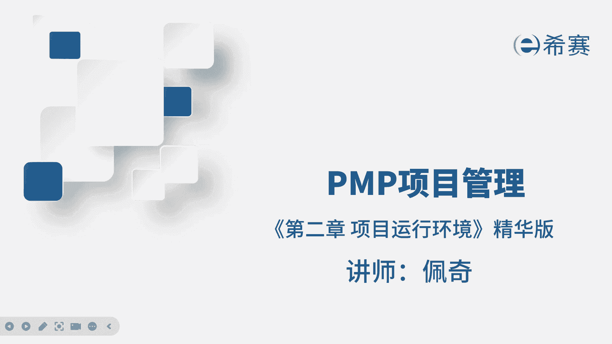
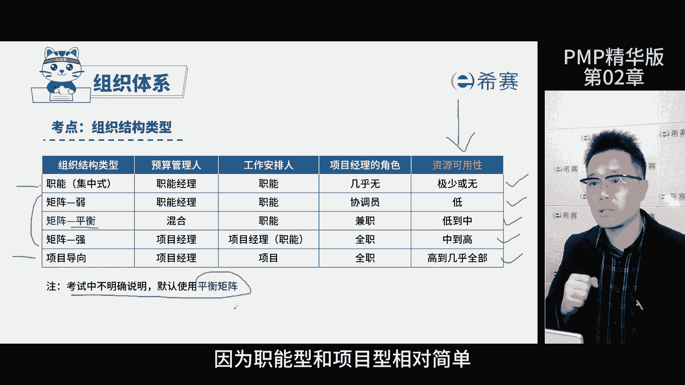
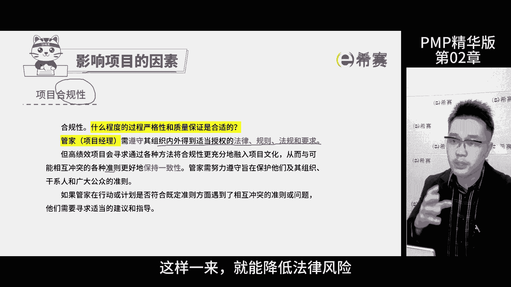
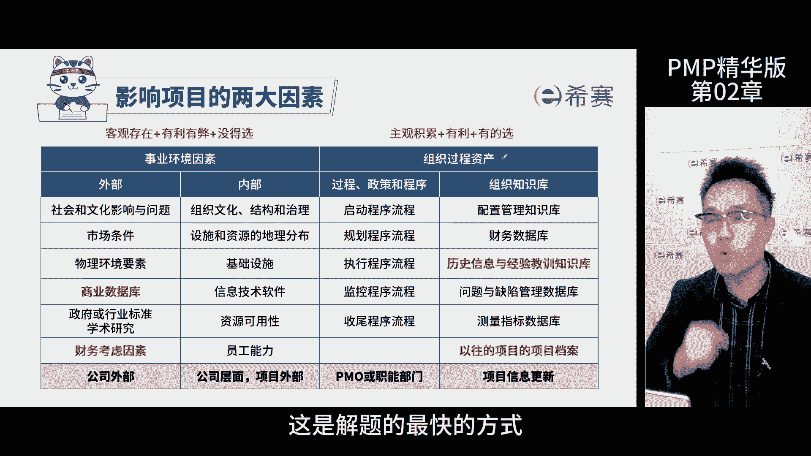
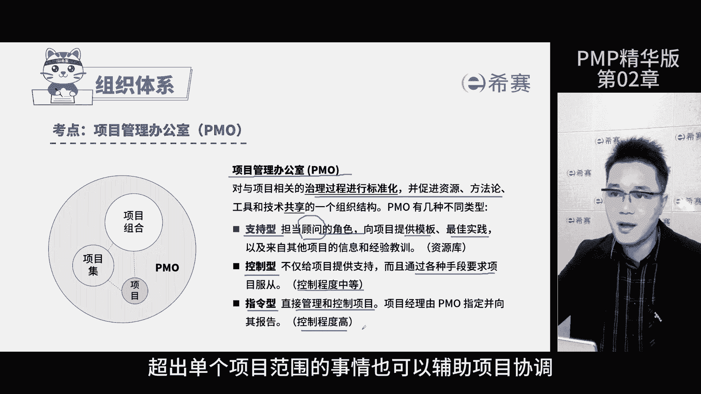
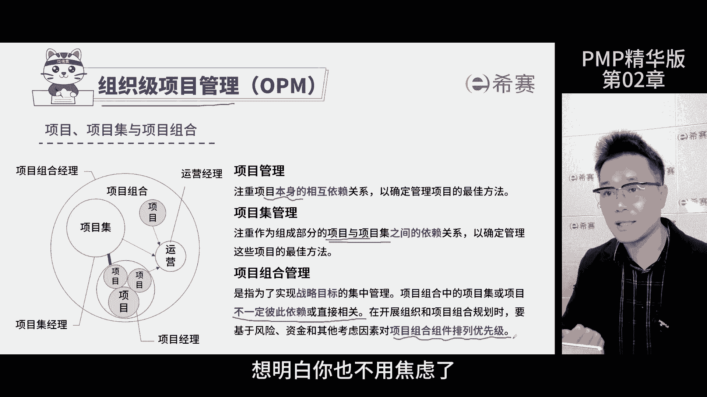
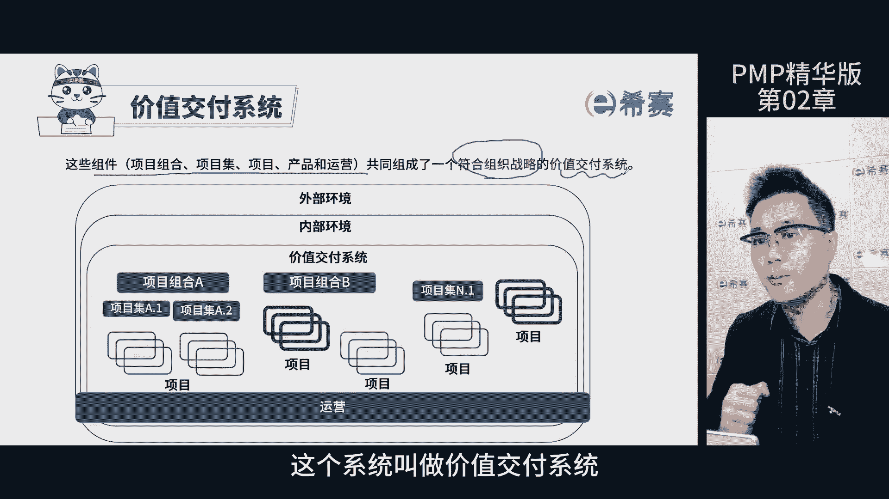
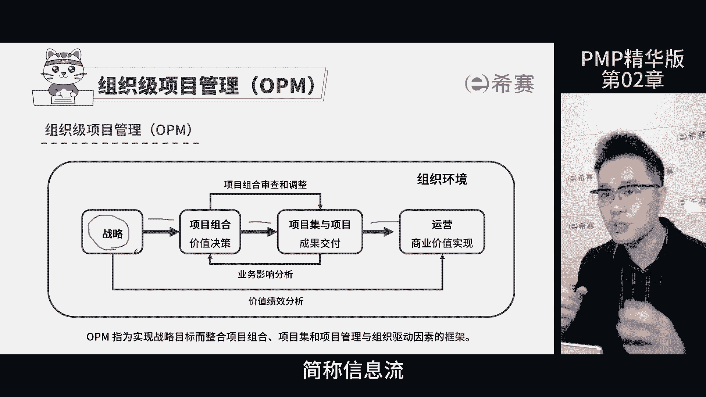

# 强！pmp高效备考，136分钟快速通关PMP项目管理考试精华版课程 - P3：第02章 项目运行环境-精华版 - 不爱哭的美少女 - BV1US411P71U

我是佩奇，今天我们来聊聊第二章项目运行环境，这张图呢是按照知识点的考分排布顺序，方便大家去回顾，大家可以暂停回忆一下前面的内容，然后再继续听啊，那组织结构类型在PMP项目管理中有三大类。

职能型矩阵型和项目型矩阵型，还细分成了弱矩阵，平衡矩阵和强矩阵，那重点来了，这几者的区别就在于，项目经理动用资源的权力大小不一样，那职能型项目经理就是个传话筒，权力很小，弱举证时。

项目经理的权力稍微大一点，但还是得听职能经理的平衡，举人呢，项目经理和职能经理的权利是平等的，有分歧要商量，有冲突，要沟通，强举证时，项目经理的权力比职能经理大，他说了算，项目经理为主导。

那至于纯项目型的，那肯定是项目经理最大了啊，最强好PMP考试里，如果题目中没有明确说哪种组织结构类型啊，默认是平衡矩阵啊，也就是说项目经理和职能经理的权利是对等的，那这个时候呢项目出问题就得协商着来。

不能一言堂考试怎么考这个知识点，他会给你信息，你要根据这些信息判断项目经理的权力大，还是职能经理权力大啊，从而来选择不同的类型，那考试重点就在于矩阵型里面，因为直线型和项目型呢相对简单一点。

那关键要区分强矩阵，平衡矩阵还是弱矩阵，接着我们还要想想影响项目因素有哪些啊，第一个就是合规性了，大家得注意啊，作为项目经理，首先做的就是确保我们的项目符合内部的，外部的法律规则，法规和各种要求。

需要跟各种准则保持一致，这么一来就能降低法律风险。

事业环境因素和组织观资产都挺重要的啊，咱们先从组织观资产来说啊，因为这方面的考题会多一些，足工人资产上有三个特点，主观积累对项目有好处，有选择权，那项目经理可以决定用不用这些信息。

比如说公司有个知识库好，里面有很多以前项目的知识内容，你可以参考啊，但是如果你觉得有更好的方法，那就不用它了呗，选的时候一定要选择对项目有利的啊，你不能选个错的，你这不来添乱吗。

好主观积累是我们主动积累过去的经验教训，不好的我们不会主动积累，这就是组织观资产了，那说到事业环境因素呢，也有三个特点，客观存在，有利有弊，还有没得选，就拿市场条件来说吧，如果你的项目在新加坡啊。

当地的人工成本呢普遍很高，你只能接受，就是你没得选择这些条件，对你项目来说当然是有弊端的，但有没有产生好处的时候呢，啊当然也有啊，啊比如说我们公司内部的信息，用了统一的信息软件平台，和公司的内部。

和其他的项目供应商沟通都很方便，那出了问题呢还能追溯，因为有记录，那这对于项目来说是有好处的啊，但是你依然没得选用了钉钉，你就不能说我自个儿用企业微信啊，因为大家都要用钉钉好，那再说说员工的能力啊。

公司就养了那么几个能干的人啊，谁都想用能力强的吧，但他们不能全扎堆到你项目上去，那其他项目怎么办啊，所以其他的人呢有可能都是歪瓜裂枣啊，能力不行的，那这也是没得选啊，所以失业环境因素就是这样啊。

有可能对你有利，也有可能会带来一堆麻烦，但是你得接受啊，因为这些因素是客观存在的啊，这个知识点怎么考啊，题目会给你一些信息，比如说有个数据库或者要考虑的流程和因素，有的时候题目不会说那么直接啊。

需要琢磨一下，那最后你会发现自己有选择的权利啊，问你是哪一项，那肯定是组织工人资产了，而另一题说了一堆信息，最后发现你没有权利选择，这属于事业环境因素，你就根据这些特点判断，是客观存在的还是主观积累的。

对项目是好的还是坏的啊，尤其是作为项目经理，你有没有权利选择用还是不用，这是解题的最快的方式啊。

这么一想题目很快就能搞定了，项目管理办公室简称PO，这个名字听起来有点复杂啊，但是它的作用跟它的名字一样，真的非常重要啊，PO就像一个专门管理项目的部门，而他的工作就是帮助项目顺利的推进。

所有的项目项目群，项目组合相关的工作都归他管，那项目管理办公室有三种类型，每一种都有它独特的作用和定位，但是不管哪种，PMO的核心任务，就是确保项目能够高效的有序的进行啊，从而实现项目的目标。

那第一种呢是知识型啊，他就像你的一个顾问，能给你提供各种资料信息，哎你可以用它给你的文件模板，用他的最佳实践，甚至让他给你员工培训都没问题啊，第二种是控制型，他除了向知行那样提供资料信息。

还会对项目有一些要求，但是控制的不是很严，那严的是什么，第三种就是控制特别严那种啊，叫做指令型，他是直接管项目，你得上报所有情况，听他的指挥好，总之哈从上到下这三种类型的项目管理办公室。

对于项目的管控能力由弱变强，如果题目中没有告诉你具体的情况，你默认这个项目是有项目管理办公室的，而且默认是支持型，这个知识点考试怎么考啊，一般情况下考PMO的作用和对项目的帮助，那PO对项目提供模板。

一加实践培训，还有经验教训等等啊，那它存在的意义就是帮助项目赋能，让公司的资源更好的辅助我们项目啊，从而实现项目标好，若是超出了项目经理的权限，这种事情或者超出了单个项目范围的事情。

也需要他来辅助进行协调，大家都知道啊，项目不是孤000存在的，就像人不能独自在一个孤岛上生活一样，那得多无聊啊，连个说话的人都没有，那项目与项目之间，小项目与大项目之间，那到底是啥关系呢。

啊这就是我们需要在组织这个大环境下，去看看项目，项目及项目组合这三者他们的关系，那项目管理是着眼于一个项目本身的依赖关系，需要在这个项目的边界之内，比如说自己的人员材料时间成本风险等等。

那这全部属于项目管理，我们后续要学习的就是这个项目管理了，那项目及管理呢，是项目与项目之间存在依赖关系，那啥叫它们之间的依赖关系呢，比如三个项目ABC，如果A项目出了问题，B项目也用不了。

B项目出了问题，C项目也完成不了，这叫做项目与项目之间的依赖关系，他们不能单独交付，那全部成功项目集才会成功，那如果发现项目和项目之间不一定有依赖关系，或者没有直接关系，而且他们可以单独交付。

它们之间还有优先级排列顺序的关系，我们称之为项目组合管理，项目组合这样管理的原因在于，组织资源是有限的，那不可能无穷无尽，所以要把有限的资源，投入到价值最大的项目中去，那比如说你是项目经理。

你发现项目要人不给人要钱不给钱，要啥啥不给，那最后还让我扛责任，那你要考虑一下，是不是你的项目的优先级不够，那领导也没指望你的项目创造多大价值，所以呢就不会投入资源，那想明白这个点，你也就不用焦虑了。

就淡定了很多，那项目项目及项目组合加上运营都称之为组件，它们存在有更大的一个系统里面，这个系统是为了服务于组织战略目标，那通过提供价值来实现战略，这个系统叫做价值交付系统，可以看这张图啊。

战略一层一层的分解，先分解为项目组合，再细化为项目集或项目，那他们完成之后有了成果交给运营去实现价值，这个价值是为了完成战略，这就是这个组件之间的信息传递，简称信息流。

