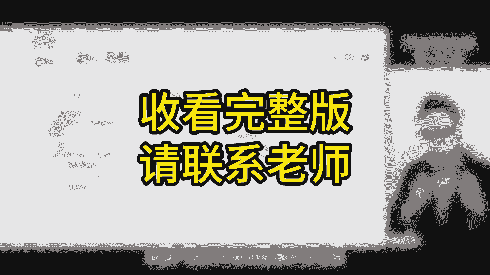

# 强！pmp高效备考，136分钟快速通关PMP项目管理考试精华版课程 - P7：第05章 项目范围需求管理-精华版遮挡 - 不爱哭的美少女 - BV1US411P71U

我是佩奇，今天是项目范围管理的进化版，那这是本章的考评目录，暂停回忆，再继续说到控制范围，其实就是盯着项目和产品范围的状态，别让他们乱变，管理基准的变更，就是要保持这个范围基准的稳定。

也就是说有必要的地方才变，其他的地方最好别变，这里有一个重要的点，就是有变更走流程，这六个字是考试的重点啊，那维护范围基准在整个项目期间都得做，只要项目有变动，就要按照规定来，这样才能不出错。

考试就是要考你会不会按照规矩办事，也就是说合规性，项目经理可千万别乱来啊，不然就成被窝侠了，那要是范围变了，但是没按流程来，那就有问题了啊，需要走流程分两种情况，范围蔓延和镀金有啥区别呢。

其实他们都是范围变了，没走流程，但是范围蔓延是外面的人要求变的，比如说客户要加一个小功能，而镀金呢是自己内部的人主动加的，可能是为了讨好客户，考试的时候，如果遇到这三种情况，客户提出新的需求。

范围蔓延了，好验收的时候无法满足预期需求的，那就是选那个变更流程的选项，收集需求，简单来说就是要把大家的需求都记下来，那这样做是为了后面确定项目的具体范围，在这过程中我们要注意一些工具和技术。

那后面还会讲到他们啊，所以最好一开始我们就搞明白，那完成这个过程之后，我们还会得到一份重要的文件，叫需求跟踪矩阵，这两个部分都是考察的重点，那先看工具和技术，我按照逻辑顺序给大家重新整理了一遍啊。

首先我们要收集原始需求，然后整理分析，最后基于这些结果做决策，那现在我们先看看收集原始需求这部分啊，重要的考点我都标出来了，大家仔细看一下，先整体了解一下，访谈和问卷调查是个体信息收集，头脑风暴。

焦点小组为群体收集，在收集过程中需要人际关系，团队技能啊，有观察呀，民意小组啊，引导而引导需要结合会议一起使用，就有了引导式研讨会，这三种，针对不同的场景分析整理数据的表现，有清河图，思维导图。

那决策工具有投票和多标准决策分析，这些工具和技术考起来呢其实也不难，主要是看懂题目中说的这个场景，然后想想哪个工具技术最合适，只要找到题干里的关键词。

跟这个属性对，上号答案全都秒选了啊。

