# 强！pmp高效备考，136分钟快速通关PMP项目管理考试精华版课程 - P16：第11~12章  敏捷scrum实践 精华版 遮挡) - 不爱哭的美少女 - BV1US411P71U

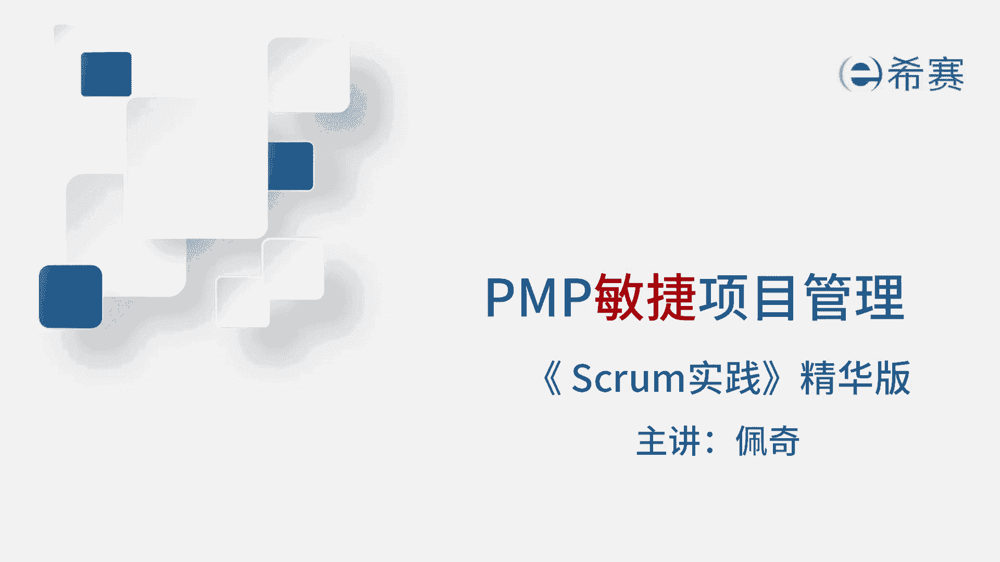

我是佩奇，本期讲解敏捷项目管理的scram实践精华版。

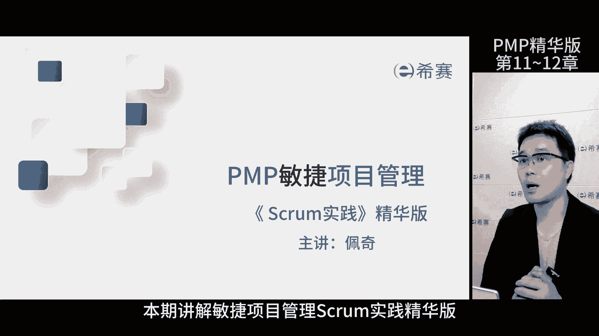

那这是考评目录啊，大家可以暂停回忆再继续，SCM是一个以经验为基础的过程控制方法，它采用了迭代和增量的方式，优化对未来的预测和风险管理，那这张图呢是SCM的实践框架，我们一步一步来看，首先客户提出需求。

产品负责人转化为用户故事，放在产品代办事项列表里面，每次迭代刚开始，开发团队成员挑选必要的用户故事，放入迭代代办事项列表，准备执行，迭代过程中，本次迭代完成后，开评审会议，团队演示已完成的功能。

客户确认验收，交付完成后呢，开回顾会议，总结经验，然后进入到下一个迭代，如此循环下去，项目过程中如果有变更，先加入到产品代办事项列表里，再根据具体情况决定是否执行变更，敏捷就是以这种方式来应对变更的。

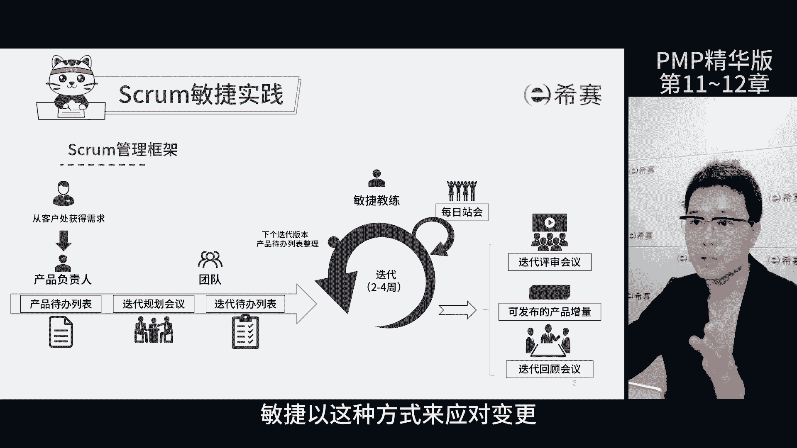

了解了SCM困难之后呢，我们来详细的了解一下每一个知识点，总的来看呢有三个弓箭，三个角色，三个支柱，还有五个事件和五大价值观。

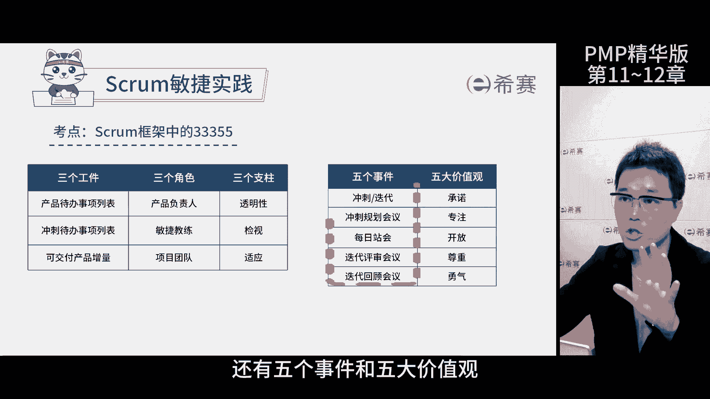

首先我们来认识下三个角色，产品负责人对外负责找客户需求，跟踪需求，确保产品开发方向和需求的优先级，它有三个身份，定义产品的功能，决定发布时间，内容成为客户的代言人，开始迭代时，明确开发方向，成为掌舵者。

验收团队完成的软件功能，成为验收者，那产品代办事项列表呢是他的管理工具。

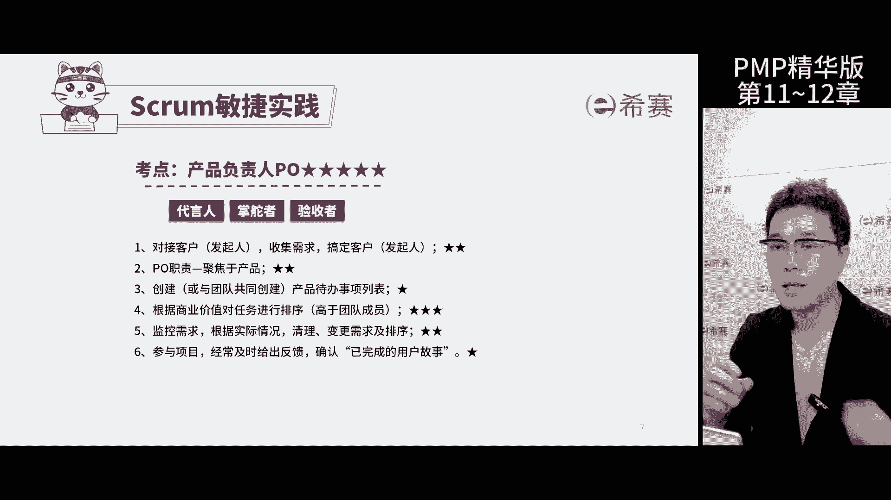

它有最终的决策权，第二个决策是敏捷教练队内管理，他向团队的普认识领导最大化团队创造的价值，他有三个身份，促进团队合作，协调内外部的沟通成为催化剂，清除团队障碍，提供指导，防止被不必要的打扰啊。

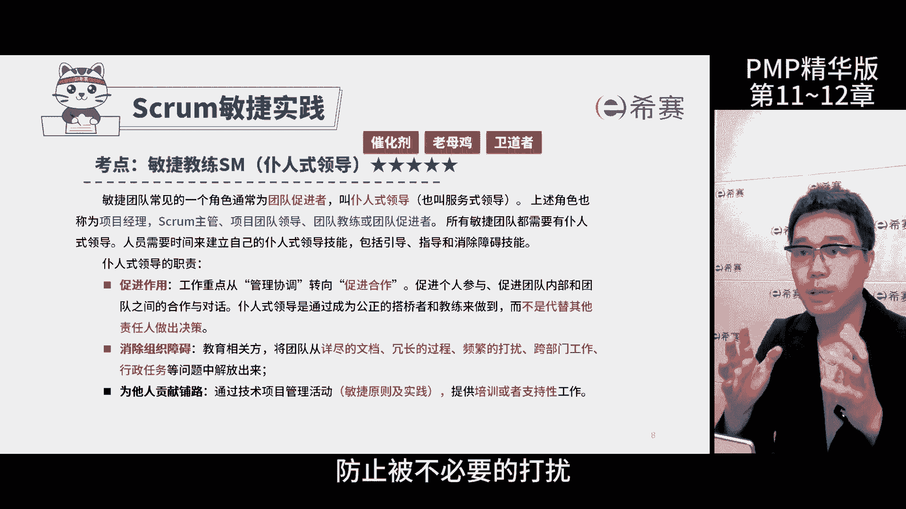

确保生产率成为老母鸡，确保团队正确理解并实施死SCM框架。

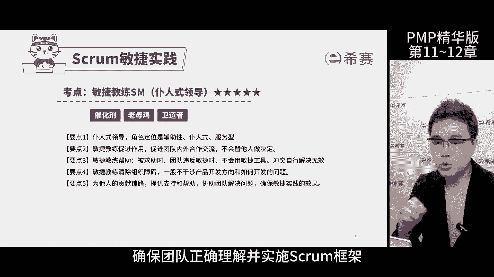

成为卫道者，第三个角色是自组织团队，也就是开发团队了，他们负责实现用户故事，包含各类的专业人员，主要负责每次迭代开发任务，并交付潜在的产品增量，他们也有三个身份，自主决定如何交付产品。

项目开发过程中出现问题，责任归属整个团队，成为有福同享，有难同当的自组织团队，团队成员3~9人，具备创造产品质量的全部技能，成为通才型专家。

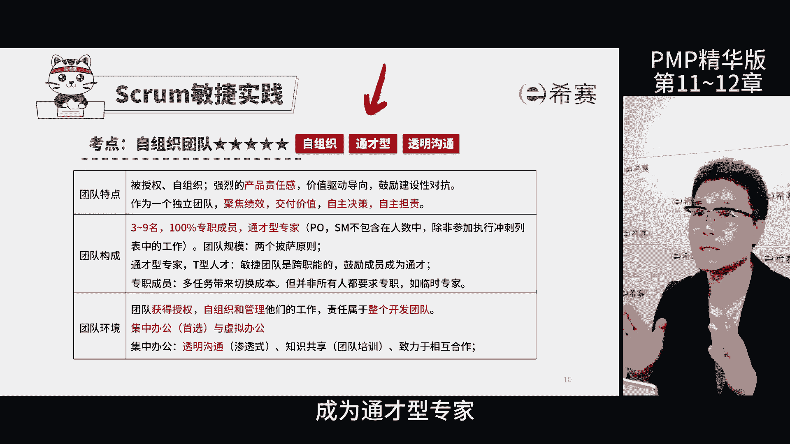

他们提倡集中办公，但不排斥虚拟办公，通过透明沟通，以提高沟通效率和团队合作，考试怎么考呢，三个决策主要考察是各自的岗位职责内容。

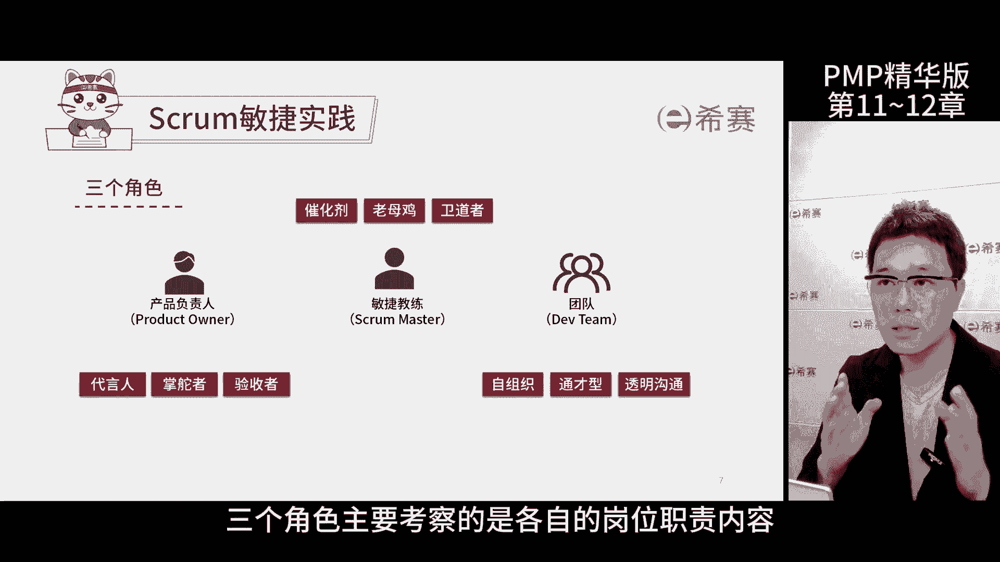

咱们接下来讲一下五个事件，首先咱们了解一下一个概念，叫冲刺或迭代，英文叫做sprint，这是scream里面的迭代的说法，每次迭代时间一般是两到四周，开发团队需要做出可交付产品增量。

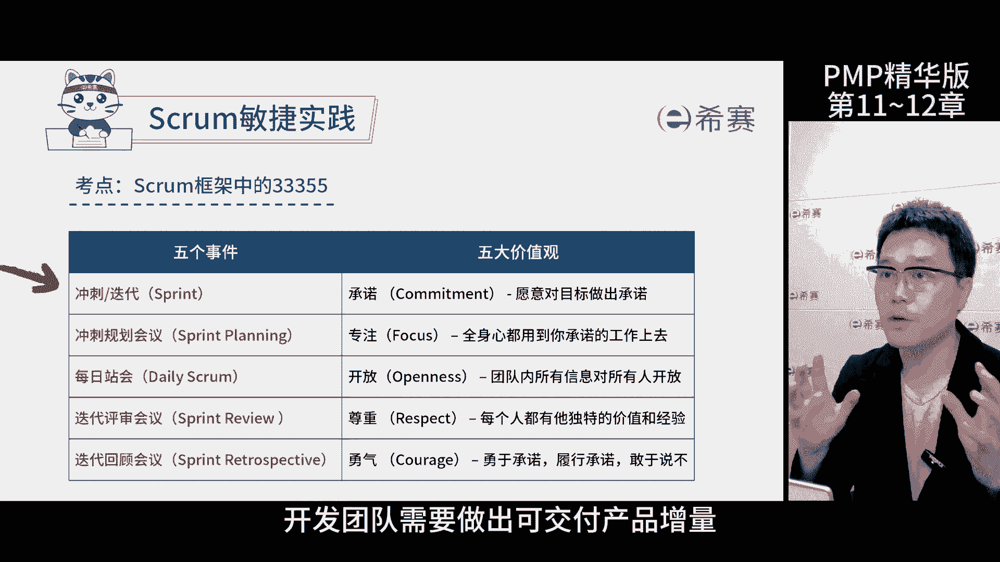

也就是一些功能迭代规划，会议也叫做冲刺计划，会议是决定了这次迭代目标和咋干活的，会议规划会议就在八个小时内搞定。

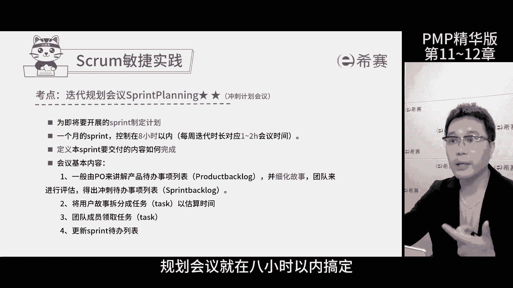

要开会自己动和新任务全都是混，一代表开会的机会，第二专学杂题。

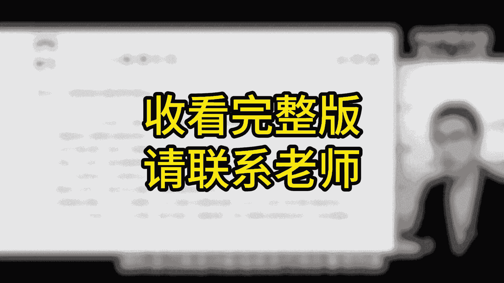

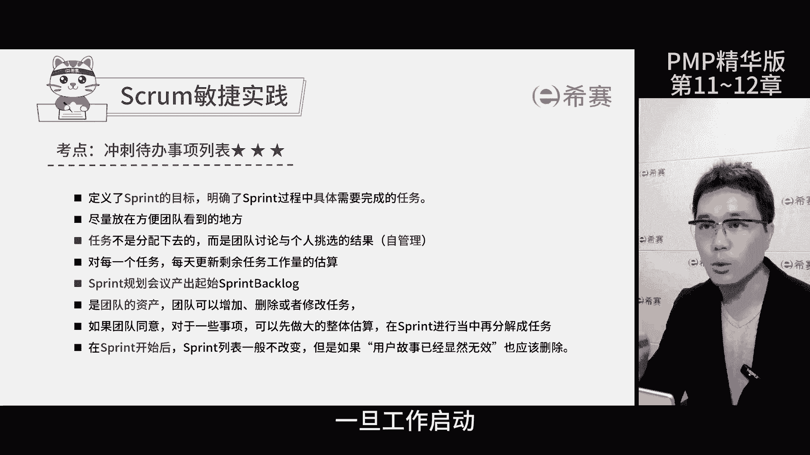

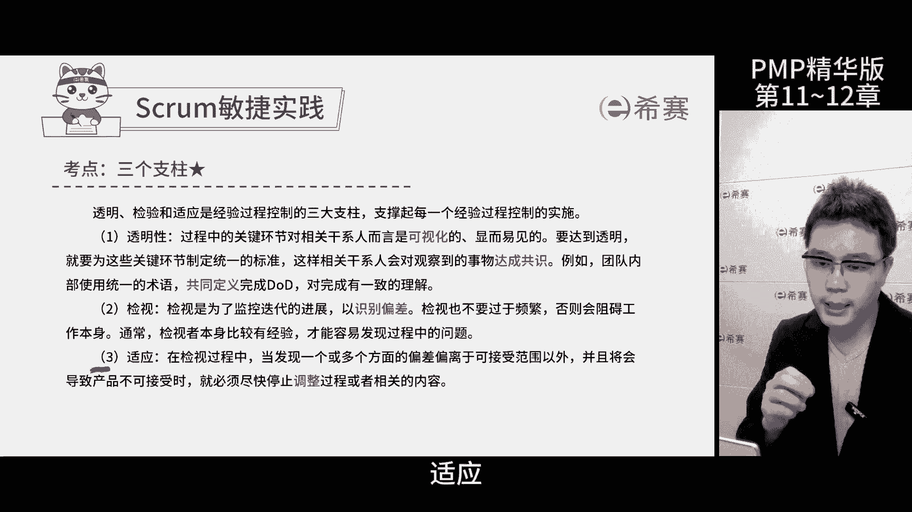

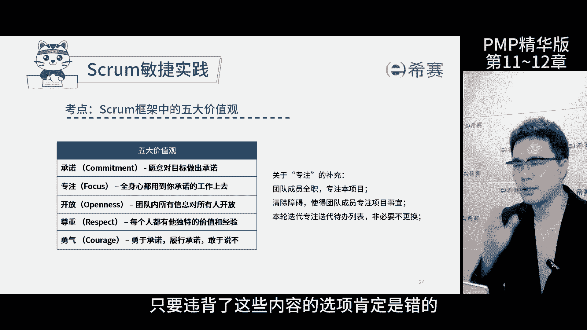