# 强！pmp高效备考，136分钟快速通关PMP项目管理考试精华版课程 - P6：第04-2章 项目沟通管理-精华版 - 不爱哭的美少女 - BV1US411P71U

我是佩奇，今天是项目沟通管理的进化版，那说到沟通啊，就没边没界了，嗯工作生活都得用得到，那这是考题目录，暂停一分钟，回忆一下再继续啊。

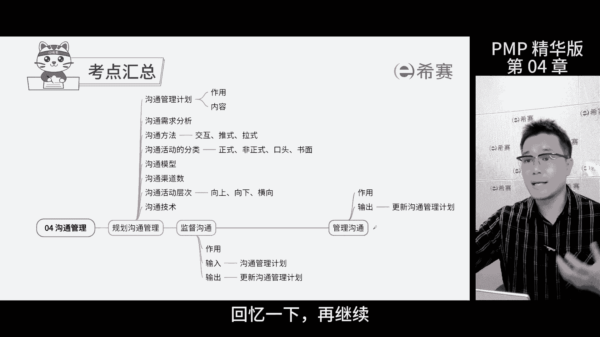

沟通管理计划呢在这章是一个重头戏，那为啥别的章节的管理计划考试呢，没有他这么常考，偏偏这个沟通管理计划那么受重视，因为项目经理的工作，70%到90%都是关于沟通的，那要是这个指南性文件出问题了。

那项目里面沟通就会障碍重重，沟通管理计划的作用嘛就是为了确保五个正确。

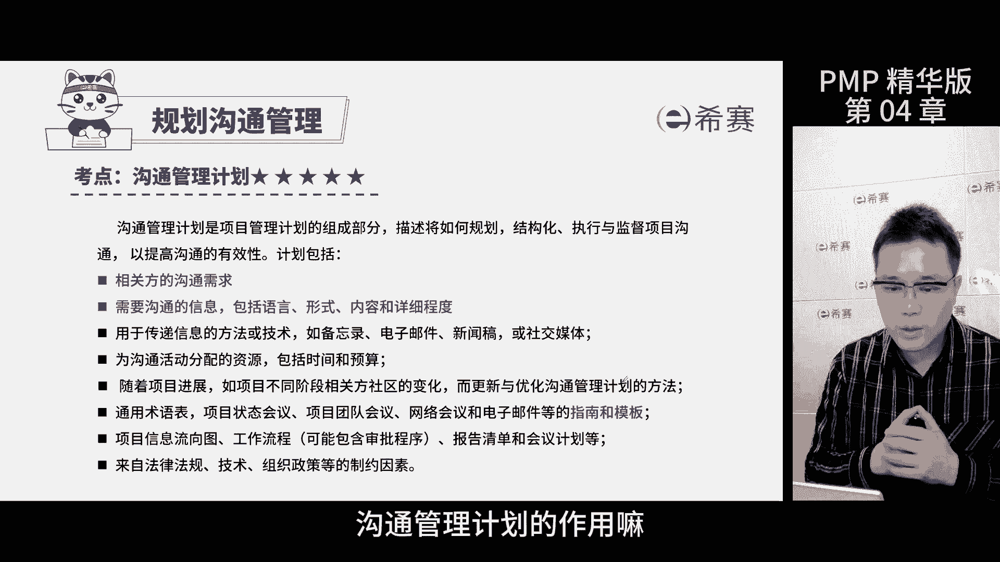

让沟通更有效，那五个正确是什么呢，正确的信息在正确的时间，通过正确的方式传递给正确的人，最后产生正确的效果。

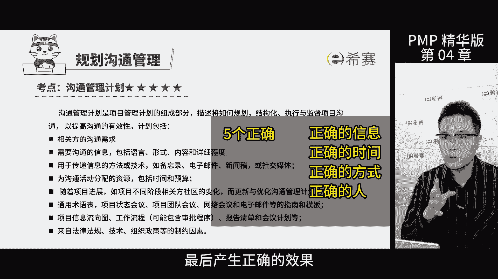

那这个要好好记住啊，特别是干型的沟通需求，要传递的信息，包括语言内容，详细程度，这些考试怎么考，你比如说团里面有人问你，这些信息应不应该发给这个人，他不清楚，那你就告诉他去查一下沟通管理计划。

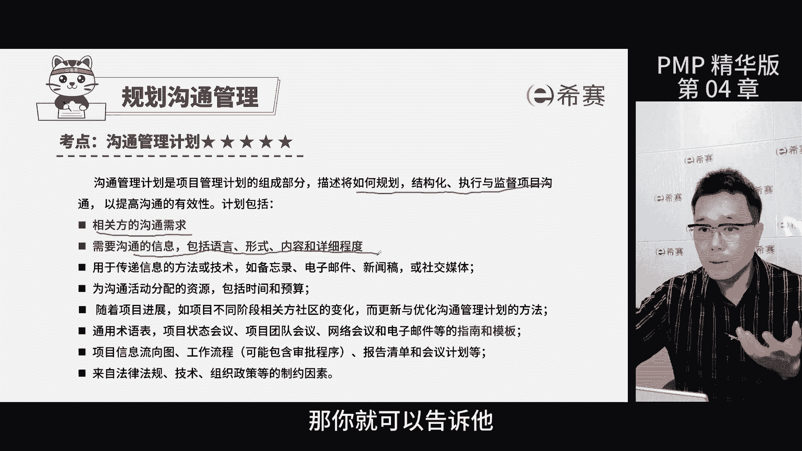

沟通需求分析，就是要弄明白参与项目的人想要啥信息，还有他们喜欢什么样的沟通方式，每个人的沟通方式都不一样，比如有的人希望你每周打一次电话给他，聊聊进度啊，有人呢则希望你定期发个邮件报告什么的。

还有些人呢得亲自参与到项目的会议中才放心，所以你得先分析一下，看看哪种方式是他们需要的，那怎么考，题干中描述客户对你的报告方式不满意，那问你事先应该干什么啊，那就需要沟通需求，分析三种沟通方式。

交互式就像是打电话或者面对面聊天，那信息传得快，反馈也快，推式沟通就像是你收到了一个信息，但是发行人不知道你有没有看到拉式沟通，就是有一大堆信息在那呢，你想知道啥就自己去找啥。

那其实呢只要记住这三种方式的示例。

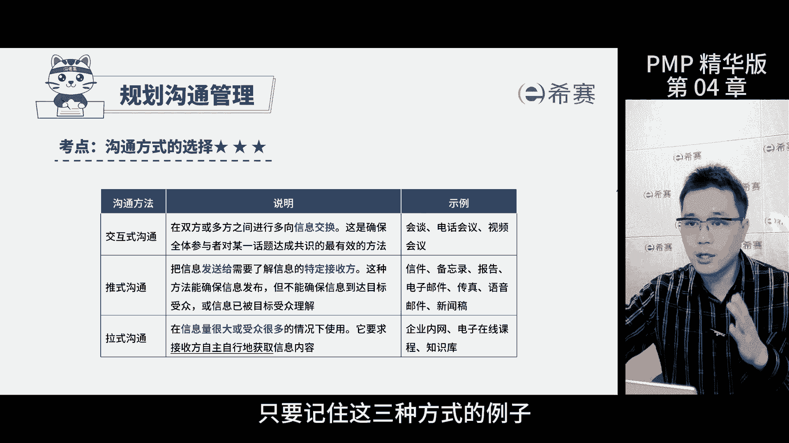

做题时看到类似的情景就能选出答案了，沟通活动的分类，根据场合不同，我们可以分为正式非正式，口头书面这几种，考试的时候要根据情况选对方式就行，还有一点要记住，如果你是以相的身份跟外面人谈事情。

那全部都是正式沟通，这点可不要忘了。

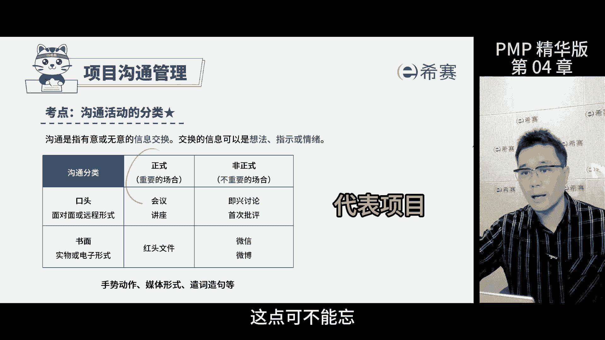

沟通模型最重要的就是理解信息的几个关键点，你看啊，首先得有人发出信息，对方得回复这个收到，那这样大家就知道了，信息已经传达到，但是这并不代表对方就明白你的意思了，他们还得去琢磨理解。

等他们懂了之后再给一个反馈，这才是完整的沟通，在这个过程中，有些噪声会干扰信息的传递，比如说文字的意思，文化背景价值观，那这些都会妨碍双方的表达和理解，那这些噪声呢没有办法完全消除。

但我们可以尽量的去减少它，发信息和接收信息的人都有责任，让对方理解自己的意思，所以钥匙信息出了问题，两个人都有责任，不能只怪一个人，考试的时候会计算沟通渠道数，要懂这个公式哈。

那如何理解它正课的时候已经详细讲过了，我就不多说了，关键是在这里告诉大家考试怎么考，那考试会给你人数，比如说有人离开项目了，又来了一些新人，重点是要算出项目里总共有多少人，那考试呢就会给你挖一些坑。

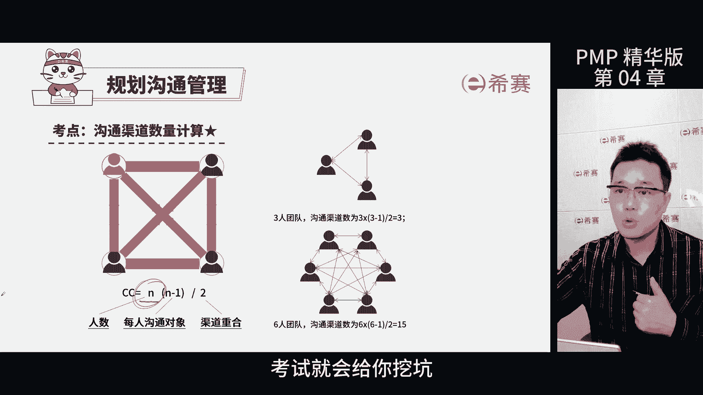

看你跳不跳进去，那坑在哪里啊，就是题目中的数字里没有算上项目经理。

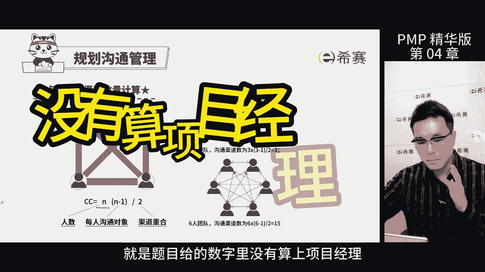

需要记住我们算的时候要把项目经理也算进去，还有啊要看清楚题目问的是啥，是问人数变了，沟通渠道数改变多少，还是问人数调整之后，现在的沟通渠道有多少，又或者问之前的沟通渠道是多少。

沟通活动呢其实会分三个层级，一种是你和领导之间的沟通是向上沟通，那另一种呢是你和下属的沟通是向下沟通。

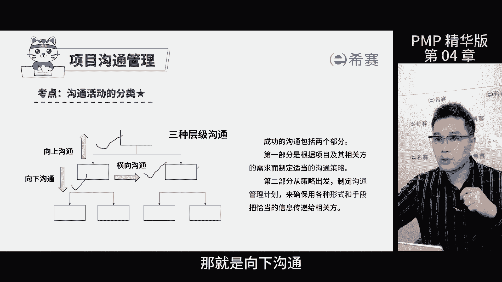

还有是你和你的同事平级之间的沟通，就是横向沟通，沟通技术，简单说呢就是和相关的人怎么传递信息，有的时候我们直接面对面聊，有的时候写邮件什么的，那选哪种方式得好好考虑一下，比如说有急事了，肯定直接打电话。

那发邮件太慢了，那搞不好你还会挨骂，那还有呢项目里有些信息很敏感，要保密，不能随便告诉别人，你得挑对的人，发对的信息，唉这就是沟通技术里面。

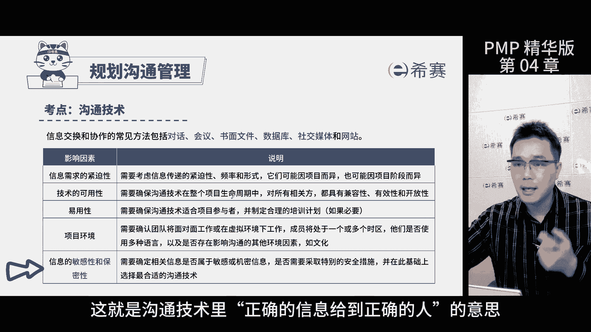

正确的信息给到正确人的意思，监督沟通是为了让信息传递更流畅啊，我们会按照沟通管理计划执行过程中，找出沟通的问题，比如说看看该做的沟通做没做呀，干系人是不是及时的收到了他们需要的信息，报告内容，对不对。

沟通效果和效率都咋样，那还有沟通是不是有助于项目的目标管理，那如果发现有问题，我们就得改进，可能还得重新进行规划和管理沟通，这么一来我们就能确保沟通工作做得更好，信息传递更流畅了。

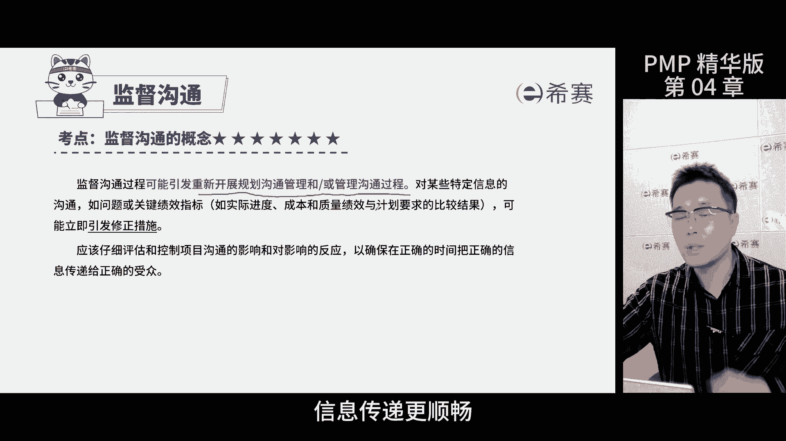

管理沟通的作用是，推动项目团队与干型人之间的信息传递，就是实实在在的开展沟通，促进团队和干型之间的有效信息流动，那有效是指有效果和有效率的项目沟通，有效率指的是提供干系人需要的信息，而不给多多信息。

有效果指的是把正确的信息传递给正确的人。

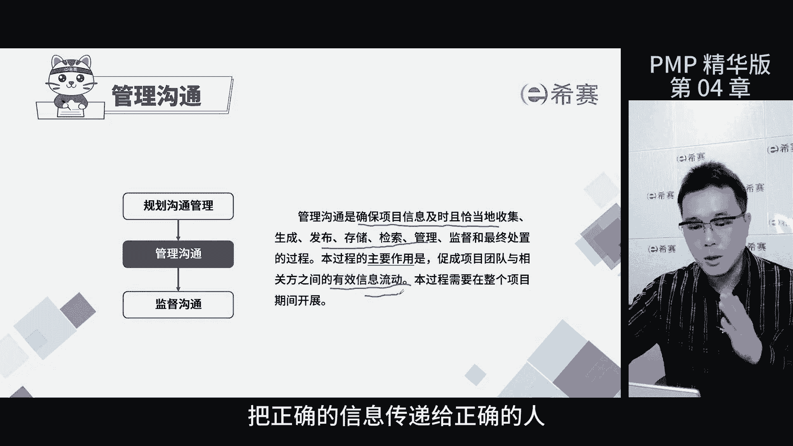

以发挥正确的作用，这就是五个正确的落脚点，监督沟通和管理。

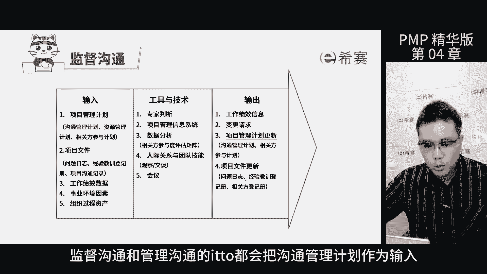

沟通的ITTO都会把沟通管理计划作为输入，但是要记住啊，这个计划不是一成不变的，因为人的需求会变，所以我们需要不断的去更新这个计划，这也是为什么在考试中，更新沟通关计划是一个重要的考点。

所以大家要时刻关注，只要出现干闲对项目的汇报方式信息有质疑的，比如说虽然发了邮件，但是他们抱怨没有通知他们，或者开会了进行抱怨，那这样的情况都需要更新沟通管理计划。

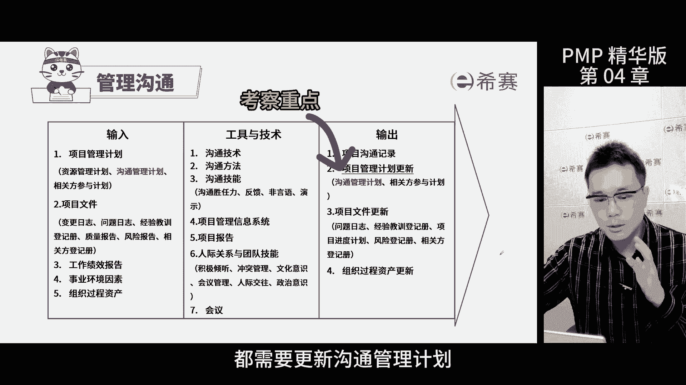

最后我们要分清楚干行登记册，干系人参与计划和沟通管理计划这三个文件，它们各有侧重，干系人登记册就像是通讯录，记录的是干型的基本信息和需求，期望肝型人参与计划呢，讲的是怎么让肝型人更好地参与到项目中来。

写的是如何搞定肝闲人的管理策略，而沟通管理计划，就是保证信息能正确的传递的方法，做题的时候如果碰到了干系人期望的事情，那就去登记册里面翻一翻，那如果发现肝纤炎好像没怎么参与到项目中来，那就是参与计划。

要是看到项目里信息传递出了问题啊，那就选沟通管理计划啊，就这么简单，一目了然，那今天的课到此结束。

