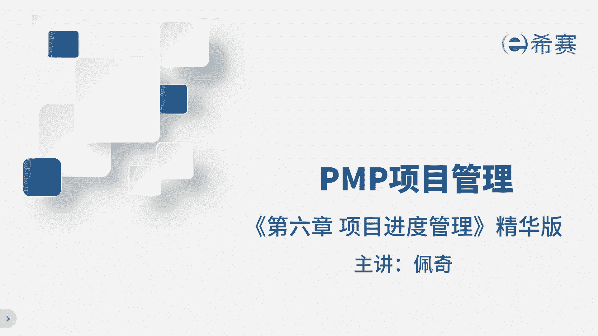
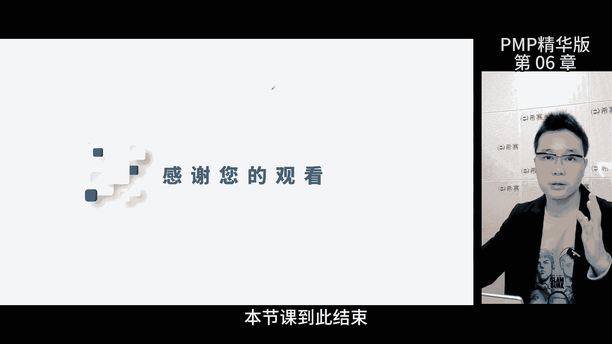

# 强！pmp高效备考，136分钟快速通关PMP项目管理考试精华版课程 - P8：第06-1章 项目进度管理 精华版 - 不爱哭的美少女 - BV1US411P71U

我是佩奇，今天讲解进度管理的进化版，进度呢是非常重要的三大基准之一，这是考评目录，暂停回忆，再继续制定进度计划的过程的工具和技术，进度压缩，它有两种常用的方法，赶工和快速跟进，考试的时候呢。

要特别注意这两种方法的适用场景，那先看一下，正常情况下有三项任务，那每个人负责一个，每个任务需要五天完成，但是现在客户着急了，希望我们能快点完成，就需要进度压缩了，赶工就是增加人力和工作时间。

比如说原来一个人干的事，现在两个人干，原来工作八小时，现在要加班到凌晨才能完成，那这样任务就能更快的完成，而快速跟进呢就是两个任务同时进行，那这样就能在同一时间完成两个任务，从而压缩进度。

比如说你平时做饭啊，等做好了米饭再煮备菜，但是今天呢因为媳妇儿饿了啊，要吃十根烤肠啊，要求快，所以你就需要刚把米饭蒸上，还没好，就开始香肠切花，放烤箱，石斑鱼，放水上清蒸。

那这样同时进行更快的完成做饭的任务，总结一下，赶工呢需要增加资源和成本，而快速跟进，虽然可以同时进行任务，但是可能会增加反攻的风险，那如果真出现反攻了，会带来更大的损失，而且快速跟进。

适用的前提是两个任务必须是可以同时进行的，比如说买香肠和烤香肠，就不可能同时进行啊，因为要先有香肠，你才能考嘛，所以啊在使用这两种方法的时候，一定要根据实际情况来进行选择，关键路径是一个很重要的考点。

它的考法通常就是给你这一类型的表格，或者用文字描述了表格里的信息，然后让你找出项目的关键路径，从而确定总工期或者基于此关键路径做判断，就像是这张表呃，我们根据他的逻辑来画出右面这张图。

在这张图里面最长的路径就是关键路径，这个路径的时间就是整个项目的总工期，所以画图的时候得特别小心，不然就容易搞混了，你看这张图的关键路径是ABCEF，总工期是2+1加5+7加一，总共是16天。

这里有两个概念，总浮动时间和自由浮动时间，总浮动时间，一个活动在不影响到总工期的前提下，可以耽误的时间，自由浮动时间是一个活动，不影响到紧后工作的前提下，可以耽误的时间。

那请问一下图中A活动的总浮动时间是多少，A是关键路上的活动称为关键活动，他要是耽误了就会影响到总工期，所以此处的重点知识，关键路径上的活动，总浮动时间和自动浮动时间都为零，D呢活动的浮动时间是九。

代表了D可以耽误九天，不影响到活动，F资源优化技术其实就两种，资源平衡和资源平滑，这两种方法主要区别在于使用它们之后，会不会改变项目的关键路径，那先说说资源平衡，假设JERRY要同时做活动。

A和B每个活动都需要八小时，但就算领导再会画饼啊，那杰瑞也不可能一天之内全干完吧，所以为了平衡资源的可用时间，只能先干完一个再干另一个，这样一来关键路径就变了，从原来的AC和BC变成了ABC。

总工期也有原来的16小时，变成了24小时，那可见资源平衡的影响还是不小的，再看一下资源平滑，汤姆也要做两个活动，但是也不能同时做，不过活动C有自由浮动时间，所以可以先做A再做C。

这样呢既不会影响到关键路径，也能让汤姆这个打工人拿一个人的工资，干两个人的活，这样总工期还是24小时，所以在做资源优化的时候，最好先用资源平滑这种影响小的方法，那如果它不起作用了，再考虑用资源平衡。

有同学会问啊，这个技术的作用是什么啊，我们来看这张图，这是一个项目的资源安排，左图呢是项目需要多少人啊，六个人，对不对，但是实际过程中只有第二天才会满负荷，其他时间总有人在摸鱼。

所以需要资源优化变成右侧的图，那申请三个人就可以了，成本低，所以资源优化是为了合理的使用现有的资源，同时节约成本，项目进度计划，简单说就是告诉我们项目啥时候能完成啊，每个阶段啥时候开始，啥时候结束。

而项目进度管理计划呢像一个导航仪，告诉我们怎么制定进度，有哪些方法规则要遵守，这两者要做好区分，项目日历就是项目的工作日，比如说有些项目呢是996，每周休息一天，有些项目上是工作四天，休息三天。

工程项目基本上是全年无休，请问你的项目智力属于哪一种，是容易模式还是困难模式，相对的，另一个叫资源日历，就是一个资源的可用时间安排，比如说张三每周只能为项目工作两天，其他时间他都要去度假，作为项目经理。

你也没辙啊啊谁让人家是专家资源啊，所以要通过查看资源日历来规划工作任务，储备分析这个知识点啊，真的非常非常关键，得好好理解，那这张图呢是帮大家做了总结，把三章的考点全部整合到了一起，诶。

大家认真听储备分析是为了应对项目的风险，比如说这章的进度风险，还有成本风险，都有储备分析这个工具储备分析主要有两种，应急储备和管理储备，应急储备是为了应对已知未知风险，只要项目经理签字了就能用。

那这个储备是包含在项目基准中的，而管理储备呢就比较复杂了，它是为了应对未知未知风险，这个储备不在项目的基准内，如果发生了位置位置风险就可以提出变更请求，动用这笔储备批准之后划入到项目的基准中。

这里的考点啊真的还是很多啊，比如说应急储备和管理储备分别对应哪些风险，分别由谁管理，什么情况下用哪种储备和基准是什么关系，要不要走流程，大家一定要仔细看，不懂的多看几遍，真的很重要。

估算活动持续时间有四种方法，那这张表告诉我们，从上到下的方法是越来越准，那咱们来仔细看一下，第一种呢类比估算，就是看看以前类似的项目活动，他们花了多久，花了多少钱，那大概估算现在这个项目得多久得多少钱。

那这种方法呢很快，但可能不太准，第二种参数估算，这个呢得有历史数据建个模型，比如说从历史的数据里面，可以知道一个工人，单位时间内可以完成的工作量，我们就可以算出整层大楼需要多长时间，能完成了。

第三种三点估算，这里有三种数据哈，最乐观，最可能和最悲观的时间，题干中会给出这三个数据，我们代入公式算就可以了，有两种不同的系数，那三角分布是一比一比一，另一种呢是贝塔分布是一比四比一。

题干如果没说默认用贝塔分布，那什么时候用呢，比如说题干说有风险，或者项目有很大的不确定性，就选这个了，第四种，自下而上的估算，这个方法得把工作分的足够细，足够准，加起来就能得到最准确的时间了。

但是这样做呢比较耗时，哎，就是慢，那考试怎么考，根据题干的信息判断用哪种方法，比如说客户急着要结果，那就选用类比估算，如果客户要求很准，就选用自下而上的方法估算，如果带来风险，那就用三点估算。

有变量关系和数据的话，就用参数估算得搞清楚用哪种，那这可是一个常考内容啊，千万别疏忽了，备选方案分析，那这个就是对比多个备选方案，看哪个投入少，回报多，或者最适合你的项目就可以了。

第一活动咱们得明白活动的输出文件有啥，活动清单呢就是一张表，上面记录了所有的活动，简单的描述了每个活动是啥，而活动属性呢，它详细的记录了每个活动的信息，比如说用什么资源，资源的技能要求。

还有这个活动和其他活动之间的关系，考试的时候如果遇到这类问题，比如问你在哪个文件里面找信息，你就记住关于活动的详细信息，都在活动属性里面，那活动清单和活动属性之间的关系。

跟WBS和WBS词典的关系是一样的，紧前关系，绘图法里面有四种活动与活动的逻辑关系，第一种结束到开始就说一件事情结束了，另一件事情呢才开始啊，就像你去餐厅吃饭，得先点完餐，厨师才开始开始做菜嘛啊。

第二种开始到开始就是两件事情，得按照开始的时间来排序，比如说你点了菜，人没到齐，你就给服务员说15分钟后开始上菜，第三种，结束到结束就是一件事情，结束了，另一件事情才能结束，就像你吃饭得等菜上齐了。

才能说吃完饭了，最后一种呢，那开始到结束一件事情，开始了，另一件事情才能结束，就像吃自助餐，你进去吃了，但是你不能在里面待太久，一般现在三个小时内就得离开，所以开始到结束的时间是三小时。

那活动与活动之间呢有多种关系啊，可以根据需要选择啊，如果没有强调，默认是完成到开始的逻辑提前量，就是说某个任务可以提前的时间，比如说审查图纸，可以和设计图纸同时进行14天，那这里少了14天。

所以就用了减号来表示，而滞后量就是一个任务得延后多长时间，比如说装修完了，得等半年之后再入住，那这就是延后了180天，所以是用了加号，那这些提前量和滞后量，还有前面的紧前关系。

都是用在紧前关系绘图法里的，前面提到通过此图找出关键路径，那判断这个项目的总工期，但前提是你得先画出这个图吧，啊通过逻辑关系再考虑提前量之后量啊，就可以画出这张图了，从而判断出关键路径是哪一条啊。

这样才能更好的管理监控进度啊，就像是咱们做菜时看火候啊，得时刻盯着，保证不能出错，那这个过程中，最关键的就是要维护好项目的进度基准，说白了就是维护进度的变更，那说到控制进度变更。

这里经常会从流程顺序的角度来考试，比如题干说项目出了进度问题，首先得赶紧记下来，看看哪里出了问题，是不是人手不够，还是技术上有啥难题，得找到那个最根本的原因，这样才能避免下次犯同样的错误。

那接下来呢还得评估一下，这个状态对于进度的影响有多大啊，要是影响到关键路上的活动了，那项目可能就延期了，最后呢咱们得制定一个调整方案，是赶紧加班加点的赶工呢，还是采取其他的快速跟进的措施。

总之是根据实际情况来定，确保项目能够顺利进行，那解法就是配齐的四部曲，好记录分析评估，解决好，本节课到此结束。

