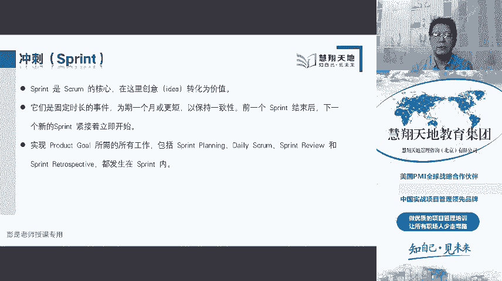
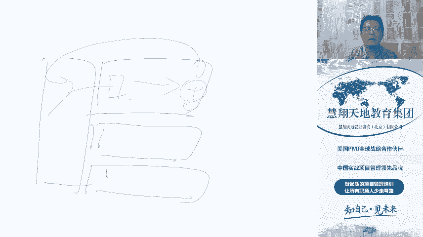
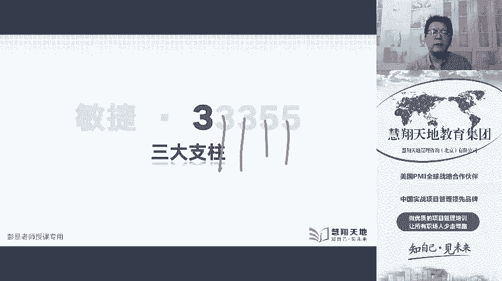
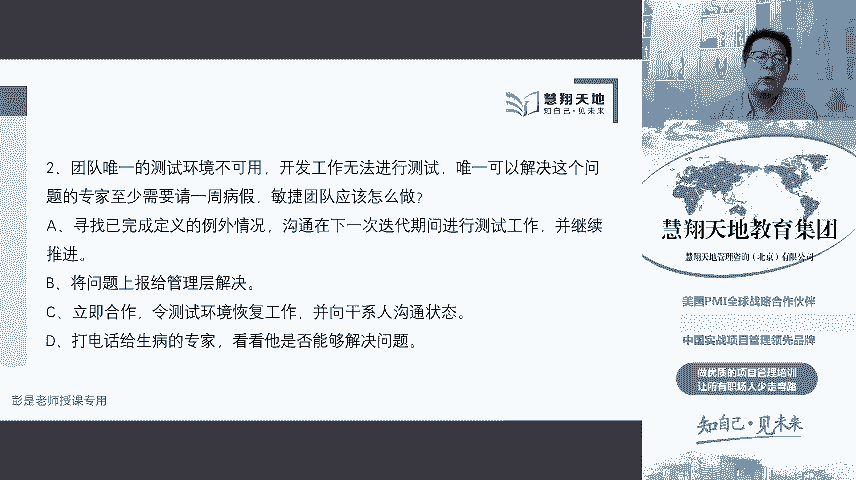
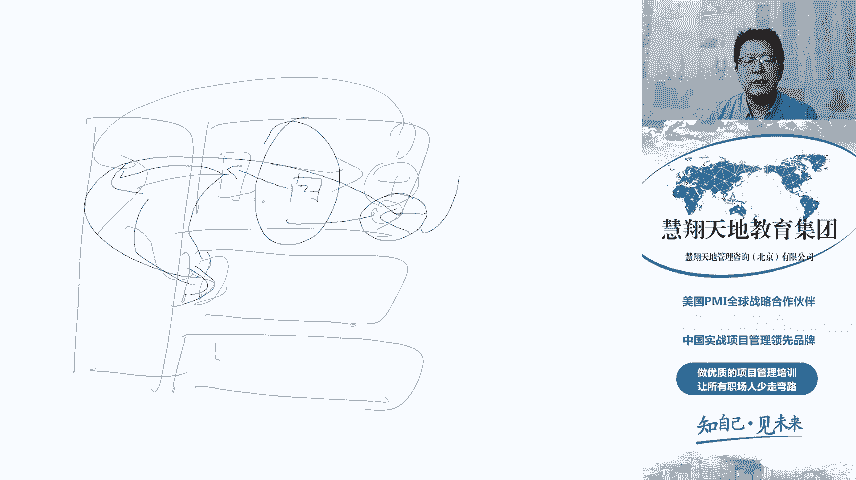
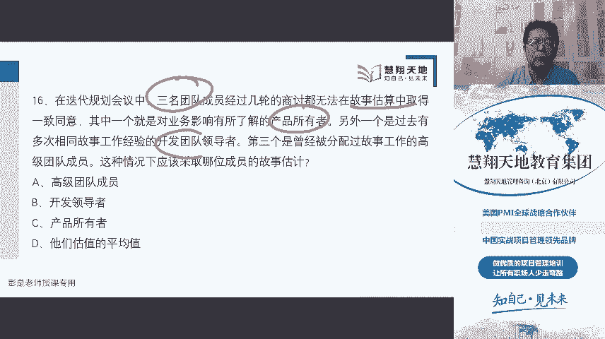

# 彭是老师pmp项目管理课堂——敏捷专场（补充） - P1：7月26日 - 慧翔天地 - BV14G411H7sL

前面那十道题就不用讲了吧，很简单了。好嘞，各位同学准备了准备了准备了，还有大概一分钟不到了，即将开始今天晚上的课程。晚上好晚上好晚上好，小概率事件不用更新经验教训登记册也没啥更新的。

机器用那机使用手机能带流量，但是需要灯光。但是上次那个家里面那个应急灯没充电，没充电，所以没有灯。而且那个灯其实照起来效果也不好，看起来跟鬼故事一样，大家晚上会做噩梦的。好嘞，准备了准备了准备了。

还有10秒钟时间，19876543210开始。好嘞，各位亲爱的同学，大家晚上好晚上好晚上好。咱们开始今天的课程啊。今天的分享课接着上回的分享课我们给它连起来啊，上回没讲完的给他往下讲一讲。

然后上次我们讲到了scrme，对吧？说这个scrme到底是个到底是个什么鬼呢？敏捷到底是个什么鬼呢？就是三个东西。

scrme最核心的就是我们需要squa master就是敏捷教练项目经理呃团队促定者都一个意思啊，需要敏捷教练营造一个环境，从而可以第一。

一名product owner将解决复杂问题所需的工作整理成一份product back，就是我们需要有一个有一个专门的人来负责产品的规划和设计。他来维护这个产品代办事项。他来维护这个产品代办事项。

他来创建和维护这个代办事项。那他怎么维护呢？保补一下那张图，它其实是需要我们相关方都参与进去的，要听团队的要听团队的意见，因为团队帮助我们去规去估算这些用户故事的规模和复杂程度。要听客户的意见。

因为客户给我们反馈反馈他的真实的需求。所以啊其实就相当于PO拉着所有人一起来开这个产品梳理会来整理这个per back里的这些东西，产品代办事项里面这些东西。好。

第二句话说squascribe team敏捷团队在一个spring期间将选择的工作转化为价值的增量。在一个迭代期间，在一个冲刺期间，我们产出成果不就形成了增量吗？产出了成果，让我们的产品增加了功能。

这就是增量。然后第三句话来说，整个团队的利益相关者检视结果并为下一个sp的进行调整。所以其实敏捷敏捷最核心的就这大事儿。一个产品代办事项，经过一轮冲刺产出一个新的东西，然后我们收集反馈。看看对不对。

如果不对，我们再调整。如果不对，我们再调整，及时的调整。所以所有要做的事情，新的需求需求的调整，对成果的不满意，换个颜色变更缺陷补救、预防措施，包括风险的应对，甚至做核酸，全都在产品加班事项里。

全都在产品代卖实现了。是直播呀，如芬同学上次直播断电了，今天直播今天直播续上去。好了。😊，好，这就是整个整个scrame。这今天北京两个阳性，你看一下，百度一下。百度一下，今天两个两北京两个阳庆。

各位同学各位同学马上要考试了，尽量的能不出去，尽量不出去啊，顺便拐个弯。顺正好就是这个话题，顺便说一说，马上要考试了，马上要考试了，还有大概几周几周啊，12天，还有12天考试。

大家最好最好规避一切一切风险。能不出门，尽量不出门，人群密集的地方尽量少去，尽量少去。不要疏中，不要不要出现意外。好，说回来就这点事儿啊，产品代办事项经过一轮迭代和冲刺实现增量。

然后我们需要获得客户的反馈。那客户反馈客户反馈就是那个评审会review那个会议。在旅游会上，我们给客户演示演演示来获得客户的反馈，对吧？您看看这是什么东西，让客户体验体验，你有什么新想法。

直接提提出来提出来，我们再开产品梳理会去排序分析做什么事情价值最高，我们再进行下一轮的冲刺。冲刺完成之后，再给客户来获得客户的反馈。获得客户的反馈，再把反馈意见扔进去，以此类推，就这样不断不断不断循环。

这就是敏捷敏捷最核心的这么一个游戏规则。然后接下来根据刚才这些单词，现在这张图，大家至少至少里边所有单词应该都认识，所有单词都要认识。如果不认识挺糟糕的。不认识，挺糟挺糟糕的啊。

左边叫product owner，产品负责人，他来负责产品代码事项的维护和梳理。所以在维护和梳理的过程中，我们需要获得所有人的所有人的收入。团队要参加，客户要参加，发起人要参加，发起人要参加。

什么业务代表都需要参加。总之，和项目有关的人持续参与持续参与。哎，来做这个产品蛋白摄项的梳理。那有了产品代白事项之后，我们在下一轮迭代开始之前需要开中间这个叫迭代规划会。在迭代开始的时候开迭代规划会。

规划下一轮迭代做什么事情，规划下一轮迭代做什么事情，就相当于收集需求，定义范围创建WBS。于是我们把大需求池里的需求搬到小需求池，这不是收集需求吗？需求过来之后，我们来决定哎。

实现这些需求需要开展什么样的工作，这是定义范围。定义范围范围定好了之后，我们把把这些工作就一个一个的分解，变成了tsask，就是任务，就相当于创建了WBS。所以通过迭代规划会干这个事情定冲刺的目标。

然后我们把左边的大需求势里面的需求搬到右边迭代代办事项里去。搬过来之后，团队就开始干活去了，干活以后就完成工作。然后通过评审会获得客户的反馈。获得客户的反馈，把反馈意见扔进去。

然后右下角呢racachel这个会呢指的是回顾会，它更关注的是去思考去复盘我们当前这一轮冲刺的过程，看看这些过程有什么差距有什么不足。哎，想办法想办法不断的改进优化我们的过程，干这个事情。

然后右边这个DOD标准也不用说了吧，我们再把任务搬过来之后啊，每个任务，每个任务，包括我们的backlogPO都要给出明确的已完成定义。这种题大家也应该见过了啊。

PO都PO都应该给出一个完全的已呃明确的已完成定义，只有它符合DOD标准的，我们才认为这个工作真真正正完成了。然后右上角这个东西叫每日战会，每日战会也说烂了吧，就这么仨事儿。

就这么仨事说就完成了什么事情，打算做什么事情，然后工作中有没有遇到问题。工作中有没有遇到问题？好了，大概是这么几个东西。DOD哪个会产出的？搬过来的时候，迭代规划的时候就定了。

迭代规划的时候定我们这一轮冲刺的目标定嗯每个任务，每个任务的完成标准。迭代规划迭代规划。大家关于这种问题，其实你看srumm那十页子。求求各位同学，你看一看吧。求求各位同学，你看一看都写了都写了。

稀奇古怪的问题都写了啊，咱没必要在课上把那实验值给大家念一遍，是这个道理吧，没必要干这个事情啊。看一看看一看看一看，求求你们了。好啦。所以上次讲到了敏捷的3355。明天的335三个核心角色快速过了。

三个核心角色就三个小人儿。三个小人对吧？一个小人叫PO他他主要干什么呢？负责产品代办事件的维护，然后分析做什么事情，对用户对用户价值最高。中间这个个team就是交付团队，开发团队。

他来完成工作的执行和控制。对不对？工作的执行和控制到底做什么事情到底做什么事情？PO来定了。其实规划看来每一轮我们跟着团队一起分析这一轮能做什么事情。然后交互团队主要是关注关注如何把这个事情做完。

如果把这个事情做好。哎，这是开发团队。然后右上角这个孤单的小人叫square master，他的主要工作就是服务型领导，我们把权利交给团队，由团队完成工作的规划执行和控制，我们变成服务型的领导力风格。

服务型领导到底做什么事呢？大家看看s那那那篇文章里面都写了。培训对吧？指导引导、启发、排除障碍，宣教，告诉大家敏捷的价值，指导大家应该用什么样的敏捷的方法去实践，去完成完成项目的工作。就这样的事情。

我们不决策，我们不决策，我们只是给大家做服务的，就是服务员粗暴理解就是服务员。你餐咱去餐厅吃饭，服务员不替你做决策，但是他给你给你提建议。是这个道理吧，先生，您点的肉太多了，你点需要需要吃青菜。哎。

最终您决定权在您决定权在您啊。先生，您太胖了，我觉得不要点肉了，决定权在您，我只是给您提建议，square master就干这个事情，不替团队做决策，不替团队做决策。好了，然后再往下产品负责人。

PO负责最大的投资回报率ROI通过确定产品特性，把它们翻译成一个有优先级的列表，就是那个产品代办事项。就是产品代码事项productback。产品代办事项，它来确定我们产品需要具备什么样的功能属性特征。

产品需要具备什么样的功能属性特征，说白了就是需求。然后把一个个的用户故事这样的需求扔到PB里面去。然后对PB里面这些需求做排序。分析优先做什么事情，优先级最高。所以第二就是为下一个sprint决定。

在这个列表中，哪些应当最高优先级。并且会不断的调整。优先级和梳理这个列表，不断的调整和梳理优先级。这个列表。这个会叫什么呢？就是产品梳理会。字面意思了，产品梳理会有的时候也被翻译成产品研讨会。

产品梳理会、产品研讨会，这是维护product backlog产品代白事项的。这里面的东西排排序，分析哪些东西价值最高。那怎么排序呢？需要团队参与进来完成这些故事的估算。

算算我们做一个健康码大概多少的工作量，算算我们做一个核酸检测，大概多少工作量。算算我们做一个老油待查大概多少工作量。哎，估算出这些故事的规模和复杂程度，PO就能更好的更好的去排序了。

因为要考虑工作量和对应的收收收入，对不对？粗暴理解啊，做一个健康码可能收入10块钱，还做一个核酸检测，可能是8块钱。做一个老爷代查，收入个3块钱。哎，那我们看先做最贵的价值最大的就这个道理。

所以需要听需要需要需要倾听团队的意见，产品梳理会，那产品梳理会什么时间开呢？看情况。看情况。有的有的团队呀在迭代规划之后，选择我们迭代迭代过程中选中期。选后期选早期，随便没有硬性的要求。

根据项目的情况自己选自己定。那具体什么时间开比较合适呢？肯定不会考啊，都不用问，都不用啊。所以随便，但是这个会要有这个会一定要有啊。好了，所以PO的职责是定义需求，定义需求的优先级。

定义需求的验收标准就是那个DOD definition of time。验收标准。然后还要定义产品发布呃，定义产品发布内容和日期，看到产品发布内容和日期能想到什么知识点呢？

看到产品发布日期能想到什么知识点呢？哎，大家看看PMbook里面制定项目管理制制定项目进度计划的一张。有个工具叫敏捷发布和规划这个事儿，PO也是干到产品路线图。哎，对，小志同学产品路线图产品愿景。

然后根据产品路线图，产品愿景出发布计划，什么时间发布第一版，什么时间发布第二版，发布计划一旦敲定了，我们就知道了迭代周期，迭代周期和迭代次数，对不对？比如三个月发布一版。我们假设迭代周期是两周。

那迭代次数我就出来了。哎，这就是PO的主要职责。看看啊最关键的这么几个。第一个是迭代产品梳理会维护这个product的backlog产品代白是项的。另外我们还要开迭代规划会。

迭代规划会是把这些东西搬到小徐州池。把这些东西搬到小区，就是根据团队的交付能力去分析哪些东西先搬过去，价值最高，把先搬的搬过去，搬过去的这些事情，这些事情我们要定它的验收标准。

翻过去的用户故事要定他的DOD标准迭代规划会里面定它的DOD标准。就是验收标准，就这大概PO主要就这么几个几个事情。最后呢就是获得客户的反馈，要组织迭代冲刺冲刺冲刺完成之后。

把我们的产品给客户演示给人家，让人家去体验，来征求人家的意见，获得人家的反馈。好了，这是产品责任人。产品责任。各位亲爱的同学，大家如果现在基本概念不知道，咱根本没办法聊了。越讲越散，大家有没有发现？

越讲越散，跟你说，发布计划是高层级的，是产品经理，是产品负责人吗？不是产品经理是公司的职位，产品责任人，产品责任人是什么呢？是项目的角色。所以各位亲爱的同学在听今天课听，听今天课程之前。

建议各位同学先把之前的课程听一听。听完了之后啊，再看sgramm。再看习惯吧，咱们不可能所有的课程说的很难听啊。接下来咱不可能所有的课程照顾那些基本概念，掌握的不好的同学，我们还要照顾人家学习好的同学。

是不是这个道理？所以接下来这些基本基本概念我就聚答了啊，聚答了，按照我的节奏讲。好了，看看产品责人在ACB那本教材里边怎么写的，一样的，产品负责人负责指导产品的开发方向。

产品负责人根据商业价值对任务进行优先级排序。看到排序了吧，对任务进行优先级排序，就是想到productback lock这里面的东西排排序。然后产品负责人和团队开展日常合作和日常合作，提供产品的反馈。

为未将要开发交付的下一个功能设定方向。这句话看完了就想到迭代规划会。迭代规划会，就那个sprint planning planning meeting，迭代规划会去定下一轮迭代的目标。

定下一轮迭代的目标。然后根据团队的交付能力，把产品代办事项里的东西搬到迭代代办事项里面去。所以大家后面看书看书看不懂，你看到每句话都要想到知识点，书上没有什么废话呀。好了，然后再往下，这意味着任务不大。

往往一张索引卡就能描述这个索引卡，看到他能想到什么呢？就是那个。看板之前讲过了吧，一个一个的小任务，这是索引卡呀，任务卡片任务卡片都放在这儿了，每个任务卡都有DOD标准，然后成员就去领取任务。

成员就去领领取任务。我们在每条甬道上设置WIP任务上线，开发测试再分场两列开发中开发完成测试中测试完成，这样我们就能够看到这些任务在整个工作流里面的流动情况。可以看到哪些任务堆积了哪些任务超过上线了。

哪些任务好几天不动了，可以分析分析我们整个研发过程是不是存在着阻碍。干这个事情。所以这段内容又该应该又有的同学听不懂了啊，建议各位同学先听一听之前的课，看看看看了解一下什么叫看板。好，再往下看。

产品负责人和相关方客户和团队协作来定义产品的开发商开发方向，就想到产品梳理会。产品梳理会刚才那张图说我们这些所有的人你吧团队啊、客户啊、发起人呢为产品为产品提供收入，了解大家对这个产品的需求。

了解团队对这个产品估算的规模、技术复杂度，干这个事情。那这个活儿想想一想就不好干。所以呢这个人应该有工作背景，应该有丰富的专业知识，不然这活干不起来。所以很多很多企业里面会有产品经理，这是公司的岗位。

公司的职位，产品经理可能会到项目上兼PO兼任项目的产品负责人。所以产品负责人要请求相关方，后面这些内容全都不念了。什么什么架构师什么什么具有丰富的产品经理，需要提供协助。

产品负责人需要关于组织什么什么培训，这都不念了啊。好，第三小段在敏捷开发之中，产品负责人将为团队创建代办事项列表，或者是与团队共同创建。大家随便一想怎么做更好呢？是PO一个人来维护呢。

还是PO要和团队共同维护合作效果好呢？啊，永远咱既大方向怎么做更好，怎么做更好，合作合作这种永远是最好的选项，对不对？永远是最好的。好了，然后最后后面那句话。

代办事项列表将帮助团队了解怎样在不产生浪费的情况下交付最大的价值。不浪费不浪费，时间不浪费，工作也不浪费，任务也不浪费，不要让任务堆压堆压，对吧？不要让任任务堆积，不要说下一轮迭代。

我们能完成100个故事，然后我们塞过去180个故事，可能什么事情都干不好了。不要在任务之间不停的切换，一个人专心致志的把手头的工作做好。就前面见到的那些那些场景，就能冒出来啊，不浪费，不浪费。

实现价值的最大化。好了，所以最后一段敏捷团队的一个关键成功因素就是强烈的产品责任感。如果不重视为客户创造最大价值，敏捷团队可能创造一些不被理解的功能或者价值不高的功能，因而造成精力上的浪费。对不对？

就想那个健康码扫码登记，什么健康健康码查询，核酸检测，然后打打没打疫苗，老幼代查。咱健康码本身开发的过程也是以价值为导向。先照顾最多最多最多的这种大众群体，我们先需要一个健康码，对不对？

一上来做老油代茶，这这就本末倒置了，他小众他小众人群。所以我们先照顾大多数人群干这个干这个事情，哎，这就是价值的最大化。所以敏捷最后核心出来就那么两句话，又来回说了，我们产品量卖事项。

然后冲刺产出东西获得反馈。为什么用短周期这样的迭代方式呢？因为我们要用我们要用最小的代价。最小的代价把这个东西先做出来。做出来的东西获得客户的反馈，最小的代价去试做。因为不确定，因为不确定做什么事情。

它价值最高，这是不确定的。其实。所以敏捷是轻规划重探索。大概计划上弄的相对估算对吧？成本清轻量级估算，大概算一算就完了。所有的工作量工作量的估算都是相对估算，不需要绝对。都是相对估算。

所以才有了什么敏捷扑克啊，对吧什么T恤估算啊，就这些东西大概算一算，找个参照物一对比，差不多，先干起来再说干在实践的过程中再去调整我们团队的速度。所以大家以前见过这样的题，不知道记不住啊。

有没有见过这样的题啊，迭代速度迭代速度原来定的是100，结果经过几轮迭代之后啊，速度变成了80，应该见过了吧，迭代速度迭代速度降下来了，并且8080比较稳定了，怎么办呢？那就按照这个速度来。

就按照这个速度来实实再说。试实再说。所以都是尝试，不断的尝试不断的尝试在实践中实践中不断的改进我们的过程。好了。😊，再往下看，敏捷教练和书上。看看我们的敏捷教练项目经理主要的工作啊。

呃敏捷教练是帮助团队开发，帮助产品开发团队学习并应用squame来达到商业价值。我们要给人家小J理动之以情，让大家意识到意识到敏捷这么玩儿，它有什么好处？它有什么价值，对吧？让大家理解明解。

所以有见过好多题了吧，有的人觉得产哎迭代规划会浪费时间，每日站会没价值，产品评审、产品评审浪费时间，然后回顾会议浪费时间，见过好多这样的题了。没，那我们要去宣教，对吧？每个会都有每个会的价值。

每个会都有每个会的重要的作用和意义。他不是随便随便就说我们要开会，不是这么随便一说的。所以敏捷里面设计这些会包括本身的迭代的这个周期都有明确的明确的时间和对不对？

每日上会10到15分钟、15分钟以于上线了。然后这些评审会呀，回顾会呀，迭代规划会啊，都通常是1到2个小时，如果迭代周期是两周的话，然后迭代周期呢也得有固定的时间吧，在固定的时间，固定的时间。

我们尽快的最高的效率，把这些事情先做完。然后尽快的尽快的主要主要的时间都花在干活上了，探索。那如果工作的过程中发现一些什么技术的创创新，也见过了吧？技术的创新，一些高风险，技术上的不确定性怎么办呢？

piike。探索仍然是探索姿态试试看，甚至允许多种方案同时stack。有人说放盐好，有人说放糖好，有人说盐和糖都放比较好，你们仨都试试都试试试试再说。通过你们的尝试，通过你们的探索。

我们来看看来看看给予反馈。我们来确定哪一个方案最优，对不对？你前面花花两天、三天、4天、5天时间的去去论证，去讨论，去开会，有这时间活都干出来。有的时间活都干出来了，因为本身迭代周期就不长。要小于四周。

本身迭代周期就不长。对吧没那么复杂的东西，复杂多多东西我们都做了分解，都做了分解。所以大家也见过这样的题了吧，说有的故事太大了怎么办？分解。太大了就分解分解，分解到一个合适的控制程度，差不多就行了。

然后把故事搬到迭代代办事项，再分解成一个一个的任务。总之总之总之，天下大事合久必分，分久必合，复杂的事情，有规模的事情就把它拆拆到可控的部分就干活干就完了。好啦。😊，所以我们为大家服务。

为呃会做任何力呃任何力所能及的事情来帮助团队产品负责人和组织取得成功，反而培训、指导宣教干这个事情。那我们的主要职责呢是促进团队工作。促进团队工作，让大家成熟，对不对？让大家自主自主做决策。

让大家能够变成成熟的自组织这样一个状态，让大家都是通才。所以该指导的指导，该指导的指导，该参与的参与，但是尽量的尽量的不做决策，尽量的尽量的不做决策，一看到说帮团队成员制定个计划。

帮你制定一个什么什么东西。这这这话通常通常就不选不选。好了，所以我们要帮助团队熟悉和掌握敏捷的价值观和框架，帮助排除影响生产力的障碍。哎，有障碍，我们说你们自己去搞吧，我不管，这其实也不好，对不对？

最好最好最好还是鼓励大家，你们能能搞定的，尽量搞，搞不定了，我才我会给你们指导，才给你们启发。然后确保团队不受到打扰，这样的题也见过了吧。说张三说部门老老叫我去干部门的事情。

李思说部门老老让老让我去部门开会，导致啊我在迭代中迭代中工作受到了影响。那我们要去和对方的职能政理去沟通，去协调，确保大家在工作的过程中专注。确保大家在工作的过程中专注。好了，这是敏捷教练。

像敏捷教练会功成身退吗？很多企业其实是外聘的敏捷教练。很多企业做敏捷转型的时候会外聘拼第三方的敏捷教练，然后拼的差用的差不多了，就就就就就拜拜就拜拜。就这样了。辅导团队辅导团队一旦走走上正轨，哎。

掌握了这个原则，掌握了这个规律就可以就可以撤了。好了，然后再往下看看那个刚刚ACP里边怎么描述这个团队促进者的团队促进者、敏捷教练，然后项目经理都是一个意思。粗暴理解啊。

敏捷团队常见的第三个角色通常为团队促进者，也是一种普人式的领导。然后他这个角色呢也称为项目经理scrme主管、项目团队领导、团队教练或者是团队促进者，这都是一个意思。都是一个意思，你想怎么改就怎么改。

可以是项目经理兼squascribe master，也可以是敏捷教练兼项目经理，可以项目经理聘一个专职的专职的敏捷教练都可以，想怎么玩就怎么玩。好了。😊，然后第二句话。

所有敏捷团队在团队中所有敏捷团队在团队中都需要有仆人士的领导。这个其实无论是敏捷的团队，还是传统的预测型的那种项目的团队，对不对？传统的项目，传统的项目项目管理者也需要考虑转型。

转型变成这种服务型的领导力风格。好了，人们需要时间来建立自己的普认识领导风国，包括引导指导、消除障碍，引导指导启发。帮助。参与该培训的给你培训啊，就干这个事情。然后起初在内部后面两句话咱就不念了。

就刚才说给大家说过那个场景，起初在内部培训能力不足的时候，企业也可以外外聘敏捷教练，去提供这方面的帮助。那外聘的外聘呢用完差不多就可以了，还是要培养本土的教练。然后再往下就是我们的第三个角色开发团队。

开发团队呢负责产品呃，负责建造产品负责人所指定的产品，对交付的结果负责。对交付的结果负责什么意思呢？就是他要做承诺的，他要做承诺的。整个开发团队就我们这一轮承诺能够完成100个故事点，这都是承诺呀。

然后我们把任务分解成了一个一个的tsask，成员在领取任务的时候，领取任务的时候都是做了承诺。哎，这活儿我一天能干完。这活儿我两天能干完，这活儿我一天半就搞定，这都是做出承诺，我们要对这个结果负责。

这不是随便说的不是随便说的啊。好，然后第二句话看看团队是跨职能的，有开发，有测试，甚至还有运维。团队是跨职能的。它包含了所有的专业能力，开发测试需求分析，这不解释了啊，并且它是自呃第三句话。

并且它是自组织的自管理的，被给予很高程度的自制和责任。我们就把工作的规划。执行和控制权全都下放，全都下放，交给团队，由团队来自行完成工作的规划执行控制，这不是自组织吗？这就是自管理。好了。😊。

然后再看看ACB里面教材怎么写的跨职能团队成员跨职能团队包括具有生产可行产品所需的各种必要技能的团队成员。在软件开发中，跨职能团队通常包括设计人员、开发人员、测试人员以及其大学策。

然后我们能够以常规节奏交付潜在可发布产品的专业人员，至关至关重要，后们就不念了吧。已完成什么这帮高质量无外部依赖，就总之总之总之这帮人这帮人这帮人啥都行。对，这成熟的这组织团队出来出去，就这么几个单词。

好了，这就是敏关于敏捷里边的三个角色。这一共5个小5个小头像。然后PO负责产品代办事项的维护PO负责往右边搬，去分析下一轮迭代做什么事情，优先级最高来决定这个冲刺目标。

搬过来的东西分解出来分解出来的任务。PO都要给出明确的DOD标准。就这么几个几句话。然后开发团队负责干什么事情呢？既然你搬过来了，搬过来了，我们就要有责任有义务的把这些工作做完。把这些工作做完，对吧？

兑现我们的承诺。然后米捷教练在上边干什么呢？我们就把权利都交给你们了，你们自己去玩吧，自己去玩吧。没事，别找我，我是个服务员，我是个服务员，对吧？咨询的时候可以参与一下，可以参与一下。

有问题可以参与一下，给予指导，就这样干这个事情。好了。😊，然后敏捷的3355，第二个三指的是三个弓箭，上次好像刚好讲到这断断电的啊，三个弓箭，三个弓箭能想到啥？开篇就说了，看看什么是三个弓箭呢？

你属会啊，现在有4个会明显不是，对不对？迭代规划站会回顾会。和评审会一看会议明显大于三了，不是，那什么是三个宫辩呢？哎，卢坤同学说的对哈。就是我们那个两个backlog和一个增一个增量。梳理费也不是。

好了，所以三个供件。第一个弓件就是产品代办事项。Product backlog。product backlog由PO负责维护。

包括增删及优先顺序PO来对来对product backlog对产品代办事项负责。他是最高决策手，听他的。虽然我们可以往里边扔东西，但是能不能扔听他的听他的哪个东西优先级高，听他的听他的。对不对？好了。

然后用户故事只是其中一种最佳实践。用户故事是什么呢？咱们课长也反复说了，这个东西就约等于需求。约等于需求，对吧？就是作为一个什么样的人，然后我有一个什么样的想法，这么做的目的是什么东西？

要说出用户的角色，他对项目的一些期望和要求，以及他最后最后为什么提出这样的期望和要求。他背后的动机。通过分析，他的动机，更能更好的给他制定相应的解决方案。好，所以每种需求都要完都要描述其外部价值。

外部价值就在于那个刚才说的soso that。就是说他为什么需要这样的功能。为什么需要这样的功能？就像咱现在大家听课的这个教学平台，对吧？彭老师就会提需求，作为一个老师，作为一个老师。

我需要一个踢人的功能。这样我看谁不顺眼就可以把他踢出去。哎，他就没有价值。只要你彭老师满足你个人的欲望，这不行，这功能我们不做。好，换句话说，作为一个老师，我需要一个踢踢人的功能。

如果有同学在课上调皮捣弹，我就可以把他踢出去。哎，这就是一个有外部价值的有效的需求。所以更关注的更关注的就是他是不是对用户的业务起到支撑，是不是符合用户的业务需要，用户的业务期望。所以就是需求需求。

咱上课的时候反复再说了，他应该符合smart原则，明确的可衡量的可实现的和业务有相关性的，还要有相应的时间要求，时间约束，不能遥遥无期。这是POproduct backlog log第一个弓箭。

第二个弓箭呃，dpro product back后面还需要对一个。产品目标产品目标是什么呢？看看啊，这但这概念很简单啊，产品目标产品目标描述了产品的未来状态，可以作为敏捷团队制定计划的目标。

是不是就这个产品路线图那些东西了，想一想。然后product go在产品代办事项中，其余部分有现用来定义做什么，将实现产品目标。是不是？就是那个方向。所以最后这句话知道这个意思就可以了。产品的目标。

产品的目标就是敏捷团队的长期目标。他们必须先实现一个目标，然后再开始下一个目标。所以我们要先高瞻远瞩。做产品路线图。产品路线图产品愿景产品愿景啊，有了愿景，产品路线图清楚了，我们就一个目标，一个目标。

一个目标的去不断的迭代干这个事情。所以这是产品负责人产品负责人对产品代办事项做出的承诺。产品负责人对产品代办事项做出的承诺，对吧？高瞻远瞩啊，第一版我们要发一个健康码，里边能查，能扫码登记。第二版啊。

我们把核酸疫苗扔进去。第三版我们做什么老优代查换头像。哎，这就是产品负责人对这个三个目标要承诺出来。好了。

然后第二个弓箭叫产品呢叫迭代代办事项sprint backlog迭代代办事项是从产品代办事项出来的，可以可以理解吧。从大需求池里边搬到小区求尺，每一轮迭代都有一个迭代代办事项。由团队评估。第二句话。

由团队评估和选择product backlog里面哪些东西放入spprint backlog。我们要根据团队的交互能力，从左边往右边搬。现在我们的速度是100就搬过来100。

下一轮速度可能降到80就搬到80，再下一轮速度还是80，那就搬过来80。那左边有很多东西可能凑能凑到80个工作量，对不对？粗暴理解啊，左边有很多东西能够凑到80，那什么东西什么东西搬过来呢？

就是要排序了。对不对？比如A是一是100，B是80，C是10，D是5，不要搬110，不要搬115，不要搬105，搬过来100都咬着牙搬。理论上来说，大家第一次迭代的时候，甚至可能少搬一点，宁缺无滥。

没错，宁少勿多。实在不行，AA如果是100的话，我们现在的速度就是100，那不行，就把80先搬过来。尽量的尽量的不要让团队去满载。因为实际上我们在估算工作量的时候，都是相对估算。

工作中可能会有各种各样的其他时间被占用。就是那些大家理想时间这个单词见过了吧，理想时间这个单词，对不对？不可能不可能每天满在工作8小时都是高负荷的工作中可能或多或少总会被打断的。

所以尽量的尽量的就是只少不多，宁缺无滥。这样的原则，以及绝对绝对不能多，绝对绝对不能多，不能大于我们迭代的速度。好，看看啊，就这么三句话，从产品代办事项过来的，把它搬到迭代代办事项，大家一起来分析。

一起来商量搬多少过来。然后团队需要一起定义完成标准。团队需要一起定义完成标准。这个完成标准一定要PO做决策。一定要PO做决策，就是搬过来的每个需求，甚至分解的每个任务都要有明确的DOD标准已完成。

这东西要不清楚不清楚的吧，DOD标准如果不清晰不清晰，就像咱应该见过这道题了吧。因为啊什么东西什么叫已完成每个人理解的情，每个每个人的理解不一样的。一定是这样的，像大家日常工作里边对吧？彭老师。

你把这个会议室打扫一下。哎，那我心中的已完成啊，就是把这会议室地上的垃圾给你扫干净就完事儿了。张三觉得可能需要把垃圾扫完了，还要把桌子擦一下。李四觉得垃垃垃圾扫完了，桌子擦一下，还要把椅子摆齐了。

王武觉得应该把这个玻璃啊也擦一擦。大家关于已完成的标准，每个人每个人心中的标准是不一样的，靠自觉对不靠经验，靠自觉，靠经验。所以一定一定要整个团队一起，大家给出一个明确的已完成的定义。

否则否则这活儿干的就可想而知了。每个人每个人的想法不一样的。好了，这就是那个为什么要出一个一个非常明确的已完成定义，并且要PO做做决策。因为PO来对已完成定义做检查。

只有他认为这个东西真真正正完成了符合DOD标准，这个东西才算一个才算一个正正儿八经的增量的成果。好，再往下承诺看看啊，我们要承诺spprint目标，就是spprintspprint冲刺目标。

spprintring go是spprint单个目标，是我们迭代的单个目标。spprintring go在spring planning事件中确定就是迭代规划会。

迭代的冲刺目标这迭代目标冲刺目标一个意思啊，迭代目标在迭代规划会议中确定，然后添加到迭代代办事项之中。那么如果需要做的工作和预期的不同，他们将与PO协作。在不影响冲刺目标的情况下协商本次。

冲刺代办事项的范围，具体也见过了吧。见见没见过，这是我们的迭代代办事项，迭代代办事项就写写缩写了不好听，迭代代办事项，然后团队就去干活去了，干活去了干活去了。

那如果现在如果现在我们需要对迭代迭代代办事项里的东西做调整，一定要和PO去沟通。要协商，大家一起商量，有事好商量，对不对？如果觉得我们当前迭代，比如说工作部保和原计划能完成100，现在完成80。

我们立检查迭代站地图。这其实这句话说完了就太活学活用了啊，看看迭代站地图，看看我们现在有没有增加这个工作的空间。如果有增加这个工作的空间，可以考虑扔进去。见没见到过这样的一个场景呢？

当时应该有这样一道题吧，说在开每日战会的过程中，有人有成员说，我要采用一个新方法。那作为敏捷教练，一定要过问一下，多问一句，对不对？还采用这种新方法会不会影响到当前的工作，会不会影响到本轮的冲刺的目标。

如果你工作上有空间，有有这个时间，有足够的时间去完成这个新方法，那没问题。只要不影响冲刺目标。但是如果如果能够可能会影响冲刺目标怎么办呢？就是对叠代代办事上里率的东西做置换。做时换吧，见过这样的题了吧。

如果现在有ABC3个任务，然后。P我觉得啊我们要换一个D任务进来，这个东西现在优先级特别特别高，那怎么办呢？我们这一轮做不完，那考虑如果ABC都没有开始，我们把C扔出去，把C扔出去，把D扔进来。

把D扔进来，哎，做等价交换干这个事情。并且里面还有一些细则，比呃太细了，再说再说太细了。什么细则呢？比如说有一些工作可能已经在看板里边已经在进行中了，进行中的任务最好最好最好不要终止它。能理解吗？

这活儿我干了一半了，这活儿我干了一半了。你突然说有个是优先级的东西过来了，然后把手里边的工作暂停，最好最好不要。因为暂停一个工作，下一次再重新开始这个工作，这是浪费。因为我们思路上要切换，记得吧。

记天那个任务切换吧。哎，这活干了一半，我就再去做别的事情了，然后过把别的事情完成以后再回来再回来做这个事情，可能导致浪费了时间。因为任务切换任务切换，其实是很浪费时间的，这是一种时间资源的浪费。

所以最好最好不要把进行中的工作终止，除非除非这个事情真的非常紧急，比如说做核酸，比如说大楼要封了，大家赶快搬电脑回家，对吧？除非这种紧急情况，我们是可以终止工作的，对不对？所以最后就变成活学活用。

一定是看情况。原则上是尽量的尽量的不要在当前迭代的迭代的过程中去增加工作量，超于我们的预期，不要影响我们的冲刺目标，不要影响我们的冲刺目标，这是原则。好了。😊，然后再看到第三个弓件叫增量。

第三个弓箭叫增量，增量不用解释了吧。需要关注的是可工作的软件功能增量。然后需要在回顾评审会上review这个会上进行展示。就是我们那个产品代办事项迭代规划迭代代办事项，然后大家去干活，工作已完成。

产出增量，开这个review这个会评审会。在评审会上，我们有由PO给客户进行演示，获得客户的反馈，对不对？亲爱的，您看看这个健康码做好了，亲，点这个按钮叫扫码登记，亲点这个按钮叫叫叫叫叫健康码自查。

您试试您试试有什么想法跟我说，哎，这就是演示，获得客户的反馈。好了，这就是增量。所以这就是敏捷敏捷最核心最核心这么三个空件。

然后增量对包的就是我们刚才给大家说的那个DOD definition of down完成标准DOD标准。DOD标准看一看这个文字怎么写的啊。

DODDOD是当增量符合产品所需的质量度量标准时对其状态的正式描述。然后当一个产品代办事项的条目符合DOD的时候，就会产生一个增量。

当一个产品代办事项的条目就是需求一个需求符合他的这个需求的DOD的时候，哎，这个需求真真正正做完了，功能就增加了。形成一个增量。然后如果一个产品代卖事项的条目不符合DOD，那么它就不能发布。甚至。

不能在迭代会呃迭代评审会上去展示它。什么意思呢？什么意思呢？我们这一轮这是产品代盘事项，这一轮搬过来两个需求，一个是A，一个是B迭代代盘事项。然后迭代代盘事项大家就去干活了。结果呀迭代迭代结束的时候A。

我给你打等我写一下啊，迭赛结束的时候，A做完了B呀，做了一半。地做了一半。那大家想想这个小小问题，刚才这句话看完了之后，A和BA和BA做完了一半。AA做完了，B做了一半。我们评审会给客户看哪个呢？

是A还是A和B。是A还是A和B呢？刚才这句话就在说吧，对不对？好，没错，恭喜各位同学答对了，我们只给客户看A。因为你没完没做完的东西，你你怎么给人反馈呢？是这个道理吧。想一想啊，就这个道理，很简单的。

没做完的，你让我看个屁，对不对？变成人话就是这样的，对不对？亲实，您看看这叫健康码，这个功能还没做完，您千万不要点哦，点了会报错的。客户肯定会骂娘吧，没做完，你给我看个屁啊，就这个道理。

所以B如果没完成，不演示。它不能够形成增量，把它扔回产品代单事项，下一轮再说。下一轮再说，哎，这就是刚才这句话说的意思。对不对？所以如果一个东西没完成，不能把它在在评审会上做演示，不能在评审会上做演示。

然后把它放回产品代办事项。下一轮迭代规划的时候再说了。下一轮迭代规划的时候再说。好了，这是关于这个道理，再给大家再。😊，再讲个细节，看看能不能能不能能不能想到啊。比如说我们产品代办事项。

然后迭代迭代代办事项，我们放了三个东西过来ABCABCA的工作量，A的规模，比如说是20个故事点，B的规模是20个故事点。C的规模是10个故事点。结果啊迭代结束的时候，A完成。B完成C。完成了50%。

那么请问我们这一轮冲刺的速度是多少？She。想一想。A完成B完成C完成了一半。我们这一轮冲刺的速度是多少？40还是45呢？除了个66%，我就不理解了。

冲刺速度冲刺速度用故事点去规算呃用故事点来描述这个冲刺速度。故事点就体现这些故事的规模。好了，各位同学恭喜你们答错了，正确答案是40，一半对一半错了吧。正确答案是事实。完成的事情才算才算速度。

不完成的事情不算速度。你C那个十没做完，它就不是我们这个有效的速度。所以算绩效算绩效以结果为导向。新工同学说的非常棒，看结果完成了完成了才算有效的速度。哎，就这个道理，所以冲刺速度是40。

那下一轮在迭迭代规划的时候，对不对？讲这个逻辑啊，在下一次下一轮迭代规划的时候，我们就按照40给团队分配任务了。我们要确保最好每一轮冲刺能够有一些。完成的成果。不要说冲刺完了，冲刺完了做了一半。

最好是每轮冲刺有结果。所以下一轮冲刺的时候，我们就按照40来往从这边拉取，拉取需求放到这个代办事项里面去。好了，就是这么个道理啊。😊，所以这就是刚才刚才见到的敏捷的这三个工件，产品代办事项。

迭代代办事项，迭代代办事项在这儿和最后这个increment增量增量产品代办事项往右边搬迭代代办事项，然后大家去干活，干活以后完成的完成的符合DOD标准的才认为它是一个增量。嗯。好，然后这是第二个3。

第三个呃，335335，第三个5呃第三个数字五叫5个关键事件。5个关键事件，大家看看这张图能想到是什么呢？对吧这个东西product backlog是三弓箭之一。

spring backlog是三弓箭之一。然后最后这个增量是三个弓箭之一，squarmaster三个角色之一，开发交互团队三个决色之一。productect owner三个角色之一，还剩啥东西。

是那个5呢？这叫五个事件。5个事件。剩下没啥了吧，剩下没啥了啊，我用黑色了啊，sprint planning meeting迭代规划会。然后右上角这个dailyscribe meeting每日战会。

然后每日战会下面这个spring review评审会和最后这个spprint还retro，这个叫回顾会，这是四个事件了。这是四个事件了。还有一个呢。还有一个呢。迭代本身。迭代本身不是梳理会。不是数理柜。

大家看sm会发现上面没有数理柜，梳理会在ACP里面。好了，所以所以这就是这就是555个事件，迭代本身也是事件之一，迭代本身也是事件第一啊。好了，咱看看这几个单词，第一个就是迭代冲字sprint。

sprintprint是是敏捷的核心，在这里是将创意转化为价值，对不对？经过一轮冲刺，你这些创意，这些需求就变成了看得见摸得着的成果。经过一轮冲刺，你这些需求就变成了看得见摸得着的成果。哎。

这就冲刺这个意思。然后他们是固定时长的事件，看到他就想到那个单词叫什么时间盒子，对不对？直译过来的ten box TIMEBOXten box时间盒，它是固定的时长为期一个月甚至更短，通常2到4周左右。

对不对？一个月一个月之内，然后你保持一致性，前一个sprint结束后，下一个新的sprint立紧接着立即开始。

所以我们的这这些东西啊。迭代规划会、每日战会、评审会回复会，它本身就是被包括在冲刺。之中的。本身被包括在冲刺之中的。对不对？围绕着产品代办事项，最后就变成这样的结构了。围绕着产品代办事项，这是一个冲刺。

这是第二个冲刺，这是第三个冲刺。每一次冲刺开始的时候，我们搬到小徐州池，然后大家去干活，产出成果，评审回顾，把意见放回产品代办事项，然后下一轮再搬过来，以此类推，就这样不断不断不断循环。

好嘞，然后再看看啊。最后一句话最后一句话，实现产品目标所需要的所有工作，包括。迭代规划、每日战会、评审会和回顾会都发生在冲此内。这很简单的一个东西。然后第二个第二个事件呢。

就是我们那个迭代规划会冲刺计划会。冲刺计划会核心议题是，下一个冲刺要实现的目标和范围，决定下一轮到底要达到什么目标要做什么事情。那怎么定呢？所以我们从产品代办事项中选取高优先级的需求，确定冲刺的目标。

对产品代办事项，对产品代办事项中的故事进行估算，以作为是否放入下一期的参考。对不对？到底放多少，到底放多少。那对于需求不清楚的故事，一定是产品负责人来进行说明进行解释。所以这个会议的输入是产品代办事项。

输出是迭代代办事项。输入输出工具技术。所有事情都是这个道理。所有事情都是这个道理啊，谁来估算呢？团队啊做相对估算啊，说过了。

只不过在squam里面squam里面scribem里面本身他没有提出那个产品梳理会。刚才说过了吧，产品梳梳理会在ACP的时间里边有。所以其实squa里面把产品梳理会这个事儿给拆开了，拆开了。

但是考试来说，我们考的是ACP。考的是ACP啊，所以单独记一下产品梳理会这个东西。并且这两天群里面发了好多好多好多遍了。好了，看看第第三个东西。呃，每日战会。张会的目标是促进信息在团队内共享和透明。

让所有人都了解目前项目的状态，所以需要团队成员轮流主主持吧。团队成员轮流主持。今天张三、明天李四、后天王五在团队主持的过程中，然后让每个人来发言，每个人来发言就这仨问题。昨天我做了啥事儿。

今天我打算做什么事情，工作中有没有遇到问题有没有阻碍，遇到问题能记住吧？遇到问题，不讨论问题，不讨论问题，对吧？不讨论问题的解决方案。不讨论问题的解决方案。大家可以去沟通，这是不是个问题。

但是一旦确认这是个问题，先不讨论了，把它放那儿放那儿，后面再不开问题解决的专项会。后面再说，因为每个问题，每个问题它涉及到的解决的人，相关方可能不一样，所以咱没必要过多的占用公共资源去讨论。

所以它的主要作用就是哎道路问题。小志同学说的非常非常棒。通过大家的沟通，通过大家的沟通去发现我们项目中有没有出现问题。对不对？暴露问题。所以有一道题，目前大家可能有些人还在纠结还在纠结啊。

就记得什么题呢，说哪个行为可以接受。哎，张三说，他工作张三在工作中遇到一个问题，他不告诉团队成员，自己自己努力去自己努力去去解决这样的行为，完全完全可以接受。记住啊，一定要看清楚人家的问题。

人家问的不是说遇到问题怎么解决最好，这是两回事儿。遇到不是说遇到问题怎么解决最好，最好的一定是一定是团队合作。但是张三如果工作中遇到问题，他自己尽最大的努力去解决问题，这没问题，这完全完全没问题。

记得吗？大家在这仔细品一品的要题。但是如果说张三在第二天战会上去把这个问题提出来，这就。不可接受了，为什么呢？有问题应该及时及时及时及时的暴露出来。不要墨迹不要墨迹。所以大家仔细再品一品那道题。

看看他想说的意思。他的问的不是怎么解决最好，问的是哪个行为可以接受。我在工作中我在工作中每天都会犯错误，这些错误都在尽尽量的尽量的去解决。我自己搞定了，没问题啊。但是如果自己搞不定，自己搞不定。

一定要一定要及时的暴露出来，不要怕不要怕，一定要他及时的说出来，不要等。不要等，就这么着。好了，所以再看看啊第二句话，每次站会15分钟左右不对问题进行深入讨论，每天固定时间召开。每天固定时间召开。

然后关于这个每日战会，其实还有原则，就是大家这种这种这种题应该见的不太多。什么颜色呢？呃，就是什么呢？看一下啊。我就这么写了。说这些领导们可不可以参加每日战会呢？

产品负责人参加这个呃想参加这个战会可以吗？然后敏捷教练参加这个战会可以吗？领导参加这个战会可以吗？可以，对不对？哎，有些同学有些同学说这个只听不说，对，只听不说，不要打扰团队，由团队来主持。

由成员来主持，我们戴耳朵听就可以了。不要发表任何的意见，不要上来。领领导说，我先说两句，没什么可说的，没什么可说的，不要听您说听员工说，听员工说吧，哎，记住这个原则，因为他背后有个小故事。

这个我不确定科长有没有讲过哈，给大家讲一讲，反正马上就要休息了，讲一讲讲一讲。就想什么一个场景呢？他是老外用这样一个一个案例来解释这个事情。为什么说呃领导来参加这个每日站会，你最好最好不要发言。

因为这个会议是什么呢？就觉得这样一个场景，就觉得这样一个场景。说有一只鸡和一只猪，他俩聊天。哎说我们发现啊咱俩咱俩合伙创业，咱俩合伙创业干什么呢？卖三明治卖三明治。然后鸡说你能贡献呃。

鸡说我来贡献什么呢？我来贡献鸡蛋。小猪小猪，你贡献什么呢？火腿。好了，小鸡说啊，我这边每天一个鸡蛋，每天一个鸡蛋。小猪，你那个腿每天拉点多拉点肉下来，拉点肉下来哎。其实老外就是用这样一个故事。

用这样一个故事启发我们，基一就是这个领导。猪就是干活的团队成员。他为这个事情为这个项目付出了生命，对不对？过两天少条腿儿，过两天少条腿儿。他为为这个事情付出了生命，所以我们应该尊重他的意见。

所以每日战会每日战会我们要倾听团队成员的心声。团队成员的心声啊，领导你过来就听听就完事儿了，听听就完事儿了，不要打扰人家，人家已经付出生命的代价了。团队成员每天玩了命的一轮一轮的冲刺，不容易不容易。

大概听一听啊。好了。😊，然后再往下后面两个是两后面两个工键很简单了，就是一个叫评审会review。一定要记住这个单词，要不然有的时候翻译成，有的时候容易翻译翻译错了啊，给大家警告了。

给大家第一次警告这个会有可能会翻译错。第二次警告这个会议的名字可能会翻译错。第三次警告，这个这个会议的名字可能会翻译错，因为review大家如果百度你搜引一搜，可能说百度回来那个结果叫回顾，对吧？

有的时候有的时候考试的视频有可能是呃，这咱翻译是翻译翻译咱就不吐槽了。他可能翻译的不太准，所以一定一定看看英文，尤其是敏捷的题，对不对？

看到看到看到评审会回顾会最好看一下英文评审会叫review回顾会是racel rEPRO记住这个东西，他俩会会议的内容完全完全不一样，好了，看看这这段文字怎么写的，评审会在冲刺末期召开检查本期的成果。

咱知道了吧，需要团队全员参与，并邀请产品呃产品相关干系人对产品进行演示。给人家看一看。如果和产品负责人预想的不一样，产品负责人就直接有权利可以接收呃，拒收拒绝接收成果。他就是客户的代表，就粗暴理解啊。

他说了算，他说是就是，他说不行就不行，他说行就行，一切一切听他的。他来决定我们最终演示这个东西，哎，能不能被接受。那其实大家不要不需要不需要把这个事想特想的特别复杂，产品负责人仍然需要听客户的声声。

对不对？仍然要听取客户的意见。只不过角策全在他手里。决策权在他手里，他也不敢违背客户的意志啊。是是这个道理吧，是这个道理，对不对？不要过分解读啊，不代表的产品负责人就可以欺负客户，怎么欺负的欺负不过来。

欺负不过来，客户要教育，要教育。好，再往下冲刺回顾会rac这个会冲呃冲刺结束后，团队一起复盘本次冲刺的过程。所以看到过程看到过程，咱上课反复讲了PDCA6C格嘛，就是指管理质量那个管理过程，对吧？

就是过程改进过程改进，哎，冲刺回顾会就特别特别像这个事情。审计加上过程改进，分析我们这一轮过程，哪些地方做的不好，哪些地方做的好，形成经验教训，形成改进清单。

所以无论是无论是review这个会还是racural这个会，我们最终最终都会反映出来一些粗暴理解，就是这个东西变更。对不对？一个是对成果的变更，一个是对过过程的变更，一个是对成果的变更。

一个是对过程的变更，所有的变更都放到产品代办事项，下一轮再说下一轮再说。好了，这就是关于第三个5第三个5这5个弓箭那，不对，五个事件。迭代本身是一个事件，在迭代的过程中，我们有4个会迭代规划，每日这会。

然后回顾会和评回评审会和回顾会。好了，然后第三第三个五是什么呢？五个价值观。五个价值观，这5个价值观非常非常快啊。讲完这段可以休息了，大家听一听就可以了。价值观其实也不咋考。

他把价值观融入到我们的实践中去了。记得啊，敏捷敏捷它是一种最佳实践，所以他会明确的告诉我们。会明确的告诉我们，对不对？产品代麦事项谁来管，然后每一轮冲刺做什么事情，有一个迭代规划会，然后干活。

然后两个一个评一个评审会，一个回顾会，还要开一个每日站会，它是最佳实践。告诉我们了这些会议的周期，这事谁负责，谁决策，这是最佳实践是方法论。然后咱学的那个传统的PMPPMPPM报里面那本书。

它不是最佳实践。它叫知识体系，知识体系指南，它不是一个硬性的标准和要求。它是告诉我们在工作中管理项目的过程中有哪些注意事项，所以在很多地方写的不死，对吧？很多地方写的不死，嗯。

没有办法清晰的告诉你这个事情应该怎么做，他不可能写死的。好了，所以看看五个价值观。五个价值观。第一个开放s把项目中的一切开放给每个人看。看到这句话能想到什么呢？开放开放开放，哎，把项目中的一切都透明化。

透明沟通，透明沟通，透明沟能想到什么单词呢？信息发射远。信息发射源对不对？所有东西都在这了，展取图啊、燃镜图啊、看板哪任务啊这些任务的状态。张三做什么，李四做什么，房五做什么，张三这个任务干了几天。

李四这个任务干了几天。还然后然后关于信息发射源还可以开一个停车场区。所有的问题，高风险都放到停车场区去。都放到停车场了，所有所有的东西，事情的东西都在这了，都在了，高度透明。高度透明。哎。

这就是开放这个单词对应到对应到信息发射源这个时间上去了。好，第二个价值观叫尊重每个人都有他独特的背景和经验，就和那个那个传统项目管理，那个职业道德是一样的，对不对？责任尊重、公正、诚实一样，众生平等。

众生平等，所以通常通常所有的PMP不论是ACP啊，还是PMPPMP的题，传统预测型的还是敏捷的题，通常通常我们先对事儿。先对事情，不要质疑人，大家可以发现吧？很少有题目说质疑这个人能力不行，水平差的。

很少凤暴麟角。如果说这个人能力不行，题目里面一定会给出明确的明确的提示。说张三水平不行，对不对？李四能力差，王五态度不端正，周六调调皮捣蛋，题目里边一定会明确的说的。

所以才有了给大家说的那个哎小志同学学的非常棒非常的棒啊，所以才有了给大家说的那个原则，对吧？本着治病救人的原则。本着治命救人的原则，即使这个人能力不行，我们要该培训的培训，该知道的指导，该启发的启发。

尽量的尽量的不要砍掉他，尤其是对于敏捷，敏捷提倡的原则是，更是尽量的不要换人。我们成熟成熟，团队要稳定，因为还要想到塔克曼阶梯理论呢。有些人可能能力不行，但是但是我们能帮他帮他成长。但是如果你换了新人。

我们可能又回去重新形成震荡规范。团队绩效又差了。我们追求的是一个稳定的绩效。追求的是稳定的绩效，不一定是非常非常高的。因为每个团队有每个团队的特点。好了。😊，这是第二个单词，刚大概想到这么几个知识点啊。

然后第三个单词叫勇气，有勇气做出承诺，履行承诺，接受别人的尊重，勇气做出承诺，勇气做出承诺PO和团队。都要有有勇气，我们才敢把权利交给他呀。PO对产品代办事项，你说这这个责任大不大。

他来完成产品的规划和设计，他来创建和维护产品代办事项。他来根据我们团队的交互能力分析做什么事情价值最高。他来设定我们的产品路线图，产品愿景。他来设定每一轮的冲刺目标。他来设定每个任务的DOD标准。

他这是要有勇气的，对不对？他说的话也要算数啊，要做出承诺呀，要做出承诺，他要有有有勇气敢承担起这个责任。然后开发团队呢也是要也也是要做出承诺的呀。我们现面看板里面有这么多任务。

然后每日战会上可能大家去领取任务，张三领取个任务，李四领取个任务，这就相当于做出了承诺。对不对？这活归我了，这活归我了，一天能完成，两天完成，工作量都在上面估算着。大家都是有目共睹的。

我领了10个工作量的任务，磨磨唧唧磨磨唧唧干了一礼拜，就是都是透明的吧。这不好混的不好混日子。所以。把勇气这个单词放在这儿。对不对？大家其实工作里边摸呃划水摸鱼，划水摸鱼，有的工作两天，你干三天。

别人不知道。有的工作3天干成5天，别人也看不出来。但是如果把这东西都开放，都透明了，你敢不敢？对大家问心自问啊，应该大部分人不敢。是不是把所有的工作工作量的估算都放在那儿。

然后每天这些工作的进展都在看板上，有一个活动，A彭老师把它领走了，第一天没动，第二天没动，第三天还没动，一目了然。哇，彭老师，你太墨迹了，写个100字的作文，写了3天没写完。哇塞，你干嘛呢？

要要有勇气要有勇气，所以把勇气放到这儿。有勇气要坦诚，要要勇敢，要勇敢于透明，敢于透明，要敢于做出这个承诺。所以把勇气放到这儿了。非常重要的一个价值观。啊，然后第三个叫专注。

把你的心思和能力都用到你承诺的工作上。专注这个单词咱也见过了吧，不要再尽量的尽量的减少任务之间的这种切换。所以他是根据团队的交互能力限制我们正在开展的工作。张三领取了一个任务。A。

他就踏踏实实把这活干好，不要再把任务推到他身上去。减少他的任务切换。然后张三娜如果他还有本部门的工作，要和人家的部门领导沟通好，沟通好，协调好，尽量呢不要让部门的工作，部门的工作打找项目上的工作。

来回切换，来回切换，非常非常浪费时间。就着切换班一的浪费。呃，制造业的同学应该能应该能想到你的八大浪费都扔到饼节里面都有。都有啊。好了，这就是专注。然后最后呢就是承诺，记住啊，先要有勇气。

再先要有勇气才敢做出承诺，对吧？所以大家如果有勇气，工作中又能保证你专心致志的完成工作，没有什么打扰，没有什么打扰，他才才会可能愿意对目标做出承诺，全身心全身心的投入去完成，我们的每一轮的冲刺目标。

整个项目的目标。哎，记住啊。看看这句话，全身心投入去完成squam团队的目标，而不是必须按计划完成。这可是两回事儿啊。这可是两回事儿，因为我们着重的是轻规划重探索，对不对？

探索探索不代表着所有工作去完百分之百都能在迭代提前去完成的。不代表着所有工作一定能完成的，实在完不成，是允许的是允许的对吧？对事不对人，我们本身计划就是花了很少的时间做规划，本身就有可能考虑不周全。

对不对？所以我们追求的是稳定的绩效，实在干不完，放到产品带办事事项。下一轮我们就不安排这么多的事情过来。对不对？下一轮我们就不安排这么多的事情过来。还经过大概三四轮、四五轮的探索，找到一个稳定的绩效。

找到一个稳定的绩效。然后如果需要的话，再根据项目的情况，考虑慢慢慢慢是不是要要增长要提高，并且通常也不建议再去增长。不建议再增长啊，随着团队随着团队的变化再说，就建机行式，不要把提高绩效作为我们的目标。

不要把提高目不要把提高绩效做住，作为我们我们的目标。所以记住不是必须按计划完成的，实在干不完，放到下一轮迭代。刚才也说了，把迭代过程中，如果干不完的，如果人家提到新需求要置换的话，哎，放过去放过去再说。

好了，这就是第三个55个价值观。恭喜各位同学，我们现在已经爬过了爬过了最难的一关。爬完了这一段，爬完了这一段内容，大家先换换脑子，轻松轻松，换完脑子，轻松轻松啊，咱休息个。6分钟。休息6分钟时间。

各位亲爱的同学缓一缓脑子，缓缓脑子。接起来的课程带着大家去刷题了，知道你们憋坏了，不刷题难受啊，正好对称哈21122112。6分钟时间6分钟时间。因为今天把上节课差一点的内容讲了讲。所以时间比较紧。

咱少休息一会儿。好嘞，各位亲爱的同学准备了准备了准备了，我回来了，我回来了，我我回来了，大概还有几秒钟即将开始。今天后半段课程。准备了准备了准备了，很快就过去了，痛苦的旅程马上就要结束了。嗯。好了。

各位亲爱的同学，咱们继续往下走了啊。后面的东西很简单了。好，记住了3355对吧？三个角色，然后三个攻坚，五个事件，五个价值观。咱再给加个三，再给加个3啊，变成仨三带俩5，3三带三带2三带2。

三代二三代二，接下来给大家看看什么叫三大支柱。什么叫三大支柱，平一停就完事儿了。

三大支柱啊叫透明检视和适应。这是敏捷三个三个最核心的什么叫支柱呢？不就是基础嘛？地基这种东西对不对？三个基础透明减实和适应。所以看看什么叫透明。刚才讲过了吧。透明透明透明说。

涌现的过程和工作必须对执行工作的人员和接受工作的人员都是可见的。产品代办事项迭代的目标，迭代的代办事项，中间这些任务的流动情况，任务的流动情况看吧。都是透明都是透明的。然后目前团队的情况，燃镜图。

我们完成了什么工作，燃起图都是可见的。再画一个停车场区，所有的问题都在这儿，所有的高风险都在这儿。一切一切都是透明的，所有的事情都是透明的。好，然后第二句话。

在scrme中重要的决策是基于三个正式工建的感知状态。三个弓建的三个工建的感知状态啊，产品代办事项里面还有什么东西，迭代代办事项，哪些东西还还还没还没开始工作，甚至这些任务这些任务它的流动情况。

然后能能不能形成增量。我们那个燃气图，燃气图，哎，大家都知道一看就这些图一看一看就整就清楚了。然后第三句话，透明度较低的弓箭可能会导致做出降低价值并增加风险的决策。因为信息咱一直在说啊。

所有的解题思路都是这样的，收集数据进行分析和评估，最后再出决策，三思而后行，先了解情况，情况了解不清楚，做出的决策就错了。所以很多题很多题都是先了解情况，对不对？然后了解情况之后呢，一定要考虑周全。

考虑好范围进入成本质量资源一个道理啊。那敏捷更要如此了，考虑周全，考虑周全分析，我们应该怎么做。最后再给出一个中肯的建议。所以如果透明度低，本身敏捷就节奏快，不确定高，变化多，如果透明度低。

我们可能没办法做决策。张三在做什么事情，不知道李四在做什么事情，不知道王五在做什么事情，不知道好了，咱开个会吧。这会议开一一两个小时可能就出去了，这不都浪费时间嘛。那不如把大家的工作透明化，一目了然。

现在能够看到大家该在做什么事情，哪些事情开始了，哪些事情没完还没开始呢？哪些事情进行中，哪些事情已经已经完成了。哎，这样我们决策起来会更快。决策起来会更快。对吧？就想刚才给大家说的那个场景。

如果我们在迭代中需要对一些东西做置换的话，哎，哪些东西在进行中了，哪些东西完成了，哪些东西还没有开始，可以快速的快速的做出最优选择。就不需要去沟通了，降低了沟通的成本。所以检视呃透明时检视成为可能。

什么叫检视呢？就是检查监督这个意思。检查监督。了解项目的情况，所以没有透明的检视会产生误导和浪费。情况不明，情况不明，你怎么去检查工作呢？好了，这是透明这个单词。

然后第二个呢就带了带到带到呃第二个支数呢就是减式。磁化弓建和实现商军目标的进展，必须经常的和勤勉的进行检视，以便发现潜在的不良差异或者是问题。大家每天每天的看板上的任务都在这儿了。

这些任务哪些是在进行中的，这些任务进行了几天，一目了然。彭老师这个活三天没动静，这就是问题。这就是问题，对吧？然后团队的工作任务太多了，这也是问题。有一个甬道，可能测试人员任务积压的太多了。

好几天没动静，这也是问题。哎，透明才能够才能够尽快的发现问题。所以这是简视最大的意义，需要频繁的频繁的去观察团队目前有没有工作中遇到障碍，遇到阻碍，那一定要透明，不透明，天天没事就沟通了就开会了。

有开会的时间，不如提前大家把这个东西都放到桌面上来吧。好了。然后第二句话，为了帮助检视squam以5个事件的形式提供了稳定的节奏。对吧我们通过5个事件。

冲刺本身迭代规划会、评审会回顾会、每日战会每日站会。哎，能够能够更好的知道整个项目目前的一个情况。我们这一轮要做什么事情。每天大家都在忙什么东西，然后产出的成果，客户满意不满意。

再总结一下我们这一轮这一轮哪一地方做的好，哪一地方做的不好。哎，检视的目的是为了改进。所以检视是适应成为可能，检视的目标是适应适应适应，什么叫适应呢？不都是不断的改进吗？不断的改进我们的过程。

改进我们的方法，让我们能够适应这种各种各样的变化，各种各样的各种各样的讨厌鬼，适应这个适应这个时代。好了，所以没有适应的检视是毫无意义的。如果不能公开化、透明化，对吧？

不能够不能够清楚的了解目前项目的情况，那你改进啥没什么可改进的。所以大家其实很多很多项目里面都这样，包括日常的部门工作，就是因为信息不对称。情况不透明，就没办法改进。大家给出的合理化建议都懵的。

不知道说啥。不知道说啥，因为每个人都没有打局关，是这样的吧，张三只知道张三的活，李四只知道李四的事情，王五只知道王五的事情，万一再碰上一个碰上一个啥也不懂的老板。碰上一个啥也不懂的领导，对不对？

他还他本身脑子是一盘架，这在家说，你说我们开个部门会议给出一个合理化建议，那每个人干什么呢？就变成了各扫门田雪了吧。我只说我我只说我工作中遇到的困难，那言外之意，就是其大人可能对我产生了影响。

慢慢的慢慢的这种会就变成了对人不对事儿了。哎，所以简视简释简释的前提是透明透明。所以然后squam事件旨在激发改变，要改变什么呢？就是第三个适应。

所以如果过程中过程的任何方面超出可接受的范围或者是所得的产品不可接受，就必须对当下的过程或者是过程处理的内容加以调整。一定要给出整改意见。对不对？所以有了后面那个评审会有意见您说。

然后回顾会有问题我们改进，我们改进，一定要反思，一定要复盘。好，然后第二句话，调整工作必须尽快执行以最小化的以最小化进一步的偏差，就是换成人话。就是说如果给出了改进意见，马上落实。

不要在错误的道路上渐行渐远。不要在错误的道路上渐行渐远，这事谁谁做主呢？PO。PO要要了解团队的苦，对吧？我们知道什么事情更重要，知道什么事情优先级更高。所以开那个产品梳理会的时候。

也不能只听客户的意见，也不能玩了命的C需求。它不是一个称职的PO一定要考虑客户的心声，考虑目前团队的现状，我们是优先优先实现需求呢，还是我们要优先改进，改进我们的团队的研发过程呢，这都要思考。

所以PO的责任比产品经理应该更多。产品经理只是工作职能。他只是那摊事儿，对吧？去设计产品PO其实是要承担更多的责任。所以通财记着吧，PO也不能说我不懂开发，不懂测试，我就玩了命的提需求。你们的活儿。

你们的事别找我，这也不是一个称职的PO啊。所以通财通财通财，哎，打破这种孤岛。所以当所涉人员没有得到授权，或者是不能第三句话，或者是不能自管理的时候，那么适应就变得更加困难。对不对？

所以才需要把权利交给团队，交给团队。交给团队想办法让大家成熟，能够形成这种自我管理这个意识。自我管理就前前面那个领个三5个价值观。第一，让大家有勇气做出承诺。不要怕不要怕工作透明化。

虽然可能大家工作里面很很难做到这一步啊，这通常也是敏捷团队的一大坎，对不对？🤧嗯。好了，然后最后最后这句话。😊，在通过检视学到的任何新东西时，然后scrm team会做出相应的调整。就改进改进改进。

好了，这就是敏捷三个支柱。所以最后凑齐了，敏捷就是三仨三代俩5三代23代2啊。三个支柱，三个基础，然后三个角色，三个共建，5个事件，五个价值观。就构成了敏捷squam加看板，变成了ACP那本教材里边的。

两个实践，敏捷是个实践，看板是个实践，它也是最高呃也是最基本最基本的敏捷的最重要的两个实践东西。剩下的所有的其他的实践都是在这两个实践的基础之上做了扩展，做了延伸。好了，各位亲爱的同学终于轮到刷题了。

终于轮到刷题讲概念大家不爱听哈，就喜欢就喜欢试错。大家刷题学习这个过程反而比较敏捷，就喜欢试错，不断的做题，然后错题做题错题做题错题就是不知道知识点是啥。这也是一些同学一些同学的通病。因为大家记住。

每道题的答案只是相对来说一个最合适的选项。每道题的答案只是相对来说一个最合适的选项。那粗暴理解它就是一个小项目的最佳实践。这个小项目的最佳实践放到别的项目里边，不一定好使。不一定好使吧。

所以想要搞想要玩转敏捷，需要需要先了解项目管理，先要了解项目到底什么事儿，知道了项目管理的这个思维方式，再再把敏捷这个玩法搞定，才能更好的根据企业的情况制定合适的合适的敏捷化转型。一个道理。

那刷题刷题刷题刷到最后，尽量的尽量的还是要看看背后的知识点是啥。因为大部分题，大家会发现一一部分题，一部分题只只能这么刷一部分题其实是没道理的，对不对？我们只是咬着牙找了一个相对来说最合适的选项。

只是咬着牙找到了一个相对来说最后热次选项。你做了半天也不知道为啥。那不如有这个时间看看书，一定要抓大放小。不要求大家百分之百所有的题都能够理解，你能够理解80%已经非常非常非常棒了。对不对？

80%已经非常非常棒了，在退而求其次70%也已经不错了。好了，拐弯拐回来。😊，看题看题第一道题。敏捷团队正显示，士气低落的几项项目经理应该怎么做呢？让员工的直属经理来解决。

依靠团队来激励他们询问产品发起人的指示。把团队协作来解决这个问题。比较简单吧，就没啥可说的了吧。对吧A让人家来解决这个问题，你不主动，你不是服务员，对吧？你不是服务员，B依靠团队来激励他们。

激励他们干嘛呢？经理他干嘛干嘛呢？看不出来吧。然后C呢询问发起产品PO的提示。气死。对吧我们为什么要听PO的呢？那就低了，大家合作，面对问题，解决问题。为啥呢？其实和团队协作和团队协作。

不是说我们和团队3分钟5分钟一起来合作，这事儿就能解决的。他后面有一系列的事情要去做的，对吧？第一个了解情况。大家士气低落，为什么低落？谁低落，张三低落，李四低落还是王五低落，还是大家都低落。

了解情况吗？为什么低落找原因。张三，你为什么这么不高兴？李四为什么这么不开心？你的原因是啥？背后的原因可能不一样啊？张三说，我的任务啊，技术难技术难度太高了，干不下去。李四说，我的部门老找我，天天开会。

天天开会，没时间没时间在项目上。王五说，哎这个东西我技能不行啊。所以找原因，找到的原因可能很多种，那每个人可能背后都有每个人的原因，人机物法还测，还记得吗？原因都不一样的。😊，哎。

我们要去分析要对症下药了。这种下药了吧，剩下才可能是该激励的激励，该培训的培训，然后该辞退的辞退，该找人家职能经理沟通的，找人家职能经理沟通，该和PO聊天的和PO聊天。因为可能目标不明确。

大家也会士气低落呀。甚至客户会影响团队，对吧？老板会影响团队，导导致问题的原因，千千万解决问题的方法万万千。所以三思而后行。通常一上来告诉你A，这个是具体的措施。咱见过不少这样的题了。

告诉你一个具体的措施的这种选项，通常通常通常要三思而后行。这个措施能不能解决这个题目理题目理论的问题，对不对？这个措施能不能解决题目理论的问题其实是不确定的。

所以为什么一直在说合作合作面对问题解决问题永远是最好的呢？因为情况不明啊，要了解情况，分析原因，制定方案、选择方案，然后执行方案，最后跟踪效果。这就是三思而后行。三思而后行。好了。😊，再看看这道题。

像敏捷团队啊，MTIT群同学问这个问题啊，敏捷团队什么情况会被辞退呢？什么情况会被辞退？道德问题对吧？道德问题。什么行贿受贿。行贿受贿对吧？然后什么什么撒谎骗子，大猪蹄子。

通常通常这种情况也不不会这么出不会这么出啊。如果出的话，最多最多一道题。看看这道题吧。团队唯一的测试环境不可用，开发工作无法进行测试。唯一可以解决这个问题的专家至少需要请一周病假，敏捷团队应该怎么做呢？

就是啊事出反常必有妖。各位同学各位同学答案高度统一，我就觉得不正常。哎，有人选A了，有人选D了。好了，那就讲一讲。说A寻找寻找已完成定义的例外情况，沟通在下一次迭代中进行测试工作。

并继续推进这玩意儿下一次迭代再搞定这个事情，再搞定这个事情，为时已晚了吧。为持一晚了，对吧？现在影响我们当前工作了，一定要及时的排除这个阻碍。所以A这样的选项通常通常我们不考虑。

尤其是很多什么放到下一次迭代的时候，对不对？可能为持已晚。因为我们要按照刚才那个那个顺序啊，从后往前倒，还记得吗？什么顺序呢？就这个就这个。有些东西可以在事后回顾回顾会。

那事中最好最好这些问题能及时的得到解决。实在解决不了了，我们放到下一轮迭代的时候，放下一轮迭代的时候，那不如放到产品代办事项里面去。再来决定要不要放到下一轮迭代里。哎。

就按照这个逆向思维这个这个思路去找。对不对？现在能解决的尽量现在解决。如果解决不了的时候，我们在回顾的时候要反思要复盘，给出改进意见，改进意见放到产品代办事项里面去了。

然后再考虑下一轮迭待要不要继续玩。按照这个思路啊倒推。好了，所以A这样的选项太墨迹了。然后B选项呢把问题上报给高级管理层，管理层解决，这样选项占样的选项通常通常让他去死，没事，别找管理层。

C选项立即合作，令测试环境恢复工作，并向干系人沟通项目的状态。停好了挺好了，对不对？蜂拥模式记得吧？蜂拥模式。哎，总之总之总之，我们要确保大家都是通才，确保大家都是通才，对不对？哎。

想办法想办法让大家合作解决问题，帮助团队成长挺好的。D打电话给生命的专家，看看他能是否解决问题。这这样的选项，这样的选项通常不确定。对不对？通常不确定了。嗯。小萌萌同学，这个问题其实挺好。

大家其实工作里面都是D，想一想，对不对？其实我们在工作里面都是D。无论是我们是这个专家，还是我们是领导，都是弟，工作里面一定是一定一定是这样的。管你在哪儿呢？哪怕你在隔离呢，对吧？哪哪怕你在飞机上呢。

你要给我想办法，马上跳下来跳下来，打开你的电脑。打开你的电脑开始干活。好了，在这种这种题一定要脱离实际。这种题一定要脱离实际啊。我们现在的目标记住这个原则，我们想办法让大家成长，想办法让大家都是通裁。

想办法让大家能够解决所有的问题。不要考虑这个唯一不要考虑这个唯一。管他唯一不唯一呢，对不对？就高大上起来就可以了。因为教练的目标和团队的目标应该是一致的。我们不要受到这种这种这种。

这是其实就相当于就在工作里面唯一的瓶静了吧。尽量在在敏捷的团队里面，不要存在这样的瓶颈。不要缺一不可，不要离了你地球就不转了。一定要想方设法，想方设法解决这样的问题。哎，就是孤岛。没错。好了，第三题。

在回顾会议之前，团体成员、团体成员之间的讨论表明存在冲突。敏捷管理专业人士希望确保会议期间存在开放和安全的环境，我们应该怎么做呢？好嘞，大部分能力选B，大家记答案，这个能力还是确实很强的啊。

大家要反思啊，各位同学要反思啊，有没有听出粉刺的味道？大家记答案还是得记得挺强的。但是为什么记知识点这么费劲呢？要反思。三思而后行，要反思要复盘了。答案记得这么清楚，知识点就是记不住。这是为什么呢？

我很好奇。好了，这道题这道题。😊，A选项说和团队评定既定的基本规则。基本规则，看到这个单词就想到团队章程。就想到团队章程，你码说大家什么不守，就闯红灯，这没有基本规则吧，开会迟到开会迟到。

在开会的时候打电话，手机不调静音，开会的时候开小会。哎，开会的时候睡觉，这都是这就是基本规则管管管理范围吧，这是规矩。现在可通过题干的描述，没有看到没规矩这样的这样的情况出现。

所以A排除B呢问一些具体原因来识别冲突的原因。可以挺好的吧。嗯，记住啊，敏捷教练项目经理我们不决策，但是了解情况还是应该做的。因为我们的主要工作之一是干嘛呢？排除障碍，排除阻碍。这人挡杀人佛挡杀佛。

干这个事情排除阻碍。所以发现问题，发现冲突也要了解原因，也不能甩手掌柜啊，这事儿跟我没关系，我是服务员，不行不行，对不对？我们还是教练呢还是教练呢。所以发现冲突，问问情况，问问情况。

引导团队看看能不能更好的解决这个冲突，挺好的。121同学这个问题大家想一想，如果会议上的冲突是不是就是规则问题了？冲突冲突，别把它想象到狭义上，它是更广义的更广义的更广义的。更广义的东西。什么叫冲突？

看看PMbook里面写的清清楚楚。可能是正面的，可能是负面的，通常来源于优先级、资源、工作风格、工作方法，它不一定不一定都是负面的。你要把它想狭隘了就不错了。所以B已经好了。C鼓励团队继续工作。

按进度计划完成此次迭代，他发现冲突，你不管不合适，排除掉D在会议之前和团队成员一对一的会面，这么做这么做，成本太高了。成本太高了，不确定对不对？不确定，所以就B了。好了。😊，第四题。好了。

5432154321，我在看你们答题呢。记住啊，咱们现在选的是相对来说最合适的一个选项而已。相对来说最合适的一个选项而已，不代表着说遇到这样的场景，就一定要要用A这样的方式。知道。能理解吗？

不代表着遇到这样的场景，说就必须绝对只能用A这样的方式去完成这个管理工作。现在我们要看一看四个选项里面哪一个选项最合适。所以A选项说，让团队自我组织并确定防止这种问题再次发生的最佳方式。这挺好了。

已经已经非常非常非常好了。再看看B，强烈建议团团队确定这些问题是否再次出现。题目以边也告诉他已经再次出现了，你还确定个屁啊。好了，C将这些共识发布在显眼地方。

以便团队成学能够看到C有没有可能是解决方案的方法之一措施之一呢？有没有这样一个可能？方法之一对不对？措施之一，把问题放到停车场去，大家随时可以看到。然后遇到问题分析原因，这是第二个措施，对不对？

遇到问题分析原因，然后解决解决个问题，执行落落落实原因的时候，我们要指定责任人。然后解决问题的方法，我们要看看能不能用备选方案分析。然后考虑成本效益多标准决策分析，做出最优最优的决策，落实到人。

最后还要跟踪问题解决的效果。哎，解决问题，解决问题要做的事情很多。C只是只是一方面。C只是一方面，所以它细了不确定。对不对？题目里面没有说沟通的问题，如果说沟通的问题，我们就找信息发售员。记住啊。

先定位知识领域。在定位选项。先定位知识领域题目里面说沟通，我们就找沟通的选项。题目里面说问题解决，我们就找问题解决的选项。题目里面说相关方管理，我们就找相关方管理的选项。先定位知识领域啊。

就像今天每天每日练习那那那有群里面有一道题吧。叫什么正在给人家发信息，你说这是哪个知识领域的工作呢？这不是沟通吗？沟通里面怎么怎么可能用到那个相关方那个那个。😊，呃，相关方译者分析和表现的个工具呢。

先定位定位错了，可能就错了，答案就错了。好嘞，然后D选项直接就排了。所以相对来说目前最合适最合适的答案就是A。好了，第五题。一个拥有封闭封闭知识的高级团队成员辞持，并没有给出足够的体现量。

结果团队精力瓶颈，若要确保在该情景中继续保持开发，团队领导本应做什么？可以吧，封闭知识有人走了，别人不会，结果我们就被卡脖子了，被卡脖子了怎么办呢？我们应该事前让大家交叉培训。技能互补。对不对？

就不会被不会被卡卡不住了，就这个道理啊。所以这道这道题比较简单，答案就是C，其他都不解释了。好了，第六题。😊，代办事项，大量工作项，担心没办法按时交付，提什么建议呢？简单吧。

有很多事情要做PO觉得可能干不完怎么办呢？就排序产品梳理会吧，考的就是产品受理会这个概念，排排序分析什么东西，优先级最高确定个MVP产品弄出来再说弄出来再说，对吧？迭代的迭代的持续交付，持续交付。

所以答案就是A，这没这么可说的啊。好了，第七题。😊，在项目会议期间，敏捷团队成员分享了一个新技术的有用专业知识。而该团队已对以前对新技术不了解。说大周数成员很感兴趣，但是对于项目的价值仍然有一些保留。

有些保守意见，不知道这个东西好不好，那怎么办呢？看到技术的创新，看到新技术新方法，哎，答案就出来了。对不对？看到这种创新的创新的这种这种什么什么技术啊，不确定啊，就是风险了。

就考虑考虑考虑找这个spec这样的一个单词就可以了，对不对？除使用原先规划的技术，继续进行该项目。这也不行，我们鼓励大家去尝试。然后聘请外部专家评估新技术的适用性。B选项的错误问题在哪儿呢？

找专家评估一下重规划了吧，对不对？重规划了，对，次了再说试了再说B去让他去死。所以在下一次迭代中实施新技术机支持技术改进。它本身就通过题干的描述啊，这个东西本身存在着不确定性，你还实施个啥。

不靠谱不靠谱。所以靠谱的事情就是让团队试一试试一试。好，第八题。某敏捷项目的项目发起人告知项目负责人说，一个高管希望了解项目的进展情况，我们应该怎么做呢？看到高管想了解情况了，各位同学高管想了解情况。

这是定位到哪一张？蛋就出来。了解情况了解情况，你自己看去吧，都在这儿。对不对？自己看去，所以就是A邀请高管来到项目的会议室，然后确定项目的信息发射员是不是满足其要求。透明沟通透明沟通。

所有的东西都在这儿。您看看您看看这相当于什么呢？规划沟通里面的沟通需求分析。是这个意思吧，沟通需求分析看看现在我们现在现有的这整个项目里面都是透明的，都在这儿了。您看看是不是满足您的需沟通需求。

如果不满足不不满足的话，再说，不代表着不代表着拒绝啊。不代表的拒绝。如果您不满足目前的项目的这些信息，您看看看有什么具体的要求再说再说。然后再说的意思就是说不一定要不一定要去满足他。因为沟通需要资源。

需要时间会产生成本。我们还要考虑这个沟通的价值。还要考虑这个沟通的价值啊，迭代本来就是可能两周一迭代，两周一个冲刺。哎，给他做报告，做两天，这事也废了。对不对？所以要思考三思而后行，谋定而后动。

不要慌不要慌。第九题。一个敏捷团队成员正在尝试了解团队目前的状态，应该给他提供哪个信息发射源呢？关键词啊叫状态迭代代办事项，迭代代办事项太粗略了。对，冲刺计划没这个鬼。然后发布计划没这个鬼啊，有这个鬼。

但是看不出像现目前的这现状，这是计划，这是计划。然后迭代燃品图这张图一定要记住，中间这条线是我们的计划，然后可能根据实际情况可以做预测。因预测我们到底是迭代期能不能完成呢？或者是如果我们速度快的话。

可能在左边可能会提前完成。所以一目了然，记得吗？刚才我们说，如果PO打算在当前迭代期里面去增加一些需求的话。PO打算在当前迭代里面增加一些需需求的话，如果看迭代燃境图的预测一目了然。这不是快速决策嘛？

哎，我这个需求可能算了一下，一天半天就完事儿了。看看现在大家可能有空间做这个事情，来跟团队一商量就扔进去了。对不对？如果发现目前团队的状态不太妙不太妙不太妙。可能我们像当前当前迭代本身工作都完完不成。

那就三思而后行了，就不要加东西了，或者是把一些没有开始的，没有开始做的东西看看要不要置换掉。这不是。非常非常有效的降低了沟通的成本了。每天早会花个10分钟到15分钟，大家沟通一下。

然后放到这个燃镜图里边，记录一下目前团队的状态，很省事儿。好了。😊，然后第十题，敏捷团队正在归创建一个团队的发布计划，发布计划应该包含什么东西呢？就这个东西吧。产品愿景产品愿景驱动。

我们画一个产品路线图，对吧？大概告诉我们什么时间什么时间发布什么东西，它是一个粗略的展望，对不对？第一版大概先想有那么三个健康码，四个什么什么核酸，第二版加个什么老油待查，到时候再说，到时候再说。

因为过程中可能会存在着各种各样的变化，所以就是粗略粗略粗略。所以才看到敏捷这样的题，看到敏捷这样的题啊，一看到计划需要详细，通常有问题，对不对？你看到计划需要详细，需要细化，通常有问题。

因为它就适用于高度不确定的这种场景。如果都是不确定的情况，呢，怎么可能？把这个细化的计划做好了。肯定是计划没有变化快呀，那我们就没必要花那么多的时间去细化的，所以都是粗略规划粗略规划。好了。

所以答案就是D粗略粗略粗略。好啲。接下来接下来。还有题呢还有题呢，看看时间9点44。接下来带带着大家做一些稍稍稍稍难度加大一点点的题，不要慌不要慌，很简单的，看看这道题见没见过。

下图下表展示了创造商业价值以及开发工作，我们应该优先实现哪项功能呢？这种题怎么考虑呢？哎，有同学说了。AD转同学说哈，单位价值单位价值，找单周最高的东西先做出来，对不对？找单周价值最大的东西。

所以用左边除以右边。然后等于32。511，那就是A。这东西单周最单周性价值最高，对不对？这种东西这种东西大家不用慌啊，你就对方到你工作生活经验里面都能想想得通吧。都能想得通哈。A公司说两周给你6块钱。

B公司说四周给你10块钱，哪个公司哪个工作赚钱赚的多呢？A。好了，第二题。11个集中办公的团体成员，他们以一个稳定的速度执行工作。第九次迭代之中有人离职，并由分布在不同地理位置的成员替换。

我们对新团队有何期待呢？好猜吧，A选项说，团队将经历形成阶段，并将以之前保持相同速度的是水平执行工作。这不。不科学这不科学，对不对？一旦来了新人，团队的速度很可能很可能受到影响。是这个道理吧。

因为想一想塔克曼团队阶梯阶梯理论。形成震荡规范、成熟，成熟的团队绩效比较稳定。一旦团队成回到了形成阶段，来了信任，对吧？甚至经历震荡规范，团队的绩效是会下降的。

绩效是会下降的这这个大家实际工作里面呢就是这样一个规律。来了行人，我们的速度就会降下来。好了，因为团队要磨合，所以A说相同水平相同的水平执行工作，这有可能，但是不一定。并且通常大多数情况下是不一定的。

对不对？好，B选项说，团队将以稳定的速度执行工作之前工作之前，我们将经历震荡阶段，并在更为频繁的沟通中规范化。震荡规范在成熟。OK的C选项说，团队将处理和解决所发生的任何团队重组，这话说太绝对了。

不确定。D团队的执行速度有可能会下降。OK的。第五，E选项，团队成员将关注他们自己的交付成果和进度，这也不确定。对不对？因为毕竟是换了一部分的员工。还有一部分老员工，这部分老员工仍然是关注的是集体。

对不对？因为团队目前是一个成熟的团队，有人走了，剩下的人仍然仍然是一个集体，是个team。好了。😊，前面那个A的前半句没毛病，来了新人就形成阶段。然后看看第三题。18个月你做出来东西。

我接受不了太长了太长了太长了，6个月给我点东西，那怎么办呢？哎，就是那个东西了，产品梳理会审查审审查产品项项目代办事项列表，查明哪些是高优先级事项，并给出符合期限的最小可行性产品最小可行性产品。

就是MVP产品。所以答案就是A，记住这个知识点。记住一个知识点就可以了啊。所以敏捷敏捷敏捷先用最短的周期做出一个成果来获得客户的反馈，然后再不断的不断的在这个基础之上去增加，去增加增量做增量。

能想到这个敏捷敏捷那三板斧产品代办事项。迭代增量。获得反馈。三板斧三板斧就这点事情。A不是PO干的么？好问题，你看看BCD都不用看了吧，和相关方一起回顾关键路径，解释为什么不可在预期范围内交付所有成果。

哎，这还用想吗？😔，18个月的发布计划都定好计划了。现在人家要求你6个月推出新东西。都不用解释。客户知道你干不完客户知道你干不稳。那你怎么办呢？所以想多了想多了。

4、某敏捷团队处于16个迭代的第八个迭代。上一次迭代迭代迭代会审呃审查会议之后，团队收到安全部门的反馈，该反馈指出了必须遵守的法规，我们应该采用哪两种措施呢？唉，好了，54321。上来先把E档案排了啊。

手上成员将需求纳入下一个迭代，这不确定刚才说过了，谁干谁干这是POPO做这个决策。好了，那C选项说啊，D选项向相关方询问法规的优先级，这块谁干呢？有。C选项让团队成员分析纳入法相关法规的影响。

这活谁干什么时间干呢？PO开的那个产品梳理会。PO开的产品梳理会上，对不对？去评估这些需求，这些需求的规模、复杂程度、工作量。那现在我们能干的啥事呢？就是A和B。作为项目经理，我们了解情况。

这是okK的。了解情况没毛病吧，我是我我们仍然是皇帝，记得啊，我们仍然是皇帝了解情况，了解情况，这是okK的。然后B呢，这事儿归谁管呢？PO。让PO把这个东西扔到产品在外向项事项里面去，这是okK的。

好了，所以相对来说A和B这两个选项是对的。不要背答案，团同学TUAM同学，你现在背的仍然是那道题，答案是那个这道题为什么答案是这个？我们永远是在找一个相对来说最合适的选项，题目不一样，选项不一样。

答案不一样。你如果带着场景记答案，可通过考试的概率就玩了命的往下降，就是这样的。好了，第五题。一个新组建的团队已经是习惯于敏捷实践。项目负责人注意到，尽管他们的绩效符合与期望。

但很多成员对日常日常实践感到厌烦。这种情况下，项目负责人该做什么事情呢？就A了吧，允许团队自我组织，让他们在回顾会议上分析情况，并自行纠正问题。很高大上的选项了。很高大上的选项了。

然后B选项强烈建议团队探索提高绩效的新方法是情况发生改观。你怎么知道让人家探索提高绩效的新方法，他就不会厌烦了呢？是这个道理吧，不确定了吧。并且大家你想一想算到工作里边，算到工作里面。

让你找提高绩效提薪方法，你会更烦。对不对？让你找提高绩效的新方法，你一定会更厌烦的。老板，这都已经快死掉了，不要提高绩效了，对吧？我还希望减量呢。希望点亮了。所以敏捷团队关注的是稳定的绩效。稳定的比较。

不要追求高绩效。高绩效不代表着好不代表着好。好了，然后其他的可以排了吧。再看看第六题，某新团队成员被加到一个自组织项目之中。该团队成员不愿开口说话和参与团队的讨论会参与参与决策。我们应该采取哪两种措施。

让这个人参与进来呢？陆克同学，我服了我服了，我这题你能你都能记到是是哪套题，我都记不住啊。大家记提的记提的这个。这个能力太强，甘拜下风，甘拜下风。这道题我都得看看选项。我都记不住。

说这个人不愿参不不愿说话，不愿参与决策。A，向项目向项目经理报告该新团新新团队成员的行为，有事找老板汇报，打打小报告肯定不选，对不对？打小报告这样的选项通常不选啊。

然后B指导该新呃指导该新新团队成员提高对项目活动的参与度挺好的挺好的。C强迫这通常通常让他去死。D针对各种想法和观点，举推动举办一场开城开诚布公的讨论，这挺好挺好挺好。

D重新审查团队关于团队行为和准则的讨论，咱可看不出来是团队有人不守规矩，对不对？没看到没看到有人是不守规矩，没看到团队章程，这样需要实施，需要重新重新重新梳理团队章程这样的场景。

人家只不过是不愿意说话而已，对不对？你又不能强迫人家说话，有人就不喜欢说话呀，所以要只是那种。新员工的那种拘谨。越均谨，对不对？新员工新员工看看塔克曼集体理论。团成员刚加入团队的时候，可能事情还不错。

但是不一定开诚布公。因为我们更倾向于把自己认为是一个个体。就是这个道理吧，慢热你到了新公司，对吧？除了那种社交牛社交社交牛逼症的人，对不对？大部分人大部分人都比较拘谨，到了新企业新团队，对不对？

刚一刚一入职，怂一点，低调一点，我们认为自己是个个体，孤单寂寞冷。我们希望得到别人的帮助和关怀。所以很多企业很多企业会给你指定导师的，对不对？一带一一带一老带新，让你尽快的尽快的熟悉环境，融入团队。

奔放起来，热情起来。就是这个道理。所以大家自己做项目有有了新人，也是这个逻辑啊，对不对？一定一定给他指指定一个导师，老带新老带新。带他不一定是技能，记住啊，不一定是技能。

不一定说啊他是开发就找个开发去教他他这测试就就找个测试去指导他。你要让有热情的人带他，有热情的人带他奔放一点的人带他。让他尽快的尽快的哎谈开谈袒袒露心声，开诚布公，融入团队，这是最终目的。好了，第七题。

某团队完成了某公司开发的一个自动化薪资管理系统的首个冲刺。我们安排负责人和团队成员举行冲刺规划会，一讨论接下来开展哪些方面的工作。然后我们需要哪两条信息呢？刚才见过这个知识点了吧，说。

迭代规划会它的输入和输出。现在问的是收入，我们需要什么？我们需要什么？所以就是。Yeah。就是什么呢？产品蛋白事项里表对。然后没有冲刺章程，没有公司的使命和愿景，跟这事儿没关系。然定图是过程中的。

所以能选的就是A和D。能选的就是A和D了，对不对？所以大家仔细看这道题，其实不严谨。能不能想到？需要啥需要啥是输入，冲刺目标是输出。冲刺目标其实是输出，对不对？就是没得选，所以不要记答案。

它只是相对来说最合适的一个选项。只是相对来说一个最合适的选项。如果再加一个产品路线图，产品愿景，那答案就变成A和这个东西了。是这个道理吧。下次一定要改一改选项，让你们跳坑里面去像你们背题背题。好。

看看第八题。某敏捷团队正在寻求为某项目定质量标准，我们应该怎么指导他们呢？质量标准质量标准就直接找，对不对？直接找那个单词。刚才讲过了吧，质量标准质量标准。

确保产品负责人同意针对用户故事所有的验收标准均已达到时会提供定义已完成标准，就是那个DOD标准。看到质量，看到质量就找DOD就OK了，基本上八九不离十啊。只能这么说啊，基本上八九不离十。

但大家考试的时候一定要注意啊，一定要注意看问题。一定要注意看问题。因为PII的风格大家也知道了吧，题干可能啰里八嗦说了好多事情好多事情。突然话风一转，问了个别的事情。突然画风一转，问了个别的别的知识点。

所以所以一定一定主主要看看人家问什么，问什么答什么，千万不要草率，不要激动。大家在这个在在在这种题上吃了不少坑了啊，吃了不少亏了。好嘞，第九题。项目经理负责建设一个桥梁，什么什么预测性方法。

然后桥梁敏捷开发缺少信息工作流程经常受到多种延误或者是障碍的干扰，我们应该怎么做呢？弄个小板板，所有的任务待完成的都在左边，然后开发测试开发中的对吧？开发完成的测试中的测试完成的已经挖已经发布的。哎。

一目了然，我们就能够看到任务的流动情况，就可以看到哪儿堵了，哪儿没堵。哎，所以就是让我们的流程可视化，让我们的流程可视可视，使得透明，使得简视成为可能，对不对？透明了透明了。

我们才能够检查检查这个过程中有没有出现问题。透明是减释成为可能。简视呢是为了适应。我们是对事儿不对人，是为了改进，所以就是看板。所以刚才这道题答案是A，还有十0道题。亲爱的同学，现在几点了？

还有10分钟结束战斗。de比是一个医疗保健机构scrrum项目的产品负责人，一个高高层高级管理层指导的什么什么筹划指导委员会召集他开会。因为他决定在最近的迭代中加入一个已计化的健康隐私特性。在会上。

高管告诉他，如果如果。将来他在做类似的商业决策，必须先与整个委员会商议。这个dey是个什么样的角色呢？大家一定要读懂题啊，这道题在说什么意思呢？他决定在迭迭代里边做一个事情，做一个事情。高管跟他说呀。

你说了不算。是这个道理吧，你说了不算，你不能做这个主。所以啊。😡，就是D。他没有这个权利来担当产品负责人的角色。对吧虽然美其名曰PO，但是但是公司公司项目治理项目治理没有给他这个权利。好了。

看看第十一题。有选A的有选B的，放了新题，答案就开始飘了。忘了新题，答案就开始不统一了。就大家考试的时候，这个状态很堪忧啊。做过的题。去去记住他换了个场，景就懵了就懵了啊。

项目经理对客户和干系人做出不切实际的承诺，这让团队感到沮丧。项目经理应该怎么做呢？他想刚想一想刚才讲过的谁做承诺。想一想刚才讲的谁做承诺。整个团队来做承诺吧。PO对客户啊，对什么什么发起人啊。

他来对公司领导啊做承诺，开发团队对客户啊，对发起人啊，对PO啊做承诺。所以应该不是项目经理做承诺。我们已经把这个权利交给团队了，由团队来完成工作的规划执行和控制。所以。答案是B。答案是B。好了。

什么道歉并进行改善活动，来证明是A选项。A选项说的太虚了。这道题给出的给出给出的场景是细化的，告诉我们这个问题了，原因就在这儿了。原因就在这儿了。问什么答什么问什么答什么。好，十二题。

你是一个使用squam团队中的敏捷从业人员，在一个spprint中间，你发现正在处理的主要特性，客户已经不需要了。接下来应该怎么做呢？活干了一半，人家不干，不要了，怎么怎么办呢？人家都不要了，你还完成。

想一想。人家说这个需求我们不需要了。这个需求我们不需要了。还去完成的。这不是浪费吗？😡，是是是是这个道理吧。说我们正在做健康码呢，现在告诉你新冠疫情没了，别做了别做了，你还咬着牙把它做完。对不对？

所以A肯定不对。A如果不对，D肯定不对。A如果不对，D肯定不对。然后呢就B和C调一个。就毕了吧，重新确定spring的代办列表的优先级，让团队尽快处理下一个优先级更高的事情。更高的事情。

然后C试着理解为什么会发生这样的变化，从而能避免再做这样的变更。通常通常C这样的选项不确定啊，通常是如果我们自己的问题，记这个原则吧。如果是我们自己的问题，一定要去分析原因，制定方案，选择方案要去反思。

要去回顾。但是现在人家说人家不需要了，可能是外部原因，外部原因就不一定逃根问题，疫情都没了，你还去分析它干啥，费得劲呢。以此类推。所以C选项存在着不确定，确定的是现在事情已经不需要做了。

那我们就看看有没有需要下剩下来要做的事情，优先实现下一个优先级更更高的事情就可以了。好了，十三题，你是一个敏捷的从业人员，你的角色是squam教练，你的团队在召开一个回顾会，你的职责是什么呢？飞同学。

你再想想你这个思路，我们一直在说找一个相对来说最合适的选项。其他选项肯定有问题，你还非着非揪着这个C选项说他说的不完美，不百分之百的完美。不不严谨。哎，太累了太累了。

所有的题所有的选项都不是百分之百完美的。我们只是找一个相对来说最合适的选项而已。不跟他较劲的。好了，十三题十三题。有选A的，有选C的。团队在在在召开一个回顾会，刚才说了，回顾会的主要作用是改进改进改进。

反思复盘，看看我们过程中有啥问题。那是我们帮团队来创建一个计划，实现改进比较好，还是我们参与创建一个计划来实现比较好呢？对不对？是服务员给你点菜比较好呢，还是服务员参与你点菜的过程比较好呢？

对吧我们是服务型的领导，我不帮你做决策，我们是参与，对吧？先生，我给你提建议，你爱吃不吃，爱吃不吃，爱听不听，爱听不听。所以答案是C。好嘞，十四题。45678910，然后最后七道题很快了。

两个人又分歧哪一个最好？换个角度换个角度看问题看，哪一个最高大上，哪一个最符合敏捷的原则。哪一个最高大上，哪一个最符合最贴合敏捷的原则。最贴敏捷原则的就是。B。允许你们自己搞。允许你们自己搞。对不对？

我听听了解情况还可以，对不对？我也不帮你们搞找不帮他们找出什么什么共同点。允许BB是敏捷里面最理想的那个模式。敏捷里面最理想最理想最理想这个模式不被动，最理想这个模式。就照着最理想那个模式想。

就照着那个乌头邦乌头邦那个模式去想。对不对？我们就真的每天。啊，看看报纸，喝喝茶就可以了，对不对？好了，然后15题。一个团队成员向敏捷教练抱怨，他们经理每个星期都要开好几次会，提供更新情况。

但这些更新和项目没关系。团队成员很不满，因为这些中断导致工作慢下来。那敏捷教练应该做什么呢？啊。刚才也说过这个话题了吧，说天天开会，天天开会影响项目的正常进展。我们就尽量的尽量的看看有没有方法。

不要中断，不要对团队形成中断，不要对团队工作形成干扰，这就是D。其他选项都不对。授权人人家本部门的工作，你还能授权，人家不参会，不对。你还向PO提出这个问题，人家还不管这个事情。

这是反而是敏捷教练应该做的事情，对不对？工作里边出现了阻碍。然后还准备一个报告，说明这些会议对工作的影响，人家团队成员都告诉你了。影响都摆在这儿了。所以答案是D。最后二个啊。16题。三个成员故事估算。

一个是PO。一个是过去有多次相同工作呃，故事工作经验的开发团队的领导者。第三个是成员听谁的。

听高高级员工的听领导的听PO的，还是取平均值呢？刚才刚讲膜拜。我们要听取谁的意见呢？谁的意见最可行呢？无论是传统项目还是敏捷项目，道理是一样的。成员参与计划的制定，能够让计划具有更好的可行性。

因为人家是人家是卖三明治的那个猪。火腿是从人家腿上真金白银拿出来的。对不对？真刀真枪拿下来割下来的。所以啊我们听团队成员的。听干活的人的意见。听干活的人的意见。

那个领导他说的不一定靠谱PO也不一定了解实际情况，也没必要取什么平均值。好了，所以正确的答案就是A。17米。最后四个问题最后四个题，各位同学坚持坚持，有同学都打哈欠了啊。太简单了。发现了一个新的任务。

发现一个新的任务，需要足够长的时间，以至于在迭代期间无法完成，我们应该怎么办呢？A选项上来就pass掉了吧，产品明诊会迭代结束后再做，维持一晚了。B呢和敏捷教练讨论这个情况，看看有没有办法达到迭代目标。

可能需要减少一个故事，或者是完全放弃一个找敏捷教练聊，还是找产品负责人聊呢？所以就是C了吧。好，答案高度统一，咱就过了。十八题，最后三道题，各位同学加油加油加油。5个团队成员的三个已经走了。

然后杰克建议他们应该取消目前的冲刺，他是组织中最年长的员工之一。呃，有为组织目标努力工作的记录，当冲刺被取消时会发生什么？冲刺被取消时会发生什么呢？人得吗？已完成的就发布，没完成的，没完成的扔回去。

所以答案就是B。已完成的就发布了，不要再放回产品代办事项了。A选项不能再放回去了，把完整的全都是放回去。A不对呀。然后不完成呢，C选项丢了也不行，立即解散也不对。从此，学校不代表的团队解散。

没有必要联想。所以记住这个知识点。干完的就发布，干不完的扔回去放回产品的白事项。好了，十九题。有人找团队成员干活，成员就干了，成员就干了。皮欧跟他说，下次啊你要听我的听我的啊。

这种决策这种你就要一定要也要一定要叫上我。所以我们应该怎么做呢？就停PO的吧，PO来负责产品代卖事项的创建和维护。他来负责带着所有人评估里面的东西，评估里面的东西啊，工作量规模复杂程度。

然后排排序分析这些事情的价值。所以就是C。就是C。尊重尊重尊重PA给他站台。没错，说的很棒。好了，最后一道题。😊，8个人的团队，4个人在一个地方，另外4个人在另外一个地方想想用敏捷。

他知道敏捷方法要求团队共处一地，对吧？敏捷提倡的是最好最好最好集中办公，那你会给他什么建议呢？A不适用敏捷方法。D根据成员的位置创建两个敏捷团队。C只要团队合作能力强，即使伸手伸出异地，也能采用。

也能采用敏捷方法。所以答案就是C了。对不对？虚拟团队仍然可以敏捷。仍然可以敏捷啊，不代表着所有敏捷团队必须做到一起，分布式敏捷团队也是非常非常常见的一种试践方法。所以答案就是C。这就是这样一个知识点。

我总看成身手一处啊，有同学跟我有过有共鸣了哈。刚才哪个同学我要记住你的名字，龙生同学哈共鸣了共鸣了。每次C，我看到这句话都想到身首异处，确实是这样的。其实大家可能阅读起来这种。主观性比较强。

看到深和意就联想了一下。好嘞，各位同学辛苦了辛苦了辛苦了。这就是今天的20道题。大家过程中给大家讲了一些敏捷的知识点，然后做了做了做题，大概一共30道题左右。做了做题。

大家听过程中过程中不要求大家百分之百都掌握，不要强迫自己了，不要求大家百分之百都掌握，你能掌握到百80%，已经非常非常了不起了。抓大放小抓大放小，大部分题都还好。敏捷说了半天，就那么几个东西。

大家花一点点时间花一点点时间把那个squab指南看一看。真的看一看把srum指南那些单词没有什么看不懂的，就是专注。都是就是专注。根据我给大家讲说的那些粗暴的概念，大家去理解就可以了，不需要去背着。

好嘞，时间时间不早了，各位同学已经快10点半了。各位同学辛苦了辛苦了辛苦了，下节课再说，后面再说吧。不理解的就不要再说了，该聊了。理解的你就是理解不了了。16刚才说了听干活的人。

成员参与计划的制定计划的可行性才最最高。成员参与计划的制定计划才可行性才最高。所以就听干活的人的意思就可以了。听什么领导的，听什么PO的，他们给出的估算不一定准。对不对？谁干活听起。好嘞。

谢谢各位同学谢谢各位同学，我刷屏了。😊，大家辛苦了辛苦了辛苦了，谢谢谢谢HOP同学看见了看见了看到辛苦了辛苦了。😊，晚安晚安，各位同学，下节课再见，拜拜拜拜拜拜。不是最后一节课了，还有的各位亲爱的同学。

我们还有三模的，你们不要气死我就好了。你们让我让我保持一个稳定的血压就可以了。稳定的血压2、不求高不求低，稳定就好，稳定就好，看书，看书，该看书，尽量看看书，看看书。好嘞，我下线了，各位同学。

拜拜拜拜拜拜。😔。