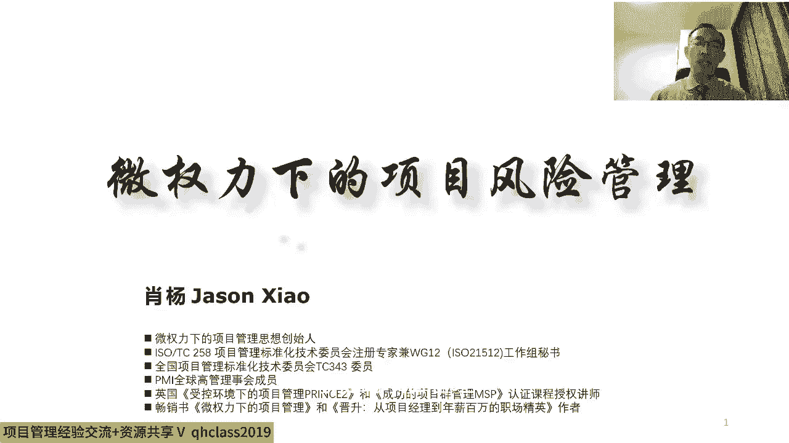
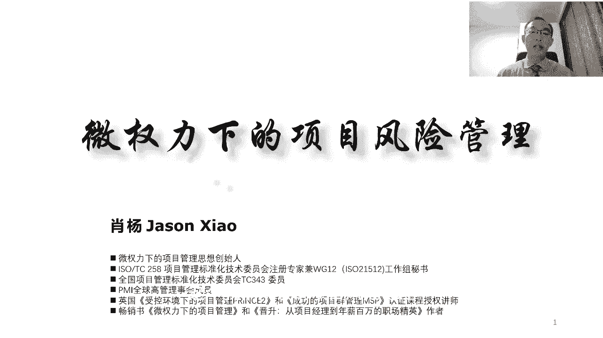
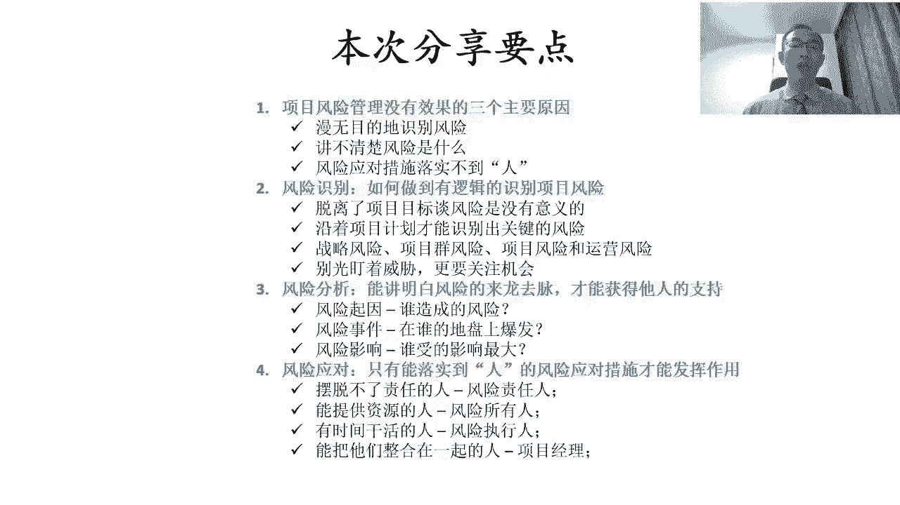

# 微权力约束下的项目风险管理与优化 - P1：1.风险识别，风险分析，风险应对 - 清晖Amy - BV1GS411A7uN

我们正式开始我们的讲座呃，很高兴呢，这个大家来收听清辉组织的这个系列在线讲座，那今天呢是我们在线讲座的第五次啊，之前已经讲了四次，包括项目管理的工具模板对吧，包括这个普瑞士领导力啊。

然后呢包括这个项目敏捷化的这种管理啊，然后呢这个包括威权利项的项目管理，那今天呢其实我们要讲的主题呢，叫做项目的风险管理啊，而且我们也是符合在我这个微权利项目，项目管理的这个一个整体的思想啊。

因为基本上其实我现在讲项目管理，大多数其实都是在围绕着这个威权利下的，这种环境去讲项目管理，那么我们今天讲的这个项目风险管理呢，其实也是在微权力的项目的这个环境下的，这个项目管理，呃。

今天呢我们讲项目风险管理。

项目风险管理呢其实这是挺难的啊，其实风险管理就很难，那在项目中呢这个项目风险管理也不容易，但是呢这个项目风险管理呢，其实就是项目管理中，非常非常重要的那一个主题，而且呢在我自己的认知里边。

其实整个项目管理，那我们之所以需要项目管理这种方法，一个非常重要的原因呢，就是因为啊项目承载的是创新和变革，那创新跟变革的背后呢其实就是不确定性，那正是因为呢，我们要组织大家去做一个。

充满不确定性和挑战的事情，所以呢才有必要采用一种特殊的方法，那这个特殊的方法就是我们说的项目管理啊，所以其实本质上来说呢，其实项目管理它本身其实就是用来应对风险的，那项目管理呢有很多的管理要求对吧。

我们大家如果学过这个ping bok，对个PMP，考过PMP的话，那我们就知道项目管理有这个十大知识领域，五大过程组那十大知识领域就是来做管理的，如果大家学过prince two呢。

就知道这个prince two里边有七大主题，那也都是用来应对这个项目中的风险的，但是我们会看到不论是PMI的啊，十大知识领域，那或者呢是prince two的七大主题，那其实里边都会有项目风险管理。

换句话说呢，我们的项目风险管理，其实是在项目管理的基础上，再去谈项目风险管理，当然后边我们也会再去返回到这个话题上啊，这个其实这个风险管理呢其实我在这几年，尤其是项目的风险管理。

这几年我也在不断的去加深对它的理解，项目的风险管理呢，更多谈的是如何应对项目中的不确定性啊，那项目管理呢其实也是谈的是说，如何应对项目中的不确定性，那它俩的区别是什么呢，这几年呢在不断的实践中啊。

最大的体会呢是说这个项目中呢风险太多了啊，不计其数的风险，那其实呢我们不能一上来就干项目风险管理，我们说做项目管理呢，我们前期要定目标，那对吧，我们做规划，然后呢我们这个定义项目的组织结构。

然后呢我们采用各种的项目的管理方法，管理工具，那其目的呢，其实是为了帮助我们去，打造一个项目的受控环境，那这个项目的受控环境呢，其实相对的可以把项目中的这些不确定性的，事情呢变得稍微确定一些。

换句话说呢，其实我们项目管理的所有的管理机制啊，我们主要营造的是一个相对让项目受控的，这样的一个环境，这个环境呢它可以屏蔽掉了，就绝大部分的项目中的风险啊，比如说80%到90的风险。

其实都是通过我们去建立这种项目的受控机制，然后来去解决掉它的，然后呢我们再把剩余的这部分，那就是我们的项目受控机制解决不掉的对吧，我们即使是项目的受控机制再好，我们仍然会有一部分不确定性。

没有办法规避掉对吧，那我们这个仍然没有办法去规避掉的，这部分的不确定性，其实呢我们会采用项目风险管理，那这个时候呢他才具备了管的可能性，如果前面的项目的受控环境搭建的不好。

那项目原有的管理机制都没有落地，跟没有发挥作用的话，就是项目风险管理是没办法做的，因为我们会发现项目风险太多了，不计其数，当然如果项目中的不确定性实在是太多的话，那这时候就没办法管了对吧。

这虱子多了不咬了，所以呢其实项目风险管理能够发挥作用的，前提是，至少项目的管理机制，要在项目中首先要发挥作用，然后通过项目管理的机制对吧，因为我们通过去提升大家的规范性，通过在干活之前先把事想明白对吧。

然后呢通过呢给大家定义明确的角色和职责，避免大家各自为政，那通过种种这些的方式呢，其实我们现对吧，解决掉绝大部分的不确定性，因为大家都按照一个相同的对吧，计划目标啊，这个各自的角色值得去做事情。

这时候不确定性会减少很多，然后呢在此基础之上呢，然后我们再采用项目风险管理的方式，那我们再去找出来剩余的那些风险，然后呢去分析它，那评估它，然后呢去制定应对措施，看我们怎么去对它进行应对。

所以呢其实项目的风险管理呢，它首先是基于这样的一个场景的，项目的风险管理，不是泛泛地谈风险管理，那它是基于在项目已经存在的这个环境下，谈风险管理对吧，所以如果没有项目的受控环境，项目的风险管理是空谈的。

因为风险太多了，风险无处不在，四处都是风险，四处都是不确定性，那这时候任何一种风险管理的手段，他都没有办法能够很好的发挥效果，因为我们顶多解决几个风险，不可能解决对吧，成千上万的风险嗯。

所以呢这个项目的风险管理，它与项目管理密不可分，然后呢，项目的风险管理是基于项目管理的环境，已经具备的情况下，才能看项目的风险管理，这也是为什么呢，我们会把项目风险管理往后面去放，往后面放的原因呢。

是因为我们必须前面要先讲这项目管理对吧，项目管理是怎么管的，所以我们讲微权利下的项目管理，目的是告诉大家，对我们建立项目受控环境是怎么去建的对吧，我们讲普人士领导，其实呢给大家讲的是说呢。

项目中怎么搞定不同的相关方对吧，获取知识，其目的还是帮助我们把项目过程受控，我们给大家去讲的这个敏捷的项目管理。

其目的呢是为了告诉大家在过程中呢对吧，我们如何去应对这个需求变化，然后提升适应性，我们讲各种工具模板的目的，其实是希望呢在项目过程中呢对吧，我们让所有的项目参与方唉，都使用共同的工具模板。

这样的话还能减少不确定性，当我们把这些事都干了之后，然后我们再去谈项目风险管理的时候，这时候项目风险管理才有可能落得了地，所以这是我们首先啊，这个我们所谈的项目风险管理。

是在一个什么样的环境下去谈的风险管理啊，基于这样的一个场景呢，今天呢我想从四个不同的角度来给大家去做，分享这个四个大的要点，这四个大调点呢，因为通常它是按照一个就是我们通常在项目中，如何管风险的逻辑啊。

我想去做这样的一个分享，那通常呢当我们在项目中啊，当我们接手到一个项目，尤其是一个风险很大的项目，很不确定的项目的时候吧，我们第一呢这个首先大家都会去抱怨说，这个项目中风险特别多啊，风险很大，挑战很大。

就各种不确定性对吧，导致我们计划赶不上变化对吧，这个这个各种这个想不到的事层出不穷，导致了目标没办法按时实现对吧，预算没办法控制对吧，人管不住，但当我们遇到这样一个项目的时候。

我们要首先思考的问题是说对吧，我们为什么项目风险管理没有管好对吧，因为如果我们想提升这个项目风险管理，我们要首先解决的问题是，我们得首先分析为什么没有管好对吧，然后我们再思考怎么去管。

那所以呢这个第一块呢，我们要首先跟大家分析的是说，这个项目风险管理对吧，没有效果或者没管对吧，这个要么是没管，如果管了没效果对吧，他可能造成的三个主要原因是什么啊，这这是第一个，第二点呢。

如果我们想进行项目风险管理呢，嗯通常项目风险管理吧它是五步法或六步法，但如果我们稍微把它压缩一下，我们可以把它简单的讲成三个步骤对吧，因为咱们国家讲一般就是这个事事，这个事不过三对吧。

那既然事不过三的话呢，那这时候呢这个对吧，咱讲太多了，大家不容易记住，那这样的话我们把风险管理先归成三部对吧，我们先解决三步的问题，那那这三步是什么呢，项目风险管理呢，第一呢识别对吧。

所以第一我们得首先能找出来，什么是真正的风险对啊，因为为什么得找真正的风险呢，这个大家知道不确定性这个事吧，它很多对吧，然后呢我们国家有句古话叫杞人忧天是吧，什么叫杞人忧天呢。

就是有的人太爱思考不确定性了，然后呢而且思考的很多不确定性吧，它发生几率很低，然后呢结果又造成自己很忧虑嗯，没有时间干这个更重要的事情了对吧，因为因为我们说啊，没有人可以。

在一个完全没有不确定性和风险的，情况下去做事情，很多时候只是我们的这个风险承受能力问题，所以呢在这种在这种环境下呢，我们要首先解决的一个问题呢，是说这个我们要首先知道什么样的风险，在我们的项目中。

它叫风险，就我们值得管对吧，我们首先解决的问题是说，我们要在我们的项目中去识别出那些对吧，值得我们进行管理的风险，对我们不能说把所有这个别人的项目中，发生过的事啊，或者是所有我们想象中可能会发生的事。

全都识别出来，然后这时候会造成一个什么问题呢，风险太多又返回到风险太多，然后呢那这样的话风险一多了，没法管了，管不过来，然后管不过来，大家就不管了，就听天由命了对吧，然后被动应对，但是我们说的听天由命。

被动应对呢，他显然不不符合项目管理的思维对吧，项目管理是什么呢，主动求变，主动应对对吧，然后主动去解决那些未来具有不确定性的，这个变化和问题，所以呢这时候呢我们一定要去识别出啊，这个风险中啊。

跟我们最有关系的对吧，这个符合项目管理的一贯思维，抓关键，那所以呢如果我们要抓关键呢对吧，我们就得从一大堆风险中啊，不断的这个对吧，筛选筛选筛选筛选筛选对吧，要筛选出我们认为最值得按照风险管理。

管的风险，这个过程呢其实是我们要去识别，换句话说我们在识别的过程中，我们需要按照一定的逻辑跟主线去进行识别，这样的话我们才有可能识别出啊，最影响我们项目目标，最值得我们进行管理的风险。

所以风险识别很重要，风险识别之后呢，如果我们识别出了一些我们认为，非常重要的风险，第二个问题要解决的问题是分析啊，那分析的原因呢是因为我们得把这风险想明白，大家知道这个任何时候，如果我们想管一个东西啊。

我们能把他管起来的，前提呢是说我们得首先得把它看透了，看明白了，看到本质，大家知道这个面上的东西啊，他是管不了的对吧，我们说透过现象看本质，这话说的容易，但实际做起来非常难。

那对于风险管理这件事更是这样的，我们不能只看到一些风险的表象，不能只是泛泛的去谈风险，但他泛泛的谈风险，是没有办法去把这个风险管起来的对吧，就像我就像我们说医生看病一样，如果我们只是看到病人的表征表象。

而不去分析他内在的造成病的原因，这个病是治不了的，管风险也是一样，管风险呢我们说只是面上的去看风险，什么叫面上去看风险，我们说项目中大家通常能想到的风险对吧，这个时间不够，资源不足，人员不配合。

那这些东西其实对我们来说呢，他根本就不是一个真正的风险，它是一种表象啊，这种表象只能说明什么呢，说明这事不好干啊，有挑战，那我们从风险管理的角度来说，我们必须要透过这个现象去看后边。

所以这时候我们要去分析啊，我们要去分析说为什么时间不够了对吧，什么事造成时间不够对吧，这样为为什么成本不够对吧，这个为什么资源不够对吧，到底是在什么点上资源不够对吧。

到底是什么原因造成的资源在什么点上对吧，不够对吧，到底是什么原因造成了什么资源，那在什么节点上对吧，想用的时候发现不够，那这个时候其实我们解决的问题是什么呢，我们要下切风险分析的目的是。

我们要透过一个风险的表象，那去分析它风险内在真正的这种原因和逻辑啊，当我们把它真正的原因和逻辑分析清楚之后，才能管得了，所以呢管理一直以来的一个比较大的挑战，就是说我们只能管那个我们真真正弄明白的事。

大家都弄不明白的事儿，管不了对，然后明白了自然就能管起来，所以很多时候我们会发现一些东西，我们管不了的原因说明什么呢，说明没没把这事弄明白，没把这事弄明白，主要是什么呢，没有把这件事内在的逻辑弄明白。

而是更多的停留在表象的时候，其实我们是没有办法能管得起来的，所以所以这个我们说风险分析，帮我们解决的问题是，如果我们想管一个风险，我们得把这风险分析明白对吧，来龙去脉分析清楚，然后我们才有可能啊去管它。

如果我们能把这个风险分析明白之后呢，接下来要解决的问题是怎么去应对的问题对吧，我们知道应对有应对措施，但更重要的是什么呢，应对措施要落实到人上，为什么，因为最后这活是人干的对吧。

我们说我们会看到很多的项目中啊，其实不是没有发现风险对吧，也不是没有产生应对措施，唯一问题是说呢没有落实到一个该落实的人上，那这时候导证是什么呢，其实大家都知道这事很重要，结果谁也没干，出了问题之后呢。

大家这个一踢皮球，相互一推诿，哎发现都没责任了，结果项目没干成对吧，可能公司受了损失，所以呢这个应对措施呢得解决，是说一个风险要落地对吧，我们大家把他解决下来，风险应对措施要落地。

然后呢这落地呢他不是一个人，他可能是几个人，而这不同的人谁该管什么，这个事从一开始他要定义的很清楚，然后我们就盯着这帮人把该干的事干了，那那这时候才有可能真正的把这个风险的，这个闭环完成，就是一个风险。

才真正的有可能去很有效的被应对起来，所以呢这个要想把风险管起来吧，要想学会风险管理，想做到风险管理对吧，想知行合一，那这三步识别对吧，那个找出真正该管的风险，第二分析，透过现象看本质对吧。

然后我们才有可能知道怎么管，然后应对对吧，我们要把应对措施落实到，落实到这个真正的能把这个风险对吧，应对错落下去的人身上，找到合适的人，那这个时候其实我们才有可能，真正的把项目的风险管理做到。

所以呢这个这次本本次分享的一个逻辑啊，首先思考为什么对吧，好多项目中的风险管不好对吧，第二如果项目管好对吧，怎么识别啊，如何分析对吧，然后怎么去应对啊。

