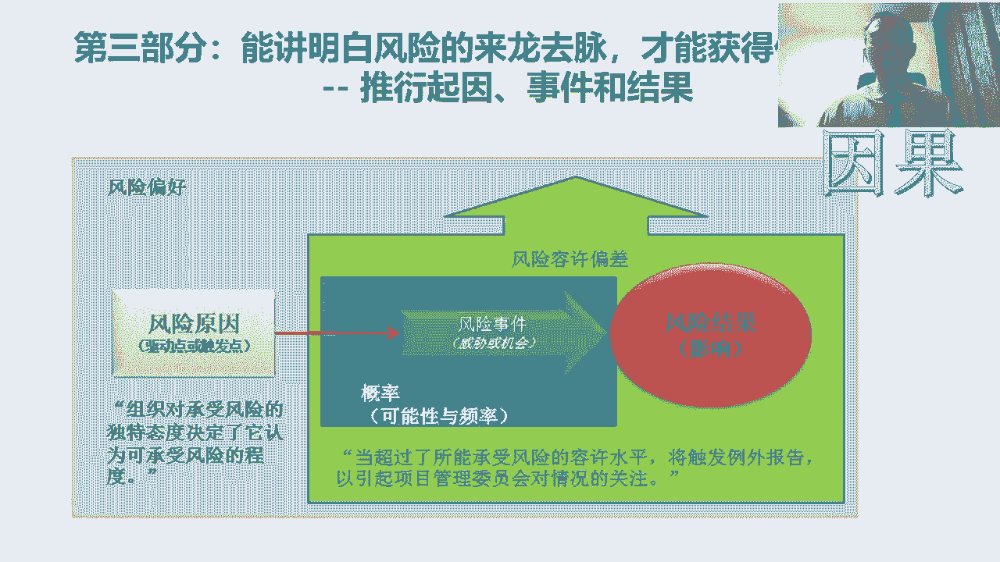
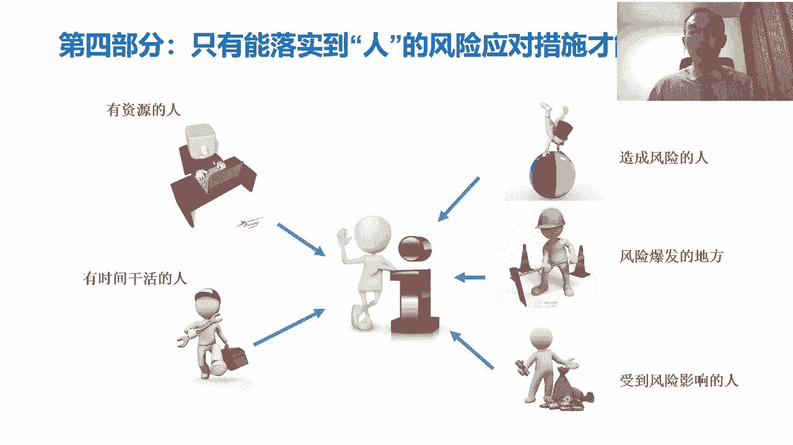
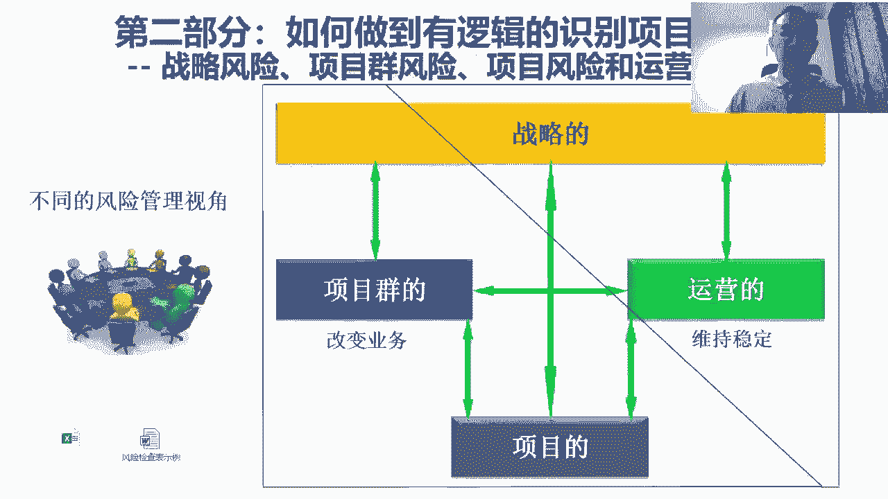
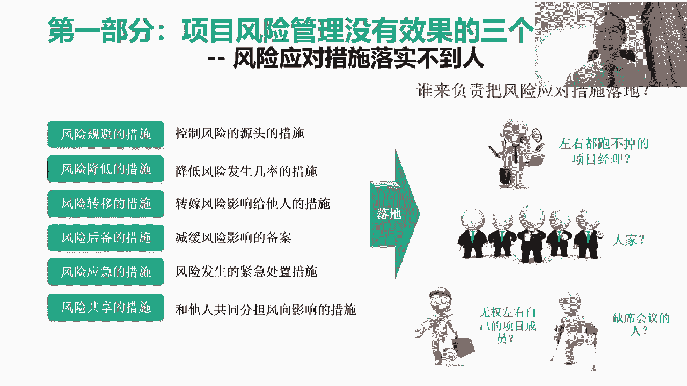
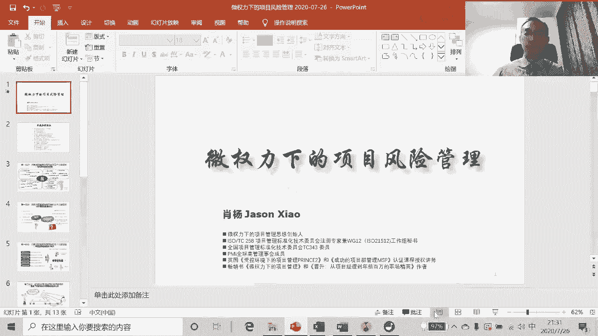

# 微权力约束下的项目风险管理与优化 - P4：4.第三部分，风险分析能讲明白风险的来龙去脉，才能获得她人的支持 - 清晖Amy - BV1GS411A7uN

接下来我们看这个第三部分，刚刚第二部分我们说识别的问题，第三部分呢咱讲的是分析啊，分析的这个风险的分析吧，我们说光找到了一个风险吧，钱不够，那那前面的风险呢更多的偏向于这叫事件了，那事件是什么呢。

就这风险一旦发生了之后吧，它的现象是什么对吧，它场景是什么，他这个事是什么，这个东西叫事件，但实际上呢，当我们要去想把这个风险真正管起来的时候吧，我们不能光知道是说这个风险发生的时候的，那个事件。

那个场景我们更多的要思考的是什么呢，整个这个风险的来龙去脉，来龙去脉就是对吧，我们说这个前期早期识别的时候，往往识别的不是原因，大家知道这个在前面那部分，一般我们通常识别的都识别的事件，事件是什么呢。

在别的项目上对吧，可能发生过一个事儿，这个事一定是个场景对吧，结果这个事因为这个事发生了之后，对项目可能最终带来了好的结果，或不好的结果对吧，所以我们说一般风险识别的时候，识别的都是事件的。

但是当我们识别出来了一个事件之后，我们不能仅仅停留在这个事件上对吧，我们要去分析这个事件的来龙去脉，这个来龙去脉呢，所以呢这个这个造成的是什么呢，当我们在这个专业的做风险管理的时候呢。

我们一定会把风险描述一个风险的时候，他应该是三段论原因事件结果对吧，就是什么样的风险的原因对吧，导致了什么样的风险的事件，这个事件呢会给我们的目标带来什么样的影响，这叫结果对吧，带来什么样的结果。

那这个东西呢简称其实就是我们说的因果啊，什么叫因果呀，我们说因果背后是一个因果逻辑对吧，像项目的风险描绘也是一样，项目的风险，其实当我们描绘项目风险的时候，应该描绘的不仅仅是个事件。

我们应该描绘的是一个因果的推演逻辑，所以这就是我们法律道为什么要去推啊，推演的是什么呢，我们拿到一个风险事件之后，我们要向前推演什么东西造成的对吧，原因是什么，这样我们要向后推演。

推演的是说它带来了什么样的结果和影响，因为我们只有把这个整个的因果线，推演清楚之后，我们才能够去得到一个结果，就是第一我们要不要管是不是值得管，第二我们到底管哪儿能有用。

对吧的原因是因为我们得先把逻辑梳理清楚，这就是因果关系梳理清楚，所以呢这就是我们为什么描绘风险时，要按照因果来来描绘，这里边呢我给大家解释一下这个风险原因，风险事件，风险。

这个风险结果这三个东西的区别是什么，通常我们说这个我们一般识别风险的时候啊，识别的是个风险事件，但是造成相同风险事件的原因有很多，所以我们如何去判断是说在我们的项目中，这个风险事件是否可能发生呢。

这时候我们要去判断的是说，导致这个风险事件发生的这个原因对吧，当然他可能有很多原因对吧，但这个很多原因中的任何一个原因，是不是已经在我们的项目上发生了，所以这时候呢我们返回到原因是什么呢。

我们说首先风险事件一定是没发生的，它是一个场景，那这在一个项目中我们识别出一个风险事件，这风险事件必须是没发生的，如果发生了就不叫风险了，叫问题啊，这个风险和问题最大的区别就是，发生或没发生的。

问的区别，没发生的叫风险，发生了叫问题，所以前期我们识别的风险事件呢，它应该是风险发生时的一个场景，但我们判断这个风险事件，在我们项目中是否可能发生的，前提是我们要首先去看，造成这个风险事件的原因。

是不是在我们的项目中已经出现了，如果在我们的项目上，这个风险原因还没有出现，那如果还没有出现的时候，那其实说明我们认为我们的项目中，可能有这个风险事件，这件事其实这几率是很低的，这很不靠谱的。

所以很多时候呢我们不能说在别的项目上，就比如说别的项目上，出现了一个巨大的变更或需求变化，那我们就认为在我们的项目上，可能它也会出现这个变更的需求变化，它是不能这么去判断的，而是我们要判断的是说。

在别的项目上出现了一个大的变更，然后导致的这个当时的这个别的项目上，这个变更的导致变更的原因是什么，如果在别的项目上导致这个变更的原因，在我们的项目上，这个原因也已经出现了，那这时候说明我们的项目是吧。

它也具备了可能会出现这个风险事件的可能性，所以这时候呢我们说风险原因是什么呢，风险原因他必须得是已知的已知原因，那这个已知原因呢，而不不光是已知的，而且它得是已经发生的一件事情。

换句话说这件事都已经发生了，然后呢这时候原因具备了，然后我们基于一个已经发生的这个事情的，这时候叫原因去推演，它可能带来的一个风险的对吧，一个带来的一个场景，这个场景叫风险事件。

当然这个场景有可能是好的或不好的对吧，要么是危险和机会，然后我们再去推演这个事件，可能带来一个对目标的影响，这是我们说的结果，所以这是他的因果逻辑啊，由一个已经出现的原因，这推演一个可能会发生的事件。

然后再去推演这个事件可能带来的，对目标的影响，当我们把这条逻辑线推演清楚的时候，说明我们把这个风险的因果关系想清楚了，这时候这件事开始变得靠谱了，所以呢当我们判断这个原因呢，第一呢就像我们刚刚所说的。

第一原因必须是已经发生的对吧，如果我们项目中还没有出现风险的原因，那这时候我们去判断，我们项目中可能有风险事件，这是不靠谱的对吧，这里面第二点呢，就是说通常我们当去识别风险原因的时候，往往我们要找内因。

而不能找外因，什么叫内因呢，这个是先说什么叫外因吧，比如说很多时候我们外因就说哎，这是客户带来的变化对吧，政策带来的影响，环境的不确定带来的影响，这时候叫外因，为什么我们把责任归外边了。

而且外边具有不可控性，这时候其实是什么呢，把责任推了，但是风险管理我们大家明白，我们开展风险管理工作的目的，不是为了摆脱责任，不是为了推演责任的，我们这个开展风险管理的目的是为了解决问题。

所以这时候我们必须要把原因拉到内部来，对我们一定要在这里边呢，我们要首先一个这是一个视角转变问题，做风险管理的人永远认为对吧，造成风险的原因是内因，是我们自己造成的，而不是外部环境造成的对吧。

我们不能总总是埋怨说，我们被动的被外部的环境影响了，我们要首先思考的是，我们被外部环境影响的原因，是因为我们没有主动影响那个外部环境，或者我没有主动的去预测这个外部的环境。

所以风险管理的逻辑是首先要把原因拉回来，拉到内部对吧，拉到内部的概念是说，我们要首先判断的是说所有对吧，我们所带来的不好的结果，这符合我们国家的因果对吧，我们后边所带来的所有的结果。

不管是好的结果还是不好的结果，都是原因，都是因为之前我自己干了什么事情对吧，至于我自己所做的事情导致了未来，给我自己带来了一个回报，这叫因果对吧，因果报应就这么来的，风险管理遵从相同的逻辑。

我们要假设是说，所有未来带来的风险事件的原因，都是因为在于这个我们自己造成了一个原因，这个原因不是我们被动地受到了环境的影响，社会的影响，国家的影响或企业的影响，而是因为我们前面有些自己该干的事情。

没有做好，结果导致了未来我们会受到自己前面没有做好，所带来的影响对吧，所以这是所以原因呢一定要先找内因，而不是去找外因对吧，这里面呢举个例子啊，这个举个例子呢，因为我现在在北京啊，这个上上周呢也在出差。

这个明天呢还要出差，明天一大早还要出差，很早要早，那这个本来呢明天一早走呢，其实是订了一个明天早晨的飞机票啊，飞机呢这个本来是坐飞机去江苏啊，然后呢这个结果呢，这个今天下午的时候呢看了一下天气预报。

然后看了一下新闻，发现这个北京明天雷阵雨，就现在已经开始下雨了，而且明天我那个点刚好有雷阵阵雨，而且呢之前又产生了一个对吧，这个被辟谣的谣言是说，这个明天可能北京有这个对吧。

这个多少年不遇的这种大的雷阵雨，结果这串呢结果把我给吓着了，你又一看哎呀，这是风险对吧，这个因为这个首先呢我飞的这个这个航线吧，那飞机比较少，一天就一班，然后正好那点呢又下了一阵雨。

那很有可能呢就会被取消，一取消呢我去不了了，去不了呢，那这时候，那我明天本来这个下午要做的事情就做不了了，然后呢这时候呢我就跟很多人解释，会造成很多人都受影响，所以这时候呢我们想。

这时候呢我们这个符合了一个风险的时间，这个风险的事件如果按照常规的说法是什么呢，比如说一般的说法呢，这个我们的描绘就是原因是什么呢，原因是因为北京对吧，这个北京有可能下，原因是因为北京最近雷阵雨比较多。

下雨比较多，那这个原因呢结果导致的风险事件是什么呢，我的航班对吧，可能会被取消，然后呢带来的结果是什么呢，大概结果是我本来该去的地方去不了了，结果我们的客户，我们的同事对吧，然后都受到了很大的影响。

对我会很有意见，这时候是在一个描绘的过程，这个描绘其实通常很多项目大家都这么描绘的，但实际上从风险管理角度来说，这么描绘是不对的，如果按照一个正确的描绘的方式是什么呢，首先原因应该是内因。

这个内因不是天气有问题，这个原因应该是什么呢，这个原因是因为我选择了坐飞机对吧，因为我选择了一个，容易受到天气影响的交通方式，导致了是说如果天气发生变化，我就会受到影响，所以这时我们把原因拉回来了。

我们看到这时候风险原因我不是埋怨老天爷，不是埋怨说这个天气环境现在多变，而而在这里边，我把原因因为如果我埋怨天气原因多变，那时我没办法了，我只能听天由命啊，祈祷是说明天早上啊这个雷阵雨啊。

千万不要在我我坐飞机这会儿出现对吧，这样即使我坐飞机出现的时候，我要祈祷这个千万不要把我的航班取消，但是我又不是那样的人对吧，对我来说呢，我还是希望这个东西相对把握性强一点。

所以这时候呢我思考这个原因是什么呢，不是老天也有问题，不是环境有问题，这个原因是因为我选择了坐飞机，这个飞机这个东西它容易受到雷阵雨天气影响，所以这时候呢因为我选择了坐飞机，所以导致的是说呢。

有一定的概率的事件是什么呢，在我的飞机起飞的时候有雷阵雨，那这个雷阵雨导致了是说我这个航班对吧，可能会被取消，结果带来的结果是一个，我非常不希望看到的结果对吧，就是因为我本来要去那个地儿。

我同事们客户们都收到对吧，因为我没去，结果这他们的工作开展不了了啊，所以这时候当我想到这个原因，是我坐飞机的时候呢，所以今天做了个决定对吧，就这个给大家做讲座之前对吧，我我请我同事帮忙。

把我们的机票改成了高铁票啊，那改成了高铁票之后呢，那高铁最大的优势就是，它不受这个雷阵雨天气的影响，当然也有可能啊，但是一般得非常极端恶劣的情况下，他才受这个影响，大部分情况下他不受影响。

所以这时候呢相对来说呢，我的原因没有了，这风险消失了对吧，明天你该下雨下雨，该打雷，打雷跟我没关系了，为什么呢，因为我改成了坐高铁，当我坐高铁的时候，其实我就不受了这个环境因素的影响。

所以这时候呢就说当我们会发现，我们正确的去描绘原因的时候，这时候我们才有可能啊去找到一个解决的方式，然后呢我们再说这个事件，这个事件呢，它必须是这个原因直接导致的一个事件对吧，这事件不能是这个原因啊。

这个拐了八道弯之后所导致的事件，什么叫拐了八道弯之后呢，比如像我刚刚所讲的，这我们的原因呢，就是因为我选择了容易受到天气影响的飞机，导致了，是说呢这个我的交通有可能变成了不可行。

这个事件就换句话去不了了，然后呢带来的一个结果去不了造成的影响，那这时候他是一个直接的，就换句话说呢，这中间没有别的不确定性，这个不确定性就是说只要明天打雷，那就有可能导致我的航班不能起飞对吧。

这航班不能起飞呢，说白了就是我就去不了嘛，这两件事他几乎是百分之百的航班不起飞，我一定去不了，那这时候他是一个直接的关系，我们最怕的是什么呢，我们会在很多的项目中啊，他在描绘这个这个由原因到事件的时候。

中间描绘了好几层概率对吧对，然后技能概率是什么呢，比如说我们举个例子，因为天气不好对吧，因为天气可能有雷阵雨啊，而且呢第二呢这个雷阵雨呢可能会造成了，是说一部分航班取消，然后这个取消的航班里呢。

他有可能刚好有我的航班呐，然后由我的航班呢导致说呢结果呢我又没我，然后呢我可能恰好这个航班取消了，我就没有其他的交通方式能去了，这时候我们会发现中间增加了好几次的概率，我们按照这个。

当我们去做一个风险分析的时候啊，如果这个概率多了的话，拐好几道弯，经过几次推演，每次推演都有不确定性，这几个不确定性的概率一相乘，我们会突然发现，这件事最后能够得到预测结果的几率是很低的，对吧。

比如说我们这一个项目风险推演四次对吧，第一次一个原因可能带来的一个结果，这结果可能有60%的几率之后，这个结果可能又会带来另外一个结果，这个结果又60%的几率，然后那个结果可能又会带来一个结果。

又60%的几率，我们这仨61%相乘663 16对吧，再乘个六，我们会发现概率低于20%，我们发现呢当我们去预测一个事，当这个概率低于20%的时候，说明我们这个预测意义是不大的对吧。

因为你说明你预测的根本不准，因为中间有太多的变数，所以呢这里边返回到什么呢，通常我们在做风险的因果推演的时候啊，它更多的是要推演这个直接带来的结果对吧，我们现在出现了一个原因。

那这个原因就是因为选择坐飞机，所以他直接带来的结果就是什么呢，只要雷阵雨不好，我我就走不了，然后再带来的结果是什么呢，只要我没去，那那当地他们这事干不了，结果大家都很不开心对吧，那工作进度受到了影响。

所以呢通常要直接的推演，当我们描绘风险事件的时候呢，我们要去考虑，首先这事件是一个好的事，还是个不好的事情对吧，这是第一个要判断威胁还是机会，第二呢我们要要要描绘风险事件的时候呢，我们要去考虑这个事啊。

它发生的可能性对吧，就概率的大小，就像我们说的这个刚刚我们说啊，这个风险的原因是我选择了坐飞机，风险事件是什么呢，如果下了一阵雨，飞机就不能起飞，那这个概率有多大对吧，那这个概率比如说像对吧。

这个这个概率可能70%，那80这时候我们说这事得管，我们这概率二十三十%，那不用管了，所以当我们写概率的时候呢，我们更多的关心啊，就我们思考这个概率比较大的时候，大家才会关心概率太小，没有人关心。

再有一个呢，通常我们描绘风险事件的时候呢，我们还会关心一个事是什么呢，临进度临近度呢，就像我刚刚举了个例子，因为我明天要走是吧，这个这个雷阵雨对我航班有影响，所以我会特别关心。

所以呢赶紧抓紧在我们讲座之前，把我的飞机改成了高铁，我们说的如果说这个事变成了，比如说这个一个月之后，这我肯定就不太着急了对吧，因为这个天气情况到时候离得近再说呗对吧，如果是临临近了之后。

发现天气预报还不错，那我就接着坐飞机走，因为时间短对吧，如果发现不好了之后再改高铁，所以呢这个东西呢我们叫临进度，就是这个风险发生这个事件呢，据我现在这个时点的远近问题，一般离得近了。

我就得赶紧优先解决对吧，因为离得远呢对吧，就可以先忙活别的，先忙活着急的事对吧，等临近再说，所以呢当我们描绘风险事件的时候，他这个临近度也很重要对吧，大概多长时间之内会发生这样发生的频率，有概率有多大。

第三个就是我们说这个影响，当我们描绘影响的时候呢，他必须得描绘啊，这个对大伙关心的事的影响，那对于项目中来说呢，其实就是对项目目标的影响啊，而且呢除了对项目，我们说有时光对项目目标造影描绘影响吧。

可能还不够，因为什么呢，这个又返回到，其实之前我们有提到一个特点是什么呢，对吧，大家这个大家都是人，大家一块做事情的时候啊，大家可能经常会抱有一个心态，就是这个事不关己啊，高高挂起。

然后所以这时候呢当项目经理啊，描绘这个项目这个结果和影响的时候，我们最怕的是什么呢，项目经理描绘了一个项目的结果，发现这个结果受影响的只有项目经理，我们如果这个受影响的只有项目经理自己，别人都不关心了。

因为项目经理是背锅侠嘛对吧，我们说这个任何一个问题出现之后，每个人首先第一反应是说自己受不受影响，分析完了发现自己不受影响对吧，项目经理受影响，唉大家释怀了，这里边除了什么呢，除了项目经理的直接领导。

或真正跟项目经理关系好的人，可能会关心哎呀，可千万别让项目经理受影响，其他人都无所谓，所以呢但如果项目经理不，我们作为项目经理，如果我们不希望出现这种情况，我们就得把这个项目的风险，这个结果。

这个影响描绘的跟大伙有关系对吧，有几种可能性，第一呢你希望谁关心，你，就要把这个项目风险的这个影响描绘了，影响他对吧，你影响他，他肯定关心对吧，如果你发现你想你想让谁关心，结果你描绘完了之后。

对人家没影响，肯定不关心对吧，所以呢这第一呢项目经理也得锻炼，是说我们能够想明白这个任何的描绘的一个，结果的影响，跟那个你你你希望他参与那个人，他之间的关联关系，你怎么能把这个事打通。

然后而且你能给他讲明白，还觉得他受影响，他就关心了，第二呢是说呢如果这个结果影响大领导，这个大领导的对，如果他受影响，所有人都倒霉，这时候大家也会关心，为什么谁都不想倒霉，说白了还是自己受影响。

所以呢通常描绘这个风险结果影响的时候吧，我们一定要把它描绘成对吧，那个你希望他关心那些人，他得受影响，然后呢一定不能把他描绘成只有项目经理，自己受影响，或者把它描绘成什么呢，大伙都受影响，大家都受影响。

大家想法都受影响，也等于没有影响，所以所以呢在这个过程中呢，如何去描绘这个项目风险的结果，其实也是一个比较有学问的事情，所以在这里边呢经常举个例子啊，我们最怕的是什么呢，这个项目经理描绘了一个风险啊。

这个风险呢描绘的是什么呢，发现这个造成项目风险原因的是项目经理，然后呢最后受影响的还是项目经理，我们这风险描绘给大家之后，大家一看哎呀，这不就是项目经理自作自受嘛对吧，自自己自己造成了一个事。

结果影响了自己，这时候大家肯定都会抱着一个看热闹的心态，对我，看项目经理之后，你自己能不能搞定这个事，那这种的其实风险的这种描绘它是没有意义，没有价值的，因为为什么呢，他只能他只能会造成更多的人。

其实抱着看热闹的心态，他去对吧，他不一定帮你，但是他可能会在过程中他老给你挑毛病，所以呢我们说一个优秀的项目经理，当我们在描绘风险的时候啊，他一定要找到风险的根本原因，这个内因呢对吧，通常我们说内因。

他不是项目经理，项目经理，因为什么这个项目中，几乎项目经理所存在的原因，就是为了组织大家做事情，这里边没有任何一个真正的事是项目经理做的，所以项目经理呢找内因，一定要找到到底项目中什么样的人。

造成这个风险的原因一定是内因，这样受影响的不能仅仅是项目经理，一定其他的也有一些关键的人，他肯定也受了影响对吧，当我们把这个逻辑捋清楚打通了之后，这时候这个风险他才这个风险的描述。

它才比较容易引起到我们所期望的，关键的人的重视，这时候他才具备了这个被解决的可能，另外呢，这个其实我们前面刚才讲这个风险应对措施，的时候也提过啊，我们突然发现风险应对措施有几类，为什么有很多类呢。

因为有的是就着风险原因对吧，解决的就像我刚刚所说的对吧，我发现我的原因是，因为我选择了做容易受天气影响的飞机对吧，那这时候呢，我们说这个我们制定应对措施的时候，我采用了一种方式，我从根源上解决这个问题。

我直接改成坐高铁了，高铁不容易受天气影响，所以这时候呢，我相当于是从原因上去解决这个问题，那再比如说呢，这个，如果假如说我我没有选择从原因上解决问题啊，对我可以从风险原因上解决问题，叫我们风险规避。

如果选择另外一种风险应对措施，风险降低，那我们去降低这件事发生的概率跟影响，那这时候呢就是降低因为天气原因导致对吧，我这个出行受阻的影响的时候，那这周可能要考虑是什么呢。

这个我要考虑说我尽量把我的航班调整到，如果还想坐飞机，我把它尽量调整到大航空公司对吧，调整到大飞机上也不容易被取消对吧，然后第二呢这个我可能要去考虑，我这个坐飞机的时间要调整，我得尽量想办法去绕开。

那个容易出现雷阵雨的时间，这时候叫降低对吧，然后当然我们说也得从后背上来去讲对吧，我们说前面讲说风险，后背就从结果上，如果是说呢前面这个事，我会发现我可能还是不太好控制，那我可能提前对吧。

就跟我们这个主要去江苏，那跟我们当地的同事跟业主打招呼，我们现在分析这个现在这个天气可不好对吧，我可能有可能明天不能，我可能明天不一定按时到对吧，如果不能按时到的话。

你是不是先把跟我没关系的时间调到前面，你们先干对吧，然后等我到了之后再去干我的事，这时候叫什么呢，叫风险预案，应对措施，相当于从结果上去做考虑，第一降低了人家的期望对吧，第二呢让提前有了安排。

这样不至于因为我没去了之后，大家都会手忙脚乱出现问题，所以这时候我们会看到呢，其实我们把这个一个风险呢对吧，从原因到实验到结果这个来龙去脉，我们整个把这个东西梳理清楚，注意清楚之后呢，它的好处是说呢。

我们可以从原因，事件结果各不同的角度都能想办法制定的措施，第二呢在这个过程里边呢，我们能分析出来这些事跟哪些人有关系，我们才能更好的呢对吧，让我们的项目的利益相关方们，帮我们齐心合力的去解决这个对吧。

去解决这个风险所带来的这个呃不确定性对吧，如果是好的事情呢，就让大家组织大家共同去促成它，如果是不好的事情呢，组织大家共同去应对它，所以这是我们知道这个第三部分，为什么要讲明白这个风险的来龙去脉的问题。

原因事件结果这个东西呢说起来容易，做起来挺难的，就是我们说的因果对吧，风险原因事件结果这个真的是因果逻辑，我们大家有机会可以练一练对吧，因为这个咱现在没办法练，就只给大家举个例子。

但是大家可以回去啊尝试拿自己的项目啊，或者拿自己的生活中的一些事，我们可以尝试去做做推演呀对吧，我们在生活中出现了哪哪些哪些事件对吧，这个事是生活中工作中任何的一个特别的事件。

它可能都是一个风险的原因对吧，我们顺着这个风险的原因，参照别人的经验教训，它可能会带来一个什么样的实践啊对吧，这概率有多大呀，是好是不好啊对吧，他未来对我的对吧，如果是如果是生活的话。

对我的人生目标对吧，或生活的短期目标可能会有什么影响啊，如果是项目的话，对我们的项目的目标会有什么影响吗对吧，如果是工作的话，对工作的目标会有什么影响，我们大家可以经常去练习一下这个推演。

这个推演过程呢比较烧脑哎，挺烧脑，真的挺烧脑的，然后但是呢如果经常锻炼的话，其实对自己来说会本能的去锻炼自己啊，这个梳理对吧。

对预测未来的这种逻辑其实会很有好处的，接下来呢咱说这第四部分，第四部分呢，就是我们说这个应对措施落实的问题对吧，我们前边呢我们能够去识别出对吧，系统性的有逻辑的啊，去识别出项目中的风险。

第二呢是说呢我们呢能够通过风险的分析对吧，把这个风险的因果逻辑想清楚，然后呢根据这个因果的逻辑呢，我们思考我们去说服哪些人帮助我们是吧，然后我们呢是从原因事件结果不同的角度。

我们如何去制定我们的风险应对措施，那当我们把我们的风险应对措施，制定出来之后啊，那这时候接下来要考虑一个问题，就是风险应对措施落地。

到底谁应该去落地的问题，所以呢其实前面呢我们其实有提到过啊。

我们往前面翻一下，前面呢我们去风险这个去分析这个项目，风险管理没有效果的三个主要原因的时候，我们其中提过一个主要原因，就是风险应对措施落实不到人对吧，所以我们左边有几个风险应对措施对吧。

我们规避从原因上对吧，然后降低从过程上或者从结果上对吧，后背对吧，应急这都是从结果上，然后呢我们会看到的说，应对这个应对措施不好落地的原因呢，其实是因为我们会发现对吧，我们有的时候大家落实到对吧。

把所有的风险对措施都放项目经理脑袋上了，或者都放大伙身上了，或者放到无权左右自己的人身上了，或谁没来开会，放谁身上了，我会发现这种的应对措施落实效果都不好。

