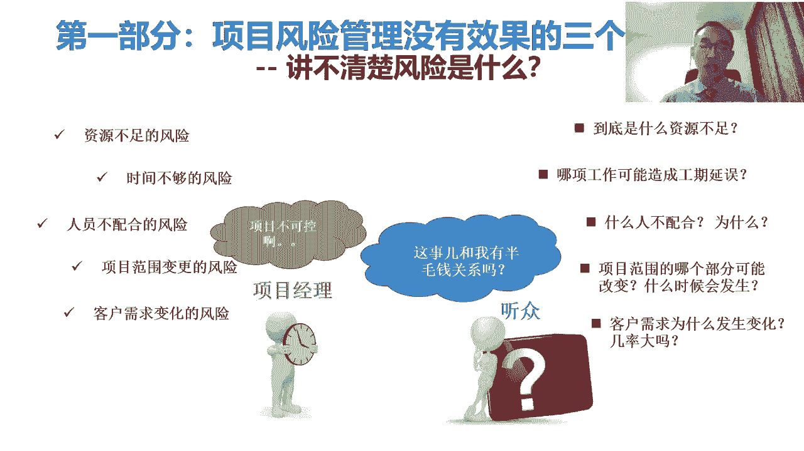
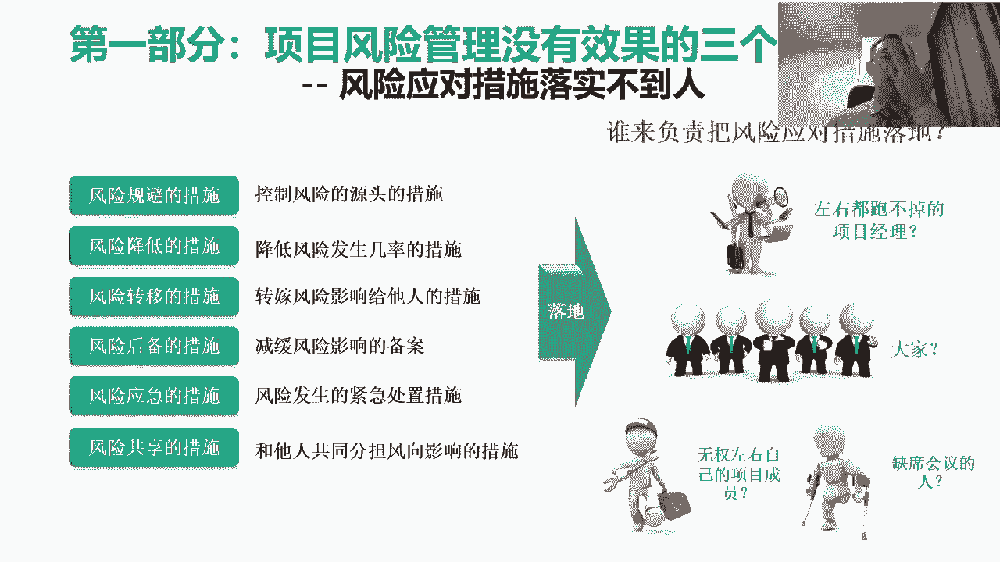

# 微权力约束下的项目风险管理与优化 - P2：2.项日风险管理没有效果的三个主要原国 - 清晖Amy - BV1GS411A7uN

然后呢首先咱先看第一部分啊，这个项目风险管理没有效果的三个主要原因啊，项目风险管理没有效果的三个主要原因呢，我觉得这个三个原因对吧，咱尽量都按三来讲，三三制对吧，这个第一个原因呢就是咱们所说的识别啊。

识别的时候呢，我们这个大家通常采用的方式啊，识别风险的对吧，这个就是把大家凑一块，我说这还做的比较好的，以项目组为单位，把大家凑一块头脑风暴，然后呢大家想这项目中有什么风险。

然后呢这个或者是说呢哎看看别的项目中对吧，大家一坐一块做一会议室，大家一想啊，别的项目中类似项目出过哪些风险对吧，或者呢再想想说这项目中自己有什么事，好像不太可控啊，也变成了风险。

但这时候呢这种风险识别啊，我们说有用吗有用，但是呢从项目管理的角度来说，不够系统化对吧，我们咱们大家学习项目管理，我们会发现项目管理跟其他的管理啊，这个尤其是跟很多这个干具体工作来说，最大的区别就是。

项目管理是一种典型的系统性思考，什么叫系统性思考呢，我们讲这个项目经理的特质啊，项目经理的特质是什么呢，项目经理特质是大局观要好，什么叫大局观要好呢，大局观好的概念。

就是脑子里边他装的装的是一个生态体系，生态体系是什么东西啊，生态体系的概念，就是说他把这个项目中所有方方面面的事，他都想着对吧，而且他得想着是说这项目中，各种不同事之间的关联关系对吧。

他们怎么相互影响的，所以这时候呢我们说识别项目风险也是一样，识别项目风险，它要进行系统性的识别对吧，系统性的识别，当然我们不是说系统性的管，但是我们得首先系统性的识别，系统性识别的目的是什么呢。

我们得把所有可能的的，我们得把所有可能的，跟我们这项目相关的不确定性得首先想一遍，然后从里面去逐渐的这种筛查对吧，这个筛查到最后我们真正该管的，所以这时候我们有一个逻辑出现了，第一呢项目风险管理。

那不是什么风险都管，我们要管最关键的风险啊，但是呢我们这个最关键的风险，我们没有办法一下一下，就准确的找到最关键的风险，所以最开始什么呢，还得先全面的想全面的进行这种这种识别排查，全面的排查。

然后从里边找到最最关键的风险，把最最关键的风险找到了之后呢，然后我们再去思考怎么去管它的问题，所以当我们做系统性排查的时候呢对吧，这时候那那我们就得按照一定的逻辑啊，这个逻辑呢首先呢大家可以做分类对吧。

比如说我们举个例子，我们大家看这张图上面对吧，我们得首先呢把我们项目中啊，相关的这个可能产生风险的事儿吧，先分类，比如说呢有的是按照项目的系统要素分类，对项目系统要素识别，按照管理过程识别。

按照对目标的影响识别，按照相关方识别，那我们说这是一种分类的方式，当然我们说还有更多的分类的方式啊，那其目的是什么呢，先分大块对吧，我们这个项目可以由哪几方面组成对吧，那我们项目的系统要素包括什么呢。

项目的环境又没有风险对吧，然后项目中的这个这个，这个这个主责的这些人对吧，行为主体又会不会造成风险对吧，我们这项目的整个这种架构跟结构，它是不是有风险，比如说组织结构对吧，我们项目组组织结构。

或者是说我们这个项目他要干的这个事，对比如说我们盖一个房子对吧，这个盖一个房子的话，他整个这个工程上系统性是不会有风险对啊，如果我们是研发一个设备，这种这种设备的系统性是不是成熟对吧。

那那这些呢其实它是一种识别的方式，第二呢我们说从管理上看对吧，从管理上有没有风险对吧，然后从管理上来去看决策有没有风险，计划有没有风险对吧策划，然后呢这个运营有没有风险，战略有没有风险。

然后呢我们说呢这个按目标的影响对吧，这是从结果上来去看对吧，这个会影响到什么，会影响到费用对吧，会影响到信誉，影响到时间，影响到市场，影响到质量，影响到人身伤亡，这个也都是再有呢。

我们也可以按照相关方来识别对吧，这事跟哪些人有关系，那这些人可能都会对吧，他都有可能会造成风险，那通常情况下呢，这个分类是一种方式，当然咱现在是泛泛的讲，为什么呢，因为具体到各种不同的项目上。

他其实项目的风险的分类呢会不一样，那比如工程的项目，它有它的一些这个项目风险的分类方式，就不环境的风险，政策的风险，然后什么这个工程的风险啊，人员的风险，技术的风险，工程上有工程上的风险。

信息化有自己的信息化的风险对吧，我们做信息化的项目，他也会有自己的对吧，这信息化的这种项目的风险，他也会包括对吧，比如说需求的需求的风险对吧，然后呢这个包括过程中可能开发的风险，那技术的风险。

那信息化信息化的做市场活动的，有市场活动的这种通常做这些事的分类，所以很多的时候呢，通常在某一个行业或某一个企业，那我们通常呢他为了去解决这个问题，后面会去讲，我们会去建立风险识别清单，为什么呢。

因为我们其实上一个人啊，他很难想全很多的时候呢，整个企业那或整个企业呢，他他为什么要吸不断的吸取经验教训啊，我们说这个风险管理啊，跟经验教训有特别直接的关系，我们说即使是一个再聪明的人，一个再智慧的人。

他也不可能在没有经验教训的情况下，凭空能够去预测出来所有的结果，那很困难的对吧，我们古人讲说我们所有的这种预测和推演对吧，首先这个我们我们大家知道，这个我们所有古代的思想家。

就最智慧的人都在不断地锻炼那种能力，是预测和推演的能力啊，然后呢我们在为什么呢，因为这个预测未来嘛对吧，我们说这个智慧的体现其中的一个方面，智慧的体现，其中一个方面就是看能不能很好的去预测未来。

唉看谁预测的准对吧，这个预测的比较准的，比较智慧对吧，预测的不准的，说明这个不是真的智慧，然后呢我们说再去预测未来的这个过程中啊，我们一定会用到的一件事叫求证对吧，求证的基本的概念，就是说。

我们首先先假设未来会发生一个什么事情，然后呢等它发生了之后，我们去验证一下，看跟我假设的对不对，那如果是对的，跟我假设的是一样的，那说明我们预测的逻辑跟方式是对的，那我们继续在这个方向去做优化。

如果呢我们这个求证的结果，发现跟我们这个预测的结果是不对的，那说明我们整个预测方式和逻辑都是错的，那我们要改我们预测的逻辑，那这个这个求证的这个过程，其实就是积累经验的过程对吧。

通过经验去进行验证的过程，所以呢这个项目风险管理要做得好，他必须得有情愿，那一个人积累的经验是少的对吧，我们说我们要把更多的人呢积累的经验，在项目中的经验，然后呢把它汇集起来对吧。

然后变成我们的一个组织过程资产，然后所以这样的话，我们才有可能啊在未来去识别风险的时候对吧，我们是站在前人的肩膀上，为什么要站在前人的肩膀上，不能光站在自己的，因为每个人的这个生活阅历对吧。

我们的工作经验是有限的，对我们就算再勤奋工作，你工作个对吧，再勤奋工作，我们实打实的能工作个十几年，20几年，30几年，他所积累的经验，也只是一个人在很有限的时间内去积累的，那作为一个企业来说对吧。

作为企业来说，我们需要把一大堆人对吧，成百人，上千人甚至上万人，他的这种的工作的经验，那把它去沉淀起来，变成我们的组织过程资产之后，那这时候对于我们个人来说，如果我们能够去对吧。

把他们的这个经验跟组织过程资产用起来对吧，相当于我们多活了对吧，我相当于我们多活了几百年甚至上千年对吧，我们说在人生的过程中，我们不断的去积累经验对吧，然后这样的话呢我们能活的更明白。

那我们能能更好的去思考后边怎么怎么做，是对的，但这还是靠自己的，如果我们能够去吸收别人的这些经验对吧，把把别人的经验呢都对吧，整合起来沉淀下来，然后我们通过在很短的时间之内，去学习别人的东西，去消化它。

去领悟它，然后把它变成自己人生经验的一部分，那这样的话呢相当于其实我们多活了对吧，好几百年甚至上千年风险管理，它依照的是相同的逻辑，所以呢作为一个企业，那或者是一个人来说。

如然后呢如果我们想如果对于个人，如果风险管理想做得好对吧，我们就得不断的去找别人的经验对吧，别人的经验是哪来的，干完了实践对吧，实践之后获得的结果，我们要找别人的经验，然后在我们识别风险的时候。

依据别人的经验来识别，对于一个企业来说，如果想把这个项目的风险管理做得好，他就知识库对吧，他都有经验教训库，我们说为什么企业，这个越来越多的企业开始推崇，需要去建这个知识库，尤其项目知识库或经验教训库。

那其目的呢是为了能够让我们把更多的人对吧，他这个亲身实践的这个结果，那然后沉淀下来，让后边的人再去做事情，之前的时候先看看他们的沉淀结果，这样的时候呢对吧，就能减少很多不确定性，是因为人家干过了对吧。

就叫确定的，你没干过叫不确定的，所以呢这个识别风险的时候呢，它其中的一种方式是，其实我们要依赖于企业现有的经验教训，那如果企业已经总结出了自己，某一类项目的风险识别清单对吧。

通常这类项目上通常容易出哪些风险对吧，通常是怎么解决的，那如果我们再去开展项目之前，我们把这些东西先过一遍对吧，组织项目团队一块过一遍，那这个时候其实不确定性会减少很多，所以呢我知道这个。

而且呢通常在企业中有这个，风险识别清单的时候，它一定是结构化的对吧，他一定会分类，比如说在项目什么阶段，一般容易出什么风险对吧，然后这个项目在什么样的环境下，那容易出什么样的风险对吧。

这些风险又分哪些类对吧，哪些是跟人相关的风险，哪些是跟政策相关的风险，哪些是跟技术相关的风险，哪些是跟管理相关的风险，哪些跟业务相关的风险对吧，那这个过程呢，其实可以帮助我们更好的去进行识别。

所以第一个原因呢，就是大家最好能够在识别的过程中，借助组织的力量对吧，按照一定的逻辑，然后系统性的对风险进行识别，这样的话呢才有可能啊，真正的让我们去找到那些对吧，最最值得去进行管理的风险。

那第二个其实通常风险管理管不好的原因呢，就是我们说这个能不能搞清楚，风险是什么的问题，大家知道能讲清楚风险是什么呢，其实说明我们真的明白了风险是什么，但实际上呢我们在很多的项目中呢。

我们所看到的结果是什么呢，大多数项目经理呢在项目中一谈到风险，不光是项目经理啊，包括很多项目成员，那当大家一谈到的风险，通常所说的就是我们大家看到PPT这片子上，左侧的这些风险资源不足的风险对吧。

时间不够，人员不配合啊，范围变更或者是需求不清楚或需求变化，那这些风险呢其实对我们来说几乎都不用问的，去问任何一个项目经理，你看有这些风险吗，一般都有对吧，我们说要要是我们能遇到一个项目经理。

说我项目上没有这些风险，那只有两种可能性，一这个项目经理是非常牛的项目经理对吧，这个就是什么项目都能做成功，他才大概敢说这个话，其实一般也不敢说，第二种可能性是什么呢，这根本就不应该叫项目。

这是一常态化工作对吧，常态化工作才会面临的是资源相对固定，时间相对准确对吧，人员很配合，是因为这个事早已经被流程制度固化了对吧，范围一般不变更，是因为东西跑多少遍也固定下来了。

客户需求是给你做了多少遍已经清楚了，但但凡叫项目，这上面列这五条它是一定有的对吧，这是因，这是因为我们要进行项目管理的原因对吧，正是因为按照常规的做法，资源是不够的，按照常规的做法，时间是不够的对吧。

按照常规的管理，人是管不了的对吧，然后这个项目范围从一开始就没有搞特别清楚，所以也意味着是说在做的过程中，一定会会摸索和调整，所以要有变化嘛对吧，所以这个变化呢有的时候可能是自己发起的。

有时候是客户需变化，客户变化的原因是因为客户也没想清楚对吧，客户要想的特别清楚了之后，这事也不叫项目了，所以在这个过程中呢，我们说其实左侧的这些东西啊，这个是需要项目管理的原因。

它不能仅仅直接把它转化成叫项目的风险对吧，因为我们是任命一个项目经理的，原因，就是为了是说把这些左侧比较表象的，项目的风险能够去进一步的分解，那进一步的分解，我们要去把这个大的风险对吧，拆分成小的风险。

当我们拆到颗粒度足够细的时候，这时候我们才能去看到这个风险真正的本质，然后我们才有可能找到一种方式，把这个风险管起来，所以意味着是什么呢，作为一个项目经理来说，当我们再去谈风险的时候，作为一个项目经理。

我们谈风险的时候，我们不能按照左侧这个谈，我们说一个项目中的外人，他是可以这么谈的对吧，资源不足，时间不够，人员不配合，然后呢，我们说这个很多的领导发现这个项目对吧，我们发现我们有一个事。

这个事具有资源不足，时间不够，人员不配合范围变更的需求，变客户需求很难，这个很难确定的这样的风险，因此呢我们要任命一个项目经理对吧，组织一个项目管理团队去应对这些风险对吧。

我们项目经理就是用来解决这个问题的，那作为一个项目经理来说，如果我们在一汇报项目风险的时候，我们把这些风险又汇报了一遍，说明什么呢，说明项目经理是不称职的对吧，项目经理对这些风险的理解。

他不能跟常人是一样的，他一定要把他下切下去，就像我们右边看到的一样，在项目经理谈项目风险的时候对吧，可以资源不足，但项目中什么资源不足对吧，某种资源在项目中，人财物服务设备可能都是资源对吧。

那对于项目经理来说，我们得首先把资源分解对吧，你是人不足还是材料不足对吧，还是设备不足，还是说你是什么比，公司给你提供的服务不足对吧，然后还是钱不足，到底什么不足，然后第二光什么不足也不行。

对于项目经理来说，这还不能叫风险，为什么呢，因为肯定是不足的，要足的话，不需要项目经理了，项目经理要解决的问题，就是如何把资源不足的事能干成对吧，就是在别人那资源不足，在项目经理这资源是足的。

在别人那时间不够，项目经理点时间是够的对吧，在别人那这帮人管不起来，项目经理这能管起来对吧，然后在其他的项目中，这项目范围变更对项目目标会造成影响，在项目经理这该变的变不该变的不变对吧，最后结果是好的。

所以呢这时候呢对于项目经理来说，当项目经理在分析风险的时候，他一定要把他下结到是说对吧，什么样的资源对吧，是人不足，钱不足对吧，还是设备不足对吧，什么样的资源在什么时点上对吧。

然后呢因为什么原因导致了它不够用，所以这时候呢，其实我们才能够去真正的把这个风险能下，接到底下，这时候才具备了管的可能性，我说泛泛的讲项目时间不够，这不是一个专业的项目经理该有的行为对吧。

项目经对于项目经理来说，时间要够就不用对吧，就不需要项目经理了，项目经理存在的价值对吧，项目经理拿工资的原因，产生这样一个职业的原因，其实就是为了解决，如何在别人那时间不够的情况下，我们是够的。

所以这样的话意味着是说，项目经理必须得把这项目中的工作，拆得更细对吧，精细化管理，然后我们才能思考到，是说我们说项目整体时间不够，他肯定不是说项目中所有的事时间都不够。

对我们得找来项目中他哪个事时间不够对吧，这个事还得是在关键路径上，他要不在关键路径上，它时间不够，其实也没什么太大影响对吧，所以那时我们要去看到底在我们的项目中对吧，为什么项目要梳理关键路径对吧。

因为关键路径上的工作他没按时完成，才会影响整个项目工期，所以我们得先找到项目中的关键路径，然后我们再看项目中关键路径中到底哪个东西，它可能时间不够对吧，然后他为什么不高，怎么才能让他够了对吧。

然后这是我们要思考的，作为一个项目经理，还有人员不配合，那对于项目经理来说呢，这个我们不能泛泛的讲，说这人都不配合对吧，人都不配合，说明项目经理的管理水平太差，说明没有能力对吧，我们任何一个做管理的人。

你不能说自己管的人都不配合对吧，我们只能说个别人不配合，大多数人得是配合的，那到底那个别人是谁对吧，他在什么场景下不配合，他不能什么都不配合对吧，什么都不配合，这事也好办了什么，如果什么都不配合。

说明这人有问题，你知道吗，说明这人精神有问题，那这时候反而好解决掉了对吧，然后呢，所以当我们说一个人不配合的时候，他必须得讲明白第一项目中什么人不配合，而且我们得举个例子说别人都很配合。

只有他不配合才能证明他有问题对吧，所有人都不配合，证明项目经理有问题啊，第二这个人不配合，在什么场景下不配合对吧，我们得说得是在哪些特定场景下不配合，我们说他如果什么场景下也都不配合，这也有问题对吧。

第三个我们得去分析一下他为什么不配合对吧，他总得有个理由吧，这人做事都是有理由的啊，不能是说是对吧，什么事我都逆反都不干，那这这个理论上来说不是项目的问题，说明他不适合在企业干的问题。

那这时候呢就不需要项目经理解决了，需要企业人力资源去解决，这人有问题对吧，所以这个项目经理呢谈风险对吧，一定要把这个风险再往下下切，再往下呢，我们说这个项目范围对吧，我们不能泛泛的讲说项目范围吧。

这个老有变化的风险，关键是项目范围什么什么变什么，有可能变，就不能项目整个范围都变，项目范围是什么呀，项目范围就是项目所有的对交付对吧，这我们说任何一个项目，它也不能所有交付全全都变。

所有项目的交付都变，这事也简单了，说明整个这项目推翻了重干对吧，那这时候这项目它需要的是一个大的变更，这换句话说这项目整个应该重新去立项对吧，那这时候凡是对于项目经理来说呢，这事也结束了，说明什么呢。

项目基础的假设是错的，那但如果不是这种情况，那这时候要返回来一个问题，这个项目范围对吧，我们将来要去预测项目范围到底什么范围，有可能会去变对吧，就大家知道，这个项目经理是一定要维护项目边界的。

项目边界就是项目范围啊，那对于项目经理来说呢，这个我们要维护我们的边界啊，对就像我们国家维护我们国家的边界一样，我们得知我们国家的哪个边界，他经常跟人家有纠纷对吧，经常人家可能会想办法在这个地方去侵略。

你对吧，前一段时间我们说这个对吧，中印关系对吧，这个在边界上这个产生了很多的分歧对吧，南海会产生了分歧对吧，就经常会产生一些就这种矛盾对吧，那在这个过程中其实说明什么呢，国家的这个范围。

国家的管理范围对吧，我们说国家的管理范围，其实我们是知道的，任问任何一个老百姓，大家都能知道我们国家对吧，边界上到底哪一个边界点经常容易产生对吧，范围可能会产生改变的情况，项目也是一样。

对于项目经理来说，这个项目的范围就是项目的边界，就是项目经理带队工作的边界，这个工作边界里面，我们不能说所有的事都有可能会变对吧，那说明我们不了解我们的项目，我们必须得从一开始就能够大概知道。

这个项目中到底哪几个地，它可能是会发生变化的对吧，因为从一开始这个地儿就有争议对吧，到底项目中的范围中的哪部分，是项目中的争议地区对吧，是跟谁有争议对吧，是跟客户有争议，还是跟供应商有争议。

还是跟自己人有争议对吧，我们得先把有争议的地儿找出来，重点盯着那些有争议的地方，那地方其实是项目风险管理的地方对吧，所以他不能泛泛的讲是说啊我们这个对吧，就像我们国家的国土一样。

我们说我们国家的国土对吧，所有的地都被侵略的可能性，那显然是不对的对吧，我们真正有争议的地区，其实只有几个地方重点防范对吧，再有就是客户需求，我们不能泛泛的讲客户需求变化是吧，因为当我们泛泛的讲。

客户需求变化的风险的时候，说明什么呢，说明我们已经接受了客户需求变化的这个事实，那很多的时候我们为了去对吧，这个减少客户需求的变化，所以前期的时候我们努力的去对吧，这个访谈调研挖掘客户的需求。

系统性的收集客户的需求，甚至去引导客户的需求，其目的是什么呀，其目的是，其目的是能够去减少客户需求变化的几率，那这个时候是什么呢，因为我们前面做的那些事情，其实都是为了去缩小可能发生变化的内容啊。

所以呢在这种情况下呢，我们说当当，我们去不断的通过，前期刚才说这演示进行排查的时候，那这时候其实我们再去干一个更精准的去预测，到底客户需求中的哪一部分，他有可能未来会发生变化和具有不确定性对吧。

我们最怕的是什么呢，前期对客户需求就没有做过深入的分析，哎只是泛泛的从面上收集了一下，也没有判断这个客户需求到底是真的还是假的，客户想明白还是没想明白，也没有判断清楚对吧，然后呢。

反正客户说了个什么东西，我们就干去了，结果干的过程中呢，客户说诶他想错了，没想明白，我们就很委屈对吧，所以这时候呢我们一定要先想明白一件事，这个我们是干项目经理的啊，干项目经理的这个他不是干施工队的。

干施工队的，他的主要工作就是人家说什么他就干什么对吧，因为什么呢，按天收费的，换句话说你说错了，反正我也干了对吧，我再多干也可以，反正按天来收费，项目经理不是项目经理，理论上来说是要比客户专业的对吧。

我们说项目经理跟施工队最大的区别是在于，施工队不思考，只是有专业技能，你说啥我干啥，项目经理不是项目经理，他理论上是比客户的专业性要更强的，他必须要能够去判断挖掘和引导客户对吧，双方共同判断。

什么样的需求才是客户真正的需求，能帮助客户解决他的痛点问题对吧，然后我们再去对吧，带着我们的施工队把这活干了，我们最怕的是项目经理，国内很多的项目经理吧，他其实实际干活，虽然他名字叫项目经理。

但实际上他的工作方式，比较像项目中的小组经理或者工作包负责人，什么叫小组经理跟工作包负责人，按照这个项目经理跟小组经理最大的区别就是，项目经理他要有能够去定义目标，定义产品，根据需求对吧，去定义目标。

定义产品和解决方案的能力，小组经理，他他小组经理跟项目经理的区别是，项目经理把这个项目的产品跟目标想清楚，然后把它分解下来，分解成几块，其中的某一块叫工作包，然后项目经理呢再把这工作包上的目标。

定义清楚，需求写清楚，怎么管，写清楚，派给小组经理，小组经理拿着工作包参照执行，组织人干活完了，这是属于施工队工长，但是我们说这个在工程行业中对吧，我们说这工长跟这个项目经理的不一样啊。

项目经理得统筹规划，得想明白目标是什么，然后怎么管这个工长，施工队小组经理他不用想，反正有人替他想了，他照着干就行了，我们怕的是我们的这个项目经理呢，以为客户其实干了项目经理的事。

我们就不动脑筋的干施工队就可以了对吧，我们最怕的是，我们希望靠我们的勤奋解决所有问题，靠勤奋解决所有问题的不是项目经理，是我们说项目中的一个项目成员，那项目经理要解决的问题，不是靠勤奋解决所有问题。

而是靠想明白，让大家少走弯路，那这是项目经理他本身的这种使命和价值，所以这我们说啊这个所以对于项目经理来说呢，一定不能把风险停留在表面上，一定要下切对吧，结合项目的实际特点，那找到这个真正的原因。

缩小范围是吧，这样的话我们才有可能把这个东西管起来，第三个呢，就是我们之前所说的这个风险应对措施，这个落实不到人的问题啊，风险能力措施落实不到人呢，这个呢其实在项目中非常普遍对吧，就左侧呢。

其实我们大家看到这是风险的应对措施，比较常见的对吧，风险规避啊，降低转移后背应急共享对吧，风险规避定位措施呢，通常就是我们从源头上对吧，原因从源头上解决，降低呢降低这个这个风险发生的概率。

或者是结果转移对吧，这个风险虽然发生了对吧，但是呢，这个这个这个影响转移到别人身上了对吧，所以一般什么买保险啊，都是干这个事的，然后后背就是说一旦风险发生了之后呢对吧，我们从最开始吧，我们就最开始去想。

万一风险发生了之后，我们怎么去应对，制定风险预案，那风险预案是典型的风险后备的一种方式，那这种方式就是在所有的事没发生之前，我们就先把应对的方案先定出来了，这时候呢对吧，这时候一旦事发生了之后就不慌乱。

为什么呢，这个对吧，因为早有应对手段，所以这时候呢就会很从容的对吧，赶紧把预案啪拿出来，那这时候呢虽然风险仍然发生了，但对我们影响很小，大招很多的时候影响大的时候是什么呢，手忙脚乱对吧。

一个意外突然发生了，发生了之后结果慌了就麻爪了，结果呢这个原来干的好的事都干不好，就会造成巨大的损失对吧，我们说什么叫胸有成竹啊，什么叫运筹帷幄呀对吧，就开始的时候。

我们把这后面的事应应对的方案都想清楚，咱不怕它发生对吧，我们所有怕发生的是什么呢，就没想明白能怎么解决，你就很怕它发生，如果我们能想明白这个怎么解决的，不怕发生对吧，发生了就预案就上嘛。

所以风险后背解决这个问题对吧，然后呢这个然后再往后呢，我们说这个共享啊，应急这些应对措施呢，我们当然要组织大家把定出来，但光定出来不够，我们还把它落实呐，那落实的时候呢，他是会遇到一个问题。

落实给谁的问题，我们右侧呢写几个人呢，就写几个人呢，这个这个是在项目中啊，往往大家在这个风险应对措施落地的时候啊，喜欢把它落实到这些人，第一是谁呢对吧，左右都跑不掉的项目经理，我们说这个大家都说啊。

项目经理是背锅侠啊，为什么项目经理是背锅侠呢，因为一直以来项目经理啊，他在项目中，他一定是一个承担主要责任的人对吧，否则你为什么叫项目经理对吧，我们成立了一个项目，项目经理一定是项目主要负责人对吧。

然后呢首先权利有没有放放到一边，责任一定是有的，那那责任一定是有的，那这时候项目中各种风险问题出现了之后对吧，最后导致项目没没有管好，项目目标没能按时实现，绩效不好对吧，项目经理肯定首要责任。

这事肯定跑不掉，所以我们说我们这个作为项目经理，为什么要苦练项目管理啊，就是为了把这个我们的责任放到大伙身上对吧，大家共同努力对吧，共同承担责任，其实项目经理吧，他这个本来的工作方式应该是。

组织大家共同承担项目中的责任，共同解决问题，但是呢大家知道这个项目吧，它往往都是创新型的事，好多事都是因为想不明白才当项目管，要一开始能想特明白的，不用当项目管，所以项目经理呢。

他一直以来肩负的一个使命是什么呢，当项目中具体这个事不知道该谁管的时候，先都由项目经理管着，但我们最怕的是什么呢，项目经理就以为是说，这些事永远都是项目经理自己管着的了。

结果呢项目经理就背的越来越多对吧，你背的越来越多，那责任就越来越大，而出的问题越来越多呢，自己背的锅就越来越多，所以呢这个项目经理呢首先要明白一个道理啊，对对于项目经理来说，项目经理一定是项目中。

风险管理的一个主要的主体，但项目经理不能自己管着，所有的项目风险，因为项目是一个团队，项目经理存在的目的，是为了把项目这个团队组织起来对吧，建立项目组织，什么叫建立项目组织呢，就是把这个项目中。

原来都由项目经理独自承担的事，变成整个项目团队的事，变成大伙的事，变成大伙的事呢，那这时候项目经理他得去分配，分配的概念就是什么呢，这个我们把项目中没有人管的事，我们先都揽过来。

第二我们要把项目组织建起来，建起来的时候，大家分工角色职责就清楚了，目标就一致了，然后呢，项目经理先把所有的事先都揽到自个儿脑袋上，然后自个儿去思考对吧，这里面谁适合管什么事，我们再把它分出去对吧。

然后呢我们再监督大家把这个活怎么干的，就是项目经理，他本来是这种工作方式对吧，我们领了一个特别有挑战的事儿，这事儿叫项目，然后第二呢这个然后领导们赋予了我责任对吧，没有权利啊，首先有责任。

这责任很大对吧，这个项目将来做砸了对吧，这个项目经理得给你责任，你一定不能让这项目做砸了，因为这个项目对公司很重要，非常非常重要对吧，你一定不能把它做砸了，这责任先落你身上了对吧。

我们从大领导那领了个责任，这时候说明什么呢，我们组织大家干这事名正言顺了，大家知道责任是个好东西，有责任你才有干事的理由对吧，越大的领导给了你越沉重的责任，那这时候你越有去张罗别人陪你干活的理由。

他虽然没有权利，但是你有理由啊，因为我有责任啊对吧，如果有责任去干这事，谁谁也不能说你有责任心，这事不对对吧，第二什么时候人家才觉得你这个对吧，我说什么叫不名正言顺，他本来不是你的责任。

你非得把这责任揽自个儿身上去，去张罗大家干这事儿，这这时候属于不名正言顺，但是如果这个事名正言顺的，从公司的大领导或官方上，然后他把他就责任拍你脑袋上了，这时候其实对大家来说，这是非常好的事，为什么呢。

你现在有充分的理由去找别人，帮着你一块干这个事，因为你有责任啊，这个责任是公司赋予的，是大领导赋予的对吧，然后所以这时候呢，我们说这个自己有了责任之后，当然了，我们就先得把项目中所有的事都揽自个儿身上。

第二呢我们拿着我们的责任对吧，去游说各个的相关方的领导，哎咱们得派人形成个组织，因为什么呢，我虽然有责任，但我一人干不了那么多事对吧，干不了这么多事，但是我有责任组织能干这个事的人凑一块，形成个团队。

所以这时候呢我们说项目中的风险，肯定也都是先弄到项目经理脑袋上，但项目经理的工作的要求是什么呢，我们先把所有的风险揽自个儿脑袋上，然后我们再把这个风险搞清楚了，然后呢再把他派出去。

派到项目中各个不同的人身上对吧，谁适合给哪个风险应对措施落地，然后我们再把落下去，但是在很多项目中的这项目经理吧，把责任都揽过来了，风险也揽过来，结果没分出去，这时候就比较麻烦了，它变成了项目中。

所有的事都成项目经理一个人的事了对吧，项目中不好干的事都是项目经理的，好干的事都是大家的，这时候这项目经理当的是不合格的，别埋怨别人从自己身上找问题，自己不合格，项目经理要锻炼的。

本来应该是把不好干的事揽到自个儿身上，先管起来，然后去思考项目中谁最适合干对吧，再用最合理的方式把这分配给他对吧，然后让他们口服心服的认为，这项目中没有人比他更适合去干，项目中这个有挑战的事。

这是项目经理的工作方式，所以在这样的一个逻辑之下呢，我们说呢，这个我们不能把所有风险应对措施，都落项目经理脑袋上，但是项目经理呢一定要组织大家对吧，把所有的风险应对措施第一都收拢过来。

第二分到不同的人身上对吧，所以呢第一呢分到不同的人身上，这时候大家对吧，共同努力，各自都去落实一部分风险对措施，这风险项目中的风险才能管起来，所以这时候我们会看到第一，所有风险不能全落项目经理脑袋上。

第二呢是说这个风险应对措施啊，不能落大家身上，什么叫大家就大伙大家知道这个一直以来啊，这个所有国家都会有个文化叫法不责众，什么叫法不责众呢，就说了这个错误虽然犯了，但如果大家共同犯的错误就不叫错误了。

为什么呢，因为大家共同犯的错误，说明所有人如果全都会犯错，那我们不能说任何一个人做错了，只能说明这事太难了，太挑战了对吧，那超出了我们的认知范围以外，这时候变成情有可原了。

所以这时候呢我们要知道大家共同的错，就不叫错，如果别人都没犯错，就你错了，你这个叫错，所以在这种情况下呢，我们说这个风险应对措施啊，它不能落到大家身上，因为什么落到大家身上之后呢。

首先如果这个风险是大家共同的责任，结果这事没做好，大家想想，既然反正大家都做不好，做不好正常，这就用对错，漏不下去了对吧，第二呢我们说大家共同承接一个应对措施，这个问题出现了之后。

我会发现到底谁占主要责任，说不清楚对吧，每个人都能把自个儿摘出来，因为是大家共同对吧，那大家共同问题是大家没共同说明什么呢，说明项目经理没组织好对吧，所以在这个过程中，风险对措施也不能落到大家身上。

因为大家的事就不叫事儿，所以一直以来呢我们国家讲说，任何一个事如果想落地，他必须要落实到唯一责任人上，就一个人对吧，就你不是大大家，这时候呢你这个想踢皮球踢不了对吧，像对吧，想想推到别人身上，推不了。

就你的责任，所以从最开始就是落实到一个人上，当任何一个人发现这事将来不管怎么跑，自己都跑不掉的时候，这人就拼了，他他肯定能把这应对措施落实落实下去，因为否则自己倒霉，我们最怕的是什么呢。

项目中的应对措施没落实下去，达到这个哎这个做项目也蛮有意思的，很多时候我们会发现这个项目中，一旦这个有挑战的事出现，有风险的事出现，那这时候呢其实项目中所有的人呢，当我们会发现很多有风险的事出现。

或有问题出现的时候，大家第一反应是首先去想怎么解决这个问题吗，其实很多人不是的，大多数人首先思考的是这个风险或问题，一旦发生谁倒霉，如果大家想了一下，发现倒霉的不是自己，唉放心了。

这事儿不用那么着急了对吧，我们可以抱着看热闹的心态去看看将来哎，这到底是谁倒霉对吧，我们或者一会可以去预测一下哎，这事将来谁倒霉啊，倒霉到什么程度，我们怕的是什么呢，这个项目中所有的问题。

大家从一开始预测发现哎，其实就是项目经理的事对吧，反正将来出了问题都算项目经理了，就是大家都释怀了，谁都不用着急了，所以这时候项目经理就变成了背锅侠，所以呢我们说这个作为项目经理来说。

一定要把风险分别落实到每个人身上对吧，个人身上，然后让他觉得这个出了问题就他倒霉，别人都不倒霉，这时候他一定能把这个问题解决掉对吧，我们并不是说呢把项目中的，让项目中的每个人背锅，而是其实我们会发现。

当每个人意识到自己可能会背锅的时候，他一定会努力的不让自己背这个锅，那这时候这个挑战性的问题可能被解决掉了，所以呢这个风险不能落实到大家身上，一定要落实到每个人身上对吧。

而且每个人的一这个承接定位措施不一样的，因为你擅长的不一样，你那角色不一样对吧，然后这样的话，每个人呢都去承担项目中一部分风险应对措施，这时候啊这个项目中的风险才能够被解决掉。

再一个呢我们说这个风险应对措施啊，他不能落实到这个无权左右自己的项目成员上，这个通常在项目中吧也比较容易出现对吧，大家一块开会讨论对吧，到底这事将来谁负责落地，后来发现的这个对吧。

这个能力强的都能找出理由，说明自己不不落地，职位高的呢对吧，也能找出理由来说，自己这个职位就不应该干这个事，结果最后呢我们会发现对吧，这个最无权无势啊，无能力的人实在找不出理由，因为说不过人家对吧。

然后又没人家职位高，结果呢没办法忍气吞声，自个儿把这事揭了，但实际上很有可能他压根就没有这个能力，干得了这个事，所以作为项目经理啊，在这个开展，在在组织这个大家讨论，到底项目中谁落地的过程中啊，对吧。

他一定要平衡对吧，我们一定要去引导，我们，要把这个风险应对措施，引导到那个能力强的人身上去进行落地，或者职位高的人身上去进行落地，我们最怕是所有的风险应对措施对吧，最后大家一讨论对吧，谁最无权。

如是谁最弱，结果谁把这个风险应对措施背走了结，这事注定落不了地，而且我们更怕的是什么呢，这个最弱的人他已经习惯了，反正经常都放自个儿脑袋上对吧，虱子多了不咬，反正大家都知道自己能力不行。

反正干不成也没关系了，所以所以呢这个对于项目经理来说，在项目中要避免这种情况的出现，再有啊，我们说这个缺席会议的，还有一个在项目中比较常见的，这个不光是项目中，企业中也比较常见，谁没来开会对吧。

大人不爱干的事都派给他了，谁让你没来对吧，你没来，所以这个大家这个投票表决对吧，问一问是不是，这个我们都把这个不爱干的事，放在也没来的人身上，大家都很开心对吧，反正责任不算自己的了，但对于项目经理来说。

我们这种场景是不能接受的，人家没来，人家自己没承认，就算大家齐心合力说这事应该他干，但是人家就算接了对吧，口服心不服，没有发自内心的认同，而且第二人家不一定适合，所以呢这个通常不建议呢把这个不好干的事。

或大家都不愿意干的风险应对措施啊，我们派给那个缺席会议的人对吧，派个缺席会议的人呢，当然从一方面来说啊，可能这个能起到一定的督促啊，下次他来开会的这个效果，但事实上如果这真是一个非常重要的应对措施。

我们把他派给了一个对吧，这个因为没有开会来，但其实并没有能力也不适合的人身上，这时候导致风险应对措施落实不了对吧，那这时候整个项目的绩效还是不好，那对于项目经理来说，他仍然是失败的，所以呢我们说呢。

这个当风险应对措施落实的时候，那我们一定要注意的这几点，那第一呢不能把风险应对措施全落，项目经理脑袋上，项目经理要把这个分出去对吧，分给项目中各个合适的人，第二风险类的措施一定要落实到一个人身上。

不能落实到大家身上对吧，我们一说这个整个项目团队共同应对对吧，或整个公司共同应对，这纯粹扯淡对，一旦是大家共同应对，就等于没有人应对，然后第三个这个不能是说谁最弱欺负谁对吧。

都落实到那个最最被欺负的人身上，因为最被欺负的人，他其实他也习惯了对吧，反正大家都知道我能力不行，反正都落到我身上之后，我干不传也无所谓是吧，那再有呢不能是说谁不来开会就给谁，所以呢在这个情况下呢。

这个我们一定要注意的一点是，项目经理呢在组织风险应对措施落实的时候，那他确实是需要去对吧，我们要去思考，我们的目标，是，让我们的风险应对措施落实到最适合干这件事，有能力，有资源的身上。

这是我们的目标对吧，对我们一定要把它落实，一定不能让它落实到那个不适合的人身上，所以这是我们通常所说的风险。

