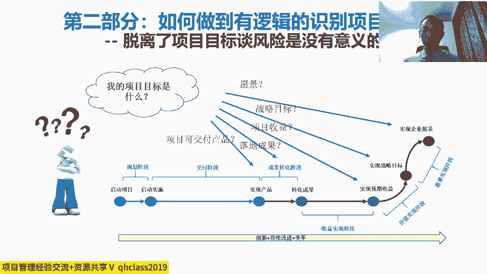
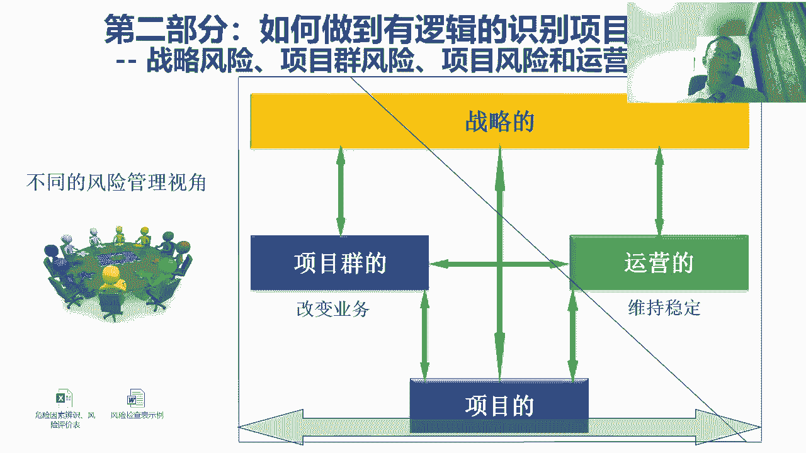
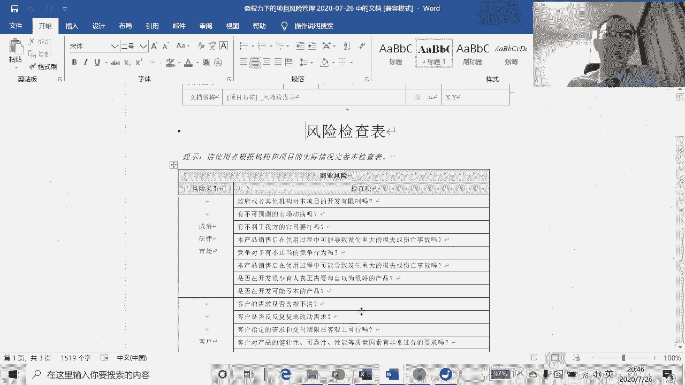

# 微权力约束下的项目风险管理与优化 - P3：3.第二部分，如何做到有逻辑的识别项目风险 - 清晖Amy - BV1GS411A7uN

接下来呢咱们要讲的是怎么让它有效果啊，对我们说之前是没效果，咱们要让它变得有效果，我们有效果呢主要是风险管理过程中啊，做好三件事情对吧，这三件事情第一件事情就是风险识别对吧，第二是风险分析。

第三是风险应对，那咱先看风险识别，我们之前呢这个项目风险管理做不好的原因呢，是因为经常会出现的问题，是这个识别的很没有逻辑对吧，那这样的话呢咱就得要要做到这个识别的，有逻辑，那有逻辑呢。

那这时候呢这里面有几个逻辑，那其中之一呢，我们说这个当我们去识别项目风险的时候啊，我们一定是沿着项目的目标和计划去识别风险，那那这点呢其实很明显，给大家举个例子，我们会看到啊。

在我们这个在我遇到的很多的项目过程中啊，经常会遇到的一个问题是什么呢，我们会发现很多项目经常讲自己有很多难处，对吧，各种不确定性，然后呢，通常呢其实我们按照项目管理的一个基本逻辑。

大家知道这个项目管理的本质是目标管理，目标管理呢就是说其实对于项目经理来说，项目经理必须是目标感非常强的对吧，之前我们讲微权利下的项目这个管理的时候，我们讲说项目经理啊。

项目经理的一个非常重要的特质对吧，就是说呢他一定要目标导向非常强，有强烈的目标感，目标杆的概念，当我们接到任何一个项目的时候，我们要进，我们必须要非常这个这个，这个非常执着的去确认和定义我们的目标。

目标是什么呢，目标是我们这个项目啊，我们在这里看到我们有几类的目标，那我们说最近的目标呢，是我们的项目交付是什么，验收标准是什么对吧，然后稍微远一点的目标是什么呢，稍远一点的目标是这个项目。

它它所带来的成转化出的成果是什么，就是他改变了什么对吧，项目的这个产品要落地，会对谁带来改变，改变到什么状态，再原价，你的目标是什么呢，这个项目最最终预期的收益是什么对吧。

就是将来我们怎么判断这项目最后做完了，对我们有没有好处，收益是什么，怎么测量，那我们先从最近的一点说，就是通常呢对于项目经理来说呢对吧，我们说最好是首先能确认项目的交付，就被我们称之为叫项目的产品。

特别是它的验收标准啊，项目的交付验收标准，明确了项目的交付和验收标准之后，然后我们反向分解对吧，分阶段对吧，然后呢产品做分解，所以呢这个通常当我们在项目中谈，项目风险管理的时候，我们得首先解决一个问题。

是我们必须知道我们项目最终的目标是什么，对我们的验收标准是什么，然后我们要去判断的是，然后我们才能知道我们到底干哪些活，才能实现这个项目的目标和验收标准，那我们怕的是什么呢，我们很多的项目对吧。

在做项目过程中，我们一问发现大家都搞不太清楚，这个项目最终的目标是什么，只是大家呢在很努力的干，我们怕的是什么呢，这个在项目过程中，我们说项目管理从最开始出现的原因，就是为了防止我们很多时候。

即使没有搞清楚目标是什么，但是大家仍然轰轰烈烈的开始在干活对吧，不计划先行动，没有目标，大家仍然很勤奋的干，很有可能整个干的都是偏的，越干离目标越远，这显然不是属于项目管理的行为。

我们项目成员可以没有目标，也使劲干，项目经理不可以，项目经理首先存在的价值不是为了干具体活，项目经理存在的价值就是怕大家走错方向，项目经理存在的目的，就是怕大家不知道目标是什么，也在那努力的干。

结果干了半天之后，结果都没干到点子上，就干的不对对吧，干的不对，那之后然后被批评很委屈，干的不对呢，被纠正过来，很委屈，很不服气对吧，然后所以呢这个我们最怕的是什么呢。

这个项目经理呢跟项目成员最大的区别是在于，项目经理他要明确项目的目标和方向，避免项目成员跑偏，我们项目成员可以跑偏，是因为他是项目成员，他所需要的是技能，但只是技能好就可以了，这个定方向不是他的要求。

但对于项目经理来说，可以没有技能，但是目标感一定要强，而且这个目标不光是自己知道，你得让所有的项目中的人的统一目标，大家朝相同的目标去，我们说所以呢第一呢这个项目经理必须有目标，你这项目中没有目标。

找目标对吧，定目标验收标准是什么对吧，我们最怕一项目拿过来之后，项目经理都不知道验收标准是什么对吧，或者验收标准不确定，然后大家都已经开始干活了，验收标准可以不确定吗，可以不确定。

这个项目实施启动之前可是不确定的对吧，然后项目实施启动之后，它必须是确定的，然后但是他可以变更对吧，我们说这个如果有变化，它可以变更，但是必须是确定的，我们最怕在项目过程中一直都不知道是什么。

我们只有等活干完了才知道，这显然不叫一个有效的项目管理，所以呢我们说这个项目风险识别是这样的，项目项目的风险识别的前提是，第一要首先明确项目的目标，然后明确了项目标之后呢。

然后呢我们再去思考实现目标的路径，对吧，实现目标的路径就是通常我们所说的计划，当我们再去实，当我们再去分析实现目标的路径的时候，那这个时候呢我们就产生了一个结果，我们会发现在实现目标路径中。

哪些是我们相对确定的，哪些是不太确定的对吧，那这时候呢其实我们在这个时候，其实我们就能开始去识别风险了，确定的叫没有风险，不确定的叫有风险对吧，所以这种说第一首先得有目标。

那然后第二呢是说这个不光有目标，这个第二呢就是我们得解决，是说项目中呢有了目标之后，我们还得思考对吧，这里面容易造成项目中具有不确定性，我们至少从三个角度去做分析啊，首先前面是目标，有了目标之后。

第二件事呢，我们思考的是说这个基于目标去做分析，我们怎么去找风险，这里边呢也是三个角度，其中之一呢就是左侧大家看到的叫产品分解，产品就是说那个目标，那我们说这个项目的最基本的目标，或者最近的目标啊。

最容易定义的目标通常是我们说的项目，产品就是交付交付的验收标准，当我们把项目产品呢做结构化的分解啊，就像WBS一样，产品分解对吧，P bs，那当我们再去做分解的时候。

在分解的过程中进行结构化的分解的过程中，我们就会发现一个整体的项目的产品对吧，那然后一层一层往下分，在分的过程中，我们就会发现这项目中每一部分的，它的这个组成是我们相对来说比较有把握的，对吧。

是相对来说风险比较小的，相对来说确定性比较强的，在我们这里就绿色的可以完全复用的，一般什么叫确定性强，之前干过的一般确定性都强，之前干了很多遍的，怎么干都干不错的，这属于基本没风险的，然后呢。

我们说在我们在分解产品的组成部分的时候，我们会发现其中有的部分呢属于之前虽然干过，但这次要求不完全一样，所以需要在过程中去改造和优化，这时候就有了一些风险对吧，没干过的就有风险，干过就没风险。

然后呢我们说在这个产品里边，其中有一部分是之前从来都没干过的这种，我们说画成红色，这绝对是风险巨大的，而且呢理论上来说，如果从来都没干过，肯定得先经过几次试错才有可能干对了对吧。

因为我们大家说这有句名言叫失败是成功之母，什么叫失败是成功之母啊，就是没经历过失败都不可能成功，如果说我们去我们干的这个项目的这个产品中，其中有一块是我们完全没有经验的，就是为零的。

那我们一定要抱着一个先至少试错个几次，最后我们才能干出一个相对正确的东西，所以这种呢我为什么标个红色呀，风险巨大，风险巨大的概念就是说一定会犯错对吧，不犯错不正常，不犯错说明我们最开始评估错了。

说明这不是一个没干过的事对吧，但凡能不犯错的，肯定都是干过的事，嗯嗯一般没干过的事，他肯定得犯错，要不就没有失败，是成功之母这个这个名言的产生了，所以呢这时候我们会发现，当我们在对目标做分解的时候。

就目标这个产品做分解的时候呢，这最终的交付做分解的过程中呢，其实我们的目的是为了从我们最终的交付里面，去识别出其中最不确定的那一块对吧，然后包括对每个部分去做这种不确定性的评估。

这样的话我们才知道将来我们重点管哪块对吧，所以这所以就我们看到标绿的，基本就不用太管了，因为大家B点你可能都干不错的对吧，我们最怕的是说呢，我们项目管理重点管的都是那些对吧，管的那些都是大家熟悉的。

结果，不熟悉的谁都不管，那其实那本来大家最熟悉的不用管，你不管大家也干不错，结果那个不熟悉的其实恰好是要需要管的结果，因为谁都不熟悉，结果没人管，结果呢不熟悉的地方使劲爆发问题。

熟悉的地方画蛇添足进行管理，所以呢首先呢第一个目标分解，帮助我们去搞清楚对吧，项目最终的产品中，什么是我们真正熟悉，有经验，没风险的，什么是我们不熟悉，风险比较大的项目管理呢。

侧重去管那个大家不熟悉的事，而不是去管那些熟悉的事，很多的时候呢，在很多企业中，他经常会有误区对吧，很多企业的领导也好啊，项目经理也好，那专家也好，都特别喜欢管那个自己最熟的事，自己不熟的事谁都不爱管。

别费脑子，熟的事自己管起来很容易，还能显得自己很权威，很专业，但事实上其实从项目管理的角度来说，那那那大家都熟悉的事都不用管对吧，你不管错不了，然后反而不熟的事需要动脑筋的事，这才是真正需要管的。

所以这是第一个按照产品分解的角度来去来去，这个识别风险，第二个就是刚刚所提到的有了目标对吧，我们要去制定实现目标的计划，在制定这个实是实现目标的这个计划的过程中，其实我们是在去梳理啊，其实就是在做推演。

推演的是说对吧，我们现在在这，那我们的目标在那个位置上，最终交付完成的时候，那从我们现在啥也没有到，最终能把交付完成这个过程中，我们到底需要干哪些活对吧，到底需要什么人去干哪些活儿，在这个过程中呢对吧。

在实现梳理实现目标的路径过程中，其实我们就能去识别出来，这里面哪一部分的工作，是我们相对比较有把握的，哪一部分实现产品的工作是我们对吧，不太有把握的，哪一部分实现产品的工作。

我们压根就一点把握都没有的红色，所以在这个过程中呢，其实我们也是在去识别风险，这个识别的是什么呢，识别的是过程中开展工作的风险，那前面呢我们说产品分解实现的，它这个识别的是什么呢。

识别的是我们对于项目最终的目标的，理解的风险对吧，一个是结果上的风险，一个是过程上的风险，第三个我们要识别的风险是什么呢，人的风险对吧，我们说这一直以来人是一个很大的风险，其实我们会发现。

项目中绝大多数问题都是人造成的对吧，有的当然可能是无心的，有的是故意的对吧，然后所以呢这个对人他也要进行识别，因为最后所有的事都是人干的对吧，人不靠谱对吧，这这事再确定也没有用。

所以呢这个项目的利益相关方分析，为什么是项目管理中一个非常重要的管理要求，而且是挑战越大的项目对吧，这个越战略的项目，项目的利益相关方管理越重要，就是因为我们必须要去尽量的去识别出人，对这个对吧。

不同的项目中的人相关方对这个事的动机，然后我们去思考，怎么样能够让他们共同的朝目标去努力，减少对吧，他们因为自己不认真对吧，或者不努力，或者是说不想把这件事干好的风险。

所以呢这个沿着项目利益相关方做分析，也是一个非常重要的点，那然后呢我们再说呢这个除此之外呢。

我们还要思考的问题是什么呢，这个这个风险这个东西吧，它分层次啊，这相互影响，那我们说呢这个对吧，我们大家知道这个，通过前边的几次课的这个讲解，我们大家知道这个项目啊可以分成。

有的叫项目群或者叫项目集就program，然后有叫项目对吧，项目跟项目群，这个项目跟项目群的层次不同对吧，项目呢它比项目群低一层，项目群呢对吧，偏向于中层的这种管理，以收益跟结成果为导向。

项目呢偏向以目标为导向，项目呢如果是项目群的一部分，这时候我们要思考的问题是什么呢，项目关心的风险，跟项目群关心的风险是不一样的，日常运营关心的风险也是不一样的，比如说项目关心的风险是什么呢，对吧。

怎么样能够去确保我的项目目标能按时完成，什么影响我按时完成的风险，项目群呢关心的不一样，项目群呢它因为它角度更高了一些，那他更多的关心的是什么呢，它关心的不仅仅是说，这个项目是不是能按目标完成的。

他关键还关心的是呢，这个项目按目标完成了之后，这个项目的产出到底有没有价值和意义，换句话说，这个项目的产品真的能够帮助我们改变用户吗，改变了用户之后，真的能够给我们的公司和组织带来收益吗，对吧。

然后或者是说我们这个项目的，即使有了一个产品之后，我们在改变用户的过程中对吧，会遇到什么样的阻力对吧，然后呢，然后即使用户被改变了，当我们再去获取我们的收益的时候，会遇到什么样的难处对吧。

换句话说活干的很好，钱没要回来，再换句话说，可能我们这个项目干得很好，产品这个很好的出现了，用户也被改变了，结果呢口碑不好，被很多人埋怨对吧，虽然事干的很好，结果结果口碑并不好，然后换句话说呢。

我们改变了大家，而且把大家改变了到一个其实很好的方向上，结果那帮人自己很不满意，所以这时候呢这是项目群要思考的，干项目很多时候不思考就是按目标完成，但是项目群要思考它的结果对吧。

是否跟我们所预期的结果是相同的，所以这时我们会发现他俩关心的风险不一样了，再有的我们在思考运营，我们说站在运营呢或者运维啊，或者是运营求稳定，项目是求改变的，他俩之间吧这个是互补的，换句话说呢。

因为项目这个企业中呢它有需要稳定的一面，对吧，我们说这个企业得稳定都不稳定，乱套了嘛对吧，这个就没办法赚钱了，项目呢是为了帮助我们的企业呢去推动变化啊，那这个变化的结果呢需要在运营中固化。

但是呢这个项目的这个东西，它往往都是创新型的东西，一拿到运营中去，我们化运营运营最怕什么呢，因为最怕改变对吧，我们都从日常运营管理的角度来说，最好是永远都不变，什么都不变。

大家都按照原来这个沉淀下来的制度流程，要求做事情，每个人都干自己熟的事，不用干自己不熟的事，这时候最不容易出问题，那从运营的角度最怕的是什么呢，这个项目老带来了很多新的事。

而且关键是呢这个项目所带来的这个事吧，自己其实也不太有把握，然后呢这时候呢运营一旦一接手，就带来了无数的风险，所以很多时候我们说项目的结果，其实是对运营很大的风险对吧，就像制造业最怕的就是工艺流程改变。

工艺流程不改变，其实这事怎么干都都没错，因为大家不断的去完善它，然后怕的是什么呢，来新产品，新工艺大家都不熟悉，一不熟悉肯定就出错，一出错，运营的绩效就会减少，那所以呢这时候其实站在运营的角度来说。

其实往往对创新，尤其是这个项目的创新，它其实是有一定的抗拒的对吧，因为他的这个他在把这个创新的东西对吧，逐渐的变成了一个常态化的过程中，他付出很多额外的努力呐，而且绩效一定会受影响。

所以这时候我们会发现呢，其实项目本身对于运营来说就是个风险，但是如果运营很难改变呢，那这时候呢这个成果就转化不了了，这时候运营对项目群来说又是个风险，如果项目干的不好呢，项目群的工作就干不好。

那对项目群就是个风险对吧，然后呢我们再说从战略的角度来说，战略关系的风险是什么呢，战略思想我规划出来一大堆东西，结果这项目跟项目群都落不了地，那这时候我们会发现，项目跟项目群的执行力对对。

战略就变成了一个风险，那站在项目群跟项目的角度来说呢，如果战略没想清楚对吧，自己又老发生变化，那这时候对于项目询问项目的这个目标来说，就会带来很大的不确定性，那这时候变成他的风险。

所以这时候我们会发现呢，战略项目群，项目和运营，他们其实构成了一个小正太的结构，它们之间会相互影响，只有他们之间能很好的配合，跟平衡起来的时候呢，这时候呢整体的风险才能最小对吧。

所以我们说PMO是干什么的呀，这个项目管理办公室非常重要的职责，那包括项目组合管理，特别是PMO里边的这个项目组合管理的职能，它有一个非常重要的工作内容，其实就是想办法去平衡战略项目群。

项目和运营之间的关系，那尽量的去减少它们之间，因为相互之间没有沟通，没有协同，相互冲击所带来的风险，所以我们说识别项目风险的时候呢，也要考虑到不同的层面对吧，不同的角度，然后呢就像我们前面所说的。

这个其实在风险站在，尤其是站在企业里风险识别的时候啊，他有的时候呢最好能借助一些工具，那那比如说呢举个例子，比如说对于工程类的项目来说。

对于工程类的项目来说呢，这个一般的来说，工程类的项目。

它其实都会有一个类似于这种风险识别的清单，那在这里边，工程类项目呢，最关心的其实是偏向于什么危险源，为什么，因为它可能会造成人身伤亡，社会损害，所以往往呢这个成熟的工程项目。

它一定都会形成自己的这样的一个危险因素，辨识和风险评价表，那比如说我们现在看到的是这个，因为我这几年一直都在风电领域嘛，那所以我拿风电工程建设啊，这个举个例子，就是这个建风电厂，大家知道那个风机吧。

这个对吧，这个100多米高对吧，风力发电的风力发电机给大风车对吧，然后呢这个那建风电厂的过程中呢，它也是个项目，所以呢这个因为这个项目干多了呢，其实大家就要把它的识别出来对吧。

这个这个这个起重机械进场安装的时候，可能会有哪些风险对吧，然后这个塔筒吊装，什么叫塔筒呢，就是这个大家知道这个风风力发电机组啊，它有个柱子对吧，这柱子到最上面是那个机头和叶片在上面去转。

就像一个风车一样，这风车那个杆塔筒对吧，那塔筒呢它也是安上去的，所以这个塔筒吊装的时候有哪些风险对吧，机舱吊装时有哪些风险，就是那风机上面那机头对吧，然后呢对吧，轮毂叶片，那叶片有哪些风险。

包括过程中的哪些，哪些工作会带来哪些风险对吧，什么焊接啦，防腐啦，在恶劣的环境下对吧，调试运行过程中有哪些风险，那那所以呢在这个过程中呢，因为经常做的项目呢，在企业中呢会把这些经常遇到的这个风险。

他总结出来，形成一个清单，那当然了，我们说能够把这些这个清单建立起来呢，它一定是因为很多资深的项目经理对吧，通过了这个数10年的这种经验的积累对吧，然后他才能按照这个整个项目开展过程中。

把这个项目的风险对吧，分阶段，然后呢分不同的主题定义出来，而且呢不光描绘这个风险的因素，那可能导致的结果而对他进行评价对吧，哪些是重要的风险，哪些是不重要的风险，当我们有了这样一张表之后呢。

那其实我们在做同类型的项目的时候，虽然项目跟项目有差别，但可能大部分的风险的角度都是差不多的，所以这时候呢当我们的这个项目经理们，每次干这个项目之前，先把这东西过一遍对吧，然后按照这个逻辑去排查一下。

在自己的项目中是不是有这些风险的时候，那这时候其实就可以帮助我们能够，很好地去识别出项目中些关键的风险，那所以呢这个我们说这个，这就是我们说风险识别清单的作用啊。

除此之外呢我们说这个再换一个例子啊。

那比如说如果不是一个工程类的项目啊，那比如说如果我们这是一个这个产品类的项目，那如果我们是一个产品类的项目的话呢，其实我们也可以根据自己的企业的情况呢，去形成这样一个风险的检查表对吧。

那这个风险检查表呢，就是当我们去研发任何一个新的产品，或者是销售一个产品的时候，那这时候我们要去思考对吧，我们要至少要回答这些问题对吧，当我们去研发过程之前，我们要首先首先去回答这些问题对吧。

我们的这个新的产品在政治，法律市场层面有哪些风险吗对吧，然后第二个说在客户层面，我们是有哪些风险吗，客户的需求清楚吗对吧，然后呢客户合作的态度友善吗，那这些其实都是用来提示我们提前要想一下，为什么呢。

因为如果你不想，这可能就是个问题，将来就会风险对吧，然后我们的承包商对吧，靠谱不靠谱啊，我说首先这是第一个层面，这是属于商业的风险，再往后呢，比如说再一个分类管理类的风险对吧，这个项目计划。

项目管理怎么管的对吧，项目计划对吧，我们是不是排的科学对吧，费用够不够对吧，考虑了关键路径吗对吧，然后人力资源是不是合格吗对吧，软硬件能到位吗对吧，我们的项目团队，项目团队的组成对吧。

项目团队的组成中呢对吧，这个有没有害群之马呀对吧，有没有有临时工啊，是不是有人可能会辞职啊对吧，那项目经理是不是因为忙于行政事务，而无暇顾及项目的开发工作呢，这些其实都是可能的不确定性因素对吧。

项目上级领导对吧，项目的上级领导是不是也具有不确定性对吧，这可能也是要去考虑的，再往下呢我们除了管理类技术类的风险对吧，这个需求开发有没有风险对吧，然后呢我们的设计编程测试对吧，是不是有风险啊。

那其实这些呢，其实呢对于我们做同一类型的项目的时候啊，那其实呢如果我们在做所有的项目之前对吧，我们再去进行风险识别的时候对吧，我们按照这样一个结构先整整个识别一遍，这时候呢其实就可以帮助我们对吧。

系统性的去去识别我们项目中的这个风险，它可以避免的是说，因为某些项目经理或项目团队那个人经验不足，那所造成的是说很多关键风险没识别出来，结果识别出来的风险可能本身并没有那么关键，那换句话说呢。

我们不是没有做风险管理。

而是管管错了地方，没有管到点子上，所以这是我们说从风险识别的角度来说呢。

作为一个企业，那其实我们应该建立自己的风险检查表，或风险识别清单，那这样的话呢，可以才能帮助大家更好的去系统性的识别风险。

所以这也是为什么很多的时候，我们说在企业中啊，我们其实要去考虑组织级项目管理，我们要去帮助我们，把这个企业中的这个项目的风险呢，这些东西呢能够系统性的去识别，然后逐渐的积累，形成我们自己的一套东西对吧。

形成我们的组织过程资产，形容我们的表单啊，形容我们的知识库，这样的话呢，每个人呢他就不需要去想特别多的东西，而不需要去靠自己的经验积累，他更多的其实参照我们的组织过程。

资产他其实就能够去做到识别很多风险问题，再有一点呢也是提示一下，就当我们在识别项目风险的时候啊，这个除了威胁吧，也要考虑机会的问题啊，这个风险不光都是坏的，所以我们看风险的定义是什么呢。

它是不确定的一个或一系列事件，那一旦发生，将对项目的目标产生影响，换句话说呢，这个只要是对项目目标有影响的不确定性啊，它都叫风险，风险有好的有不好的，我们不能光找不好的，更重要的是找好的。

那我们国家呢有一句经典的名言啊，叫一俊遮百丑，换句话说呢，很多的时候这个项目大家都觉得不好的原因呢，不光是说项目中很多这个负面的东西，更重要的是说找不出亮点来，就是如果能在项目中产生几个。

让大家特别认同的亮点，其实项目中甭管犯多少错，很有可能大家也就都包容了，理解了对吧，所以呢这个作为项目经理来说呢，一方面我们规避威胁，但是我们大家一定要知道这个项目中啊，你不管规避掉多少威胁。

他是没有亮点的，因为大家觉得你只是干了你该干的事情，如果在项目中呢，大家希望是说别人都觉得这个项目经理，风险管理能力特别好，而且项目经理能力水平特别高，他必须要造亮点啊，按照这个做管理啊。

一定要造亮点对吧，如果我们能造出几个让人特别瞩目的亮点来，这个这个项目中之前犯的错对吧，都不都不重要了，最怕的就是没亮点，如果是说我们不管把活干的有多好，仍然没有亮点，大家是想不起来你的对吧。

所以呢这个在项目过程中呢识别风险也是一样，我们一定要识别机会，我们一看一定要看说在项目中对吧，有哪些机会可以让我们创造出亮点来，那这个时候其实我们哪怕对吧，少管点威胁，我们也要把这个亮点造出来。

这样的话呢对吧，才能够更容易的获得别人的认可。

