# 微权力约束下的项目风险管理与优化 - P5：5.5.第四部分，风险应对，只有能落实到“人”的风险应对指施才能发挥作用 - 清晖Amy - BV1GS411A7uN

好的是，我们说我们会看到这个在这里边呢，我们呢这个通常按照风险管理的逻辑啊，风险应对措施要落地，他至少得落实到两个人身上，那一个人呢是有资源的人，往往是领导，那所以我们通常要把这个。

风险应对措施落落实啊，他一定要挂到一个这个有实权的领导身上，第二呢，我们要求这个领导只派一个有时间干活的，为什么，因为挂领导身上呢，是因为这过程中要有什么问题，领导可以用他的资源跟权力去帮忙推动对吧。

然后呢，第二呢，但是领导往往很忙，他没有时间干这个具体的事，所以呢我们得需要这个领导啊，派个有时间干活的人，代表他来去干这个活，但责任得算领导的，所以呢这时候呢把这两个人都出现了之后。

他其实这个东西才比较容易落地，比较容易落地的原因是什么呢，领导解决对吧，这件事能干，然后呢这个这个有时间干活的人呢，他解决的问题是说对吧，他有时间干，那当这两个东西合并了之后。

风险应对措施呢才真正的具备了落实的基础，第二呢就是说我们考虑到这个这个风险啊对吧，原因事件结果，那可能过程中会经过很多路径，这里边一定会涉及到很多相关方对吧，当这相关方多了。

到底谁谁来负责是比较合理的呢对吧，因为大家可能都会找个责任，这坦诚的讲啊，在项目中，这绝大多数人啊谁都不爱承担这个风险，应对措施对吧，因为这这纯粹对吧，首先第一呢这肯定有成本，有投入对吧。

而且应对不好了之后，自己还有责任，这事儿肯定大家都不爱干，所以对于项目经理来说呢，他一定要擅长找理由对吧，一定要找合理的理由对吧，然后让这个真正有能力解决这个问题的人，他他没办法推辞这个事对吧。

所以这时候呢那一般情况下，一般什么样的人适合，这个承担风险的应对措施呢，就是右边我们讲说这个，第一呢就我们还得从那风险的三段论上找原因，事件结果对吧，一般的谁造成的风险，谁往往其实有责任对吧。

你也要去这个承担应对措施，解决这方因为你造成的对吧，这事你不好讲，第二呢风险呢在谁的地盘上出现了，这就是我们说的风险事件，这风险事件在什么地方出现的对吧，在在工作中的什么环节出现的对吧。

那这时候呢在那个风险爆发，那个地儿，你应该，其实他其实是有责任去落实风险应对措施的，为什么，因为你要不落实它在你那儿出现，你将来这个你的责任也跑不了对吧，为什么这个风险不在别的地儿，事件爆发。

偏在你那爆发呢对吧，然后第二呢他在你那爆发，你也受影响啊，所以呢，所以一般这个风险事件爆发，跟出现的这个地方呢，他的这个人比较适合这个承担风险应对措施，所以我们看第二个选项对吧。

实际上这个造成风险的人来来去负责落实呢，还让那个风险在谁那出，在谁那落实呢对吧，第三个是什么呢，受影响的对吧，谁受影响，所以也有可能他会成为一个风险，这个措施落实到合适的人，为什么呢。

因为你就将将来就你受影响，你自个儿不盯着这个事对吧，自己倒霉，所以这时候呢你会有一个非常充分的理由对吧，去说服他对吧，你受影响对吧，如果你都不管，你受影响，他自己都不关心对吧，我们说一般的来说。

管理是什么呢，一般是谁最受影响，谁往往最关心，所以呢这个受影响的人啊，他往往也有可能成为这个风险，应对措施落实的一个主要的责任人，所以这时候我们会看到项目经理，至少有三个选项了吧，当我们这个任何的时候。

当我们这个识别出跟一个风险对吧，分析评估完了制定的风险定措施之后，当我们找责任人的时候，我们至少可以从这三个角度找对吧，谁造成的风险，他可能是一个潜在的责任人，这个落实风险的措施的责任人对吧。

第二呢在在在哪风险事件在哪出现，那个出现的那个地儿的人，他可能是个责任人，第三谁受影响大，谁可能是一个非常适合的责任人，那不管谁是这个责任人呢，我们说他都要向左侧一样承担风险应对措施的，这至少得俩人。

一个是领导责任算领导的，然后让领导派一个有时间干活的，然后项目经理盯着那干活的，把这个风险给落这个措施对吧，他给落实了，所以呢这样的话才有可能让风险的应对措施啊，真正的将来能够落实到位。

所以这种我说在落实的时候要考虑的。

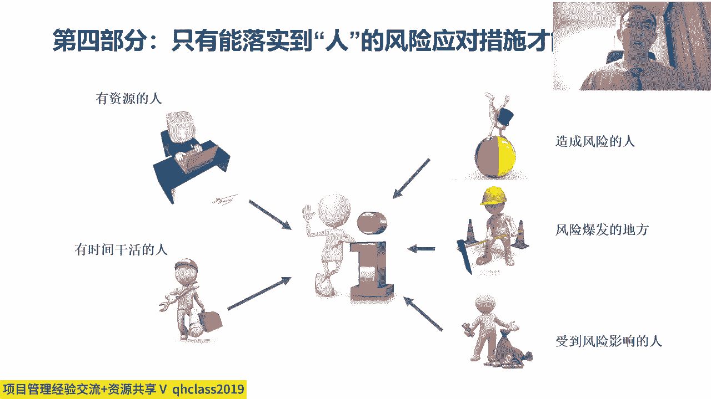

再有一点呢，这个从项目风险管理的角度来说呢对吧，这个项目风险管理，他一定要有个项目风险记录单，风险技术单位是，因为其实我们项目中不只有一个风险对吧，我们前面风险识别的时候。

我们会发现项目中其实会有一大堆风险，那项目中一大堆风险呢，而且呢它可能会不断的增加，因为这个项目风险管理这个事啊，它其实是在整个项目过程中对吧，它不断的识别对吧，不断的解决再识别再解决。

它是贯穿整个项目过程中的，所以呢这东西不能光靠项目经理，拿脑子记着对吧，中中国话讲说这个好记性不如烂笔头，那项目管理更是一样，项目管理呢注重用表单进行管理，当我们注重用表单进行管理的时候呢。

我们就有一个项目风险的一个记录单，在这个项目风险的记录单里呢，我们把所有识别出的项目风险呢，都要列到上面去，而且不光要列到上面去，我们要排优先级对吧，我们要永远优先解决那些优先级高的。

所以当我们再去定义项目风险记录单的时候呢，它通常会有这些条目啊，正好顺便大家可以看一下，第一呢这个对吧，我们风险多了，所以排个序吧，风险id对吧，123456，第二个这个风险呢可能是哪个领域的风险对吧。

比如说可能是属于是这个呢，其实背后是风险分类，比如说这是一个市场风险对吧，还是个研发风险对吧，就或者叫这个市场风险或者技术风险，或者管理风险对吧，但总之呢你要有个分类，然后或者呢也可以按阶段分啊。

阶段分，比如说这是属于方案阶段的风险对吧，还是属于计划阶段的风险，还对于开发阶段的风险，还是实施阶段的风险对吧，还是试运行阶段风险，总之呢要有风险分类之后呢，这个风险名称对吧，描绘这风险叫什么名字对吧。

嗯之后呢我们要按照风险三段论原因，事件结果对吧，这风险造成的原因是什么，这原因必须是已经发生的，如果这原因没发生的话，我们描绘这风险其实是不靠谱的对吧，第二风险事件描绘的这个风险的场景。

场景就得包括什么呢对吧，场场景就得包括的是时间地点人物事件对吧，所以时间点人物事件去描绘，这个风险到底在什么地方出现，然后呢再有了影响对吧，到底对目标的影响是什么，是不会造成延期啊。

还是会造成成本增加呀，还是会造成客户不满意呀，对吧等等等等，还是造质量不好啊，这是对项目，针对于我们自己项目的目标去描绘它的影响，再之后呢我们说这个风险发生的风险，事件发生的概率是多大对吧。

然后呢影响是多大，那通常呢这个风险管理的一个通常做法呢，是把风险发生的概率乘上风险发生的影响，他俩相乘所得出的一个结果呢，作为我们排这个一这个风险的，这个优先级的一个几率，那这个一个重要的依据。

所以这时候呢我们说比如说对吧，概率80%，然后呢这个影响呢，当然这个影响吧一般按概率不好定义，所以有的时候呢我们一般会采用的方式啊，比如说影响呢我们按照这个比如说分四级，特别严重对吧严重。

然后呢这个那可能不太严重，或者完全没有不严重，我们可以把它分成四级或者分三级都可以对吧，就属于这个这个特别严重，严重和一般严重啊，这分几级概率呢，一方面呢我们可以用这个百分比啊。

另外一方面呢我们也可以把它分成对吧，概率比如说特别大啊，这个大，然后呢一般不大，那然后这时候呢，我们可以把这个东西背后去进行量化对吧，我们可以把这个分的这个级啊，可以背后进行量化对吧。

比如断案12345对吧，或者20%，50%，80%对吧，百分百，然后呢这两个东西再相乘就能进行数字量化，它就能得出一个数字的结果，然后再按这个东西来排，优先去这个这个按照这个按照这个结果呢。

我们再去定义一下，比如说在哪个区间里边较严重，哪个区间呢叫一般哪个区间较轻微，这时候呢我们就能够把这个风险对吧，根据它的概率和影响相乘的结果进行分级，然后呢我们通常还要描绘一下风险的临近度。

然后呢这个再描绘一下呢，这个而且再一个呢得写我们的风险的应对措，施和应对计划对吧，可能定期要更新，然后呢从状态上我们还要去描绘什么呢，这个风险的事件到底是发生了还是没发生对吧，这个没发生的时候呢。

叫风险一旦发生了，我们就得上应对措施了，这时已经变成问题了，之后呢，我们要去描绘一下，我们风险的这个相关的责任人和责任方对吧，这个这风险算谁的，就owner，这是所有人对这个所有人。

可不是说大家这里边说的这个风险的所有人呢，是owner，O o w n e r owner，owner就是这风险是归谁的对吧，第二呢这个风险的执行人对吧，然后执行人呢谁负责去落实对吧。

我们说这个这个owner所有人，他一般得是个领导，这个领导责任制对吧，然后第二呢他得派个人去落实风险，对措施执行人，第二呢可能会有相关的参与的人有哪些，那这样的话呢，我们才把一个风险的过程去描绘清楚。

那通常呢风险记录单呢对吧，他得把我们所有的风险都列进去，而且不断的呢根据它的优先级进行排列。

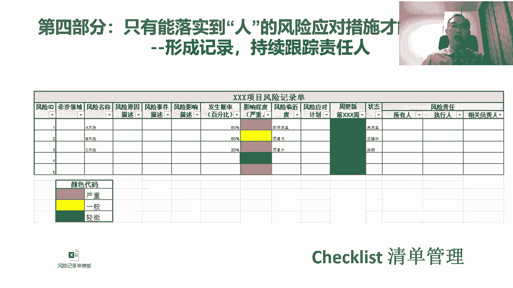

我们优先去解决那些对吧，最重要的风险。

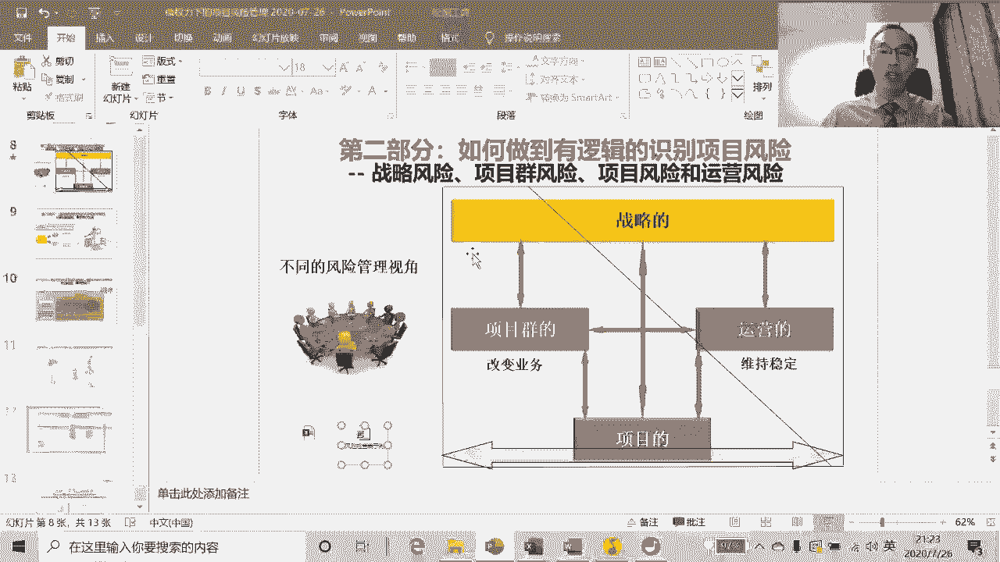

而且呢噪一点呢这个，给大家再举个例子啊，很多的时候呢，其实可能我们通常的习惯呢，会把这个项目的这个计划，计划控制表跟风险记录单，问题登记记单，经验教训记录单，这几个表单放一块，为什么呢，一般的来说呢。

这个风险呢在很大程度啊，它跟这个项目控制计划它有关系对吧，所以一般来说呢前面都有WBS工作分解对吧，这个首先有项目的计划，跟这个产品分解和工作分解。

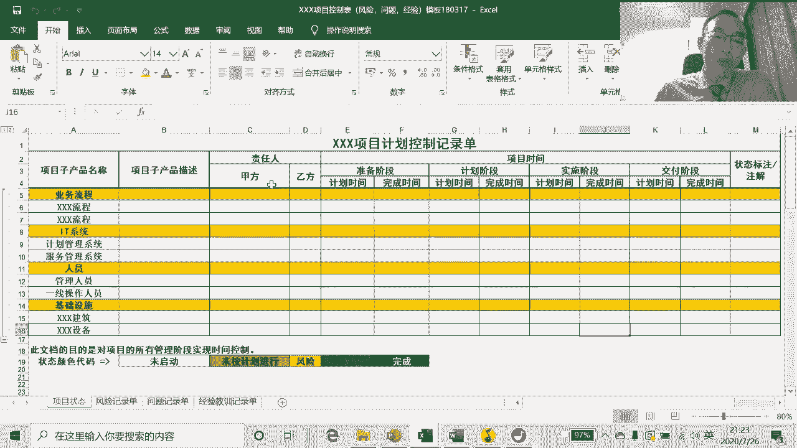

然后之后呢，这个基于前面的这种计划和目标对吧，然后呢我们再去把所有的风险识别出来，进行记录，然后一般的这个风险没发生的时候叫风险。

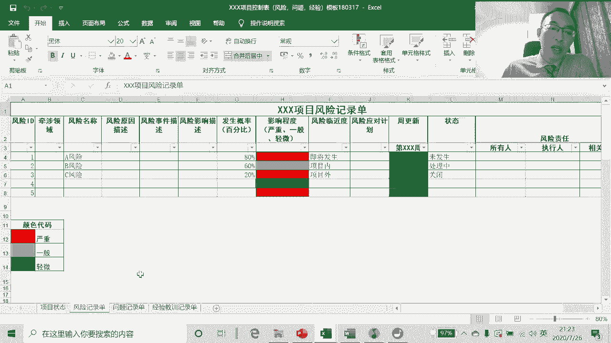

发生了叫问题，所以一旦风险发生了之后呢，那我们就把这个风险呢，从风险登记单转移到问题登记单上对吧，那这时候呢就由风险变成了问题，按照问题跟进，然后问题解决了之后呢，就变成了经验教训。

所以这时候呢我们就把它放到经验，教训记录单上，所以很多的时候呢，这个作为项目经理呢干项目管理的时候啊，这几个表单都是需要的对吧。

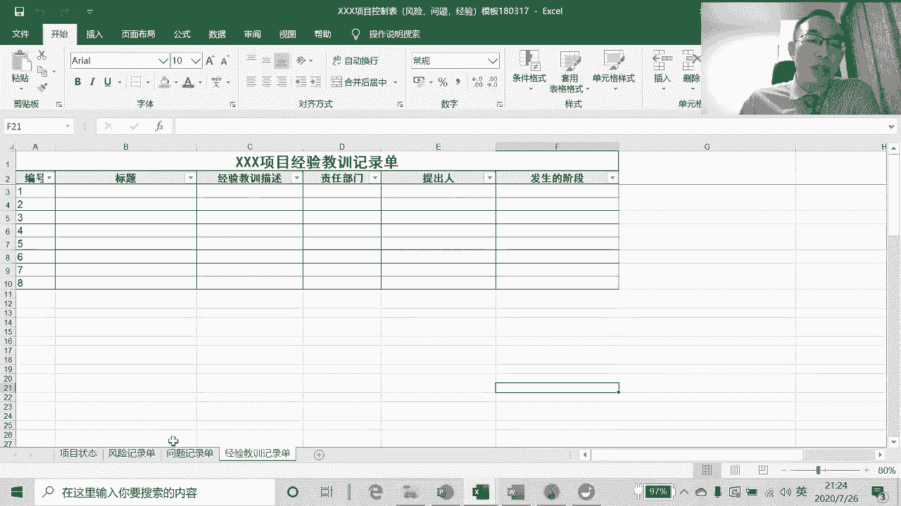

前面呢有项目的目标和计划，然后之后呢这个对吧。

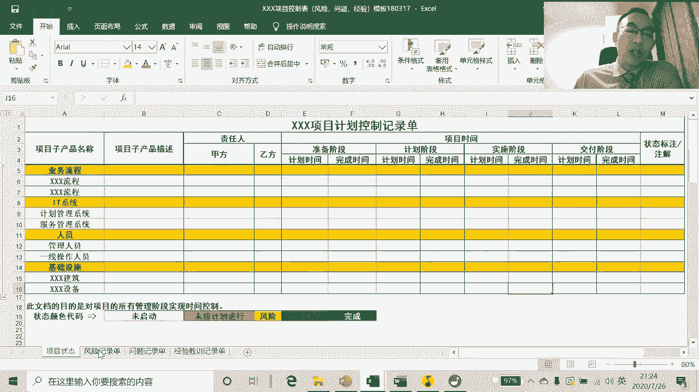

然后呢我们要预测各种可能的风险，然后呢这个风险发生了之后把它转移到问题上，这时候呢我们在序列号呢可以做关联对吧，问题解决了变成经验教训，那这时候呢将来我们查一个经验教训的时候，我们就可以反向查到。

是说当初他的问题是什么，他最开始识别的时候是按什么风险识别的对吧，它影响了项目什么目标。

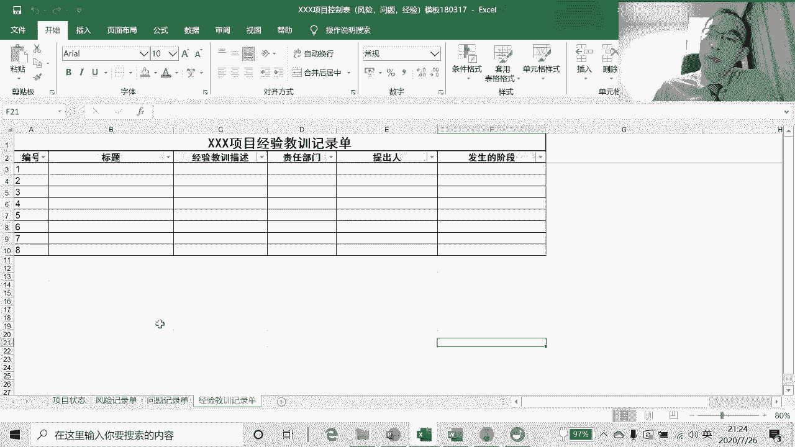

什么计划，这时候呢它其实更方便我们进行整体的管理。

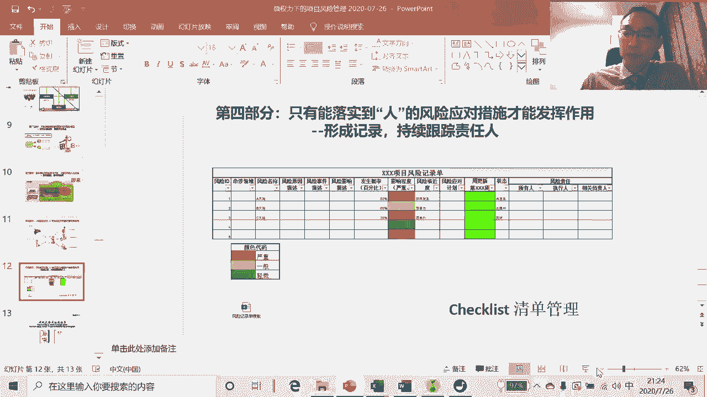

所以呢这就是我们说的这个风险，最后落实的时候呢，他一定要落实到表单上啊。

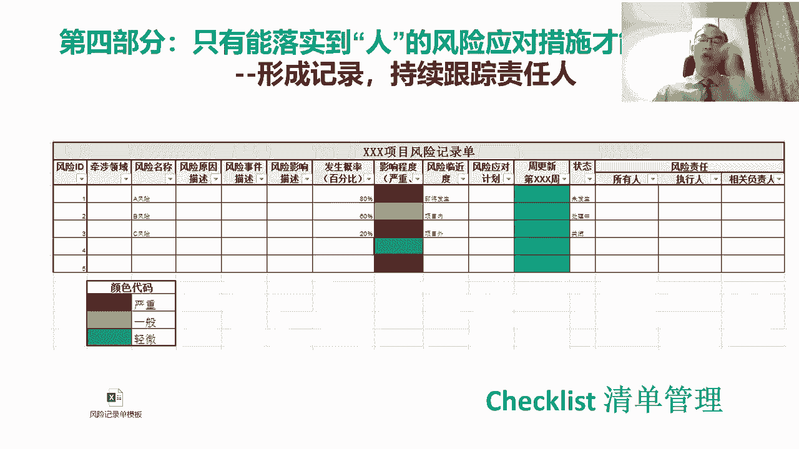

那这个呢其实讲到这儿呢，我们这个整个风险呢。

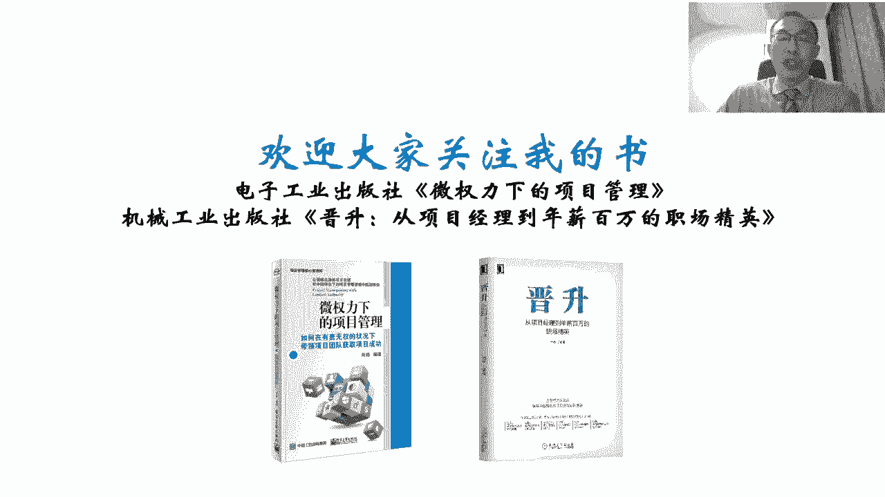

这个风险管理这个讲座就讲完了，然后呢这个为了能让大家更清楚啊。

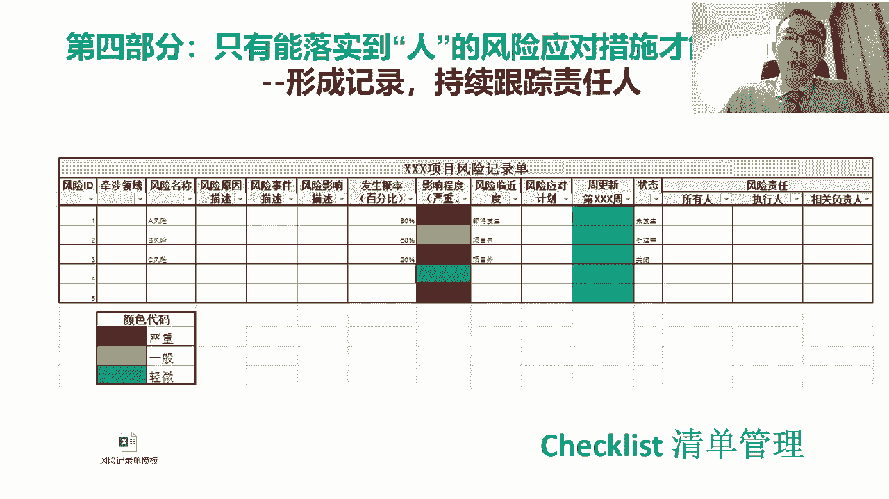

我们把这个过程再稍微再串一遍啊，再重新再去串一遍，那其实在今天这个这个讲座的过程中呢，我们给大家，首先呢讲这个项目风险管理的三个主要原因，这三个原因是什么呢，这个一般来说项目中风险管不好。

第一就是识别的时候不系统性对吧，然后呢可能很多关键风险没识别出来，那可能呢这个管的风险呢也不太重要，然后呢第二呢也有可能识别太多了，发现实在管不过来，所以也不管了，第二个原因是什么呢。

这个风险虽然识别出来，但是因为没有对他进行这种因果关系的，这种这种充分的分析，所以导致是说呢其实这风险吧说不清楚是什么，就说不清楚是什么，就就不好制定有针对性的应对措施，第三呢这个即使有了应对措施呢。

因为没有落实到合适的人上，那结果导致了是说呢这个没有被落实，即使识别了风险，但是还是变成了问题，而且带来了负面的影响，所以为了解决这些问题呢，我们作为项目经理或项目管理的，他必须要苦练。

我们说这上面这这三个东西对吧，这个这个项目管理的三个技能，一个就是风险识别对吧，如何有逻辑的识别风险，那在项目中呢，它一定是基于目标去识别风险，所以项目的首先对目标目标清楚，我们才知道这个什么风险。

对目标有多大影响对吧，如果连目标都没有，我们根本没有办法判断什么风险，对目标有什么影响，有了目标之后呢，我们可以沿着计划识别风险，沿着产品分解识别风险，沿着项目组织结构相关方识别风险对吧。

然后呢我们还要关心的风险的层次对吧，战略的风险，项目群的风险，运营的风险，项目的风险，在我们这个这个识别风险过程中呢，不能光盯着威胁，也得关注机会对吧，我们说造一些亮点，这样项目成绩会更好，识别之后呢。

我们要做的是分析对吧，项目风险分析的时候呢，我们最重要的是把项目中的因果关系，一定要梳理清楚对吧，原因事件结果英国，当我们把整个项目的这个来龙去脉，的这个因果关系梳理清楚呢，我们才能更好的去对吧。

去去找出来相关的责任人，更好的应对措，定义应对措施，才能更好的把这个项目呢这个风险管起来，然后呢这当我们进行风险应对的时候呢对吧，强调重要的一点是说，一定要落实到合适的人身上对吧，然后呢一定要有责任人。

第二要有干活的对吧，然后呢然后呢我们也要形成表单，把它记录下来，不断的去通过它的概率跟影响排优先级，以确保的是说我们永远关心那些对吧，最重要的风险，那负责这件事的人呢，就是我们所说的项目经理好了。

这个因为时间的关系呢，我们今天的这个项目风险管理呢，对我们这个分享的内容就分享到这了，然后呢希望这个分享内容能够对大家有帮助啊，然后呢，这个呢其实我真的是这个把自己的这个做项目。

风险管理的这个心得体会啊，很毫无保留的分享给了大家，是因为呢这个项目风险管理真的很难，然后呢，我很希望呢这个大家通过这个我的这个讲座，能够去去真正的这个理解到，这个项目风险管理啊。

到底怎么管才能发挥价值，因为现在国内大多数企业的项目上，这个项目风险管理，它都是一个形同虚设的东西对吧，所以大家呢貌似有风险管理，其实又没有做到发挥不了作用，有很多呢根本就连连管都不管。

那这时候你就会造成其实整个项目过程中啊，他是非常失控的，这时候想想达到这个比较好的项目的这个目标，结果就会非常困难，项目风险管理很重要，也很难，所以呢需要大家呢更理解他后面的逻辑和工具。

然后呢更多的去训练自己，然后更多去实践，才有可能把这个项目风险管理逐渐的摸索出来，一套自己的套路，然后我们还剩点时间啊，我们看看这个是不是可以，帮大家去回答一些问题啊，啊看看有什么问题。

嗯我们我在这个问答区里面，唯一看到的一个问题是，我们有有一位我们有一位同学问今天还有课吗，嗯这个问题我没看特别明白，所以这个对今天反正我要讲的就讲到这，快讲完了对，然后至于可能应该没有其他的课了吧。

这眼瞅都晚上09：30了，嗯看看大家还有没有什么别的问题嗯，然后在我们的讨论区里边呢，没有看到太多的问题，然后看到的其实大家都都大家的感触啊，然后看到了大家的收获，那这个我也挺开心的。

那说明大家其实过程中能有一些收获，那然后呢反正嘛讲座嘛，然后其实目的呢还是希望呢第一呢大家有触动，然后能跟自己的实际的工作关联上，然后呢，如果大家呢在这个这个听讲座的过程中呢，对吧。

然后能够帮助自己解决一些困惑，然后呢能够去帮助自己解答一些问题，那对我来说呢，其实这也就是最欣慰的了，那目前呢没有看到太多的问题啊，然后呢时间也差不多了，然后呢希望呢大家呢能够很有收获。

然后呢在自己的项目中呢，能够真的呢能够能把它用上对吧，然后不光的是说听得听明白了，更重要的是在自己项目中呢能够能实践起来，能落实下去，真正能解决一些问题对吧，我们说这个一直以来我推行的都是知行合一啊。

那那知行合一呢，这个在这个知行合一其实它是什么呢，就是首先学到了一个东西，就听明白一个东西，然后我们得实践，在实践的过程中呢，再反过来去体会，我们学那个东西，然后呢其实才有可能啊。

才有可能真正的把人家从人家那学习的知识呢，转换成自己的能力，甚至是一种本能啊，好吧，这个现在刚好时间09：30了，然后呢这个我们的今天的讲座呢也就到这了，然后呢这个也希望大家早点休息啊。

然后明天呢我也要还要这个很早出发，然后呢，将来呢有机会呢，我们再去沟通大家里边一些具体的，其他的这个这个问题，我们以后再有机会来做交流好，那我们今天讲座就到这儿。

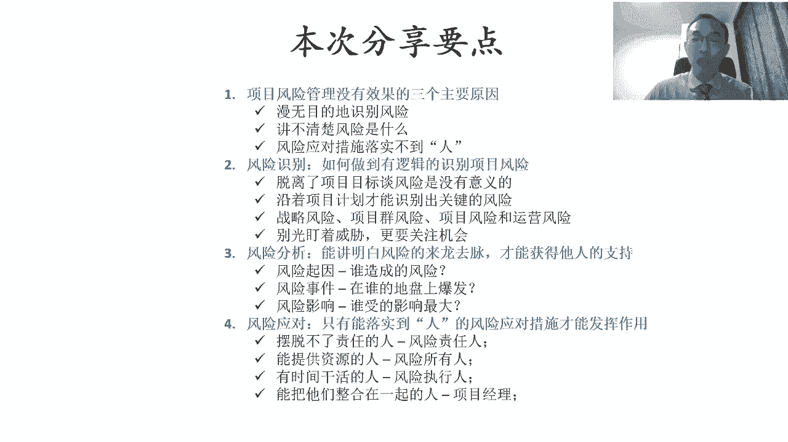

谢谢大家，感谢大家的这个收听啊，坚持到最后，好晚安。

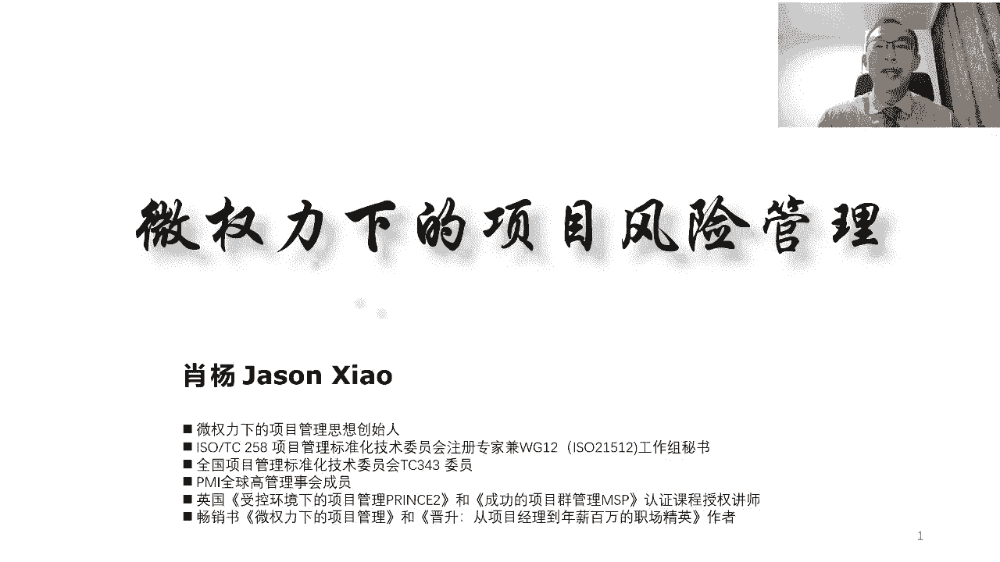

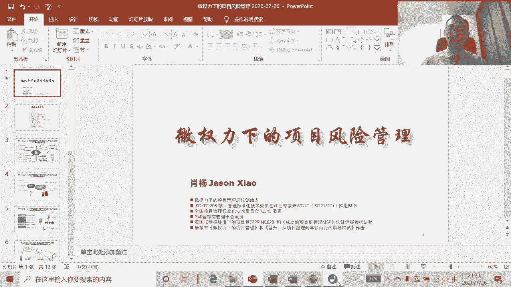

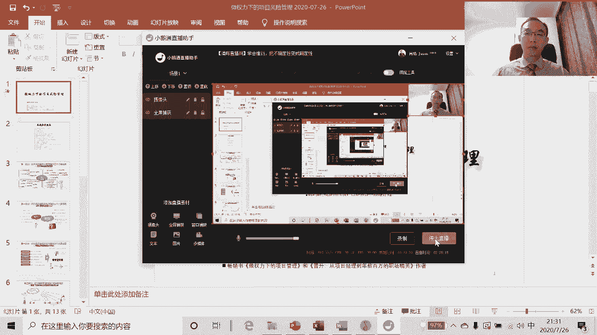