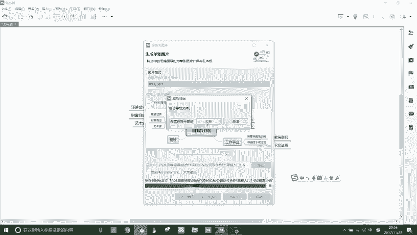
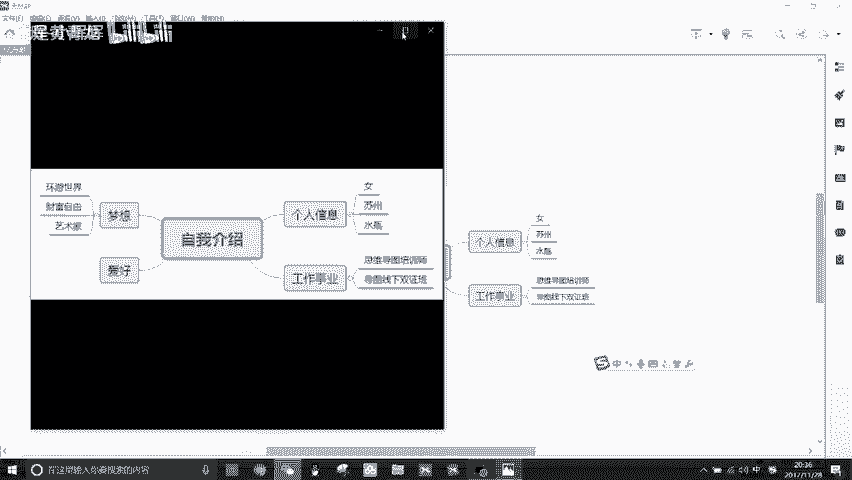
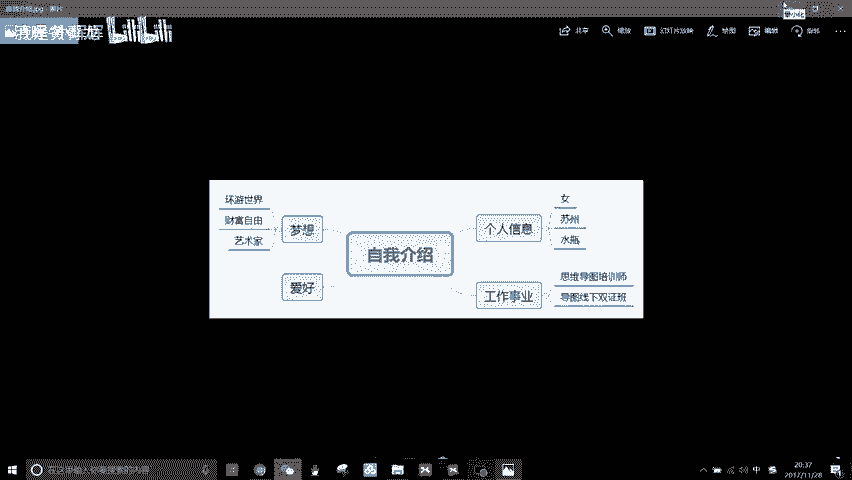

# 思维导图xmind官方教学教程(合集) - P1：2.脱离小白：如何用最快的方式绘制思维导图 - 清晖-小晖晖 - BV11T42117jf

欢迎大家来到x max维导图软件实操特训营，我是吴思颖，你们的思思老师，作为一名拥有多重身份的达人，多亏了思维导图软件XML帮助我提升效率，逆袭人生，我们的特训营课程分为两个部分，应用篇和专业篇。

用片主要针对个人使用时所需XMIN主要功能，专业篇主要针对职场所需的XML专业实操应用，上一节课我们学习了快速上手，如何下载与安装XM，那今天的这一课，第二课，脱离小白，如何用最快的方式绘制思维导图。

非常期待你能够绘制出你的人生中，第一幅XML思维导图，当我们打开XMIN，我们会看到这样的界面，正中间有新建空白图，我们可以直接点击新建空白图，也可以点击左上方文件新建空白图，当我们点击以后。

界面会产生显示中心主题，那假设我们的中心主题是最简单的自我介绍，那我们可以在鼠标点击中心主题的时候，直接输入自我介绍，当然你也可以点击空格键space来输入关键词，当我们打完关键词以后。

我们可以直接点回车来完成第二步，我们要产生下一级分支，这时候请大家记住一个关键的快捷键，请找一下自己键盘上的tab键，只要我们点击tab，它就会自动生成下一级的分支主题，那再点击tab。

它会继续生成下面的子主题，再点击tab，它还会继续生成下一集的字数题，当我们不需要的时候，我们直接点击delete即可，那自我介绍的第一个可能是个人信息，那你可以输入个人信息，请回车完成。

接下来有可能你需要生成，同一级的第二个分支，那我们点击以后可以请enter键，记住这个第二个快捷方式，enter回车键啊，我们清回车键，它会自动生成更多的同一级的分支主题，那关于自我介绍啊。

我们可以可以点击空格键来输入个人介绍，我们可以继续打关于自我介绍的，你能够想到的分类方式，比如说个人信息工作事业，当我需要将鼠标移到下一级分支主题的时候，我们也可以使用电脑键盘上的上下左右键。

我们请往下，它会自动挪到下一集的分支主题，输入完成以后继续进，下面他会继续往下，啊我们可以，继续来打字，当你遇到你不想要的分支主题的时候，你可以选中，然后进delete，也可以用鼠标全选拖动。

然后直接进delete，那这个时候我们可以用鼠标点击以后，自动拖动我们想要的分支到合理的地方，比如说我希望工作事业和梦想交换位置，那我也可以随意的点击以后拖动，那这就是最简单的思维导图，在个人信息下。

如果还记得吗，如果想要产生下一级的分支，我们可以进tab键，想要生成同一级的分支，我们就请enter键，那关于个人信息，你有什么内容可以输入关键词可以输入的呢，你也可以进行一些头脑风暴。

啊这是我的自我介绍啊，女性目前居住在苏州，是苏州人，此外还有其他的信息，比如说是水瓶座好，当我们输入完毕以后啊，我们可以点击是用鼠标点击下一个分支啊，也可以用上下左右键来选择，那我们再次输入。

记得两个快捷方式，一个是tab生成下一级分支，然后请enter回车键啊，然后产生同一级的分支，那我们可以继续输入嗯，你可以想一想你的分支是什么，然后你可以想一想，你的自我介绍会涵盖哪些关键词。

当我们输入以后，也许你会有输错的地方，比如说，当你输错了以后啊，你可以进delete或者你放错位置的时候，你只要用鼠标点击该关键词，然后直接拖动到你想要的位置就可以了。

软件最大好处是它可以随意自由的拖动，而他的这个基本图形会自动生成，需要导图，线下双证班也即将开启，所以记得如果你要生成下一级分支，那就请tab，如果你想要生成同级分支，就请enter，如果你发现错了。

可以直接请键盘上的delete删除，如果你想要移到下一级分支，你直接进键盘上的上下左右键即可，所以如何用最快的方式绘制思维导图，我们只需要记住几个重要的快捷方式，然后用鼠标点击关键词。

或者是直接进space就可以输入关键词，那第二个，当我们想要产生下级分支的时候，就请tab快捷键，当我们想要产生同一级分支，那我们就可以请enter回车键，当我们想要删除错误的关键词。

我们直接进delete，当我们想要移动关键词，我们只需要用鼠标点击长按，然后随意的拖动到我们想要的位置即可，当我们完成了思维导图以后，我们有两种方式来保存，首先是我们可以看到在右上角会有一个图标。

叫做导出，我们点击，然后它可以以图片形式导出，那像以PDF思维图啊，PDF格式或者excel word等形式导出的时候，我们看到它后面有一个pro pro，就表示我们需这个是专业的专业版的功能。

我们需要购买授权码才可以实行，所以通常情况下啊，我们如果想要导出的话，可以直接选择导出图片，然后他就会啊，我们还可以选择图片的格式啊，BMP啊，JPEGGIF和PNG的图片格式。

你可以选择啊导出展开图标啊，我们这里没有将这个信息展开和收缩，那我们可以看到这边有个小按钮啊，我们可以点击以后，这个下方的会收缩等等，那你可以直接点击完成啊，选择你想要把这张图片保存在哪里。

然后点击保存啊，然后再点击完成即可，还有一种保存方式啊，我们点击文件啊，左上角的文件我们会看到它有不同的保存方法，比如说它可以保存另存为啊，我们点击另存为自我介绍啊，然后点击保存。

这时候我们可以看到它所保存的，是以XM工作软件啊，也就是说它是以XM格式，这个思维导图文件格式来保存的，那如果说我们点击导出，那它就可以以图片的形式啊，或者svg file文件的形式。

还有其他很多种不同的格式形式所导出，比如说啊还有text文本文件的形式啊，这个HTML的形式等等啊，但大家要注意后面打pro，这个代表了是专业版的功能，需要下载授权码才可以按这样的形式保存好。

如果我们点击图片，点击下一步啊，然后没有问题啊，我们点击浏览，然后选择合适的嗯，选择合适的路径保存路径，然后我们以JPG的格式保存，点击保存好，我们点击完成啊，这时候它会显示成功导出。

会有打开和在文件夹中显示，那如果我们点击打开，那这张图片会直接打开在我们眼前，如果点击文件夹中显示，那则会打开我们所保存的文件夹，那在此呢我直接打开。

选择打开。

这是我刚才我们绘制的一张自我介绍的，思维导图，就以图片的形式保存下来了，所以今天啊我们用学习了，用最快的方式绘制思维导图，下一节课第三课，熟练达人如何用多种方式绘制思维导图。

那下一节课呢，会教大家更多的思维导图的绘制方法，好探索思维导图XMIND的更多功能。

