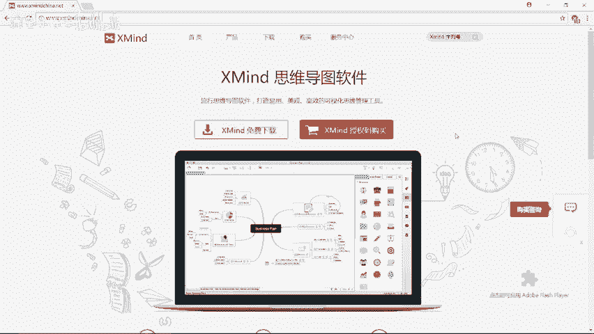
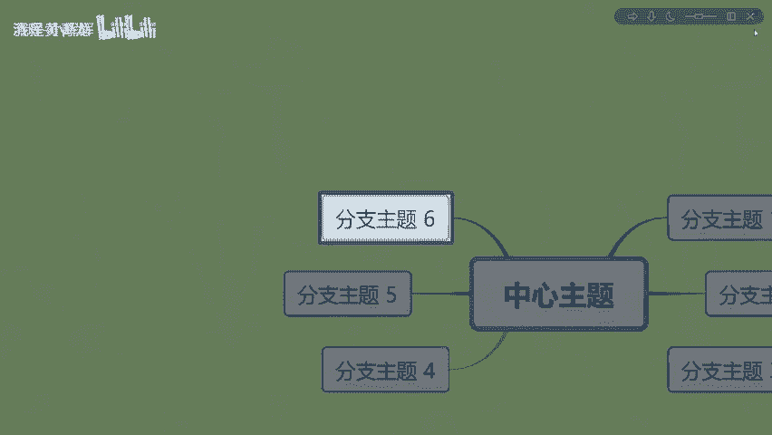
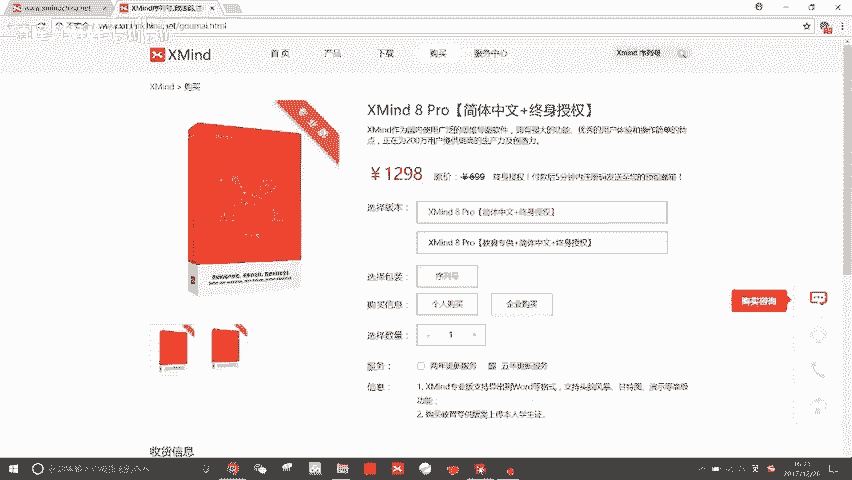

# 思维导图xmind官方教学教程(合集) - P5：6.美颜导图：软件导图也有高颜值 - 清晖-小晖晖 - BV11T42117jf

欢迎大家来到x min思维导图软件实操特训营，我是吴思雨，你们的思思老师，这张就是我用x min绘制的个人简介，你有没有发现相比于蓝白素颜的模板来说，彩色的导图会更吸引人眼球，让人觉得眼前一亮。

上一节课，我们一起探索了XMIN在工作和生活，不同场景中的应用，这节课呢我们就会来学习，如何让你的导图也有高颜值，我们的训练营分为两个部分，应用篇的功能我们已经基本讲解完了，通过这期的课程。

您基本上能够应用XML免费版的功能，绘制出自己想要的导图，应用篇我们会针对XM多种专业功能，帮助大家在职场效率上得到进一步的提升，那在x mi的软件里面啊，有很多隐藏的。

最近还没有与大家讲解过的专业版的功能，那这些专业版的功能能够在我们的工作，多方面给予我们非常大的帮助，比如说头脑风暴团队合作演讲，项目管理，决策判断等等，那下面呢就让我们进入应用篇的第六课，美颜导图。

软件导图也有高颜值，也欢迎大家将自己绘制的导图发布到新浪微博，艾特5C思思和无私分享，然后我会给大家答疑和点评，下面请点击x line软件进入我们的软件界面。

当我们打开XML，我们会看到这样的界面，点击新建空白图以后呢，就会出现我们平时经常使用的，蓝白色主题的素颜导图，那经常看这样的是不是会有些乏味呢，那在新建里面我们点击然后选择思维导图以后。

我们会发现他这里其实有一些默认的风格，那下面的话呢会显得稍微有一些色彩啊，我们可以看到有不同的颜色啊，有比较商务的，一般颜色都会比较素雅，然后personalized的比较个人化的呢。

颜色相对而言选择比较多，也比较丰富一些，它还有一些主题，那这个就是比较经典的啊，也是看着比较颜色素净一些，那假设我们就随便选一个颜色略微丰富一些的，选择以后我们会发现它的背景和中心主题的啊。

这个形状和颜色都经过了改变，那我们来看它的这个分支的颜色，和下一级分支啊，也字体啊，颜色也都有一些改变，那我们如何自己来设置这样的模板和主题，颜色呢，那我们再次回到原来的素颜主题，那我们会发现啊，啊。

当我们点击我们想要更改的关键词，和更改的部分，然后鼠标点击右键会发现这边有一个格式，那我们点击格式，那在界面右方会出现主题格式，因为这是我们的中心主题，然后我们就可以啊来点击我的样式，那我们就可以啊。

这些是默认的样式，我们可以选择它就会改成相应的底板颜色啊，还有字的颜色相应都会更改，还有边框等等嗯，那我们来选一个颜色略微丰富一些的好，那这里呢我们可以看到有字体可以让我们修改。

那这个就跟我们word阴影文档的操作是一致的啊，我们可以选择各种不同的字体，然后我们可以放大哦，可以加粗，然后我还可以换颜色，橘色和什么是对比色啊，可以换一个更啊，更亮一点啊，字体可以再放大一些好啊。

然后比如说可以如果文字比较长，我们可以居中对齐或者左对齐等等，好，那下面就是边框，那如果我不喜欢椭圆形的，还有很多其他各种不同形状的边框，都可以供我们选择，那这个底色如果你不喜欢橘黄色的话呢。

你可以在默认的颜色里面选择，浅蓝色啊，当然了，如果你觉得还想更丰富呢，可以点击其他颜色，那这里还有很多不同的颜色，那点击自定义颜色呢，这里的颜色就更多了，更丰富，你可以随意的选择啊，假设我想要这个颜色。

好想要这个绿色，这个绿色，然后点击添加到自定义，然后点击确定，那这时候呢，这个背景就换成了我刚才选择的特别的颜色啊，所以大家看好了怎么操作好，然后是非常有意思的，可以根据自己的喜好来随意的改。

那这下面的是边框，本来是没有边框的，那假设我要突出，我要加强边框，边框的颜色呢，我们选一个凝华哇，现在的话是不是特别突出和亮眼，那下面我们来看线条啊，我们还是要点击主题，那线条是指它的下一级线条。

我发现除啊，首先我们除了曲线以外，还有直线箭头折线以及圆角折线啊，所以啊还有没有啊，没有这个线，一把线给隐形了，所以你喜欢什么样的线，你也可以选择，你想要什么样的粗细，也可以选择，那颜色也可以选择啊。

就变成红色的，那我还可以啊，变成黄色的都可以好，那这个是中心主题，那分支怎么修改呢，分支也一样啊，我们点击想要修改的分支主题，那还是啊在这边右侧点击格式也可以，或者是鼠标右键点击格式，它也会出来。

那在工具栏啊，在工具栏里面啊，我们也可以看到有一些更改格式的部分，好然后点击了以后，其他的操作跟我刚才讲的是，跟中心主题修改是一致的啊，嗯可以改成这个样子，然后字体可以改，大小可以改，既可以加粗。

然后形状可以更改颜色，背景可以更改边框可以更改，最重要的是大家可以实际操作一下啊，然后啊你喜欢什么样的版本，那就可以设置怎样的不同的版本，那这时候你会发现诶我这边改动了，但是没有反应啊。

线条那是因为嗯所有的线条啊，掌管的都是下一级的分支啊，所以在这里它是下一级的，变成你看它是变成黄色，然后有箭头型的，你看黄色变成箭头形的啊，红色，好那在这里改动以后呢，很多伙伴说好麻烦啊。

难道我要一个个去修改吗，当然不用了，那首先如果你要选择同一级分支的话啊，嗯点击了一级分支，然后我们可以在这里啊选中同级主题，然后我们在这里修改的时候，他会啊同时改变，你看啊会同时进行修改。

他都会进行同时的修改，看啊看你接下来的这个啊，但是我知道还有很多的伙伴，他说哎呦真的好麻烦啊，就算这样我也很不喜欢，那怎么办呢，当我们再点击空白界面，然后再白色的地方，然后点击格式的时候呢。

这时候右侧面会出现画布格式，那所谓画布格式它当然就是指整块画布，那这时候我们会发现啊，我们的背景颜色是可以改动的哈，嗯一般工作如果调成绿色啊，对眼睛看着会很舒服，但如果说你想要有一些特殊的使用。

那你可以选择墙纸，比如说加增加这个背景啊，或者增加这样子的啊，这样的彩色的背景，那如果说你有专业的水印的背景，那你可以选择本地图片去添加，或者自己喜欢的图片，如果你不想要呢，点击删除就没有了。

然后这边还可以调整透明度啊，调整透明度，因为如果你添加特别是添加图片的时候啊，可能透明度会影响啊看到前面的内容的清晰度，那所以呢你在这里啊可以选择透明度，假设我来选一个这样的啊，会很亮对吧。

然后喧宾夺主，但我选择透明度以后，诶它颜色就会降低好，那接下来呢我们来看啊，高级里面的线条渐细和颜色渐变的效果，我们点击，然后你发现诶这个线条渐细了，点击颜色渐变啊，你会发现这个原来是纯蓝的。

现在由白变蓝啊，有一些区别，我点击彩虹色，然后你会发现这个分支自动变成了彩色，就不需要我们来设置了，那彩虹色还有几个不同的版本啊，你可以根据自己的喜好或者需求来设定，这样一来是不是觉得很方便呢。

那以上呢就是我们的x line的思维导图，的美颜功能，我相信通过刚才的介绍呢，你肯可以根据自己的喜好来绘制出一张啊，颜色很丰富，然后图形很多样的思维导图来，也让你的思维导图啊从素颜变成美颜。

那在思维导图的界面上啊，之前六课一直在与大家介绍的，主要是这一部分的信息，那很多伙伴会说啊，我特别想要用一些啊，比如说诶这个任务信息是什么呀，啊这个这个录音pro是什么呀。

但是如果说你没有安装专业软件的话，你的这个所有后面带pro的，这个功能都是被屏蔽的，很多伙伴观察的特别仔细，他发现诶这边还有一串的图标，但是这是演示头脑风暴甘特图搜索导出，导出里面有pro啊。

我现在只能以原文件的格式，或者图片的格式导出，但实际上我们来看一下啊，我们的导出和保存，我们会发现诶除了图片以外，像我们经常使用的PDF文档，Excel powerpoint。

思维导图怎么能够由excel powerpoint来导出呢，甚至还有word，它导出的形式会是怎么样的呢，包括啊除了X以外，其他的导图软件我是不是可以通用来打开呢，把所有这些带crow的功能。

都是我们XM专业版软件的功能，那在第一课如何安装的时候呢，已经与大家演示了，我们在官网上，安装啊，我们打开官网，再次给大家演示，如果我们要实现explain软件里面，那后面带pro的那些神奇的功能啊。

我们可以打开我们的官方软件，你看啊，如果是掩饰他会有哇，哦是不是很神奇的效果，好像比PPT还要酷炫，对不对。

那像类似这样的效果呢，还有很多的功能，专业版的功能啊，我们可以打开3W点x min china，点net xm中国网站，然后啊免费下载的软件我们已经都实操下好了，那在这里呢有个XML授权码购买。

那我们点击授权码购买啊，我们可以根据自身的需求来选择，然后在这里呢还会有两年更新的服务，和5年更新的服务，那像现在是XM8版本，但如果说你购买了两年更新的服务，那以后更新两年期间。

这个软件如果更新到XY的九，或者更新到explain10，你都可以免费的去更新新的版本，所以当你选购好了以后啊，这5年的话，那就是啊5年的这个终身的啊，5年的这个终身授权的不断的迭代。

我相信现在85年以后不知道会更新到几，但是你都是免费的，可以啊，免费可以这个更新的，然后啊当你选择好了以后啊，如果是企业购买，就点击企业购买，在下面的收货信息会有不同，那输入你的联系人的。

写出你的姓名啊，输入你的手机号，然后输入你的电子邮箱，好选择，然后点击支付，然后点击支付，然后提交订单，那你的XMIN的这个序列码，就会发送到你的邮箱里面。

那在序列码里面我们点击帮助，然后在序列号里我们就可以贴粘贴，复制我们x min的序列号，这时候你就会发现那些所有灰色的，没有办法点开的pro呢，它都可以来使用了，那我们的下一篇XN。

思维导图软件实操特训营，会与大家专门的有六节课，来介绍x mind导图软件的专业体验功能，希望在下篇啊，与大家继续的来探索XMIND软件的各种功能，提高大家的职场效率，提高自己的工作和生活的效率和质量。

那今天啊，我们所有的XMIND软件应用篇的内容，就到此结束了，嗯如果大家对我们的课程感兴趣，绘制了我们的思维导图，那欢迎去新浪微博艾特伍思一思思五思分享会，给大家来做点评和打分反馈好。

那我们的XY思维导图软件实操特训营，软件应用篇就到这里，非常感谢大家，我们下篇软件专业篇，再见到此，我们XMV导图软件，实操特训营的软件应用篇就结束了，那我们学习了快速上手，脱离小白，一直到美颜导图。

通过这六课呢，我相信啊学员们能够从一个思维导图，x mind小白的状态，变成了现在可以自己独立的用x mind软件来绘制，一张属于自己的，甚至是比较好看的思维导图了。

那在我们的下一篇XM的软件专业篇里面，会与大家详细的去探索啊，思维导图XMIND软件的专业版的功能，包括头脑风暴，团队合作，演讲必备，项目管理，决策判断，思维格局等等，那在这些方面呢。

我相信啊可以给大家在工作，职场中提升很多的效率，同时呢能够让大家在职场中如虎添翼，欢迎大家去XML中文网站，使用便捷高效又实用的XM思维导图软件。

高校从现在开始，那希望大家听完课程以后，最重要的是进行实际的操练和演练，那也欢迎大家去新浪微博艾特5C思思，将您的作业提交到我们的微博上，会给大家来进行答疑打分和解惑，期待在XML软件应用片中。

能够与大家一起继续的去探索XM更多的功能。

