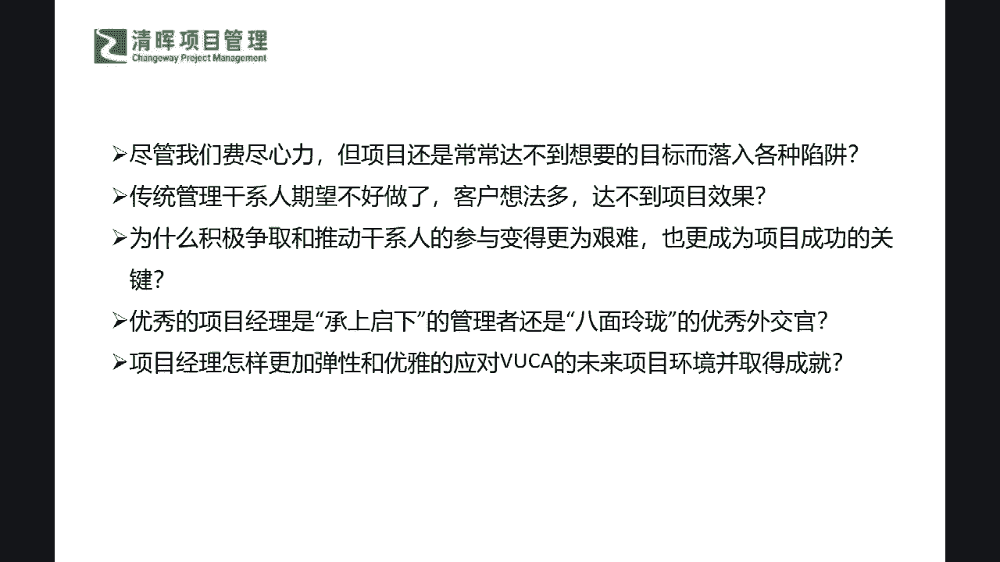
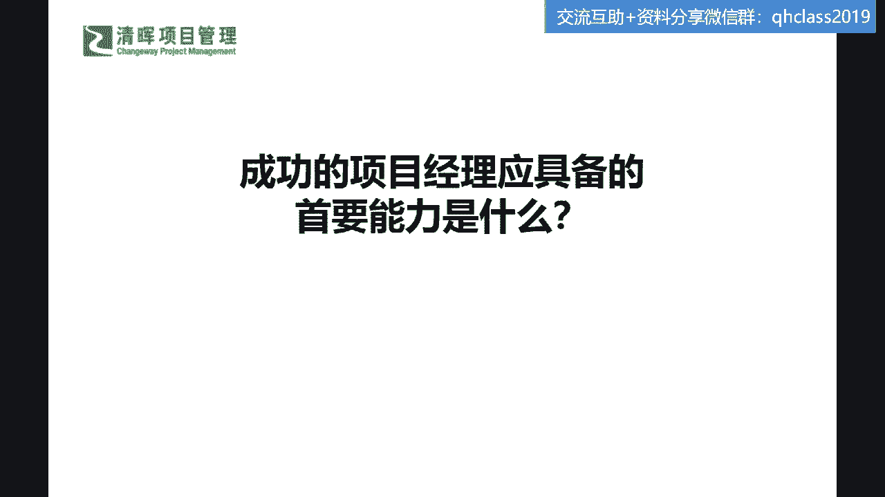
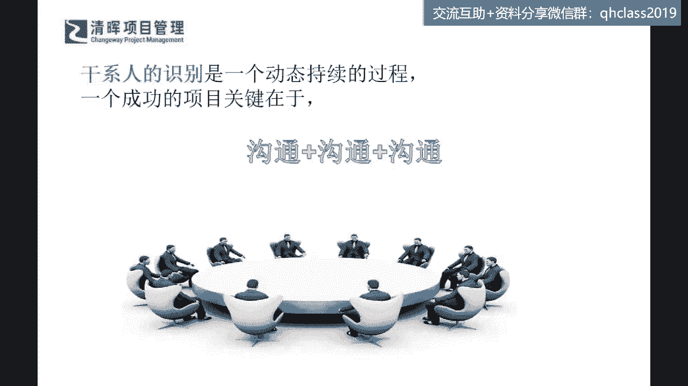
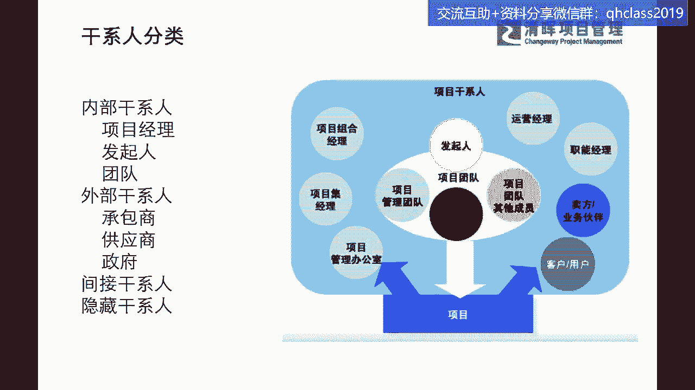
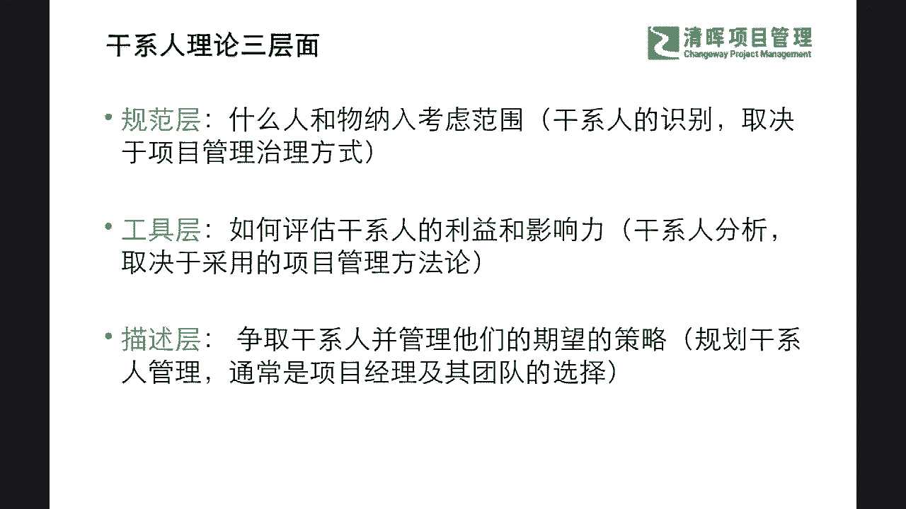

# 成为项目经理应该具备的首要能力 - P1：1.成为项目经理应该具备的首要能力 - 清晖Amy - BV1kx4y1471R

下面来讲一个呃这个灵魂之问是吧，我们今天先问一问这个问题，成功的项目经理应该具备的首要能力是什么，同志们来在评论区扣一下你们的想法，我看到有同学说沟通，有人说个人魅力是吧，还有说据说啊都是花在沟通上了。

还有说这个领导力的沟通的，来大家抠一下，你们认为最重要的首要能力啊，首要能力啊，首要能力啊，来组织协调沟通，细心呐哦这个有同学还真的是非常细心啊，还有影响力是吧，具备技术能力嗯。

一看应该也是一个技术管理管理者是吧，横向管理力啊，唉看来我们同学这个知识也是学的比较丰富啊，学杂了啊啊这各方面的这个概念都懂啊，但是我们在落地的时候可能大道至简啊，非常好。

我看到很多同学都在参与了沟通专业能力啊，珊珊说沟通啊，很多着急就说沟通送分题是吧，说服别人的能力啊，这个嗯也是嘴巴的能力，是不是啊，协调资源嗯，郭洋同学讲故事的能力rain啊。

这个你是不是现在已经在某些岗位上了啊，111般能能到呃，更高层级的，肯定要要把这个故事story，这个这个presentation要讲好的团队管理能力是吧啊，会技术才能好协调，才能会沟通嗯。

宁静致远同学，你所讲到的技术应该是指软，这个不仅是这种这种engineering的一些技术，还指了一些什么communication technology，是不是沟通的一些技术是吧。

你指的是宽泛的技术啊，有效的沟通逻辑思维，全局思维啊，还有拍马屁啊哈哈，还有手机尾号是3376的同学说嘴遁啊，这个大家真的是有各种各种的这个想法是吧啊，大局意识非常好，非常好啊，全局观啊。

今天我们讲pm是一个高薪的工作，真正senior pm都不少，拿的不是不少，拿钱是吧，大家也在看offer，在看这个JD的时候也清楚，那么我们来看一看啊，首要能力是什么，大部分同学都已经深谙其道了。

是啥呀，沟通啊，沟通啊啊，但是我要特别特别回应一下这个萝卜同学啊，这个不是忽悠啊，同志们大家都清楚啊，忽悠人不长久是吧啊，我们讲这个今天我们不要去建立在啊，这个这个一两次让别人觉得很好。

但是后面可能人家就会知道，你这个真真正的一些这个意图是吧，这样不长久啊，那么PM你要想survive，你要想sustainable是吧，你要想长久，你就一定要什么。

建立你个人的一些微信和reputation是吧，口碑，所以可能在这个里面，我们不能这么简单的来把它界定为一个，打嘴炮的是吧，来去忽悠别人，所以在这里面沟通肯定是首要的，但是大家请注意一个点啊。

我放的一个东西是什么，在干系人的识别，在干系人的识别，它是一个持续动态的过程，也就是说你的沟通为什么这么关键，因为你的项目从头开始，就是不断的跟一些不同的干系人在打交道。

所以你必须要通过沟通来去建立这样的一个，良性有效的桥梁，你从开启是跟发起人沟通，在规划是跟团队沟通，在执行是跟执行团队沟通，在收尾是跟客户，跟我们所有的团队进行一个沟通，所以可能在这样的一个过程当中。

沟通能力是非常非常关键，所以之前闫老师就在呃，我们的这个这个实际的这个专栏课程，跟大家特别讲到过啊，怎么样判断一个PM是不是一个能够晋级，并且能够具有未来潜力的一个项目经理呢。

你其实就看他的一个沟通能力，今天我如果我们讲啊，有同学可能还还会提出不同意见，说诶他技术很牛啊啊它能够解决很多问题啊，我们不是在否认这个CAPCAPABILITY啊，不是在否认这个能力啊。

但是如果他的沟通不能做到这样的一个高效率，链接这种干系人的话，你不能去更好的engage age干系人，你去去团结干系人，去去让干系人更好的参与，去让干系人发挥他们的这种效应，的这样的一个呃功能的话。

那么PM可能在他的项目管理的这个流程，工作当中，其实会面临到非常大的一个risk，就是failure，因为你如果bridge不起来，大家都其实各自是各司其职的，所以就像一盘珍珠，PM是那个穿针引线。

把这个珠子穿起来变成一个项链，很漂亮的项链，挂在客户的脖子上的那个人，也就是说如果你你说哎，我其实我自己本身也是一颗大珍珠，我非常的棒啊，这个毋庸置疑啊，但是如果你起不到穿针引线的作用。

你其实在PM的角色上，你就是failure的啊，所以大家能理解这两者的不同啊，不是否认你的技术能力，大家可以看到在很多的企业当中，我们技术能力好的一些管理者，可能啊可能在某些时候他并不是一个很好的P。

大家也能够看得到是吧，所以可能在这个里面，我们非常非常关键的一个点，就是你要意识到这是两种能力，那么在这个能力的锻炼上，你就要把它分开来去锻炼，也就是说你不是说我提升了我的技术能力。

我就已经是一个非常牛的人，就是你这个珠子再大，你也不行，你得把大家串起来，你才算厉害是吧，所以可能在这个里面，我们看到有同学啊讲这个刚才水月天同学问到，如果每个部门都互相推委呢，当推委成常态呢。

非常非常尖锐的一个问题啊，那水月天同学，我用两句话先来回答你啊，推诿是什么造成的，推尾是什么造成的，第一个啊，有一个箭头，第一句话就是推尾是什么原因造成的。

它一定背后的隐藏就是r and而不清晰什么意思，Roll and responsibility，不清晰，就是角色和职责不清晰，所以要返回去看清楚到底是什么角色，什么职责，讲清楚这个东西再去派活理解吗。

所以可能这是一个能杜绝推诿的本质因素啊，第二个当推委成常态，第二句话，你的公司文化是什么，也就是说你的公司的你的公司的rule是什么，规则是什么，如果今天这个事儿都要都要失败了。

我们还在这个会议室里面打架，那你的这个stakeholder case，Stakeholder，你的大老板是什么态度，如果还能容忍这样的事情发生，那你公司的文化可能是存在。

有一定这样的一个啊小小的一个质疑点的，也就是说我们最终肯定是要拿到成果的对吗，所以大家不是为了去互相argue，互相去吵架的，那如果还在会议室不断的吵，而且变成常态都不能去解决，大家持续在这样推来推去。

那么我们就要去问高级管理层，你们想要什么好吧，我就这两句话送给你啊，水月天啊好，那么还有这个富贵是吧，富贵同学问的沟通中，PM太强势或太温柔，怎么把握别人觉得太强势或太nice soft啊。

首先你问到了一个非常好的一个点，就是leadership的style，领导风格，这个我后面今天也会涉猎到，一个非常经典的一个小例子啊，大家一听就明白，那其实在这个里面，我首先回答你一句话啊。

富贵同学PM强势还是温柔，跟他能不能带好项目没有直接的关系啊，你不要觉得只会就是非常强势，拍桌子指着人骂人的这种才是最厉害的啊，通常来讲我们要也要去看这个情况啊，我们实话实说。

那么我看到过很多的一些非常优秀的leader，他们并不是这种非常rude的，非常暴力的是吧，非常粗鲁的，反而他们是非常非常就是你所讲的很nice，很reasonable，非常讲道理的。

但是他们依然能够把项目带的非常好，所以可能这个leadership的style，我相信不是一个解关键的问题，那么关键问题在哪里呢，今天你跟着后面来听啊，你可能会有一点点启发。

那么还有同学说很羡慕有高质量沟通能力的人，不要羡慕别人羡慕，其实羡羡慕是第一步的，你承认有gap，这是一个正常的心理，但是不要变成嫉妒了，嫉妒就是承认自己再学也追不上的这种gap是吧。

羡慕还只是承认有gap，所以可能在这个当中你一定要树立一个信心，这个是可以去学习的，我们就像一直严老师在讲这个领导力课程一样，领导力不是谁，天生就是适合做一个leader的。

当然我们会看到一些侃侃而谈的人，是吧啊，但是我告诉大家侃侃而谈，愿意说和会说能去感染别人，跟你说的多也没有什么关系啊，所以可能在这个这个点上，大家要有充分的信心，只要你有这方面的一个动力和目标。

你要去锤炼你的沟通能力，那么一定会得到提升啊，我相信刚才也为什么花一点时间跟大家讲一讲，社区的这个小专栏，因为我们社区里面有很多这种针对性的小课程，你不先不要去听大课，如果你感觉你其实还存在一点点这种。

这种差距的话，那你先去听听小课程，看对你的一些这种启发和影响和对你的引导，是不是可以让你制定出来，一个属于你自己的一个计划是吧，那么阿仙同学也说，首要能力是沟通啊，没问题啊。

还有这个说边界责任不明确是吧啊，角色职责是吧，那么啊非常好啊，也有张大饼同学响应了我们的富贵，同学的这个提问啊，分场景是吧啊，当然啊这个是讲的比较学术了是吧，我们分场景紧急需求啊，强势试探需求。

用亲和力啊，这个是非常学术的讲法，但实际上呢这个leadership的是style呢，不是一个呃关键的节点啊，所以大家也不要都把自己变成一种，就是觉得我一定要去拍桌子瞪眼啊。

才是才是一个这个这个这个很好的一个leadership，所以我们还是要去啊分门别类来去研究清楚，我们到底应该用什么样的工具啊，好那么我们再来看啊，这个我们很多同学也在响应啊，小企业看领导。

大企业看制度文化是吧啊，所以可能在这个里面哈，我们呃用比较简单的方法给你们一些响应，大家尽管抛进来啊，这个其实有好多我们互相之间一碰啊，互相这个同学之间一点你也会发现哦。

原来其实有很多同学其实非常非常聪明smart，我们其实互相都能给予对方一些，这样的一个帮助啊，那么我们知道是沟通了之后，我们就来看看我们的干系人为啥要沟通。

沟通再加沟通，来看看它的复杂程度，我们从PMP上已经学过了，干系人分成什么，内部干系人，外部干系人，间接干系人，隐藏干系人，直接干系人，非直接关系人是吧等等啊，非常多的这样的一些分类是吧。

那么可能在这儿啊，我们可以呃分的非常明确的一点，大家今天不管怎么样去啊，做这样的分类，我们最主要的一个职责啊，或者说作为PM你把这些干系人分分堆儿分类，你是为了干什么，同志们。

你的目的一定要看本质啊是吧，你是为了干什么，你把它分分类是为了干什么，我再问一下同志们，他内部干系，外部干系人什么，这个呃这个这个直接干系人，间接干系人，然后这个对我们有什么样的一些意义吗。

其实本质上就是在干什么，两个字大家能猜出来吗，学过PMP的同学应该非常清楚了，所有的东西都从哪里来，需求而来，是不是啊需求而来，也就是说你这个所有干系人的分类啊，所有的这种分类，你在不同的分类上面。

他的需求是不一样的对吧，也就是说你把它分类就是为了干什么，去管理好他的需求，非常好啊，温森同学讲的需求导向，是不是啊对的，你要先知道他的需求是什么，然后再想办法去干什么，第二步干什么，把他往哪引导啊。

那不是瞎引导啊，这个往哪儿引导啊，我们之前讲过这个干系人参与的时候，讲过一个东西，叫什么建立统一战线联盟，还记得吗，其实干系人参与就是这句话，不管今天他是一个反对你的，还是一个呃看起来表面上支持你的。

还是说他本质上其实是中立的，不管是什么样类型的一些干系人，那么呃我们要去搞清楚啊，我们呃这个呃也要也要想一想，我们到底应该怎么样，更好的把这个发起人的一些需求，进行这样的一个引导。

引导到我们想要去建立统一战线，联盟的这么一个这个平台上来，也就是要让大家目标要一致，你才好打呀，今天如果一一艘大船，本来这个船呢就是啊我们讲这个这个呃project，这个都是成本又管控的严格对吧。

然后周期也管控的严格，客户要求又是特别细致，所以我们上了这么多的人，上了这艘船，我们就要一起努力往同一个方向来去，不断的滑行，才能最快速度到达客户要求的那个什么目的地，如果上了船之后，你发现这么多的人。

他想往左，有人想往右，有人想往后，还有人想想去干点不一样的事情，那你这个是不是影严重影响你的效率啊，其实我们讲的话糙理不糙啊，其实事情就是这么个事情啊，所以大家要理解我们今天上了船的人。

就必须让大家搞清楚，我们要分门别类，对于大家的需求，对于大家目标进行严格的管理，其实我们去做这样的分析，就是这么一个主要的目的，所以那么我就同样问回，咱们在线的这么多位同学。

因为我看到陆陆续续还有很多同学在上线，非常的谢谢大家的支持啊，因为我们每一次这样的分享，不管有没有PDO啊，我发现咱们同学都特别的积极，所以我也啊不不吝啬于，每次可能提供一些严老师自己。

力所能及的一些小福利奖品来奖励给同学们，因为我发现大家真的都是特别希望，能够去学到一些真知的这个呃这个伙伴，而且从你们自己本身来讲，我也能看到你们自己在岗位上的一些沉思，包含你们的一些这种啊想法。

还有你们的一些这种观点，那么其实我们也非常希望啊，大家能够进一步深入的去抓住本质，来更好的帮助你们，在职场当中有一些更好的发展，那么我们看到这些干系人分类，我们就知道他背后不同的需求。

那么知道这个不同需求的时候，我们就来看看在学术上。

在我们的理论上，我们一般来讲把这个干系人要怎么去划分一下，应该用什么样的一些方法，来分门别类的去对它们，这样会比较好一点呢，那首先有三个层面，第一个规范层，规范层什么意思，其实就是大家怎么样去识别。

到底这个人会不会影响我的项目，这个人是不是可能会通过一些各种方式的一些，这种措施，可能会影响我这个项目的范围，影响我这个项目的一些过程，甚至影响我这个项目的交付成果是吧。

所以可能在这个里面是非常非常关键的，就是来画战队的啊，画一画，这群人他一定是要管起来的对吧，规范层就是干这个事情的，那么还有工具层，就是工具城要干什么，我把范围一框定之后，我们一群的人啊。

乌泱乌泱的人就在里面了，那么我们在针对这些干系人要怎么办呢，我们就想办法要分门别类逐个击破了，是不是，那怎么个分门别类法来啊，这个阿仙同学非常非常好啊，做了总结，分门别类是吧，那咋个分门别类法。

就是我们之前PMP就学过的，干系人分析的工具嘛，权利利益方格还记得吗，啊是吧，这种东西都是为了方便我们去干什么，来去分析它的一个利益和零影响力来去，针对不同的人群，针对不同的分类来去采取不同的方法。

应对的是吧，最终应对是为了干什么，还是要干什么，建立统一战线联盟就这么简单是吧，我不是为了去这个这个采取一些工具去打击啊，或者是有一些其他的处理方式，最终所有都是为了什么，最终的团结啊是吧。

同志们都是为了团结啊，那么还有第三个层面叫做描述层，描述层是干什么，大家都清楚啊，我们能不能直接去给我们的干系人下命令，在学PMP的时候，我们是不是已经被无数次问到这个问题。

我们能不能直接去给干系人下命令，能还是不能啊，同志们好，有没有这个同志已经开始睡着的啊，哈不能睡啊，我们跟上节奏啊，杨老师声音可能会有点大啊，但是我就希望你不要去这个走神啊，啊能下命令啊。

SADDY同学啊，ran同学说不能是吧啊，可以去影响，可以也不可以，温森同学这个多纠结啊，是吧，看我们同学这个做做这个PM，做的真是挺不容易的，挺心酸的是吧，能还是不能啊，不好说是吧。

我刚才用的词是什么命令是吧，听到了吗，同志们，命令命令，Demanding，这个东西我们通常来讲在评级之间都不可以，何况我们在这，今天如果你还我们通常听得最多的一个东西，项目经理是什么。

项目经理是一个什么，你没有什么正式的职权的权利，也就是说所有人都不report给你，不汇报给你，你不能直接去派任务给别人的是吧，我们讲微权利下的项目经理啊，所以你在这个时候能去直接下命令吗。

我们可以讲百分之百是不可以的，百分之百是不能直接下命令的，因为你下了命令，一来人家可能不掰印，不买单是吧，二来可能不直接汇报给你的话，你这个命令就是白下对吧，那么我们这个问题就来了。

那你又怎么去管理这个干系人呢，所以我们在学PMP的时候，也是在强调一个点，我们不是在直接的管理干系人，同志们，我再强调一遍啊，我们不是在直接的管理干系人，我们是在干什么，管理干系人的参与参与是吗。

那参与我们再把它转述一下，管理干系人的参与，其实是在管理什么，管理他的一个attitude，他的一个态度和期望，同志们，也就是说他怎么样才能愿意参与呢，跟他相关对吧，能够吸引他，而且这个东西能够带给。

带给他一定的什么获益的，同志们，你想过这个问题没有是吧，所以在这样的情况之下，他才愿意主动去参与啊，如果事不关己，他肯定是观望的，对不对，所以你要管理他的参与，就要去管理manager。

他的expectation，管理他的期望是吧，管理他的需求，那么这里就来了，我们怎么知道千人千面啊对吧，我们怎么知道他的期望呢，那这里面就也一样，你就需要去知道它到底属于哪一堆儿的。

就是我们规范层和工具层已经打了底了，它属于哪一堆了，那么我们就需要在这个层面之上，进一步来干什么，增加我们的软技能啊，同志们，这个时候可能一些硬技能不顶用了是吧啊，你要增加一些软技能。

来去获取他们的一些显性的期望，和隐性的期望哦，我用的这两个词啊，显性和隐性大家在PMP也学过是吧，显性是什么意思啊，今天我在讲着分享这个这个线上沙龙啊，PPT能写出来字的，这叫显性是吧。

大家能给到大家讲义的，这也是什么显性，但是隐性的东西是什么，今天假如说老老师没有给你讲这些，他是存在我的脑海里的，不是在你的脑海里的，所以这是我的技能，不是你的技能是吧，所以可能隐性的东西。

它是没办法直接通过一些方式啊，来去直接灌输给你，他可能需要有一些这种什么一些过程对吧，所以大家要去学习对吧，所以可能在这个里面，我们就要知道隐性的东西，可能在管理期望上是更为重要的。

因为大家清楚今天一个干系人，他可能给你讲的，他的期望，给你讲的，他的需求也许只是他需求当中的一一部分，我们还有一些他没有说出来的一些这种需求，我们可以通过沟通的方式，技巧，通过观察来知道。

他也许还有一些隐藏的一些东西没有说出来，是不是，那么这种我们在学PMP的时候，其实也是有跟大家特别去提醒过的，我们在学沟通的时候，我们知道语言文字能表达的是其中一部分，那么肢体语言也是非常重要的一部分。

就像我们今天讲，如果一个人跟你在沟通，你的你们公司的一个这个非常关键的一个，干系人，在跟你沟通一个项目的时候，他本来是正面朝向你的对吧，然后两个人互相交流，然后双目之间有一些这种目光的一个肯定。

和这种啊互相的一个认可，那么说着说着的时候，他开始什么侧面对着你是吧，侧面对着你，并且开始什么抱起了双臂，而且眼神也不与你直接有一些交流和沟通了，那么在这个时候你能get到什么点啊，同志们。

如果你是一个比较具有软技能，具有观察能力的一个PM，你能get到什么，你会认为他还在很很仔细的听你讲一些东西吗，你会最直接的就是什么，他已经干什么不耐烦了是吧，或者是已经没有在听你讲的一些内容了。

他可能已经走神了，或者是有一些什么抗拒了，非常好啊，这个这个啊C同学是吧，其实已经暴毙，其实这种体式和不正面对象，你说明他是抗拒的，也就是说可能在某一些点上，他已经不赞同你了，你还在一直的讲对吧。

所以可能这样子已经没有任何的作用了啊，如是同学也说他不赞同，所以可能大家要知道，其实这种期望管理它更多软技能的观察上面，不仅仅从你的语言表达，文字表达，你还可以从你的环境，如果你今天踏进你的办公室。

踏进你的这个这个团队的这个工作场合的时候，大家都是沉沉闷闷的，没有任何交流沟通，死气沉沉的，你会认为这个是一个很好的一个状况吗，是一个和谐的团队环境吗，所以可能在这点上肯定你能get到一些是吧。

所以可能这些期望呢也是来自于方方面面，你的团队也是你的干系人啊，对不对啊，所以可能在这个这个里面，我们要知道我们有很多显性，隐性的东西都存在于描述层，那么我们这三个层的这个作用是吧。

所以也是非常非常关键的，大家不仅仅要了解一些实际，也要了解一些这种我们在学术上，通常所讲的这种理论体系，稍微了解那么一些，你可能就能这个触类旁通啊，啊这个C同学说，感觉做PM心理学还是挺有用的啊。

啊一定非常有用，颜老师特别讲过，分享过一本书啊，就是不懂心理学，你还怎么做一个好的片啊，如果感兴趣，也可以去看看我们社区读书会的回放啊，其实那本书非常有意思，里面讲了很多心理学的特征。

而且如果pm没有掌握这些心理学的一些这种基，础的一些这种做法的话，可能你的做法上会产生大大的这种效率低下，甚至可能会起到相反的作用，所以心理学其实是管理学的一个，非常非常重要的一个一个分支啊。

那么啊刚才有同学还在问啊，说这个什么书啊，刚才说这个不懂心理学啊，你还怎么管项目是吧啊，不懂心理学怎么管项目，是严老师读书会专栏的一本书啊。

