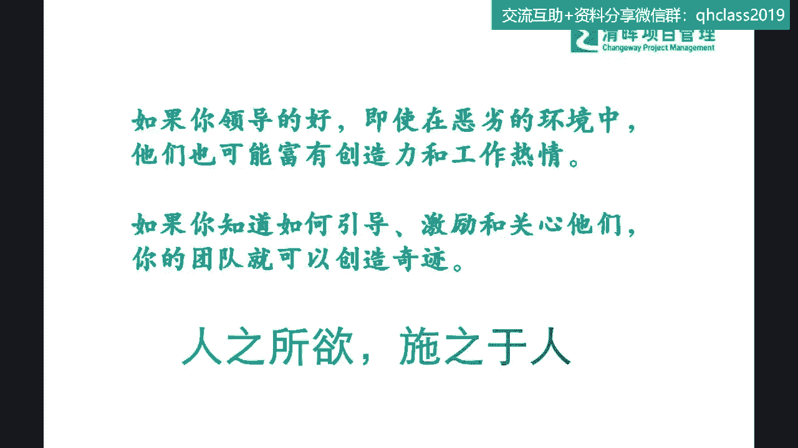
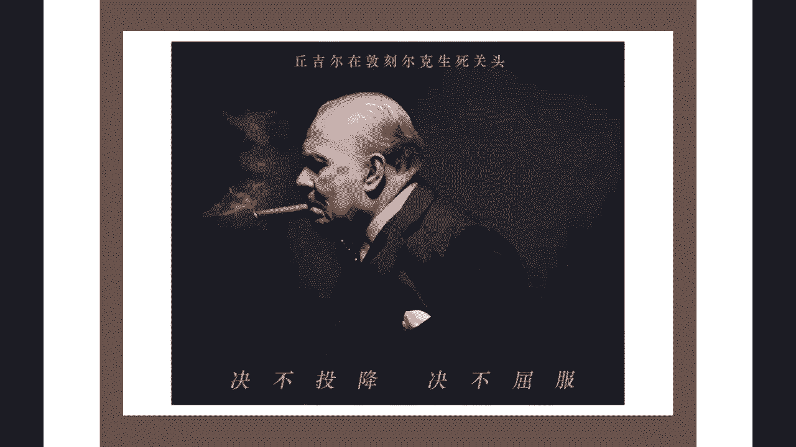
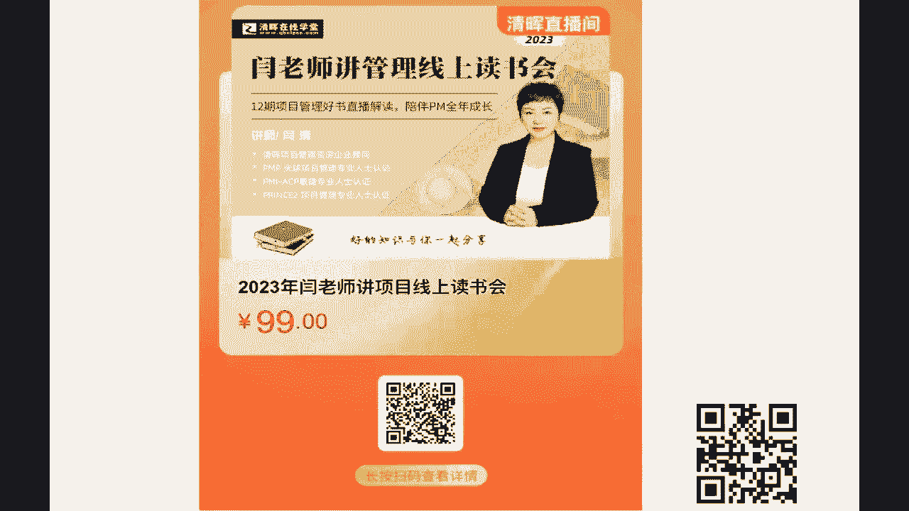
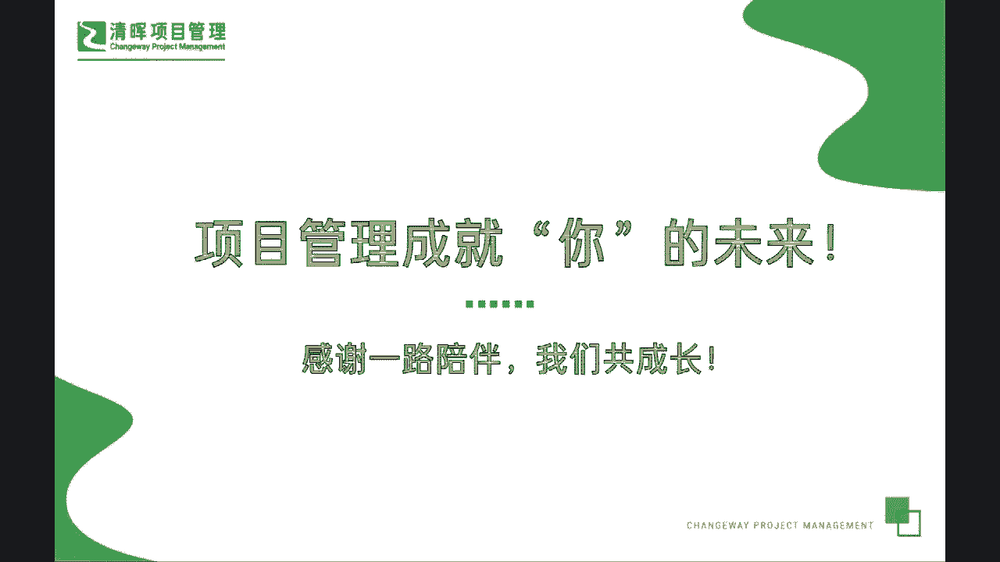

# 成为项目经理应该具备的首要能力 - P4：4.DISC起源与意义 - 清晖Amy - BV1kx4y1471R

不同的是吧，那么在这种情况之下，我们怎么样更好的再去管理大家呢，在这里呢我想跟大家来重温一个工具啊，我不知道大家在职场当中有没有自己去测过，这个东西，叫DISC这个工具测过吗，我们的职业性格测过没有。

如果没有测过的话，我强烈推荐大家可以去找一些免费的版本啊，这个网上都有啊，自己去测测啊，你是属于哪一种类型啊，我们今天讲了，你想要成功是吧，你想要升级，你想要晋级，我们讲知己知彼啊，同志们知己为先呐。

知彼为后啊，你先把你自己个儿研究研究是吧，啊你是属于什么类型的是吧，你自己就是一个非常重要的干系人，你作为PM是吧，你要先知道自己的一些这种能力的一个啊，Potential，一些呃潜能以及一些边界。

一些需要改进的地方，那么DISC就是这样的一种工具，能帮助我们了解自己，也帮助我们了解团队，你就搜这个DSC啊，同志们啊，那我们可以看一下啊，了解到这个DISC它的首字母的缩写啊，其实就是四种类型。

叫做支支配型，影响型，稳健型和服从型是吧，那所以在这个里面我们可以看到啊，甚至有一些这个这个呃性格测试里面，大家如果有接触过的话，还有用这个动物来形容，我不知道对各位有没有什么了解。

比如说有这个老虎型的，它就属于支配型的是吧，还有什么啊，猫头鹰型的稳健型的是吧，还有什么影响型的，就是属于孔雀型的，还有什么服从型的，就属于考拉型的，是不是啊啊就属于不痛不带动弹。

比较属于这种希望可以遵循一些己有的过程的，是不是啊，所以可能这四种类型大家去测一测，测一测之后，你就多少会知道你和你的团队，你的干系人，因为我们很多的一些呃大型公司啊，其实都是有这样的hr的工具。

我们hr也非常专业啊，也会给每位员工去进行这样一个能力检测，来看到大家到底是属于哪一种类型对吧，那你的类型也就决定了，我们可能在后期再分析和制定一些策略的时候，我们应该怎么去做对吧。

所以我们了解了这四种类型，我们接着往下看啊，如果你在通常一种情况之下，我跟大家举个例子啊，很多同学会说哎非常好的问题啊，手机尾号3376是我的嘴替啊，你已经问出来了，说这个什么类型比较适合做项目管理。

做领导，那么这里问题就来了，很多同学说我测出来的，测出来我又能看到什么，什么样的一些指导意义呢，那大多数人今天我们就比如说啊，今天同样一桌人出去吃饭，不同类型的人会有什么样不同的一些。

behavior呢，一些行为呢，如果是一个支配型的人，他会怎么做，今天大家一起坐一个圆桌吃饭，支配型的人会怎么做，就是属于老虎性格的人，他可能拿起菜单，就说上次我已经发现了这家只有这些好吃。

我们今天就点这些，就不给大家这个机会去选了，是不是啊，啊，这是典型的智慧支配型的，这种指挥者的一种类型是吧，这老虎型你去观察一下啊，你下次在你们团队聚餐的时候，你先不要去先不要去发言。

你先观察一下你们整个团队的一些行为，你就能基本大差不差，能分辨出来大家属于哪种类型了是吧，你看那种直接拿起来说，就选这几个肯定好吃，那它肯定是什么支配型的是吧，那么还有什么影响型的是什么。

就那种孔雀型的是什么，比如说啊，突然你发现这个桌子上站起来一个人说哎呦，他说哎呦，小杨，我还记得你上次特别喜欢吃这个吃这个菜，所以这次呢你看这家我选了这家，就是因为这家也有这个菜特别出名。

然后唉哟那个peter你上次也跟我说了，就是这家馆子特别好，所以我也特别留意了，这家的确评分很高啊，你真有眼光，他在干什么，这个人这个人在干什么，他为什么叫孔雀型啊。

他就是在什么不断的开屏要去向别人示好是吧，来展示自己的一些这种能力是吧，他特别适合social，他很这种社交高手嘛是吧，他要显示出来，我其实照顾到每个人的感受了是吧，你去观察一下，通常这样招呼人的啊。

一般都是孔雀型的，那么再来是什么，非常非常明确的一点，就是有拿着这个菜单不断的研究，说你看这个菜啊，这个菜诶他是季节的时蔬，但这个价格有点贵了，我们这次的整个的这个8G团队聚餐的，8G不能超啊。

我们再来看看有没有其他合适的菜，然后他在一个一个挑这种就属于什么类型啊，猫头鹰型的典型的稳健型的抠数据，抠细节非常在行，你就观察啊，基本上就是这样子的，那么还有一些一些人永远是坐在那儿，不太去讲话的啊。

怎么样都行啊，你们点什么都行，你们说什么都行，这是属于什么考拉型的是吧啊，就是比较比较呃不愿意突出自己的，那么我们在这个过程当中，通过不同的这种行为方式，我们也可以去引导一些这样的一个存在。

也就是说比如说我们知道了他是一个tiger，他是一个老虎型的，那我们就可能会影响一下，说既然今天我们是团队聚餐是吧，那我们可以让大家自己来选啊，我们不要直接去点了。

大家自己每个人选一道自己喜欢吃的菜是吧，那这其实也是一种引导，那么对于这个事我们就这样来来讲啊，如果你是在这样一个团队里面，你觉得哪一种类型的人最适合当领导啊。

如果是我们一个团队的team building的聚餐的话，去回应刚才那个同学哪一个人适合当领导啊，哪一个人适合当领导，其实你从从面上来看，应该是孔雀型的是吧，大感觉上照顾了很多人。

但是你会发现孔雀型有最大的一个特点是什么，他只是在显示我照顾你们了，他有没有做决定啊，他有没有做决定啊，可能是没有的对吧，它只是在显示出来，我已经考虑到大家所有。

所以这个时候我们就需要teamwork要配合是吧，也就是说这是会出现我们最经常的一个场景，就是孔雀型的在照顾大家，然后这个猫头鹰型的在研究菜单，最终tiger型的老虎型的排版是吧。

这就是一个非常好的很顺畅的一个团队合作啊，是不是啊，所以可能在这种类型当中，大家也要去了解到你对人的研究，其实也是这样子，它并不一定哪一种一定是非常好或非常不好，这只是不同而已，但我们通常来讲。

在更多的场景之下，我们的一些这种呃leader，他其实是需要有更多的这种呃动漫，动漫是什么，就是控制欲望的，因为我们在很多的这种企业，它其实这个boss啊，老板要承担更大的压力。

所以他要更为主动一点是吧，所以可能相对而言在boss的这种type里面，它更多的是支配性和影响影响型是吧，但是不代表这两种形就是最好的，这个能理解吗啊，所以可能这个这个当中，我们能够去了解到这个部分。

那么我们来看看啊，这里面还有一个四个呃，这个P打头的这个popular power peace和perfect，这个为什么给大家稍微去这个这个啊，介绍一下这个概念呢，你其实大概一看就清楚了。

其实通常来讲我们讲影响型，它无非就是来秀魅力，孔雀开屏很受欢迎是吧，好交际是吧呵，让别人觉得他非常非常照顾到大家，那么它适合干什么呢，干pr是吧，干P2，那其实我们每一种类型的人。

其实都是有自己的一些非常好的一，些定位的对吧，那么power型的人，支配型的人，他就喜欢去尝试创新，这也是为什么boss里面很多这种类型，因为他们要去主导一些以往没有的事情，要去创业。

要去做一些原来没有的一些东西对吧，那么稳稳固型的，他们可能会更加在意一些细节来去稳扎稳打，如果今天你去逼一个猫头鹰类型的人，去做一些创新，他可能会非常难受甚至抗拒，甚至可能会呃跟你产生一些矛盾冲突。

因为它一定要基于所有的数据，所有的一些呃这个流程都是分析过，没有万无一失的时候，他才肯往下走是吧，所以可能在这个当中，我们很多技术型的人就属于猫头鹰，猫猫头鹰似的啊，没有数据不行的，你这个没有说服力。

光凭你一张嘴是不是啊哈，所以可能我们在跟猫头鹰的这种人，打交道的时候，我们也要掌握一定的技巧，那么可能这种呃服从型的就是考拉型的，我们最大的一个特点是什么，考拉型最大一个特点，他怎么样都好。

他不愿意与人产生冲突，他也不愿意站在风口浪尖，那你怎么去让他感到满意呢，你千万不要让他感觉不舒服是吧，那你就要把所有的一些东西呢，可能相对合理的，按照流程的标准化的来去传递给他，他会更加有满意度。

是不是啊，同志们，如果你分门别类，想要去拿到不同类型人的一个satisfaction的话，一些满意度的话，你就必须得了解他们的一些这种行为特征是吧，所以你会看到DSC它的个性特征的一个解析。

下面就可以看到，不管是力量型，活泼型和平型，完美型，它其实都会产生自己的一些这种喜好，所以我们分门别类逐个去击破就好了，尤其是我们在了解我们自己的时候，其实也特别好啊，我们可以看到很多的一些。

这个这个我们的这个小伙伴啊，你会发现其实这个内向和外向，其实没有什么特别的一个说好与坏，那么你可以看到啊，我们的猫头鹰型，他其实是一个典型的内向者，那我们很多时候，你如果你去把一个猫头鹰的人推上去。

你觉得他非常严谨，然后非常会善于去分析，然后你把它推到一个一个presentation的角色，他又会感觉到非常不舒服是吧，所以可能在这个点上来讲的话，我们还是要去细部的了解到我们所有的这个啊。

整体的一个过程啊，这里面有一个点啊，LIZZ同学，我们这个内向不代表不说话啊，这个内向其实是他有他自己的一个世界啊是吧，但是他可能不是特别遇到很多事情，他愿意第一步先去求诸于Y啊，这个不是说他不讲话。

他也讲话的啊，只是说你看外向型的人，他是怎么释释放压力的，我们就举个不太恰当的例子啊，今天可能女生跟男生最大差别是吗，女生要遇到不开心的时候，你要干什么，你找你的好姐妹要去要去干什么，倾诉是吧。

我们就一定要讲讲讲，讲出来之后可能这个东西就慢慢就化解了，但是男性就不太不太愿意把所有的东西，全部要什么讲出来是吧，所以这其实是一种性格上的不同而已，并不代表他不讲话啊。

所以可能在这个当中就是哎非常好啊，RYAN同学说的万事求诸己是吧，也就是说他首先想到的是我自己来去慢慢消化，来解决，还是外向型的人，一开始遇到问题，我要先想怎么样去找团队来聊一聊是吧。

其实可能这种outgoing和这种内向，他其实会有一些思维方法上的不同啊，所以可能在这里面我们举个例子啊，大家特别熟悉的就是我们的这个啥呀，西游记是吧，大家来看看，刚才讲了这个DISC这四四个兄弟啊。

那大家觉得如果没有读过小说的，你觉得哪一个是适合当领导的，我相信可能从一开始来选的话，大家一定不会去选那个什么唐僧吧，是不是啊，大家来猜猜DISC把这四个人分分分分堆，让他们属于分别属于哪种类型的啊。

属于哪种类型的，你觉得今天如果西天取经这个这个leader，你让孙悟空当了会怎么样，同志们，孙悟空当了怎么样，为什么宋这个唐僧是一个我们队长，看起来最窝囊的，什么都不会是吧，然后需要这么多人保护。

但是他又是一个leader，为什么为什么大家可以看到，我不知道这个各位有读过这个西游记吗，啊当然有不同的解读啊，但是我强烈推荐大家，现在太多的一些西游记的外传啊，拍的电视剧啊。

还有一些甚至可能一些动画片是吧啊，我我真的希望大家还是回去看看，那个西游记那本书啊，那本书的话它章回体其实也并不是特别厚，你可以看一下，它在里面其实非常非常提到了一点啊，就是这个唐僧是什么。

唐僧他是一个在网络关关系当中诶，有资方背景是吧，他其实他的前世是谁啊，金蝉子是不是啊啊，可以看到它是有背景的是吧啊，所以可能在这个里面我们来看一看啊，我们来看一看到底他是怎么样的一个分配啊。

我们如果把这个四大类啊，肯定毋庸置疑，孙悟空就是干什么啊，直来直往，不跟你废话是吧，先先这个捉妖再说是吧，然后我们的这个这个二师兄呢，这个一遇到困难就想着要分行李是吧，这个可有可无。

基本上也不太看得到他，偶尔可能英勇英勇一次啊，也是被这个大师兄给逼的，是不是啊啊，那么我们还有这个这个我们的这个这个沙僧啊，永远就是说哎只要大师兄二师兄同意，我就这么做对吧。

那么我们的真正的这个根基在哪呢，还是在这个control是在哪呢，是在这个我们的唐僧这边住心谷是吧，所以大家可以看到这是一个非常有趣的，非常有趣的一个这个这个例子，我相信可能大家自己来来去理解一下啊。

也就是说我们很多的同学会来去咨询，说怀才不遇啊，说我这样为什么老板永远不生我啊，或者都生别人，你自己想想看啊，如果今天你是一个什么样的定位，什么样的角色，其实你的boss。

你的管理层也会去对大家有一些分析，也就是说它永远晋升的，都是有利于未来组织发展的这样的一个布局的，也就是说你是否符合这样的定位和布局，也很关键，所以你自己本身也要对自己有一个，这个正确的认知。

是不是啊啊，所以可能在这个过程当中，我们有几种啊，如果你怎么样去鉴别这种类型的话，你其实可以通过一些提问，你比如说啊通过这样的一个呃类型的鉴别，是谁啊，什么怎么样，为什么你会看看到不同类型的人。

他有不同的回答方式，你其实这个是需要有一些经验当中的，一些反思的啊，你看啊他有些人就喜欢就说哎呀，你不要跟我讲这么多，现在如果是这样子来做的话，我们就立即来做，那他就属于这种非常的这种结果导向。

就一定要去赶快抖慢的是吧，那我们还有就是啊，这种注重这种呃这个这个细节的，那么他就需要去哎咱们一起把这件事要做做好，做做细是吧，所以他每个人的这种回应方式是不一样的。

所以为什么给大家稍微讲一讲这个DISC呢，就是它非常有趣的一点，它不仅能够给你提供一些，你自己个人的一些检测，那更加给你提供了一些方向和可能性的，一些工具是吧，所以可能在这个过程当中呢，我们可以看到。

在这个在这个整个的一些分配当中，大家也可以拿这个当做一个工具来指导你自己，怎么样去区分不同的干系人是吧，他他的一些喜好和他的一些position，这样更好地满足他的一些需求和引导他。

那么我们看到怎么识别这个性格呢，你会看到有很多性格标签贴在这里，我在这里呢想要强调一点给大家啊，就像星座一样，同志们所有的都是一个概率事件啊，大概率事件什么意思啊，就是这个不是绝对的。

它是大多数是这样的，所以你你也不要去这个特别这个梗的啊，特别较真的说，哎我就不是这样啊，或者是有哪些人不是这样啊，我们大概率，因为我们讲大家往往一开始，我们讲一个非常好的一首词。

叫什么少年不识愁滋味是吧，爱上层楼，爱上层楼，这个人因时而今识尽愁滋味，欲说还休，欲说还休是吧，啥意思，就是当你自己对自己的这个意识说啊，我我就是很特殊的，我就不是属于这个类型的，当你开始说这句话。

说明你还年轻是吧，等到你稍微这个有一些沉淀和经验的，你发现其实我们人都是差不多的，人都是差不多的，就是你的包含你的这个人体成分是吧，智商我们就讲再聪明的人，他的智商也没有说高到那个程度。

但真正产生差异的是什么，有环境影响是吧，有教育的影响是吧，等等一些外界的一些加持是吧，其实会产生很大的后天影响，所以可能在这个里面的话，我们就要去了解到我们去识别性格。

他也是有这种大概率的一个这个正确度的，所以我们要去给自己，给团队，给干线人做一个正确的诊断是吧，那我们还要知道怎么样去与他人交往是吧，那我们根根据不同类型人的一些特点。

我们怎么样去跟这样的类型的人去进行，communication进行沟通，那能够很好的有效率的去引导别人呢，你就要知道你比如说你跟这个不同，你跟那个CC类型的，就猫头鹰型的，跟这种比较较真的人。

然后你一定要干什么，回答人家的问题，而且要解释细致是吧，人家问你数据，你不要跟人家扯说，哎我虽然没有数据，但是我非常确信这一定是个规律，你如果这样讲的话，猫头鹰的人会立即对你的什么信服力大打折扣。

是吧啊，所以可能在这个点上，大家一定要非常非常清楚啊，不同的人的类型有不同的交往的一些建议，所以大家也可以呃自己多多去涉猎和研究一下，你会发现你永远搞不定一些人的时候。

或者说你在跟某一类型的人沟通有困难的时候，其实往往可能是存在有这样的一个什么差异的，是吧，有一个差异的，所以可能在这个当中我们想要去呃，跟大家去了解一些这样的一个，非常非常明确的一个这个方式方法啊。

那么我们还有不同类型的人，怎么样去跟他人交往，这里我就不去展开了，时间有限啊，那么大家感兴趣的一定要多多去研究一下，自己测一下，也研究一下这个DSC的工具，当然它不是唯一的一个工具，还有很多工具。

但是这个工具呢它是比较有代表性的，那么在这个工具当中我们要去注意什么东西呢，第一点啊，你一定要去不要踩雷是吧，同志们，什么意思啊，不要踩雷，不要踩雷的意思就是你千万不能去搞清楚。

这个所有的这个这个我们呃整个的事项啊，你你去呃触到他的一些这种红线是吧，你看不同类型的人，他的红线是不一样的，也就是说如果你仅仅站在你自己的立场上，比如说你是个I型的人，你去跟一个C型的人。

你不断的这个这个这搞搞这搞这种，就是你们两个可能会互相这个针尖对麦芒的，因为你互互相之间探你的热情，在他眼里可能就是一个就是一个不严谨的，知道吧，所以有时候你你你不需要去卖笑啊。

我们家长们不需要去特别陪笑，或者是跟他讲很多话，这这些不是说你说的多就一定是好的，所以你要了解他是什么样类型，所以你要采取不同的措施，这样才能拿下它是吧，这也是我们两讲的，为什么要去了解啊。

了解这个东西，所以do not你要花点精力在这个上面，do not不要去踩雷，不要去踩雷啊，好那么我们来看看啊，如何有效的去管理这个干系人呢，那么问题就来了，如何有效的去管理干系人，那我们通常来讲。

我们要对上级的发起人要有意识，对周围的伙伴要有意识，对下级领导要有意识，对自己的公民意识也要有意识，这是如客户般管理干系人当中的四艘船啊，这个四艘船到底是啥呢，我们来快速勾思入一下，快速看一下。

如客户般管理干系，他最终这个总结的四艘船其实是非常经典的，就是发起人意识，你永远记住上级对于项目是至关重要的，项目经理必须要清醒地认识到，获取这种高级管理层知识是多么多么的重要。

甚至你可能要去跟这些发起人建立，personal的一个很好的relationship，这是为什么你个人的这种很好的一些，关系的建立，对你项目成功有很大的影响，这也是我从开篇就跟大家讲啊，我非常认同。

就是他为什么认为项目经理是一个具有高度，这种锻炼综合价值的这么一个岗位，他可以上触达到战略，下触达到执行是吧，其实就是因为即便项目经理，你只是一个pm的title，只是一个PM的这种岗位，管理层。

你会知道更多的一些战略的决策和战略的原因，和你项目的来源等等这些重要的一些商业信息，所以你可见而知，pm如果你有了这种发起人意识，你其实能认识很多大咖的朋友是吧，那么还有伙伴意识。

伙伴意识就是你的合作联系，协作联盟，同盟等等这个维度，它一定是需要，就是我讲的那个建立什么统一战线联盟是吧，建立统一战线联盟，我们必须要维护和支持我们自己的联盟啊。

所以在这个当中我们是不允许有任何人掉队的，不允许有人不知道，不允许有人还中立是吧，我们就一定要干什么来让大家接触到，知道了，参与了，并且大家是手拉手团结在一起，奔向一个目标，上了同一艘这个项目的船。

我们就要必须全部人要向同一个方向，同一个目标去滑行，而不允许有什么具有二心是吧，不容有二心啊，因为这样子才是更加有高效的一个伙伴的意识，那么还有我们的领导意识是吧，领导意识是什么意思啊。

在这里面我们提到了一个领导力专家，詹姆斯库泽斯和巴里波斯纳，的一个信任六原则啊，他从发现自我对团队成员敏感，确认共享价值开发能力，为目标服务满怀希望，所以到现在这个我们要去拿出一种，极具感召力的方式。

提出你的vision愿景，把这个愿景实现，那么可能在这个当中，你就需要去团结你所有的干系人，让大家也活在啊，也活在这个美丽的美好的愿景当中啊，也让大家开心的在项目当中工作。

并且认为他们deliver和交付的这个项目的价值，也是大家共同想要去达成的，所以也就是说我们需要不断的去锤炼自己的，这个也就是我们讲的影响力，领导力其实无非就是信任力嘛，刚才已经跟大家讲过了。

你想办法让别人更加的信任我们，也就是说我们你想达成这个生活目标啊，就是人生的项目目标其实也一样，刚才已经跟大家讲了，我们的人生就是一个项目，我们的人生管理就是一个人生项目管理。

所以你不要再去抱怨说你看别人多成功，我为什么现在还是这样这样，那是因为你自己欠缺对自己的规划呀，啊我就直接点抛到你的痛点啊，所以你想要成功，你就必须想要把它规划进来，把它一步一步地监控执行收尾。

实现阶段性的小目标，你最终才能实现你的最终人生的一个大目标，所以在这里呢，你的人生项目管理也是一模一样的道理，所以大家不要再去讲说，大环境影响有多么恶劣了啊，再影响恶劣。

在任何的环境之下都有成功的和不成功的是吧，我们承认事实啊，所以可能基于这个事实，我们对自己也要做好这样的一个人生，项目管理规划，那么同样我们这本书也提到了公民意识，公民意识是我们中国人不太去讲的。

一个一个这个这个术语啊，但他讲的是什么意思呢，它其实并不是一个非常难理解的一个一个术语，它是指很多事情啊，它并不是一次性生意是吧，他还要长期，我们用一个词来形容就可持续嘛对吧，你要可持续的成功。

你不是为了一年去晋升一个岗位，你就已经最成功了，你是希望可以以后不论在什么样的情况之下，都可以去呃胜任，都可以去成功对吧，我们叫可持续的成功是吧，所以我们的公民关系概括为这种基本的良知。

其实我们从一开篇，大家刚开始非常非常好的一个讨论，就是我们的公民的这个呃诚信，我们的一个知行合一对吧，我们的一个道德本质，也就是说我们不去忽悠别人啊，我们不忽悠了PM不是在忽悠啊。

你是切实去了解到了我们项目的一些价值点，我们的一些这种基本意识，那么我们就是要做到，我们怎么样能够真正带领大家，你也非常明确，我的确是在帮助大家来，最终达成我们项目的最大化的一个价值。

那么实际上我们就是在执行一个什么，非常正确的一个善事是吧，我们一定要秉承这样的一个道德底线啊，我们也不是这个销售，把这个不好的东西卖给别人是吧，这是不可持续的啊，所以可能在这个里面。

这也是我们在如客户般管理干系人里面提到的，公民意识的核心，就是我们还是要知行合一，诚信守则是吧，那我们可能在这样的一个过程当中，我们怎么样能解决掉这些困惑呢，其实就是要沉下心来认识到自己的gap距离。

那我们就要好好的去学习，去读这样的书，来去做好这样的沟通，来去分好这样的一些类别，来去做好这样的一个我们技能的升级是吧，所以我们很多情况之下，我们更多的是应该向自己提出一些更高的要求。

比如说我们是不是能成为一个更加综合全面，更加掌握多种多元技能的PM呢，如果你可以提升到自己，那么还是一样一句话，像镜子一样与你合作的人，也势必能感受到你的这种能量，他也会更加的什么，相信你的影响力。

信任你，只要有了这种信任，你可能在处理整个项目过程当中的，一些事项的时候，你会发现可能会更加的有效率是吧，那么我们在今天分享的最后呢，也给大家送几句话啊，这句话呢不完全是某位大师说的啊。

也是严老师给大家总结的啊，所以这个呃什么意思呢，话糙理不糙啊，大家可以作为一个简单的借鉴，如果你领导的好，即使在恶劣的环境中，你的团队啊，他们也可能富有创造力和工作热情。

如果你知道怎么样去引导激励和关心他们，你的团队就可以创造奇迹，简要的总结就是我们讲人之所欲施之于人啊，这个其实是反着说一句话也知道叫什么，己所不欲勿施于人是吧，你自己都觉得天天被人逼着，天天被人追着。

天天有人挑战，你这里做的不好，那里做的不好，你都觉得天天负能量，那你就不要把这种方式，方法用到你的团队里面去对吧，我们通常来讲，我们有更好的工具和更好的方法论来指导我们，做好干信任的管理。

做好团队的一些交付，所以在这里呢我们要需要了解到我们自己本质，真正应该做的都是求诸于己来，去不断地提升自己的能力是吧，不断提升自己能力，那么在最后呢也去分享一张，其实严老师在读书会的时候。

有分享过的一张图片啊，也是想给大家做一个鸡汤啊，这个当然这个鸡汤可能是有点大的历史事件。

那它是一个真实的事件是什么，其实在啊敦刻尔克这个生死关头啊，就是这个丘吉尔，他其实更大的一个压力，面对议会的一个分崩离析，面对着民众的一些，刚开始的所有的反对跟不支持，但他提出的就是什么，绝对不投降。

绝对不屈服，他是站在什么样的一个利益点上呢，其实项目经理也是要有这样的一个大局观，什么意思，他是站在民族的角度啊，不可以去屈服，不可以投降，不可以去什么妥协是吧，所以可能在大环境。

大家没有意识到这样的一些大局的时候，我们的PM依旧能够坚定地去坚挺，在我们项目价值的核心去坚持到底把困难克服，交付了这样的一个项目的时候，其实大家对他的这个支持，对这个影响力。

对这个leadership的认可，也可以说应该是没有办法去取代的啊，这也是我们项目经理非常非常重要的一个，一个功能，我也希望大家把这个项目经理的成功与否，不要简简单单界定在一两个项目的成功交付。

这个太局限了，因为大家看到更多的项目经理，我们讲可持续的项目经理，你的可持续成功，一定是今天不管委派给你什么样的一些任务，你都能够拥有这样的一套技能，完整的一套技能来去做过呃，做好这样的交付。

并且让大家都非常非常的信服啊，所以也把这个送给大家当做一个激励，我们还没有难到这样的程度啊，无非就是被呃客户投诉几句嘛，对不对啊，所以可能在这个里面，我们一定要非常非常乐观的和坚定的来看到。

我们自己应该更好的来去求诸于己，来去提升自己啊，那么啊我们在最后呢也去啊，刚才有同学在问啊，那我也放上来，就是我们的读书会啊，这个感兴趣的同学可以去加入，因为我们这个读书会是一年12期。

每个月才读一本书啊，其实我们节奏拉的还是比较慢的。

为什么，因为我们太了解大家了啊，今天我们不是来比拼一年读谁读的书，最多，读的多，囫囵吞枣也没什么用啊，我们一个月暂且就一个月去好好的读一本书，我们去吸取一些精华，能够对大家其中某几个点有用。

某几个点有启发，这已经是非常非常好的一个收获了，那为我们通常来讲，我们是希望可以触类旁通的啊，我们不是在记知识，我们是在学思维，把我们整个的方法，把我们整个的底层思路作为一个升级和迭代啊。

那么呃我们有C同学问组员，有很多抵触highlight怎么办啊，highlight为什么要high light啊，同志们，你在什么情况下，highli highlight通常来讲是要跟老板说。

我有什么事情解决不了啦，然后这个highlight就是我来告状了，是不是啊，但是通常这种情况为什么又有那么多抵触，要我我也抵触啊，你为什么要还赖我啊，你一定是没有任何办法才去讲这个事情吗。

他就变成一个bottle neck了是吧，但实际上真的是没有办法解决了吗，所以我们的highlight要谨慎啊，C同学highlight一定要谨慎，你一定要今天我们所有借鉴过的东西。

你去啊讨论过之后来去想过之后来想想看，我们是不是还有其他更好的一些办法来解决掉，我们和团队之间的一些问题啊，不要去嗨line，甚有慎用这个工具啊，好那我们今天的整个分享也接近尾声了。

我们还有很多同学还在踊跃的在啊讨论啊，也非常感谢大家的一个参与，那么刚才我也在最后呢也在啊，提出来，就是要有一本书已经送出去给一位朋友了，是吧啊，就刚才回答出来那个信赖力的那位朋友。

那个我们在线的小仙童帮忙去要一下地址，那么另外一本书呢我们也啊送给我们的呃，这位同学叫什么，我看他一直在非常积极的在回答这个问题啊，呃这位同学我稍微翻一下啊，好好啊，OK啊是这位叫RYAN同学。

是不是RYAN恩同学就是刚开始要睡着的，这位同学是吧啊，也送给你啊，这个也非常好，其实你呃我相信你一直在讨论，说明没有睡着是吧啊，哈还是对你应该有一些帮助啊，所以可能在这个当中。

我希望大家呃能够更多的通过这种比较轻松，愉悦的方式来去吸收到对自己有用的东西，也感谢大家的一路的支持，严老师也会秉承我的原则，持续给大家输出更多更好的一些内容，呃，也希望项目管理的思维成就你我的未来。

感谢大家一路的陪伴，我们一起持续共成长。

