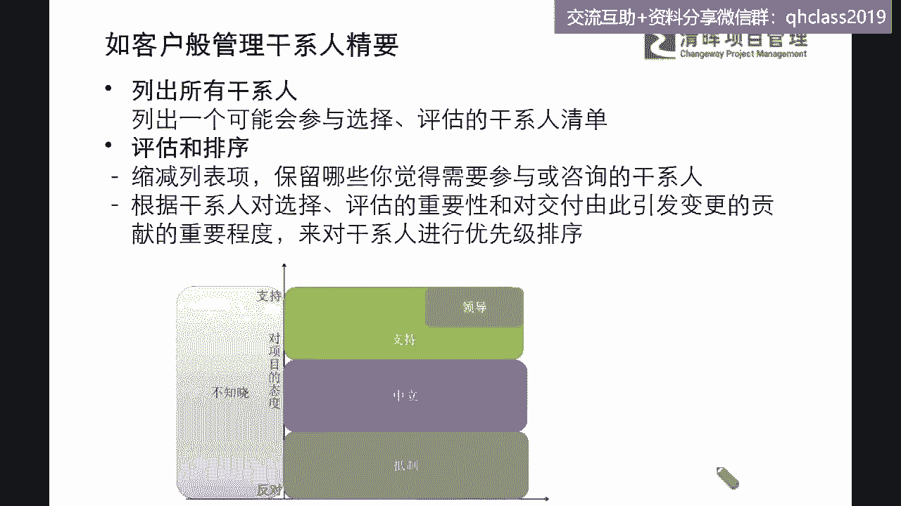
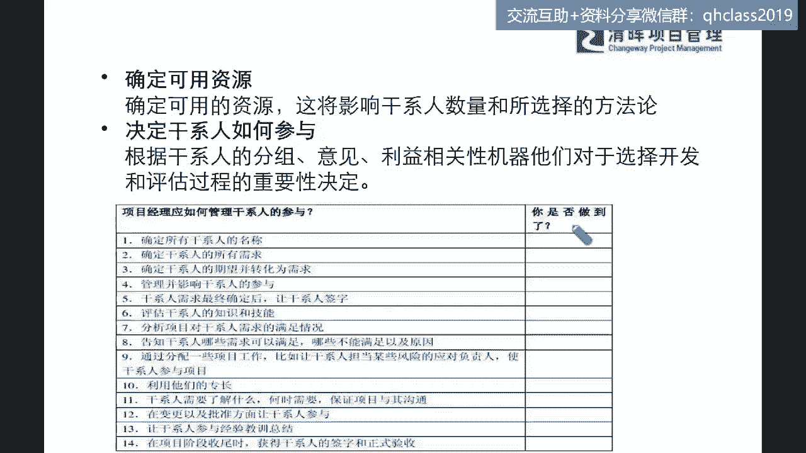
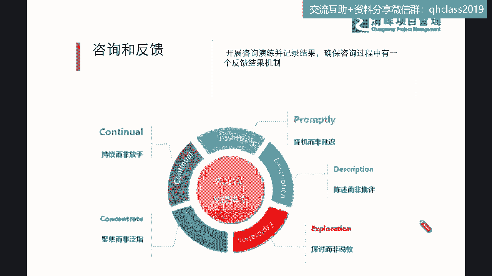
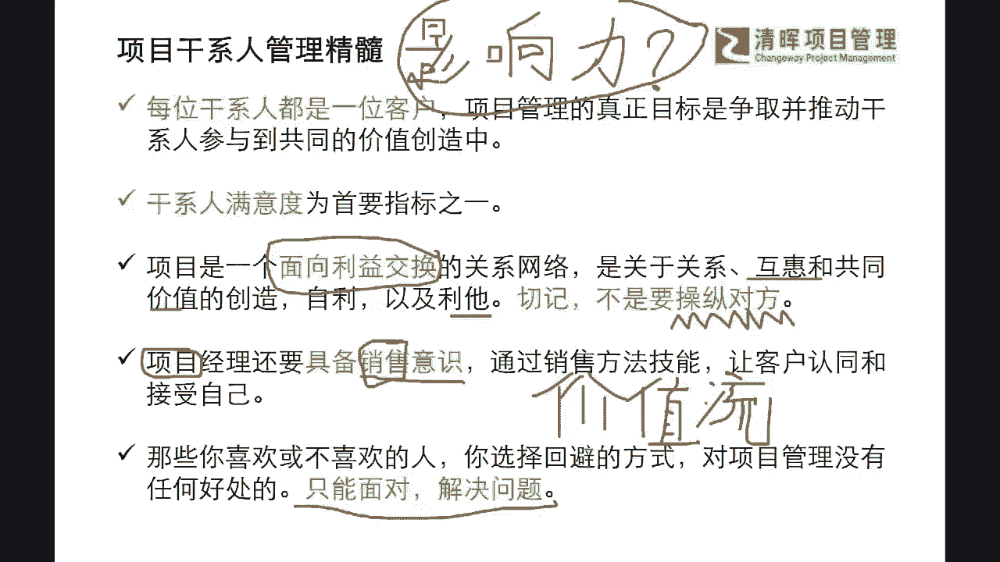
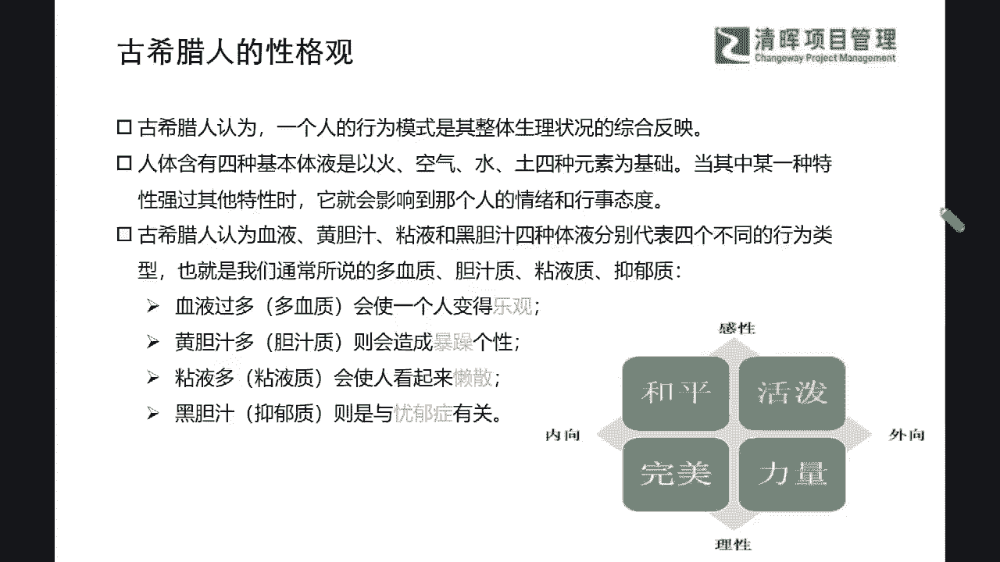

# 成为项目经理应该具备的首要能力 - P2：2.如客户般管理干系人精要 - 清晖Amy - BV1kx4y1471R

心理学啊，你还怎么管项目是吧啊不懂心理学怎么管项目，是严老师读书会专栏的一本书啊，感兴趣回去翻一翻啊，好那么我们来看看啊，那既然讲到这本如客户般管理干系人是吧，那么可能在这个如客户般管理干系人的精要。

那么在这里面他其实提到了几个点啊，第一个列出所有干系人是吧，列出所有干系人，那在这这里面你就有一个问题了，我怎么知道所有啊，所有这个包含什么样的范围，那么其实在这个里面，就需要刚才我讲的三个层次。

那这三个层次里面东西都需要去要touch到是吧，所以可能在这个里面，大家一定要非常非常关键的啊，就是来去通过这三个层次来去做分析，那么我们见得非常熟悉的，这个叫这个五种态度是吧。

不知道反对支持中立抵制是吧，这个是我们在PMP就学过的是吧，那么我们通过这样的一个这个评估和排序啊，同志们评估和排序，我们再去把我们这些干系人分堆儿，分堆之后还要再去进行优先级的排序。

这个就非常非常关键了，是不是啊啊有同学说这个组织结构是组织架构，是不是就可以列出所有主要干系人啦，啊这是一个非常好用的一个工具啊，如果这位同学雨涛同学，你应该是已经考过PMP的，对吗啊。

PMP在这个组织架构，它其实是属于什么哪一个章节里面的东西啊，啊应该学过的都有概念啊，在第九章项目的资源管理那里啊，也就是说这个组织架构架构凹叉，其实是项目重要资源的一部分是吧。

所以可能那个这个部分的话，我们就需要请大家啊要搞清楚，我们以前可能是没有这种理论依据，今天是我们已经多少学了一点点，我们就要清楚是吧啊，所以啊还要准备5月份考啊，那好啊，那你现在提前先入为主了。

你要知道all差其实是项目资这个资源管理，其中一个重要的一个信息，知道吗，所以可能这个里面，其实就是我们其中可以利用的一个项目资源，所以你用这个组织架构去进行这种优先级的评，估和排序是非常非常正确的啊。

非常正确的，还有同学说考过了，但是忘记了，这就典型的我们中国式的学习是吧，为了应付考试啊哈对，但这个也当时在考证的时候也没有什么错啊，但是我希望我还是非常非常真诚的，希望咱们每一位同学。

不仅仅是为了拿那一张纸啊，因为这张纸背后你到底能够做多少项目，多少成功的项目，你能够呃处理多么复杂的项目，其实真正的能力还是长在你自己的身上的是吧，你拿那张纸也忽悠不了人了，对吧啊，我们也实际务实一点。

切切实实拿到证之后，赶快去提升自己的这种实际能力是吧，就像我举一个不恰当的例子啊，很多同学以为考完PMP的这个证，就跟你的这个实际能力就对接了，那我举一个例子啊，今天啊闫老师把一个这个做的非常有营养。

非常好吃的一个大餐啊，里面都是干货啊，比如说我们像我们今天这样，一个两小时的一个分享都是干货，我一勺一勺喂到你的嘴里去了是吧，一勺一勺喂到你的嘴里去了，但是喂到你的嘴里之后。

这就代表这些营养全部变成你的营养了吗，显然是没有的，还缺了一个什么，缺了一个什么，我喂到你嘴里之后，你好歹还要干什么，嚼一嚼咽下去吧，同志们是吧，话糙理不糙啊，今天你学东西也是这样子的。

我即便一勺一勺喂到你嘴里去，你也觉得诶挺好吃的，但是你也要干什么，一勺一勺的往下咽呐是吧，所以可能在这个里面你一定要吸收非常好啊，三水同学啊，你一定要自己吸收啊，今天你不吸收，你可能我喂进去了。

你发现我喂越喂越多，你不往下咽的时候，你会吐出来的，是不是啊啊，所以可能在这个这个点上，我们要非常提醒大家，一定要做自我的一个吸收啊，那么我们还有同学说这个一张纸啊，也是个门槛是吧，是门槛啊。

这个就是我们的确有资质认证，肯定在跳槽时候是有用的，但是到了岗位上，我们可能就不仅仅说拿一张纸了，我们的确要做出成绩的，是不是啊，所以我们还是出发点也要是干什么，也要是比较明确的。

我们要务实地提升自己的能力，我相信这个是更更有利于个人成长的一个，出发点是吧，好，那么我们来看一下啊，如果这个你列出了所有干系人，去进行评估和排序。

那么你这个接下来要干什么，还要确定可可用的资源是吧，确定可用的资源，它将影响该系人数量和所选择的方法论，那么这个里面可用这两个字就很微妙啊，什么叫可用啊，大家认为的可用是什么意思啊。

第一个它时间是可以让你调动的，第二个是干什么，第二个是干什么，他的这种技能是匹配的，是不是啊，那甚至可能在某些层面上来讲，你这个可用资源也是需要干什么的，同志们争取的，是不是啊，啊，因为我们现在知道。

我们所有的一些这种好的资源都是稀缺的是吧，所以可能在这个点上，我们需要特别去提醒大家啊，我们啊这个要去理解这个资源的一些调配，利用这个方面的话，我们一定是需要这个更加宽泛的来理解，这个资源这个概念。

因为这个资源，不仅仅是指你的一些什么物质资源，他也是更指你的人资源，人资源里面还分你的什么样的一些岗位资源，和你的一些专业技能资源，是不是啊，所以可能在这个里面，大家可能要去啊。

了解到你方方面面的这些可用的资源，那这将确定你在分辨识别干系人的时候，你的干性人的数量和你的一些方法论，可能都会匹配得相对更加精准一点是吧啊，我们还有同学这个讨论非常积极啊，这个啊有这个这个嗯。

Miss children，同学还在纠结说有纸，但没啥帮助啊，老板都不知道我有这张纸是吧，哈哈啊，这个问题我相信啊，这个不是一个个体问题啊，非常好的一个问题，因为我们呃在很多线下的课程。

包含闫老师的一些这个学员，大家可能在反馈给严老师一些问题的时候，其实也有这样的一个困扰，就是发现我们考了什么什么证，考完之后呢，回到刚工作岗位上，用不用不用不起来啊，就是你不会用啊。

或者是觉得这个东西太理论了，跟我这个不衔接，我相信啊，可能我要讲句公道话啊，同志们，就是我们在讲的所有的理论价值，它已经被总结出来，并且全球推广，而且已经推广了50多年了，他一定是有他的一个高含金量的。

这个是毋庸置疑的是吧，但是我们再去想想看，你理论衔接实际过程当中发生了什么事情，如果大家现在啊这个早安机长同学，曹慧萍同学说，大家都是成年人，如果短期做不到，那自己的问题啊。

这个我我用一句话来总结这句话说的这个论点，话糙理不糙啊，其实是对的，也就是说什么今天就还是这个例子，今天大家把这个这个东西都喂到你嘴里了，你不去嚼，你不去咽，你不去吸收，那其实你不能去怪说这个东西不好。

是不是啊，那么从另外一个角度来讲，我们学了理论，理论到这个实践中间还有一段距离的，我们叫知行合一，是不是啊，同志们在知行合一上也上了不少课吧，也看了不少鸡汤吧是吧，这个看鸡汤也没什么用啊。

所以我在跟大家讲，这个知行合一要怎么做能够更好呢，大家记住闫老师的一句话，如果你已经学了一些东西，你发现你实践当中可能用不到其中之几，那么你就要想办法，就是有一种非常笨的这种学习方法。

但是又非常高效率的就是什么，大家以前在学英语的时候，今天我们可以说我们没有生活在国外的环境，我们周围也没有外国人是吧，那我学了英语，我口语不好就是理所应当吗，啊当然不是了啊。

你想办法给自己制造一些这种什么案例呀，比如说你自己每天可以去自己锻炼你的口语啊，其实项目的管理经验也是一样啊，你今天学了PMP，你在你现在做事的方法上，你如果没有什么大项目能去做的话。

那么你至少比如说流程的管理，你去draft一个这个起草一个sop，标准化的一个项目管理流程行不行，完全可以对，你能不能在整个团队的，即便你没有什么title，你也可以通过学习这个你的人际关系。

与团队技能里面的软技能来去团结大家，来去达成一定的目标行不行，完全可以，就在于你有没有刻意的练习，就这四个字刻意练习，同志们啊，就记住这四个句就行了，你一定要去用啊，你不要怪环境啊。

今天环境可能就是他需要的时候，他会考验你，不需要的时候，你也会觉得哎我怎么这个没有要求，我用我就没有压力了，但是你今天有了这个证啊，正对你来讲，他对你应该是有什么付出的价值的对吗，所以同志们用还是不用。

你自己要有这样的一个掌控权啊，好那我们来看到这个，还有很多同学说这个看公司这个呃有有证书，还有补贴，现在都没有了哈，这补贴可能是其中一部分，我们现在还有很多的一些这个证书，尤其是清灰很多的其他证书。

我看还是有国家的一些补贴的啊，但是大家是为了这个补贴吗，我相信可能一部分啊，但大多数都还是为了要去学一些这种，真金白银的东西，一定要拿到一个这样的资质是吧，那我们还有3D同学说收集可用资源。

就平时多去沟通与人关系好了是吧，来这个底层逻辑上也会用到啊，这个非常实际的一个点啊，那么还有宇涛同学说，与工作中收集干资料，干系人反馈慢，如何更好的调动好，这个问题问的有点大啊，雨涛同学啊。

你呀在工作当中收集资料，干系人反馈慢，我们会发现啊，反馈慢可以分成好几种类型，我至少给你先分出三种类型，第一种类型为什么慢，为什么反馈慢，第一个她不理解你在问什么对吧，他不知道你在要啥，他怎么回呢。

所以这是第一个反馈慢是吧，第二个是什么，他觉得你为什么来找我呀，这个事儿不应该我来反馈你呀对吧，事不关己嘛，反馈慢嘛是吧，第三种反馈慢是什么呢，他收到你的信息了，他也很想回复你，但是他能力有限呀。

传不起来呀对吧，所以他不能及时的给到你啊，那么到底是哪一种类型呢，宇涛同学听明白了吗，所以在这个其中，你其实只用一招就可以解决掉你现在这个问题，什么什么招数，刚才已经强调过了，不管哪一种类型。

不管是抗拒的还是搞不清楚的，还是这种他想做做不出来的，都需要干什么，多沟通呗对吧，你要多去了解它到底是什么样的状况，来去切实可能来去建立这种良性的链接，你可能依次这样子，下次就不会了，是吧啊。

就是就这道理其实很简单，话糙理不糙啊，大道至简的啊，所以我们来看这个，还有这个呃，早安机长说，我们这个现在物联网时代，不要怪自己公司必须用得上，我们加一个群都是智能团是吧，那要放开格局啊，啊这个对啊。

这个格局是肯定要打开的，但是我们在讲的这个哈这个点上来讲的话，那么我们来看啊，如果我们有了这些可用资源，你怎么决定该行人如何参与呢，在这里面你就要对它进行进一步的一些，分析了是吧。

所以可能我们看到的这个过程，我们其实我们所有的这个干系人参与啊，他们都有各种各样的原因对吧，我们在咨询的和反馈的时候，你会发现是吧，他也非常的不能一下子表明他的态度是吧。

有好多的看起来有好多的一些困难，甚至可能有些干系人他不是说他不不协助你，他还有一些难言之隐是吧，等等这种状况，那么在这种情况之下呢，我们到底应该怎么样更好的来去来，去团结他们呢。

这就考验我们项目经理的各项的一个，软硬技能了是吧，我们可以看到一个最基本的一个反馈模型是吧，我们看到一个反馈模型说，你这个嗯，通常啊我们很容易就陷入到一种说我，我要你什么信息，你赶紧的呀，你赶紧给我啊。

是不是啊，你要你要给我一个这个，这个非常有这个呃说服力的数据啊，你而且你要回答我的问题啊，你要要我的这个这个我要的东西你要充足，要这个充分的呀来去给到我呀对吧，那至于所有我们的需求的时候，你会发现。

其实我们在跟我们的干系人，进行这样的一个交流，沟通和反馈的时候，我们自己就像照镜子一样是吧，同志们，这个这个比喻是非常直接啊，我们就像照镜子一样，你到底是怎么样的一种状况啊。

你可能面临到的一个反应就是什么样，因为我们讲啊力的作用都是相互的是吧，力的作用都是相互的，大家记住啊，所有的这个大家可以看到这个很牛的，世界上很牛这个这个院士啊，物理学家啊，这学到之后都开始搞哲学了。

是不是啊，你有没有发现啊，其实这个你会发现啊，你很多的时候我们觉得一些难题，其实这个难题往往返回来之后，你才发现是你的不经意间的一些行为，来去制造了这样的一个难题，甚至可能解铃还须系铃人是吧。

如果你现在我们很多同学不能理解，严老师讲的这句话，没有关系啊，我们先慢慢的一步一步来沉淀积累，那你可能在某一天会突然发现，原来其实只要你换一个视角，换一个思路，换一种做法。

你的干系人就有完全不同的响应了是吧，完全不同的响应了，所以可能在这个当中我们可以看到啊，在如项目管管理干系人这本书里面。

和我们学过的干系人理论当中，他这个精髓啊，我揪了几个点啊，基本上都会陈述的几个精髓呢，就是首当其冲，每一位干系人都要把他当成一个客户一样，为什么我们讲客户是上帝，客户讲什么都是对的是吧。

没有这种错误的是吧，我们要去satisfy我们的客户，所以也就是说我们每一位干系人，他都是能够产生这种客户价值的对吧，所以可能这个3D同学又说，我觉得所谓的资源都是掌握在干系人手上。

都是与干系人的沟通关系呃，可以这么来理解啊，一部分非常好啊，非常好，所以在这个这个角度上，我们非常需要来get到每一位干系人，他都是有他的特殊的价值的，所以不要以老板还是你的评级。

还是你的下级来去界定他啊，这样的界定呢其实可能会误导你啊，你一定要把每一个人，即便是今天你的团队的下属，你也依然要非常respect，尊重他，因为我们每一个人都是我们的一个什么生产力，啊是吧。

都是我们团队最终会交付出来的，一个非常非常重要的一个资源呀，同志们理解吗啊，每一位人都是我们的客户，今天我们就返回到这个家庭啊，杨老师之前也星期五的晚上，我们尽可能轻松一点讲这个话题是吧。

我们之前还讲过一个话题，说家庭项目管理学是吧，我们平时在回到家的时候，今天你的孩子，你的这个呃这个丈夫，你的这个夫人其实全部都是你的干系人对吧，也就是说你想经营好这个家庭，你每一个关键因素都要去维护好。

是不是啊，同志们，所以你的PM的这个这个能力，可以用在你的所有的生活的方方面面，尤其是我们第一第一次这个读书会，讲的这个项目管理是生活是吧，其实我们的人生它就是一个标准的项目啊，是不是啊有始有终啊。

是不是记还记得项目的特点吗，有起点有终点，而且是什么独特的，能够创造自己独一无二价值的，什么这样的一个过程，所以我们的每一个人的人生，都是一个什么人生项目啊是吧，所以你要在你的人生项目当中。

所有对你人生产生影响的都是你的干系人对吧，所以你在manager，你在管理你的人生项目的时候，也是一模一样的道理是吧，那么第二个就是干系人满意度，如果大家都来支持你，大家都觉得你非常非常棒。

非常愿意跟你一起来合作，非常愿意看到你的成功的时候，你会大家我相信啊，咱们每一位同学，我看到大家讨论，我刚才已经讲了，我发现咱们每一位同学，其实都非常优秀的一个点，就是不断的反思和沉淀自己。

我也相信大家在工作岗位上，有很多自己的一些磨砺，那么大家会发现你在读鸡汤文的时候，读的最多的一个点是什么啊，其实很多的优秀的管理者啊，优秀的这个成功人士都会说，我其实是幸运的，不是由于我我多么努力。

而是由于什么，由于大家来不断地帮助我，督促我，是大家让我成功了是吧，这句话是不是凡尔赛啊，不完全是凡尔赛啊，因为你会发现真正能成功，什么叫成功，同志们，什么叫成功，影响力大的人成不成功啊。

影响力大的人成不成功，当然算成功了是吧，但是大家同志们，你能理解什么叫影响力吗，这三个字啊，我来我来问大家一个问题啊，啊我这个鼠标不太好写啊，影响力是什么东西啊，同志们回答。

我用你的一句话来来来表达一下什么叫影响力，大家天天讲啊，我们这个一定要有leadership，要有零影响力才能做好我们的项目，这个没有权利的情况之下，我们要扩大我们的这个影响力，什么叫影响力。

什么叫做影响力啊，同志们，啥叫个影响力啊，来回答一下，脑子转起来啊，讲那么多学术的东西，你自己不理解是没有用的啊，吸收啊吸收啊，引导别人是吧，个人魅力非常好啊，这就开始看出来了，大家还没有完全理解啊。

还没有完全理解别人，认可自己嗯温森你讲的很对啊，但是怎么算认可嘞对吧，左右别人决策啊，参与度话语权，有钱呐，2008这个手机尾号啊，非常实在是吧，让别人by in的能力，史蒂文说啊，by in嗯。

个人魅力对直接权利和建立权力，能够让别人信服你，你表达的需求去执行，对大家一看都是干什么，上过课的对吧，我一看就能知道上过课的讲的都是官话，我们这样子来讲啊，你们讲的比我讲的还官话啊。

你可能比老师讲的还宽话，就你讲的太学术了是吗啊，我们在讲以什么叫影响力，你就用最简单的几个字告诉我，其实大家有没有去仔细考虑过这个东西，我们真正的学习是把复杂的东西，要把它变简单是吧，变简单。

所以啊听你的这个这个有些这个我们在讲啊，什么叫做好的影响力，或者你有影响力，其实我记住严老师告诉你啊，手机尾号2008的用户啊，我要先给你送出一本书啊，先送出一本书，虽然你的回答不多。

但是我相信你在认真听了，信赖你啊，虽然差一点点，但基本上是一致的，什么意思，这是一种信任力，同志们记住这句话，影响力其实就是信任力，什么意思，就是别人信不信你对吧，就这么简单啊。

别人信不信你这个信呢就包括方方面面的信，不是光你讲话，信你今天站在那里不讲话，你就是有一种这种说服力，比如说你的什么学历，你的背景，你的一些什么个人，其实刚才提到的都包含在里面，你的个人气场魅力是吧。

这些都是什么信任力，也就是说今天你很简单的一个公式，影响力就等于信任力，你想有大的影响力，就需要有大的一个什么信任力，也就是说让别人信任你就这么简单，那么这这种信任，为什么今天大家要考PMP证吗。

想过这个问题没有，你今天空口白牙去跟别人讲说，我项目管理能力非常厉害的，我很牛的，我原来在工作岗位上，我做过很多复杂项目，别人会信吗，也许会信是吧，但是你如果今天拿出来这个证书。

他会知道你已经什么有这种体系化的认证，就像我们ISO认证，PMP也是一种全球的这种公认的，你只要有这种资质认证，人家就会相信你一定是一个什么，具有这种能力的人是吧，他就是信任呐，本质就是信任呢对吧。

所以也就是在这个点上，你能够让别人信你的更多，你就有更大的影响力，就这么简单，所以我们通常来讲，你不需要去花很多时间去搞那些嗯，就是我们讲道和术嘛，同志们，道和战略和战术啊，你不需要花太多时间去讲。

我要学演讲啊啊演讲技巧啊，如果我们今天所有都是在研究这种术，研究这种技巧，你没有掌握到那个道的话，你不能说服人家，就今天你一句话不讲，你站到让人家要非常信任你的，你学再多数也没有用啊。

不要去花那个冤枉钱啊，所以可能在这个里面，大家要搞清楚这样的一个基底层的逻辑啊，我们今天所有的啊这个竞争啊，不仅是在显性面上的竞争，我们也在拼底层逻辑啊，同志们是吧，大家学习是学啥。

我们不是仅仅去记住几个术语是吧，觉得自己好厉害了是吧，事业环境因素，组织过程，资产背再熟，也帮助不了你去解决一些实际的问题是吧，所以啊非常好啊，如是同学，这句话也是我之前在沙龙里面分享过的，有道无术。

术尚可求是吧，还有什么有术无道，道止于书是吧，我们还有很多这样的一些这个这个讲来讲去，一些非常学术的东西，但是我今天尽可能不去讲一些这种很学术的，但大家一听就明白，所以既然都明白，为啥不去做呢对吧。

就是就是这么回事啊，知行合一，就是知道了你就得去做啊，所以你要做的就是增加自己的影响力，就是要增加自己的这种信任力，让别人信服你，你怎么让别人信服，你就做一些让别人有信信任力的事情啊。

你不能去影影响你的一些reputation，你也要切切实实的去deliver1些东西啊，就刚才有位同学说的这个知行合一啊，还有诚实守信可靠是吧，这些都是非常关键的，所以我们在讲的我们真正拼到最后。

其实就是人格而拼啊是吧，人格啊是吧啊哈，那其实我们这个不是在，在简单的技术上去打拼啊，是吧好，那么在这里我们来看到还有什么项目，还是一个面向利益交换的关系网络，还有多少同学沉浸在我只要把项目交付了。

我就一定能够拿到一个很好，口碑的这种假象里面，也就是说我们很多多少同学PM吃过亏啊，是不是啊，说这个我项目已经交付了，然后为什么诶最终这个客户给我考评的时候，分数打的不高呢，影响了我的这个项目的奖金。

是不是你会发现你其实最主要的一个点，你还花了不少时间去跟人家这个social是吧，搞一些社交是无效社交，不要搞这种无效社交，你永远记住啊，你在干系人管理的时候，你要记住项目。

它本来就是一个面向利益交换的网络，你们之间你和所有干系人之间的关系，都是要互惠互利，而且要有共同价值的，你要利他的，而且你不是利用你PM的这个角色，就在不断的这个来去操纵对方，这个啥意思，我见了太多。

我们有些同学干什么啊，还说哎呦，今天我们的娇妻特别着急啊，你就赶紧给我做，人家说这个我的确有很多困难，有再多困难也得给我冲啊，就是把这个压力搞得非常大是吧，但实际上你有没有切实去了解。

人家到底有什么样的困难，可能有一部分一着急，你就根本没有这样的一些什么耐心，和你的一些专业技能去帮助到别人，那么在这样的过程当中，尽管在高压之下，别人尽管是给你交付了。

但是可能你们这样的合作就只有这一次了，或者说你后续也可能会丧失掉更多的这种好的，一些合作伙伴和口碑，这也是为什么我们很多pm吃力不讨好啊，因为你没有利益，这个记记住这一点啊，项目永远是要利益交换的。

你不是在利的别人，你是在跟别人做一些这种交换是吧，那么还有就是我们的项目经理，一定要有一些sales的意识，这个我我其实很少在某一些课程当中，特别去强调，但是我觉得今天可能要提出来一下，给大家一些启发。

什么意思啊，因为sales意识很多的，很多的学员很多的同学跟严老师反馈过，他觉得销售就是一个什么作秀啊，就是要给大家去这个孔雀开屏是吧，就是觉得我的东西特别好，然后你就得买我的东西。

然后觉得这个东西特别销售，其实是一个特别low的一个行为，但是我们特别特别要去纠正到大家一点，尤其是搞技术的同学啊，真的你们可能要少去说，少去说一些PM就是个动嘴皮子类之类的，这种话啊。

我们在讲的项目经理，他其实这种销售能力，销售是干什么，同志们，销售是什么，sales是干什么的，我又得问你们啦，可能有些时候听了很多遍，其实没太明白，没有太明白啊，你只是大概知道销售是干什么。

销售是干什么，我们还是一句话讲本质啊，不讲他的那个卖货是吧，哦对是卖货没错，是卖货产生利益，同志们，你来想想看这个事情啊，如果今天没有销售，你认为你说我自己种的瓜多么多么好。

我做的项目这个成果多么多么好，你想要把它展示出去，没人买单呐，是不是啊，那么你这个销售环节是什么，是你把你的这个什么西瓜多么多么好，多么多么很难得，大家一起齐心合力，把这个瓜子养的这么大，这么甜。

你要卖到客户的手上去，然后客户还要认可你这个瓜又大又甜又好，所以他愿意用更好的价值价格，来去买你手上的东西，这是一种什么，不是简单的利益交换，它是一种什么价值流啊，同志们，三个字，价值流啊。

哎今天上课的同学啊，你们真的是应该可以听到很多干货啊，如果是经常思考的同学，你去想想闫老师讲的这几个东西，你可能会啊这个少跑这么几年的一些弯路啊，这其实是一个价值流啊，什么意思。

你要把你的价值要deliver出去，同志们，你要给到你的客户，给到你的干系人，你就必须让他认可你的价值，他才肯让这个价值往下流的，如果留不下去了，你这就是做的再好，你瓜再甜，瓜再大是没有用的。

没有价值的，所以项目就是一定要有产生这个价值的，所以你必须要具备这种销售意识啊，所以可能在这个里面，大家不要再觉得销售是一种作秀了啊，这完全不是作秀啊，所以我们很多的同学，对于销售技能反而是比较轻视的。

所以如果你现在意识到这一点，那么尝试性的去接触一下，你会发现其实销售的背后也有很多的体系，感兴趣的也可以跟上我们的读书会，我们也有很多这样的一些书籍，来帮助大家理解啊，当然也不是这种课体系化的课程。

这么这么难啃啊，我们先去了解了解到底人家在干什么是吧，那么我们除此之外呢，还有就是一个不得不去提醒的点，就是不管今天你对你的干系人，是喜欢还是不喜欢，反感还是讨厌是吧，你都需要干什么，必须去面对。

要去解决问题呀，要hands on啊，要务实务实，同志们，也就说我们的项目经理，其实是一个非常务实的岗位，你是没有办法通过天花乱坠，就能去赢得最后的一个这个成功的，尽管你可能是一个很好的销售。

但是你没有东西给出去，没有价值流出去也是不成功的是吧，所以可能在这个里面，你还是要去务实的解决问题的，所以你看看啊，项目干系人的管理精髓，我只给你圈了几个重点，我们可以很容易就做一个奔驰Mark是吧。

我们做一个这个对标，我们到底可能在这个过程当中，我们还有哪里马上能够去提升提升的是吧，所以这个就是我们可能能去学的一些差距是吧，那我们来看看咋弄呢，那么今天给大家再介绍一个。

可能在课程里面没学过的东西啊，这个叫啥，大家看到过这个古希腊人的一个这个性格观啊。

大家可能之前读过一部分书的同学会了解到，我们古希腊人，他是把人的这个这个行为分成了呃四种类型啊，叫做什么多血质啊，胆汁质啊，粘液质啊和抑郁症，大家可能听过是吧，那么为啥这么分呢，其实你可以看到。

他其实会以某种这种人的情绪和行事态度，来去进行分类，这其实是在干什么，是在分析我们的什么干系人是吧，分析我们的人，那么大家清楚，其实在企业管理这个话题之下，同志们，企业管理这个话题之下，最难的是什么。

最难的是什么，大家都清楚，企企业管理是管什么，人财物的对不对，最难管的是什么，管的人嘛，人嘛对大家都清楚啊，人是一个相当复杂的东西是吧啊，今天可以这样，明天就可以那样对吧。

那所以可能在这样的一种情况之下，那我们就要去，既然想去管理好干系人，那我们就先得研究他呀对吧，刚才我们接触了这种比较学术的，比如说权利利益方格啊，大家也都在PMP里面接触过了。

那么我们来看看其他的一些增补，对于人的这种研究，让你去更好理解人的这种呃behavior，一些行为的话，它是怎么样的一个过程是吧，那么我们看到这四种类型，如果你是一个多血质的，你可能就会比较乐观是吧。

那么如果你是黄疸之多的，你就会比较暴躁，那粘液多的就看着比较懒散是吧，以及这个抑郁症的就会比较忧郁是吧，大家其实在平时团队工作当中，你也会发现我们有很多人，他其实天生本身的这种性格是完全不同的是吧。

那么在这种情况之下，我们怎么样更好的再去管理大家呢，在这里呢我想跟大家来重温一个工具啊，我不知道大家在职场当中。

