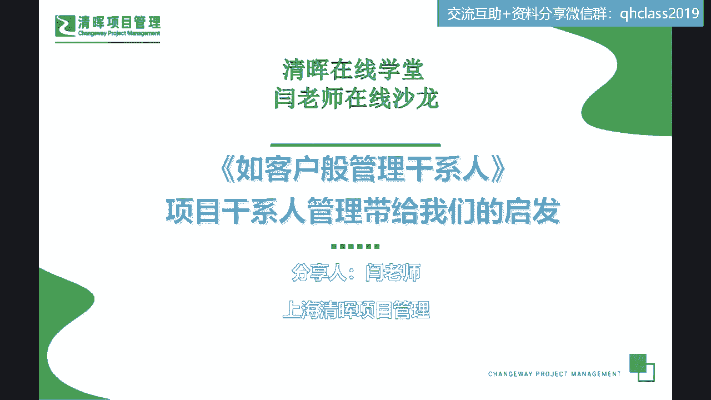
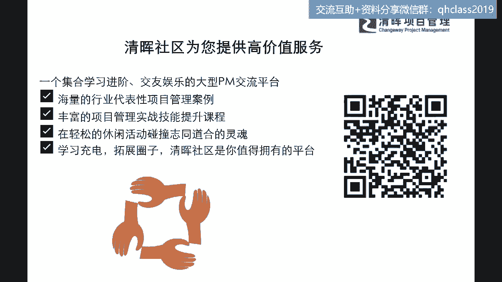
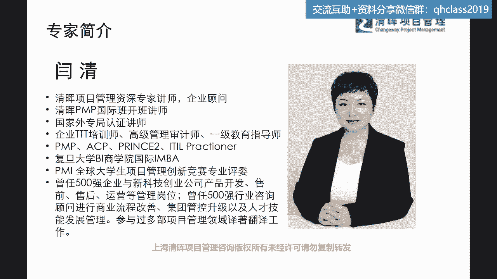
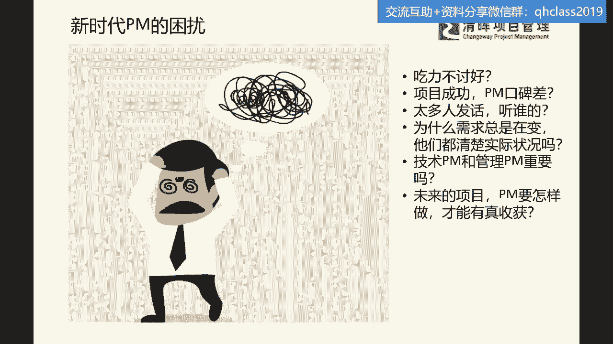
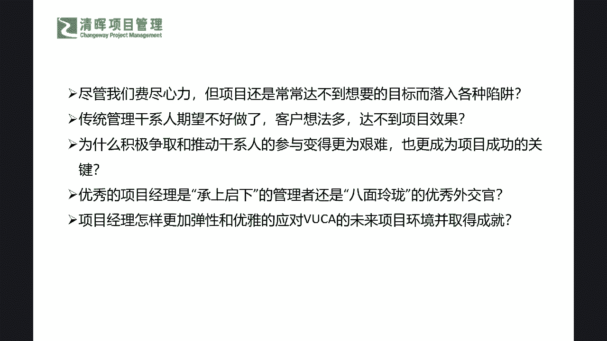

# 成为项目经理应该具备的首要能力 - P3：3.新时代PM的困扰 - 清晖Amy - BV1kx4y1471R

好我们在线的各位呃伙伴们，大家晚上好，星期五的晚上又来了啊，今天我们不是读书会哈，我看到好多这个新朋友，那么今天的分享呢，可能跟我们读书会还不太一样诶，大家好，如果已经在线的。

可以跟闫老师来扣个123都可以啊，来扣一下，让我看到你们有在认真的听啊，屏幕还清晰吗，啊屏幕还清晰吗，应该是能看得到啊，好的好的好的啊，我从这个手机尾号啊，有一些朋友，这个我不知道这个微信名是怎么样。

能够显示出全名啊，但是我从手机尾号已经能分辨出来，几位朋友一直也在参加我们的一些分享活动啊，非常好，说明大家在周末的晚上，这个还是非常内卷的是吗，你们在默默的成长啊，默默的听课啊，非常好，我看到闫老师。

看到每一位这个朋友的这个回应了啊，那么我们今天跟大家分享的这个话题，我相信如果参加过杨老师读书会的同学，可能会有点熟悉，因为咱们分享过一本书，这本书呢也是呃清辉咱们的创始人傅永康。

傅老师的这本非常有名的一本著作，叫做如客户般管理干系人，那么在之前的一些读书会的环节呢，闫老师还曾曾经把这本书啊，当做咱们的一个这个福利啊，就是我们参与评论区讨论的福利来送给过大家。

那么今天呢也是非常非常有这个机缘啊，又在分享关于这本书的一些话题，那么严老师可能又想给大家送一点小福利了，是吧啊，那么我看有同学说，这个嘉玲同学说有些卡顿是吗，其他同学呃听声音像现在有一些这个卡顿吗。

还顺畅吗啊好，那么如果稍微有一些这个卡顿的话，建议大家可以再重新进入一下啊，因为可能刚开始进入的时候，会有一些连接的问题啊，这个可能是一些平台的问题啊，应该不是什么大的这个呃技术问题啊。

所以大家可能尝试重新进入一下啊，好的那么可能在今天的这个分享里面呢，严老师也会给到大家的一个小福利，就是我也会在评论区啊，选出我们两位参与我们讨论最为积极的伙伴呢，朋友也会送出我们的这本书啊。

就是付老师的这本啊，这个如客户般管理干系人这本书为啥，因为这本书我觉得特别好，因为它不仅不厚，非常薄的一本书，但是他讲了很多实战非常有用的一些信息，而且我相信大家如果能啊。

这个静下心来来把这本书读读个几遍啊，读一遍，这个我相信可能收获呃是会有的，但是就是好书它会像这个什么一样啊，就是陈酒一样，也是越陈越香是吧，我们一定要多翻几遍，那么可能就会看到不一样的一些点。

我看到有朋友说已经读过了，也有买过的啊，好，那么还有我相信更多的这个同学，如果还没有看过的书啊，我相信这本书还是非常非常值得推荐的，那么呃这这个颜老师给出的福利呢，也都是严老师会直接寄给你们的啊。

如果有幸的同学啊，因为我也在想办法争取是吧，那有幸的同学可以收到我们的这个呃，付老师的签名档，但是这个我不敢保证啊，因为我们这个付老师也特别特别忙，所以我们在啊，呃想办法给大家多争取一些这样的福利啊。

那么还有同学这个是不是马上周六，明天早上要考试了啊哈哈，所以也希望啊，如果有明天早上要参加考试的同学啊，希望大家今天晚上放松一下心情，听一听咱们的这个啊，干系人的这本小的分享的课程，那我相信啊。

你可能会更加激起你对于学习PMP理论啊，这些的一个兴趣，和你能更加看到他在应用层面的一个深入啊，也就是说可能在这个层面的话，我们会看到其实不仅仅是考试180道题，那么枯燥是吧。

我们其实反映到实战的运用当中，它其实还是有很多非常有趣的，非常有用的一些知识来反馈给大家的，那么呃我们唯一再说明一下啊，我们的一个呃抽取的原则，就是大家在评论区尽可能多的去分享你的想法。

抛出你的一些论点，也可以提出你的一些问题，甚至可以去响应其他同学的一些啊这个提问，还有一些啊这个建议啊，都可以在评论区打出你们的一些想法，那么严老师在呃接近尾声的时候会额选取啊。

我们在评论区最为活跃的两位同学啊，因为这个从啊我们的后台的这个这个回答量，包含大家的一个活跃度，我们也都看得出来，那么严老师也会从综合的方面来去pick出来，两位同学来送出严老师的这个。

私家的一个福利啊，那么今天的这个在线的伙伴也是有福了啊，因为大家都清楚，我只在读书会，个别的一些特殊活动的时候有送过啊，平时是没有的哈，好啊，那么我们在今天的这个话题之下呢，因为我特别加了一句话。

在这啊，如客户般管理干系人，我们其实更多的是来讨论关于人的一些话题，对吧，干系人嘛，客户也是人啊，管理干系人，干系人也是人啊是吧，那么我们在项目，干系人管理上到底有什么样的一些啊，点一些呃。

我们需要去注意的，可能在我们学习理论知识的时候，并没有啊特别深入去看到的一些面，这些东西对我们的帮助，还有哪些可能性和潜力呢，其实我们今天就要讨论到这个问题啊，就是我们在多级维度。

多维度管理这个项目干系人的时候，管理这个人的时候，我们除了理论知识还需要注意什么，那么我们今天就围绕这个话题啊，来跟大家来去拓展，甚至可能在某一些点上稍微深入一点。

所以今天大家听到的肯定跟我们的这些公开课，跟我们的这个读书会是不一样的啊。

那么同样我也非常非常欢迎大家能够，在我们的社区平台当中啊，加入我们的这个啊社群来去摄取，来去寻找到更多你感兴趣的一些课程，那么这个课程呢其实也就是我们更多针对性的，有一些实践作用的一些小的课程。

大家可以看到啊，我们更多的关注，在我们的行业代表的一些案例呀，我们的一些软硬技能的提升啊，那么我相信可能这些小课啊大概两个小时啊，我们呃没有这样子，大面积占用大家时间的情况之下。

尽可能多的给大家摄入和提供一些多维的视角，那么啊我们有同学已经等不及了是吧，快进入正题啊，那么可能在这个里面还是要跟大家来讲清楚，很多新朋友啊，那么啊为啥闫老师之前在很多的这个。

分享的沙龙和在线，包含我们线线下的一些沟通，我们所有的一些这个话题呢，其实不仅仅是这个围绕我们的理论常识是吧，那么我们更要去看到一些实际的生活当中，离我们最近的一些这样的一些人群。

包含我们的一些周遭的管理体制，在发生着什么样的一些变化，那么可能在这个过程当中，严老师更多的能够从自身啊，从服务的一些企业，从我们清灰的一些案例，能够给到大家更多的一些启发。

那么我相信啊大家也一定能够听得出来，这些东西一定都是非常有价值的啊，那我们有同学说这个run同学啊，说已经神游天外了啊，我相信周五的晚上，大家来选择听课已经是非常不容易的一件事情，但是我还是提醒大家啊。

严老师尽可能啊，从各个维度已经去抛开一些大部头的东西，但是呢我们毕竟这个沙龙分享，还是要有两个小时的这么一个专注度的啊，所以也希望大家至少跟上节奏啊，跟上节奏的同时呢。

我的讲解熟悉闫老师这个授课的朋友啊，包含严老师的这个读书会专栏的一些学员，你一定会清楚，我很少讲一些理论的东西啊，我都是讲一些糙话是吧，所以可能在这个上面呢，也希望大家能够把你们的想法。

把你们的一些呃这个问题也抛在我们的评论区，大家一起啊动起来你就不会困了是吧啊。

还有顶着高烧的啊，这个同同学这一定要关注啊，休息啊，这个休息是第一位，我们现在这个的确是非常挑战大家的免疫力啊，那么首先我抛出一个这个很简单，但是不停又在问的一个问题，就是我们现在这个时代之下啊。

我们黑天鹅事件的不断发生，我们现在各种不确定性的不断发生，那新时代这个PM到底有什么样的一些困扰呢，首先大家非常非常明确的一点，就是什么吃力不讨好是吧，我们做了那么多事情。

为什么一来工资我们就暂且不讲了是吧，二来我们的口碑是吧，也是会打问号的，所以可能在这个当中，PM这个角色到底应该起到什么样一个作用，那么在这个作用的加持之下，PM到底怎么样才能拿到。

与他付出相匹配的一些这样的一些呃，这个这个收获呢，实际上你会发现PM永远是那个什么中轴，中轴是什么意思，你需要去drive大家，你需要去带领大家去做事情，但是你又没有那个什么实际的一些权限。

而且你可能还会被别人误解是吧，而且太多人跟你来提要求，跟你来提指示，是不是啊，是说你你应该这么干，你项目呢如果这么干就会有一些风险，那么你要听我的对吧，我们个个的这个这个boss都来给。

我们是有一些这样的一个指导，那么在这种情况之下，我们到底听谁的需求，难道不是客户来吗，你会发现需求不仅仅从客户来，还要从内部来，甚至还要从你的下属来对吧，所以同志们，你意识到PM难不难呀，难对吧。

它难在哪里，因为他是在跟人打交道啊是吧，但是这里面我们大家也发现除了这些啊，这个吃力不讨好，然后这个口碑问题，然后需求管理问题，你还发现唉我们做pm的不仅要学会规划，不仅要学会组织人，我们还得干什么。

就要在这个这个我们通常讲的就是，还得是个万金油是吧，什么意思啊，就是你至少人家问到你这个里面，所有的一些关于产品的，关于市场的，关于这种整个流程的，关于整个的一些这个体系的，你都得要懂那么一点点。

如果你说你不知道是吧，你说你不了解这个，你也不知道怎么处理，那么就会大大影响你的一个什么微信，也就是说你可能作为这样的PM，当你很难去说我不懂这个事情的时候，你又会发现原来其实你的压力会非常大的。

就是你要不断的去干什么，跑在别人的前面，你要懂技术，懂管理，还要懂什么软技能，各项东西都要略懂一点点，我们在讲呢这个大家看那个呃，看这个三国演义的时候，其实讲的最啊通俗的一句话是谁，谁是略懂一点点啊。

我们讲谁谁讲自己什么都略略懂一点点，诸葛亮是不是啊，我们叫诸葛军师，非常谦虚的说，什么方面他都略懂一点点，但是他是略懂吗，他可不是略懂啊，他可是各方面都研究的很透彻，所以pm其实也要是这么一个角色。

今天我就问大家一个问题啊，刚才有同学说了呃，许春荣同学说啊，懂但是不做，但这句话我就不完全认可了啊，如果今天pm你没有干过这个事，你都不了解里面的123456的这种，这种道道在哪里，你去指导别人。

你去发现别人的问题点，你会觉得你讲的话有说服力吗，所以实际上这对pm是什么挑战，你不仅要干什么啊，面上懂你还真的要干什么，这讲的hands on，你要做过，对不对，你要知道这里面到底风险在哪是吧。

所以可能在这个里面的时候，PM对我们的这个现在这种时代下的要求，它不仅要什么上得厅堂，就是你要去做presentation，你要去做汇报，你要去总结宏观项目的所有的全局风险是吧，监控流程你还要干什么。

还要深入到细节去帮人家去解决问题是吧，甚至可能在出现一些矛盾的时候，你还想办法要去干什么，想办法要去调解，了解细节是吧，所以你会发现PM这活是不是好干不好干，是不是啊，也就是说你仅仅靠一张嘴。

这个天花乱坠吹一下，人家做过的人，一听就知道你是不是在忽悠我是吧，所以可能在这个里面非常重要的一点，就是我们一定要懂，那懂其实要付出什么样的代价，就是你要学呀对吧，你肯定是要学的。

就是我们没有人是一个万金油的，大家都有各自的专攻，大学都有分科，是不是，但是对于pm的要求，他就是一个综合管理人才，但是我们今天遇到了这么多问题，我也跟大家分享一个，我上个星期刚刚在啊。

我们复旦的这个课程当中啊，有听到一个我们的非常知名的一位国际教授，说的一句话，让我特别认可他啊，他讲了一句话是什么呢，他说所有的企业的岗位当中，大家听好了，如果各位参与线上的各位伙伴。

你们或多或少都曾参与过项目管理的工作，并且你们现在也是PM的一些title，或者还可能不是PM的title，但你们做的是pm的事，那么你可能就要注意啊，其实这位教授他说的话。

就是他认为在企业所有的岗位当中，可以快速让一个人具备既有战略思维，又有执行视角，又能从上到下，从下到上去，这样子串通管理的这么一种综合技能，那这个岗位呢他认为就是project management啊。

当时他在讲到这个时候，我特别特别的赞同啊，为什么呢，大家来想想看啊，今天如果你要去drive一个项目，你难道不应该了解为啥要有这个项目，它的价值在哪里吗，如果你不曾想过这个问题，不曾去问过这个问题。

那你又怎么知道他的优先级重要性，你在协调资源，你到底兜里能有多少的一些bargain power是吧，你有多少的一些这种，所有的这种这种谈判的一些力道对吧，所以在我们通常所讲的pm。

它其实是需要了解一些商业价值的，其实我们应该有一部分同学，明天可能也要考PBA是不是商业分析师是吧，都在明天啊，那么商业分析就是讲的立项前的这些价值，那么现在目前它还是跟PMP是分开的。

但是我们会发现啊，你在学PMP的时候，你会发现里面有很多部分，已经开始逐渐涉及到我们的早期的，商业价值的讨论了，因为项目项目本身，project的存在就是基于什么价值而存在的。

如果你做的这个事情没有价值，那么可能它就不叫一个称之为项目对吧，所以可能我们在这个里面我们要搞清楚，其实PM它的难，是在于他的战略的视角和战术的难度，也就是说它并不是一个简单的一个。

我们通过学习一些工具，学习一些这种基本的方法，就可以快速有这种提升的，它是需要你去不断的磨练你的一些战略视角，综合能力，和你的一些硬技能，软技能的，所以可能在这里我们来看一下啊。

那么在整个的这样的一个过程当中，我们会发现。

尽管我们费心费力啊，还是可能这个项目通常达不到这个目标，是不是啊，那么还有什么你会发现传统的这个管理干系人，今天我们讲大家今天你去跟他讲，说干系人满意度，我们肯定会非常不屑啊，同志们，是不是。

你会怎么不谢，你说我作为一个项目经理，我难道还不知道要让客户满意吗，是不是，但是实际上今天你知道要让客户满意，但是你怎么样让客户满意嘛，就问深一点，问深一点点，你就答不出来了对吧，你怎么让他客户满意。

客户的想法一直是多的，而且他是完全是围绕着自立的角度来出发的，什么意思，只要今天对他有利，他可以立即修改他的需求，他不会去修，跟这个consider说，你有多少风险，对不对，我们这个直接一点啊。

我们就把问题抛出来，那如果是这样子一种情况的话，那我们怎么管理他的满意度，它永远是跑在前面，我们永远追在后面的，对不对，所以这种情况怎么怎么办呢对吧，那么还有就是。

我们怎么样去积极的争取和推动干系人的参与，大家都清楚，如果干系人没有参与，就没有发言权，那如果没有参与的这些干系人，他会突然蹦出来的时候，只有一种情况，那么就是半路杀出来的程咬金对吗。

实际上我们是都非常不欢迎这样的角色是吧，如果半路杀出来，他肯定是提问题，提意见嘛，提反对嘛对吧，那所以可能在这样的一种情况之下，我们又能怎么样去覆盖到这种完整的干系人，的一个网状图。

能让我们的干系人他可以积极参与进来，那这种engagement，其实也是需要很多的技巧在里面的是吧，那么还有我们如果从这些角度上去考量过了，那么我们优秀的这个PM它不仅承上启下，我们还要以一个词啊。

中性词啊，叫八面玲珑是吧，八面都少了，是不是啊啊因为我们干洗人太多了是吧，那我们这样的你更加多的，你不仅是一个hands on的，在上得厅堂，下得厨房的一个管理者。

那么你还要做到一个优秀的外交官的一个级别，也就说出现问题了，你还要有理有据，有有有节的去把这个问题解决掉，而且让周遭的所有的人对你项目的反馈，对你的反馈，对你团队的反馈都要是好的。

那么这也是一种非常非常硬的技能啊，所以这是之所以大家可以想想看啊，今天为什么中国已经有十几万大军，都在PMP的这个正书里奋斗已，而且也已经有那么多人上岸了，就是因为项目管理这个事不好干啊。

啊同志们也就说不是我们想象当中那么容易的，所以我们在PMP加持之下，我们掌握了一些必备的一些这个工具了之后，我们还得学会知道了what就要知道how啊，你已经知道了，有什么样的工具，有什么样的枪。

就像你今天上战场，你已经知道有100多种武器都可以用，那你要会用啊对吧，所以可能在这个时间点，我们就要去考量，你到底这个所谓的角色感代入了之后，你怎么样承上启下，怎么样八面玲珑。

你还有哪些工具需要掌握是吧，那么项目经理又应该怎样更加的flexible，就是我们讲的弹性是吧，我们现在一听这个词儿，就觉得哎呦，这个就是现在有太多的不确定，就要求我们这也行，那也行，既要又要是吧。

那这就是个事实啊，所以可能在这个现现实的点里面，pm到底应该怎么样更加弹性，这也是一个非常火爆的话题，也就是说，大家往往一开始都想到的是增加一些技能，那这个技能就很大的面了，到底是硬技能呢。

知识性的呢还是软技能呢，大家可能说都需要，那么我就请问了大家的时间精力有限，你到底应该抓哪一个是更为有效率的呢，也许我们今天跟大家去讨论讨论啊，也许能给大家一点点启发是吧。

所以可能在这里我看到有这个有同学啊，张大饼同学啊，说个人认为，收敛需求的有效方法是从技术方面，解决他的顾虑，从客户关系管理的紧急程度啊，啊这个这个观点是正确的，但是可能不见得那么完整的表述出来。

我相信你可能知道这个需求的一些有效方法，收敛需求，技术方面解决它的顾虑，但是我们今天讲了，今天技术也是不封顶的是吧，那如果这个客户在有限的bug之下，50块钱就想让你搞一个苹果机对吧。

你这个也是不可能做到的，但是碍于市场，碍于环境，你还又得接这个单的时候，你就不这么去想它了对吧，所以可能这个我们也要kiss by kiss，来一件一件来看是吧，那RYAN同学说。

利用自己跨部门这个工作的角色，帮目标解决问题，人家也愿意帮你才会积极参与，对帮助别人是一个非常非常好的一个点啊，但是你会发现今天PM你也是一个正常人，也是一个普通人，你每天的时间并不比别人多。

你自己的任务还有很多，如果你今天你一些很多的efforts，放在去帮助别人，你自己的事情做不好，你会发现一样有问题啊，所以可能在这个这个当中，我们永远可能会面临到一些更多的question。

Mark是吧，那还有这个学学学学从业者找到共同目标方向，共通利益点，共通利益这点也非常好啊，其实这个共通利益点就是我们所讲到的，你需要有一些工具来帮助你分析，你到底能不能抓到这个本质就非常关键了啊。

所以这个也是需要修炼的是吧，那么谭强说，这干系人在工作之外的人事关系认可比较重要，这个非常关键啊，非常好的一个论点啊，谭江同学，其实就是，我们很多的事情是解决在工作之外的啊，但是PM有没有意识到呢。

那这一点意识到了，你要怎么做呢对吧，所以我们今天也许带给大家的一些这种工具啊，还有一些这个东西，也许能帮助大家来再去深入的分析分析啊，那么还有呃同学一直在问有没有录播啊，我强烈建议你能跟上就跟上啊。

你在听录播的时候没有互动性啊，况且今天闫老师也说了，我这个参加直播的都会有这个小福利的是吧，啊尽这个尽可能啊，因为录播也是占用你同样的时间是吧，还没有福利是吧，所以可能这个啊。

还有CD同学说这个沟通占比最高，非常非常棒啊，我下面来讲一个啊这个灵魂之问是吧，我们今天先问一问这个问题。

