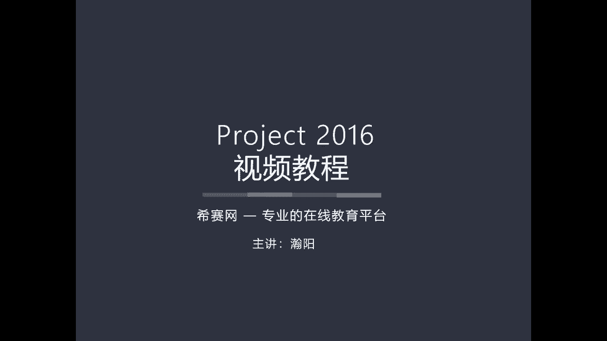
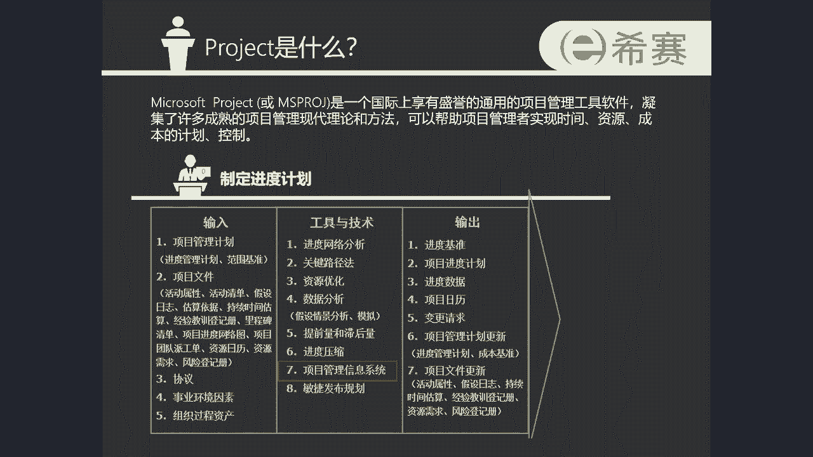
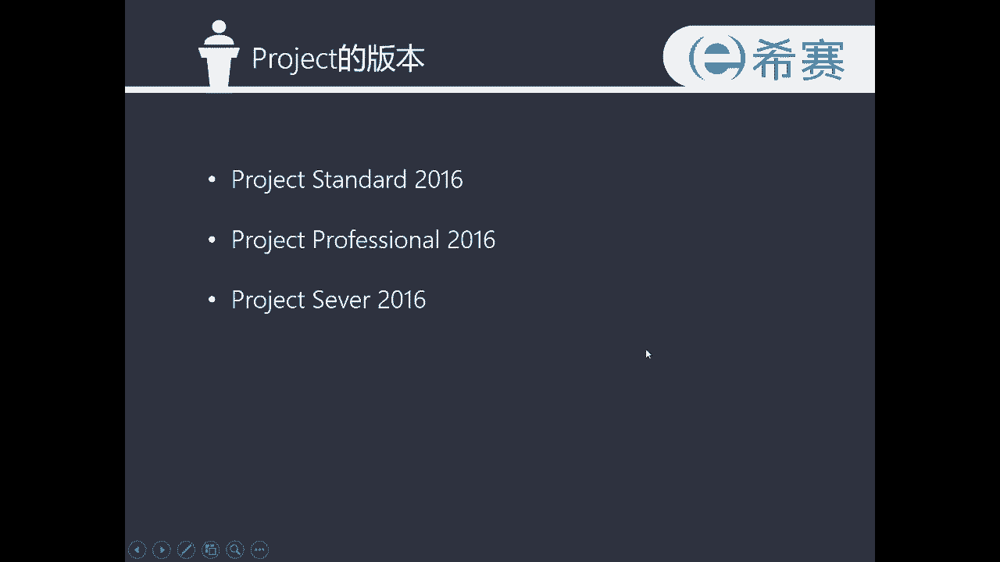

# 手把手教你用Project做项目管理｜｜小白必备 - P1：1.1基本情况 - 小哦的PMP之旅 - BV1Bp4y1g7Ai

新赛网专业的在线教育平台，各位同学大家好，欢迎进入project2016视频教程的学习，我是今天的主讲人汉阳，在开始正式的我们软件的学习之前呢，首先我们先了解一下什么是project。

以及project都有哪一些版本，project全名叫做max soft project，它是由微软公司在1995年发布了，一款通用的项目管理工具软件，同学们在进行我们的PMP。

项目管理的知识的学习的时候，会经常使用到一个叫做ITTO的工具，ITTO由输入工具与技术输出，这三个模块组成，通过使用这个工具，可以更好地帮助同学们去理解，我们项目管理的49个过程组，的一个组成的内容。

那么在我们学习到49过程组中有关进度，有关资源，有关成本以及一部分沟通的过程组的时候呢，在工具与技术这个模块中，会经常看到一个叫做项目管理信息系统的工具，没错。

我们的project它就是一款项目管理信息系统，project可以帮助项目管理者实现时间，资源成本的计划和控制，同学们要注意一点啊，Project，这个软件，在大部分的时候。

是没有和微软的全家桶放在一起的，也就是说，电脑上可能预装了微软的一些基础的软件，比如这个word excel和PPT这些软件的时候是没有安装，Project，project是需要单独去自行去安装的。

这个时候就要对project的版本进行一个选择了。

我们以project2016这个大的版本号为例啊，它分为三个小版本，第一个版本叫做project专业版，第二个版本叫做project官方版，第三个版本叫做project server。

也就是我们的服务器版，在这一次上课的时候，我们会使用到的是第二个project professional，2016，这个版本正版的售价大概是300块钱左右，当然了，在网络上会有一些破解版的版本。

在这里不推荐同学们使用盗版啊，还有一种情况是，有一些同学，公司的it部门会在服务器上部署一个，我们的project的一个服务，在这种情况下，可以自己去联系一下公司的it部门的同事。

帮忙来在自己的电脑上部署一下，我们project的这个软件，好的介绍完了基本的情况。

