# 手把手教你用Project做项目管理｜｜小白必备 - P3：1.3视图类型 - 小哦的PMP之旅 - BV1Bp4y1g7Ai

同学们，这节课我们来学习project的一些基本的视图类型，以及它们的具体的特性，首先我们要知道，在project中切换视图类型是有三种方式的，第一种方式是在任务菜单栏的视图的。

这个工具栏点击一下这个向下的箭头，然后可以在这边去切换一些不同的视图，这是第一种方式，第二种方式呢，是把鼠标移动到我们整体的这个主页面的，最左边，到甘特图这边，点击一下鼠标右键诶。

我们可以在这里去切换不同的视图，这是第二种方式，第三种方式呢是在第二种方式的基础上，点击鼠标右键，然后点击一下这边的视图栏，我们就可以在整体的页面的最左边，去切换不同的视图了。

project的视图一共有三种类型，第一种类型叫做图表与图形视图，它是以图表的形式来显示项目计划的信息，比如说我们刚才看到的甘特图，以及这个追踪甘特图，包括网络图看。

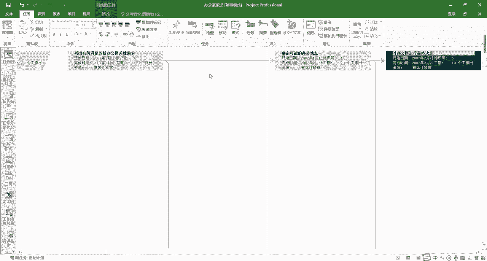

以图表的形式，并且网络图可以显示我们整体的一个关键路径。

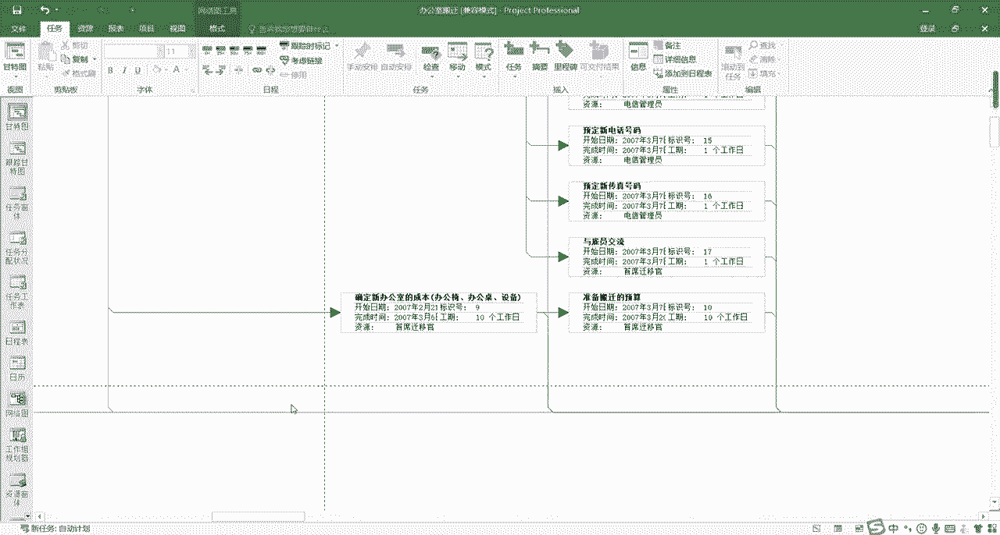

跟紧前紧后的关系以及资源图表。

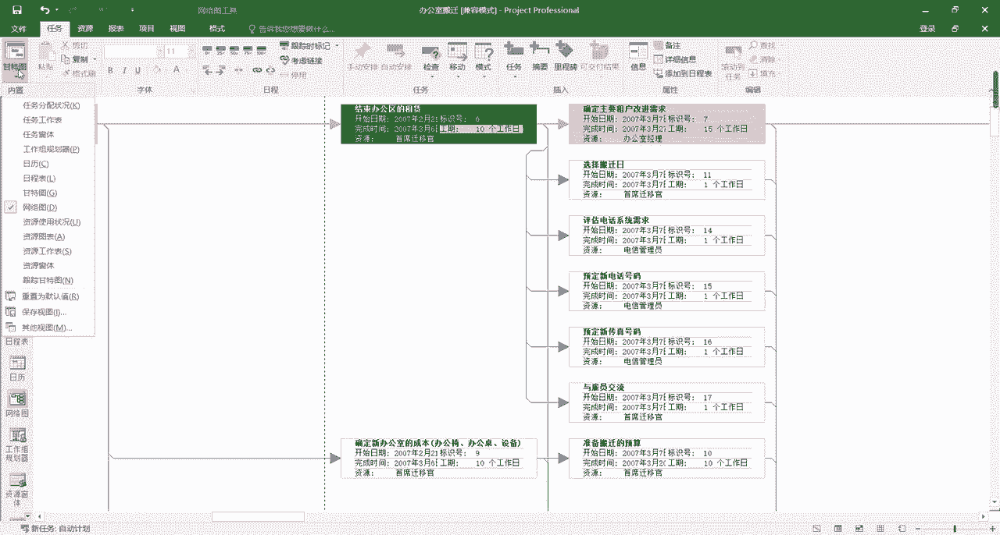

看这些都是有图表的。

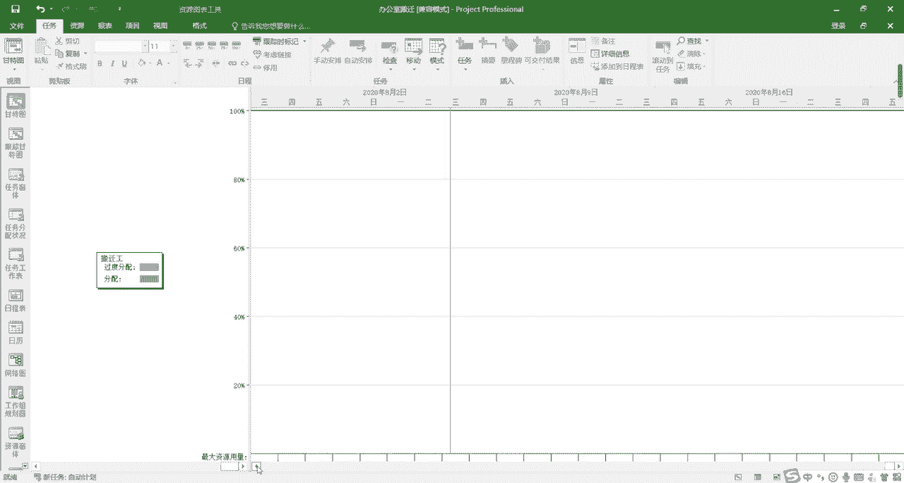

还有日历，以图表的形式来显示信息，那么第二种类型叫做工作表视图，它是在行列中显示信息的一种视图。

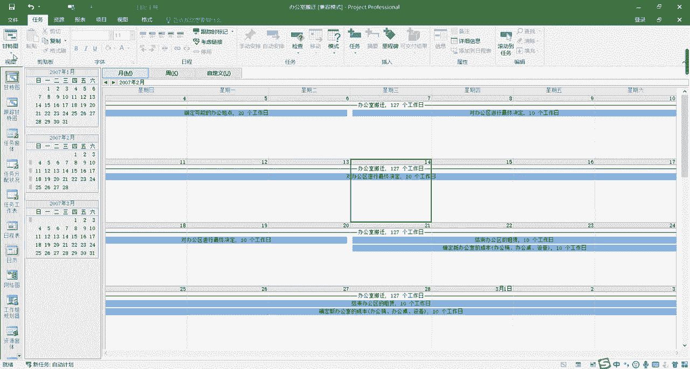

比如说任务分配状况看，以图表的形式来展示我们的信息，还有资源使用情况，都是以这样的方格来展示我们的资源的一个，使用的情况，第三种类型叫做窗体视图，它是以结构化的格式，一次显示有关任务或资源的详细信息。

实现对任务或资源的信息的快速的操作，比如说任务窗体，看它一次性只显示一个任务，但是我们可以在这里看到，这个任务的整体的一个情况，比如说我们可以往下切换，这是我们这个任务的整体的一个，资源的使用情况。

还有以及就是我们的资源窗体。

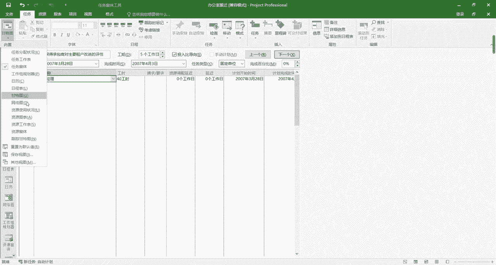

它是以资源为维度来显示出，这个资源一共进行了哪些任务，也是可以在这里进行切换的，好的，这是我们project的三种视图类型，好的，接下来我们来学习一下，在使用project进行项目管理时。

最经常使用的六种视图的特性。

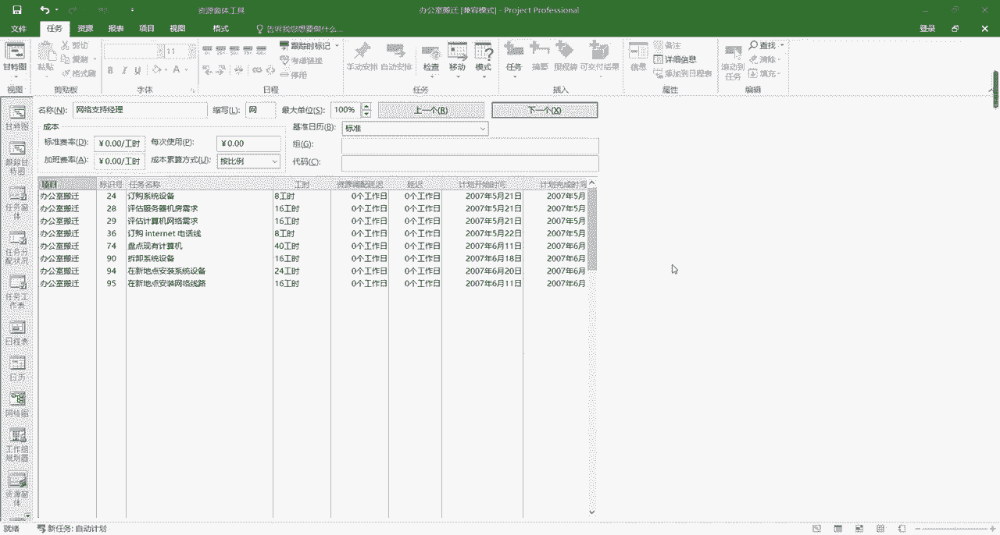

那我们首先来看一下甘特图啊，他是我们最经常使用的一张图了，甘特图呢又叫条形图和横道图，在甘特图的视图区域啊，每一个线条都代表着一个任务长度，表示任务的时间跨度，我们可以通过使用甘特图来创建。

项目的时间计划，并通过链接建立任务之间的搭接关系，查看搭接关系对任务日程的影响，以及将资源分配到任务以后呢，查看资源的一个分配的情况，并且查看项目的进度，跟踪或更新任务的执行情况和进度，在后面的课程中。

我会详细的给大家讲解这些功能的，具体的使用的方法，接下来我们来看第二张图啊，第二张图叫做任务分配状况图，大家可以看到这张图可以从任务的角度出发，来查看每一个任务资源的一个分配的情况。

并且也可以查看这个资源公式的一个，分配的状况，我们点击一下滚动到任务啊，大家可以看到针对每一个下面的这些子任务，在右边的视图区，都可以显示出他们资源公时的一个分配的情况，这是我们任务分配状况图的作用。

我们来看第三张图啊，第三张图叫做日历图，日历图呢可以用来查看某一个时间段，某一天，某一个月，或者是某一周的一个项目的任务，时间的一个分配情况，并且呢它也可以查看任务的开始结束，工期等信息。

也可以根据信息直接进行任务信息的修改。

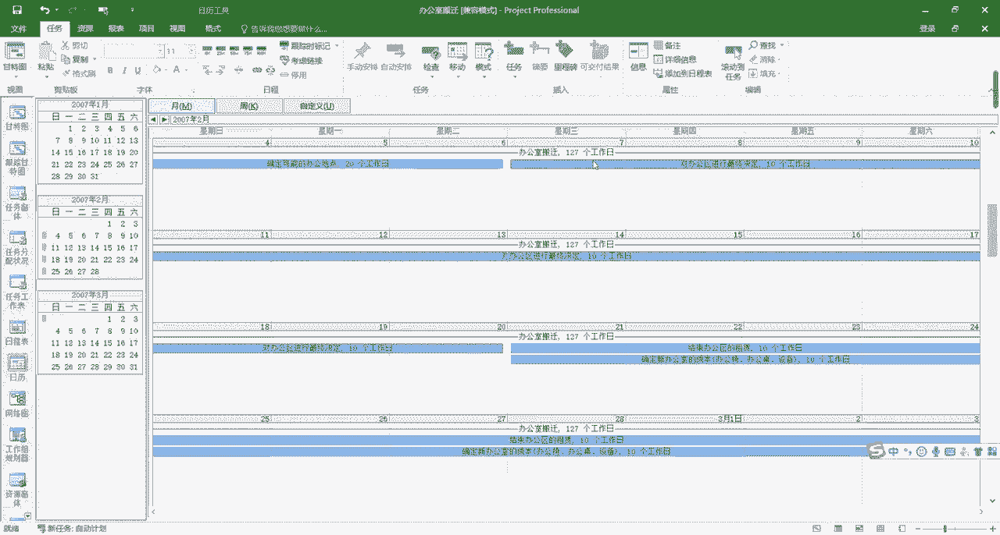

比如说我们点到这里，可以在这个页面直接进行任务信息的修改，好我们来看第四张图啊。

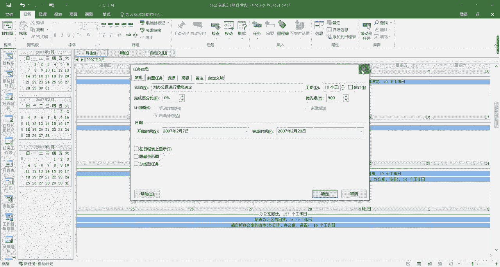

第四张图叫做网络图。

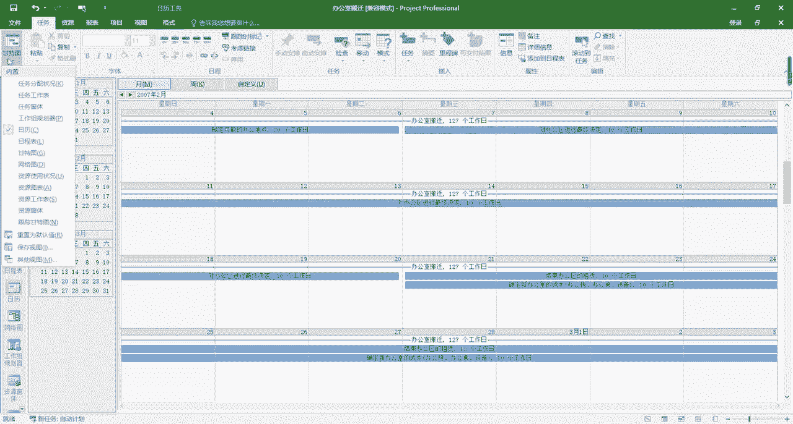

网络图呢又称单代号网络图，它主要是可以用来查看项目。

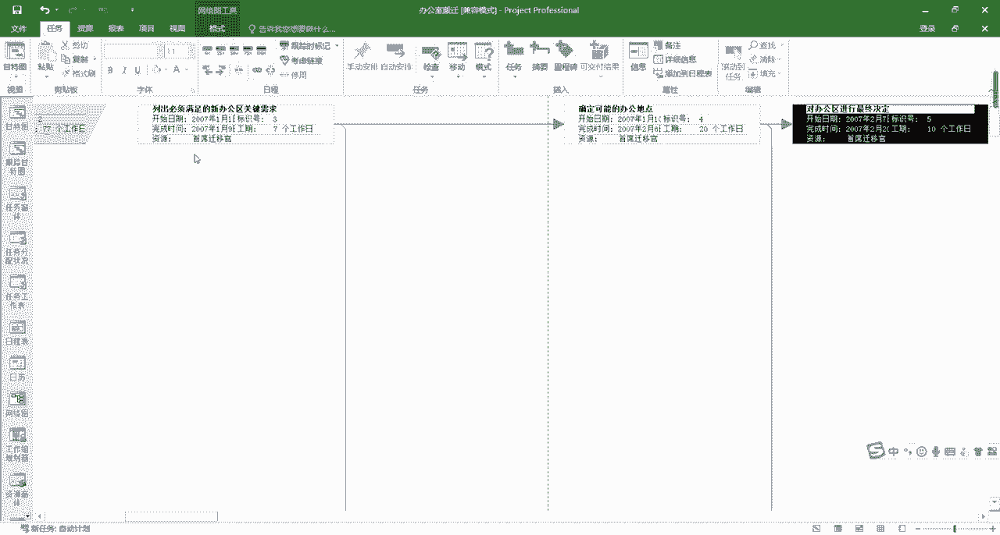

各任务之间的搭接关系，关键路径以及总工期。

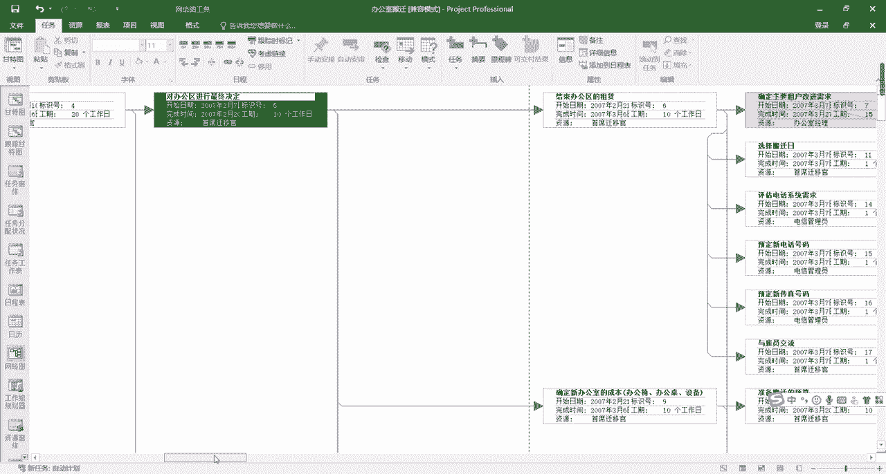

是可以通过这张网络图来查看的，并且网络图也可以用来查看某个时间段，一个项目的任务时间分配情况，和刚才我们学到的日历图。

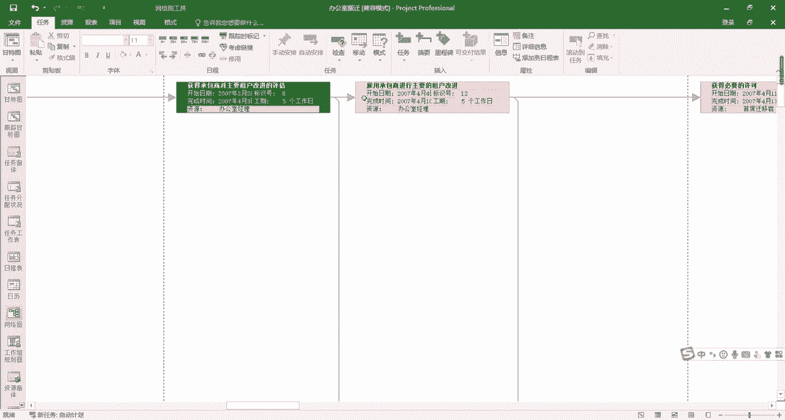

是有一些功能上的相似的，而网络图呢更偏重于去体现出，个人物之间的搭接关系，好的接下来我们来看第五张图。

第五张图叫做资源工作表，资源工作表可以记录为项目提供支援的，所有的资源的信息，在项目的实施过程中，这张图表可以对资源使用的效率，工时成本进行统计和协调，资源工作表呢分为八个模块，第一个模块叫做资源名称。

资源名称可以是一个单独的个体，也可以是集合，比如说在进行装修这个项目的时候，我们可以把施工队作为一个单独的资源，也可以把它进行拆分，比如说拆分成泥瓦匠和油漆工，第二个模块叫做类型。

类型分为公式和材料消耗公式，完成任务的资源叫做公式资源，比方说人力资源一般就会是一种公式资源，而具有损耗性且与公司无关的资源，就叫做材料资源，比如说在装修的时候会使用到的一些电线，水泥。

这些就是材料资源，第三个模块叫做标记，标记这一栏会显示资源目前的一个使用的状态，比如说在资源被过度分配的时候，就会在这里显示一个红色的小人，提示此资源处于过度分配状态，如果有一些资源拥有备注信息的时候。

也会在这个状态栏有所显示，比如说我们在这里给这个资源添加一个备注，随便写一个看，在这里就会有一个像性质一样的图标，这里会显示出这个资源的备注，接下来我们来看第四个模块，第四个模块是材料标签。

这个模块仅针对材料资源的度量单位，由于我们没有使用材料，这一栏就是空的了，第五个模块叫做缩写系统，默认资源的名称的第一个汉字，或者是英文的字母会显示在这边的缩写之中，第六个模块叫做组组。

是共有某些特征并按组名分类的资源的集合，比如说刚才我们提到的泥瓦匠和油漆工，就都可以算作施工队组，第七个模块叫做最大单位，最大单位显示的是系统默认的百分数，用来表示资源的一个可用量的信息。

第八个模块叫做基准日历，基准日历可以显示出，单个资源在一天内的一个可使用时间，默认的是标准事件，我们也可以选择，比如说24小时都可以使用，或者是它是一个夜班，而标准时间就是八小时制。

了解完了资源工作表的整体特性之后，我们来看project视图中我们经常使用的第六张图，也就是我们今天讲到的最后一张图，叫做资源使用状况图。

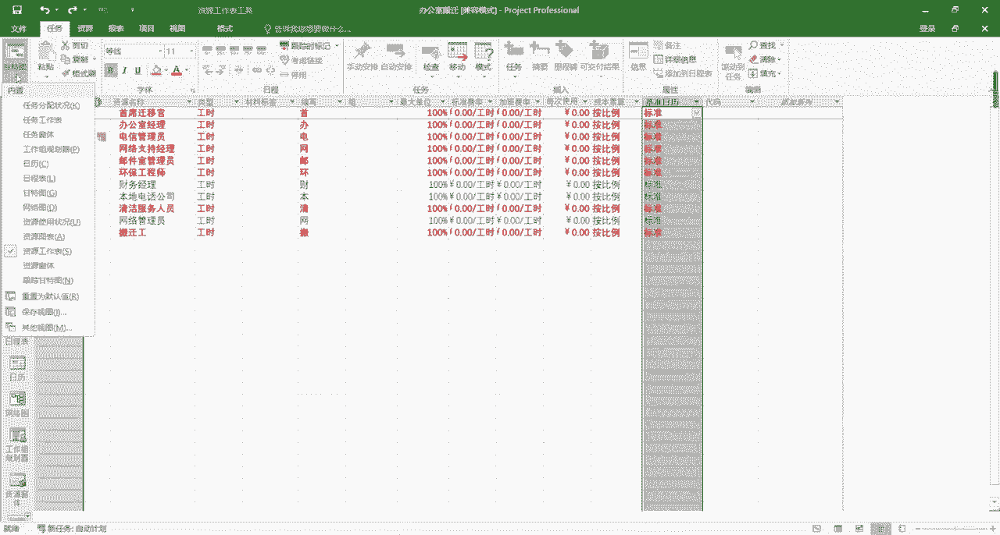

资源使用状况图呢，是用来查询某个或某种资源的使用情况的图，他可以查看每个资源上分配了哪些任务，以及任务上资料的工作量情况，大家看啊，同样的我选到这个任务，对办公区域进行最终决定。

然后呢点击滚动到任务在右边的视图区域，我们就可以看到这个资源，在执行这个任务的时候的一个具体的工作情况，同时资源使用状况图，也是任务状况分配图的另一种反应。

以上就是我们在使用project进行项目管理时。