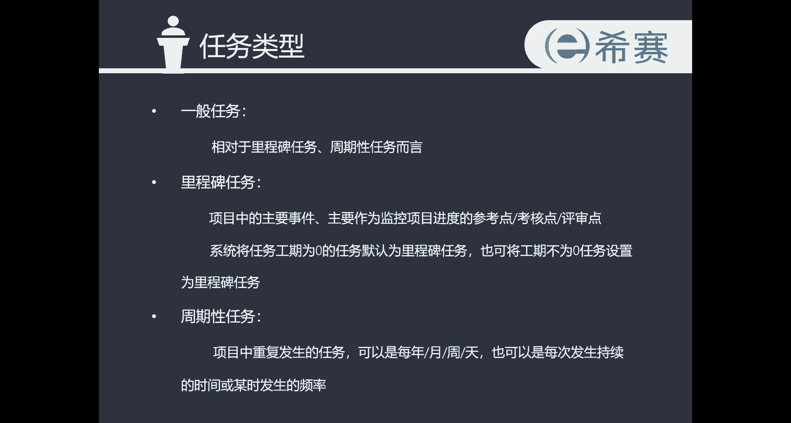

# 手把手教你用Project做项目管理｜｜小白必备 - P6：3.1建立项目任务 - 小哦的PMP之旅 - BV1Bp4y1g7Ai

好的同学们，接下来我们来学习project视频教程，第三章，制定项目任务管理计划，这一章的学习啊，也就是我之前一直提到过的，我们使用project进行项目管理的时候，有三大基准，第一个基准是日历基准。

这个我们在第二章在项目的预先设置的时候，已经设置过日历基准了，第二个基准呢就是任务基准，第三个基准是资源基准，那这一章呢我就跟大家详细来讲一下，在使用project进行项目管理的时候。

我们应该如何去设置任务基准，以及它的一些具体的比较实用的操作，那我们来看一下第三章的第一个小节啊，建立项目任务，主要这一小节我会跟大家说，如何去进行任务拆分，任务建立设置任务日历，添加备注。

任务的升级以及降级这一类的操作，在我们进行任务的正式的创建之前，我们首先要搞清楚有哪几种任务类型，任务类型呢可以分为三种，第一种是一般任务，一般任务呢是相对于里程碑，任务和周期性任务而言呢。

也就是说除了里程碑任务跟周期性任务之外，全部都是100任务，那第二种类型里程碑任务啊，他是项目中的主要事件，主要作为监控项目进度的参考点，或者是考核点以及或者是评审点，什么意思呢。

我们来进入到project中看一下具体的实例啊。

大家可以看到，这是我之前跟大家一块模拟的，一个我们叫做装修计划的任务，那在砸墙开槽，找平都已经做完了之后，是不是也就意味着我们的泥工是已经做完了，他全部的工作了，应该等到瓦工去入场了。

那这个时候我们是不是应该给泥工结账了，所以在这里我们做一个泥工结账的任务，对不对，那这个任务，它就标志着我们泥工的工作已经全部完成了，而瓦工的工作要正式开始了，那这一般像这种结账。

是不需要一个明确的工作日了，对不对，所以是不需要给他时间，给个零就行了，好我们把这里所有的任务都改成自动计划，可以在这里全部调整一下对迷宫结账，那这个时候大家就可以在右边的图表去发现啊，我们的迷宫结账。

这个任务已经被设置为了里程碑任务，Project，这个系统会默认把工作工期为零的任务，设置为里程碑任务，那如果说这个里程碑任务它不是零，也可以是进行设置的，具体的操作方法啊，双击我们的任务。

然后呢任务信息这个菜单栏中选择高级，在高级最下面这一块标记为里程碑，这个地方把它打上勾，就可以把工期不为零的任务。

设置为里程碑任务了，好的我们再看一下第三种任务类型啊，周期性任务，周期性任务呢指的是项目中重复发生的任务，可以是以每年每月每周每天，也可以是每次发生持续的时间，或是某时发生的一个频率。

最典型的例子就是我们的在工作中的周例会了。

对不对，一般是每周一的早上会开一个周例会，那我们接下来来看一下在project中的具体的操作。

进入到project之中，周期性任务的设置方法是在我们的project菜单，任务这个菜单栏的任务，这个选项的下拉框点击一下，然后点击任务周期这个按钮，在这里，我们就可以对周期性任务进行一个配置了。

那首先输入任务名称，周例会，然后工期一般周例会啊最多也就开一上午，所以这里是0。5个工作日，那重复发声方式是每周，因为是每周的一个例会，对不对，然后间隔是以一周作为间隔，在周一的时候去循环。

那重复的范围呢，开始的时间就是我们项目正式开始的事件，那到我们项目的结束的时间，系统中会自动计算出我们的项目，等我们的周例会发生的次数，你也可以直接在这边自己进行收入，比如说我只希望我的周例会只开五次。

在这里输入就行了，然后下面就会自动计算出我们最后一次周例会，开的一个时间了，在这里设置完了之后呢，还可以在这里排定此任务所用的一个日历，比如说我这里调整一个标准的日历，或者是我启用其他的日历。

那周立会使用的，这个日历呢，是可以和我们的日历基准设计的日历，是不一样的，在这里也可以去选择去勾选，排定日程时忽略资源日历，也就是虽然说这个资源在今天它是不可用的，但是他还是要参加周例会。

如果出现这种情况的话，我们就在这里点一个勾，把它勾上，这样就可以做到这个资源，虽然他今天他是不上班的，但他还是不要过来参加例会的，这种情况就可以这么解决了，设置完了所有的这些选项之后，点击一下确定。

就可以配置完成我们的周期性任务了。

好的以上是我们项目任务的三种类型，以及它们具体的一个配置的方法，接下来我们再来学习一下，进行新建项目任务的时候，会使用的一些其他的功能，首先是第一个功能，任务拆分，项目实施的过程中呢。

有时候一个任务连续完成，由于客观的原因，中途需要暂停，然后继续接着实施，这种情况我们就需要进行任务拆分了，它具体的一个操作方法，我给大家来看一下。

任务拆分这个按钮啊，是在我们的菜单栏，任务的这个菜单栏啊，找到这个小按钮，拆分任务这个小按钮，然后我们点击一下光标，就会变成了这样的一个样子啊，然后我们就可以在右边的这个图表区。

甘特图的图表区去选择一个需要拆分的位置的，比如说我在这个8月24号这里，我点一下，看，现在任务就被我拆成了两段了，那很多同学可能要问啊，为什么你点了拆分这个星期一的这个时间。

为什么周六周日这里也断出来呢，这是因为我们日历使用的是标准日历啊，周六跟周日是休息的，那周一又被拆出来了，所以这个时间就变成了，从你看这个从周二到周五，然后后面就是从周二开始了。

周一这个时间就被我们拆掉，跳过去了，那这个我们把它拆成了两部分之后啊，这个时间也是可以进行移动的，我们也是可以进行再往继续往后移动的，这都是可以你自由去调配的，那如果我们把它往前移动啊。

我们再把它移回周一看，这样任务就又变回去了，因为周一继续工作的话，那我们整个任务就又连起来了。

这就是我们拆分任务的一个操作，好的，我们来看第二个功能啊，第二功能设置任务日历，那任务日历的设置可以满足，任务不同于项目日历的日历，设置任务日历后，项目这个任务将不再采用项目日历。

也就是我们可以对一个单独的任务，对他自己这个任务进行一个日历的设置。

我们来看一下具体的操作。

比如说我们要给砸墙这个任务，配置一个跟其他的任务不一样的一个任务，日历啊，那点到砸墙这个任务双击，然后进入到任务信息的这个界面之后，点击高级，然后就可以在这里的日历这边去选择一个。

跟其他的任务不一样的一个任务日历了，那如果说这边配置的一些标准的日历，感觉大家都觉得不合用，那同样的可以，我们自己去新建一个新的对应的日历，来在这边去做选择，那我们在这边先选一个24小时。

也就是需要24小时，加班加点的去完成砸墙这个工作，那同样的在后面我们可以勾选排定日程时，忽略资源日历，也就是说我们把这个整体的项目管理计划，交给施工的项目经理之后，砸墙的这个工作。

是一定要在24小时内去完成的，而不能说是因为资源不合用而不行，你必须要去给我调配别的资源，在这里就可以进行一个勾选了，那配置完所有的这些选项之后，我们点击一下确定啊，好这样就完成了单个的这个任务的任务。

日历的配置了，接下来我们来看第三个功能啊，添加任务备注，对任务资源工作分配进行文字说明，可以实现附件的插入。

来看一下它具体的操作，我们继续选择砸墙这个任务啊，点击砸墙这个任务名称的选项，双击，然后点击任务信息这个菜单栏备注，这个选项点进去之后，我们就可以在这里对砸墙这个任务，进行一些备注了。

比如说我在这里可以输入文字信息啊，抓紧是吧，然后呢，也可以在备注这个地方去插入一些其他的附件，点击一下这个按钮，插入对象，点击进去呢，可以选择去新建一个这些附件图片呀，或者是excel表。

或者也可以去选择一个文件去进行插入，那在这里我们备注完成了之后呢，点击确定，在状态栏这边，我们就可以看到这个任务是有一个备注的，然后把光标放在这边，就可以看到我们具体的一个备注信息，抓紧这两个字了。

这就是我们进行任务备注的方式。

好的我们来看一下在新建项目任务时，第四个经常会使用到的一个功能，叫做任务升降机，那进行任务升降级的时候，我们要知道摘要任务是什么，摘要任务呢是由子任务组成独立显示的，它的工期不是子任务工期数字的叠加。

而是子任务实际跨度的时间段，因为我们有一些子任务啊，他可能是会并行发生的，所以呢我们的摘要任务是它的具体的时间段，是自从第一个子任务开始，到最后一个子任务结束的这个时间段，这要特别的注意啊。

那我们来看一下具体的操作。

同样的进行project之中，工具栏任务的这个选项中呢可以找到升级任务，降级任务这两个选项，那就我们就比如说装修这个任务啊，装修这个任务肯定他是最高级别的任务，下面的都是它的分支。

那我们可以把设计这个任务进行一个降级，然后把施工交底进行一个降低，开工以及砸墙照片，这些都进行一个降级，同样的如果需要升级的话，点击一下左边的这个升级任务的这个按钮，它就升级回去了。

以上就是第三章的第一小节，建立项目任务的全部内容了。

