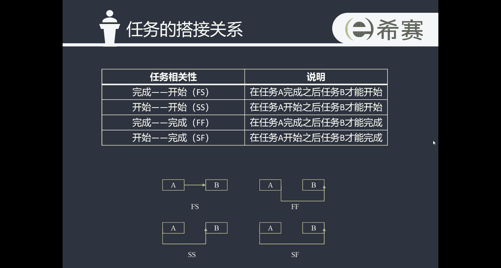
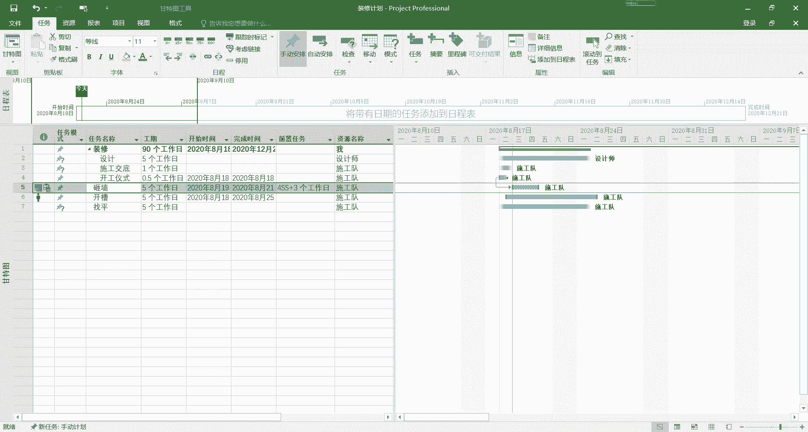

# 手把手教你用Project做项目管理｜｜小白必备 - P7：3.2排定项目日程 - 小哦的PMP之旅 - BV1Bp4y1g7Ai

同学们，这节课我们来学习project视频教程第三章，制定项目任务管理计划的第二小节，排定项目日程，也就是说要对项目的任务进行一个排序，那首先我们要搞清楚任务之间的搭接方式。

任务与任务之间的连接方式一共有四种，学过项目管理课程的同学啊，看到这一页应该就会回忆起来啊，在我们学习项目进度管理这一章的时候，是不是，也学习过任务与任务之间的一个连接关系。

而这四种连接关系呢又会分为两类，完成到开始和开始到完成这两种连接关系呢，我们称它为串联式的连接关系，他们有一个共同的特征，就是在同一个时间段内，只会有一个任务正在进行。

而开始到开始和完成到完成这两个连接关系呢，我们称之为并联的连接关系，他们是会在同一个时间段之内，会有两个或以上的任务并行发生，同时发生的这么一种连接关系，那在大家了解到这些基础的信息之后呢。

我们进入到project中，来看一下设置任务之间的搭接关系的，具体的操作。

设置任务之间的搭接关系一共有三种方式，第一种方式呢是直接在这边的表格区域的，前置任务这一列，这边直接去输入我们的一个搭接关系就可以了，比如说在这边砸墙这个任务啊，他是第序号是排第五的。

那我在这边输入一个它的前置任务四，然后点点一下回车，那这大家在图表区就可以看到，我们一个前第四个任务开工仪式，到第五个任务砸墙之间的一个搭接关系，就这样建立了，这是第一种方式呢，那第二种方式，同样的。

我们直接在图表区点击到上一个任务，然后点住鼠标的左键把它拖下来，大家可以看到这会有一条线出来，把它拖下来，然后连接到任意的一个任务，这边，大家可以看到也可以形成这么一个搭接的关系，这是第二种方式啊。

那同样的，如果我在图表区，我觉得这个搭接关系我不需要了，我想删除它，双击我们这中间的这条搭接线，鼠标左键双击，然后进入到这个对话框中，在类型这边选择无，再点击确定就可以了。

我们使用鼠标拖动这种方式去建立搭接关系啊，以及我们在这边列中去输入一个前置任务，这两种方法去建立搭接关系，都是默认的完成到开始的这种搭接关系，那第三种方式呢就可以双击到我们这个任务，比如说砸墙双击进去。

在任务信息的这个对话框中选择前置任务，然后在这边就可以输入一个前置任务的名称，比如说我们还是输入到刚才的那个开工仪式，在这边的类型，就可以去选择我们四种搭建方式中的一种了，后面的这个严格时间。

严格时间是什么意思呢，它相当于是在两个任务中间，可能会有一个延迟的时间，比如说当开工仪式完成之后，三天我们才开始砸墙，那在这里就可以把严格时间设置为三个工作日，然后点击一下确定。

