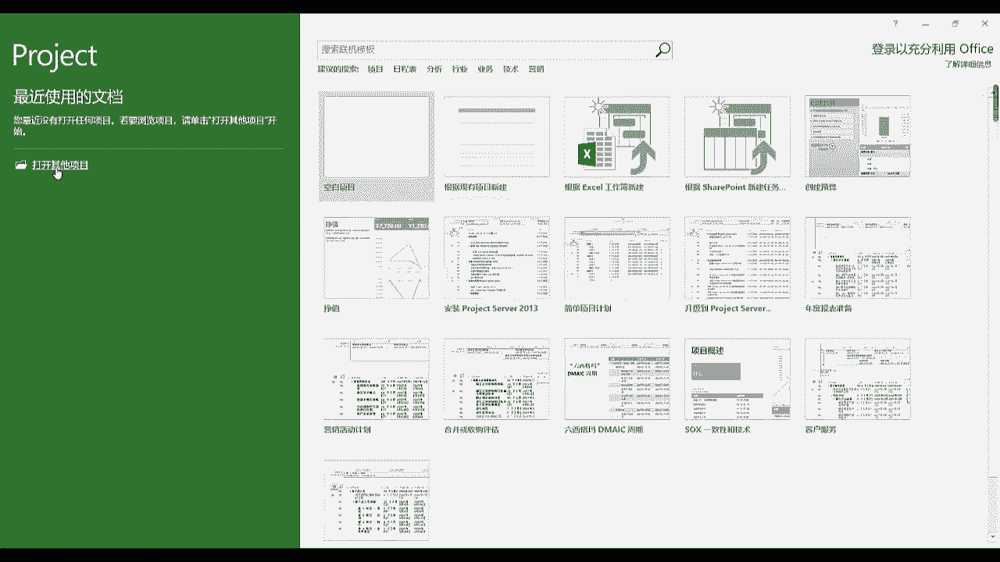
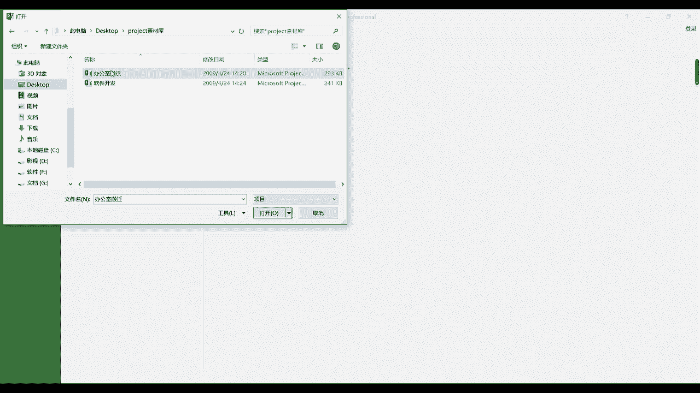
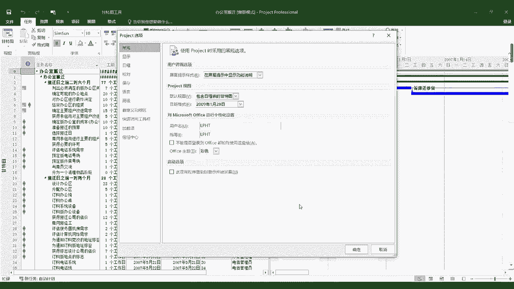

# 手把手教你用Project做项目管理｜｜小白必备 - P2：1.2页面展示 - 小哦的PMP之旅 - BV1Bp4y1g7Ai

好同学们，我们现在正式开始project，2016这个软件的学习啊，首先我们双击这个软件之后，进入到这个程序的第一个界面，叫做开始屏幕界面，在这个界面呢，我们可以去选择新建一个空白项目。

或者说是根据以往的，我们做过的一些项目的模板来开始我们的项目，包括从excel表中去导入数据，以及选择在程序中预设的一些模板来开始项目，同时左边的这边，我们也可以选择去打开我们以往的一些项目。

来继续我们的工作，好的那在这边我们先打开一个预设好的项目，来方便我们理解。

点击预览，然后我们找到我们要打开的文件。

办公室搬迁，好的，这是我们project整体的主页面，那么有一些同学在使用这个软件熟悉了之后，认为不希望再看到刚才的那个，开始屏幕的按钮了，想直接点击文件之后，就可以进入到我们的主页面，应该如何操作呢。

点击文件按钮，点击进去之后，点击一下选项选项，这个界面是我们在使用project进行项目管理时，经常会在这上面进行一些调整的一个地方，打开选项之后呢，我们要去关闭刚才的开始屏幕按钮。

可以在常规的这个模块中找到启动选项，然后把此应用程序启动时显示开始屏幕，这个按钮给它勾掉。

再点击一下确定，这样我们下次打开project的文件的时候，就会直接跳入到我们的主程序了，看到这里，很多的同学应该会发现，整体的project的界面和我们的office的一些经典的软件。

比如说word和excel感觉是非常的相似的，也是由最上面的办公室搬迁这个地方的标题来，以及下面的文件程序，资源报表等这些的菜单栏，而点击每一个菜单栏，下面都会有一些工具的按钮。

这些每一个工具具体该怎么使用，我们在后面的课程会讲到，好的，那么我们再往下看啊，下面的整体的这个区域，是像我们这个打开的项目的甘特图的一个展示，甘特图分为两个部分。

第一个部分是在这边像excel表一样的这个区域，叫做甘特图的工作区，我们可以在这个区域对项目的一些具体的信息，进行一些配置，而配置完了这些，比如说工期时间的这些信息之后，可以在右边的视图区。

看到具体的这些项目信息的一个图形化的展示，在这里我分享给同学们一个小技巧，比如说我们往下翻，翻到这个搬迁日之前，一到两个月的这个时间点的时候，我们是在视图区，看不到这个整体的一个时间展示的。

这是因为工作区跟视图区的展示，是并没有直接关联的，出现这种情况的时候，我们就应该使用到project，这个软件经常会用到的一个按钮，叫做滚动到任务，点击一下滚动到任务诶。

我们就可以在视图区看到我们这个任务的一个，图形化展示的页面了，由于这个按钮经常使用啊，所以我推荐同学们把这个按钮点击一下，鼠标右键，然后点击一下添加到快速访问工具栏，我是已经添加过了。

看他在这里添加到这边之后，当我们比如说在使用别的一些菜单栏的时候，点击这个按钮之后，立马就可以在视图区去观看，我们需要展示的可视化图形了。

