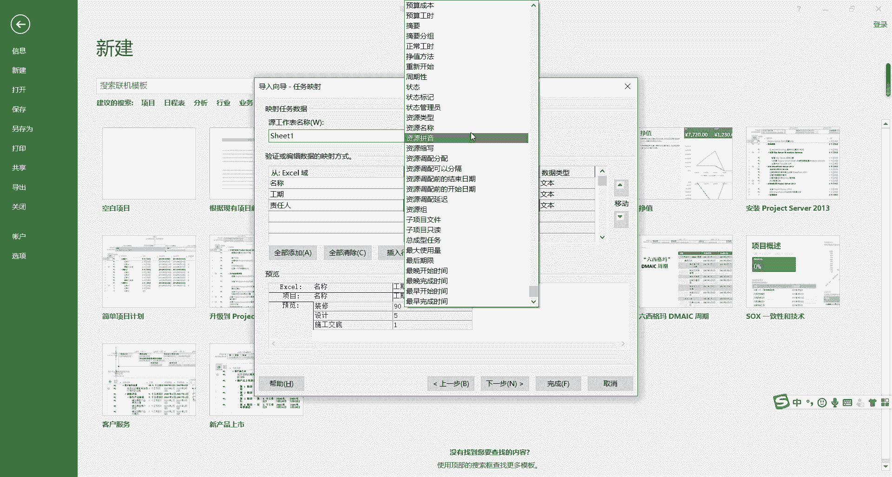

# 手把手教你用Project做项目管理｜｜小白必备 - P4：1.4EXCEL表数据导入 - 小哦的PMP之旅 - BV1Bp4y1g7Ai

同学们大家好，这节课我们来学习，如何把excel表中的数据导入到project之中，这是一个非常常用的功能啊，因为在很多公司做项目计划的时候，可能会把计划先做在excel表中。

然后由我们的项目经理再导入到project之中，那么具体应该怎么操作呢，首先是进入到project的这个界面来，然后点击一下文件这个选项。

然后点击新建，如果说我们的开始屏幕的那个按钮没有关闭啊，会直接点击project的程序进入主页面，就可以进行新建了，那么在新建的这个界面这里我们点击一下，根据excel工作簿新建。

点击一下这里，然后我们打开之前预设好的一个excel文件，在这里没有看到，是因为我们的格式没有选对，所以要在这里把它切换成excel工作簿，让我们看到了装修计划，然后我们看一下这个计划。

这是我自己做的一个小计划。

好大家可以看到这个小计划由三个部分组成，第一部分是名称，装修设计，施工交底这些，然后是工期，也就是说每一个项目，每个任务的一个持续的时间，然后接下来是一个责任人好，是这么一个基本的情况。

那我们看如何把它导入到project之中啊，在这边选择到装修计划这个excel表。

点击一下打开，然后会出现一个导入向导的一个界面，这边我们点击下一步，然后这里会问你是使用新建的映射，还是使用现有的映射，因为我们之前没有做过预设，所以新建一个预设映射，好导入模式作为新项目来导入。

完了在这边选择要映射的项目信息类型，任务信息，资源信息或资源分配信息，那我们明显是一个任务信息啊，选择这里，然后点击下一步好了，然后在这个界面这里原工作表名称，我们选择的刚才的工作表对。

然后这边就出现了，看名称对应到我们max soft project域中的名称的，这个完了工期，那也对应到了责任人，没有对应到，那我们自行输入啊，听过上节课的同学应该知道嗯。

在project中人是作为一种资源来出现的，所以这边我们输入资源，然后点击一下这个下拉框。

可以看到这边有很多的资源选项。