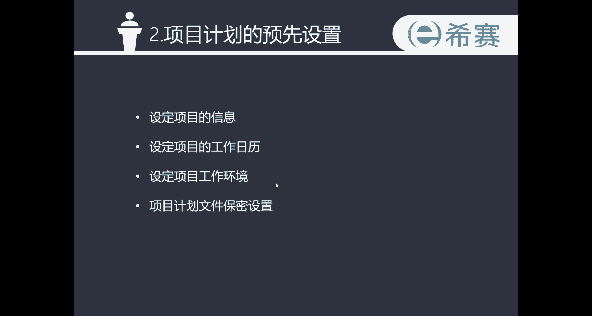
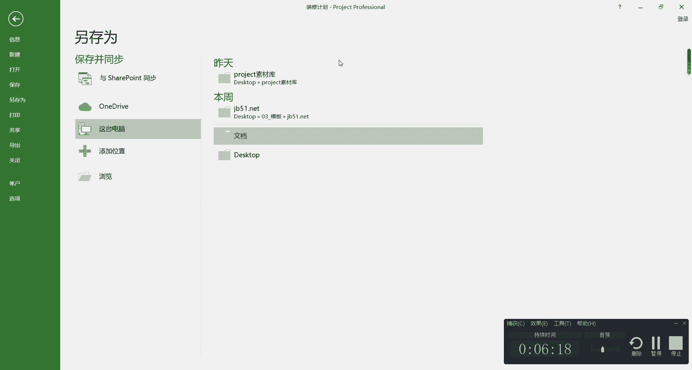

# 手把手教你用Project做项目管理｜｜小白必备 - P5：2项目的预先设置 - 小哦的PMP之旅 - BV1Bp4y1g7Ai

各位同学大家好，现在我们将开始project视频教程，第二章项目计划的预先设置的学习，那么本章的学习，我们将学会设定项目的信息，工作日历，以及工作环境和最后的项目计划，文件的保密设置。

使用project进行项目管理，我们需要预先在程序中设置三大基准，第一个基准叫做日历基准，第二个基准叫做任务基准，第三个基准叫做资源基准，那么任务基准和资源基准，我将在第三章跟第四章为同学们讲解本章。

第二章，我们将重点学习，如何在project中设置项目的日历基准。

那我们切换到project的界面，大家可以看到在上一次课我再跟大家讲到，自动计划时间的时候，跟大家提到过，我们项目的一个预设的开始时间是可以调整的，以及在我讲视图类型的时候。

项目工作表这一块的基准日历也跟大家提到过，日历基准的这个概念，那么我们为什么要设定日历基准呢，设定日历基准可以实现两个功能，第一个功能是设定项目的锚定时间，因为有些项目是正牌项目，有些项目是倒排项目。

但是无论是正牌还是倒牌，我们都需要确定一个锚定的时间，来帮助我们去做项目的一个时间的计划，你比如说我们现在看到的这个装修计划，它就是一个正牌项目，我们知道一个具体的开始的时间，但是对什么时候完成。

其实是不够确定的，而有一些项目是倒排项目，只能做倒排计划，比如说像奥运会，像春晚这种项目，都是我们知道在一个特定的时间，比如说春晚就必须要在大年30之前要完成，这个项目，要完成所有节目的一个准备。

所以倒排计划是由结束的时间为锚定，来从后向前推到我们的项目计划的，第二个功能呢是我们需要确定，在一个工作日中的具体的工作时长，一般一个工作日的标准工作时长是八个小时，但是在一些特殊的项目中也会有例外。

所以我们可以通过设定日历基准的方式，来动态的调整一个工作日内的具体工作时长，好的，接下来我们来看一下具体的操作啊，点击菜单栏的项目选项，然后点击项目信息，在这个界面中，我们可以设置项目的一些基础的信息。

比如说确定项目的判定方法，看这里是预设的是项目的开始日期，那么我们可以也可以把它改成一个倒排计划，就是项目的完成试金为锚定，一般情况下我们是以开始日期作为锚定的好，那么开始这个日期也是可以调整的。

比如说我们往后调，开始日期调到9月1号吧，对然后当前的日期我们就不动了，那么状态日期也是一样的，这里我们可以不用动日历，这边呢预设的是一个标准的和24小时，以及夜班的一个日历，在这边设计好之后。

我们可以看一下统计信息啊，统计信息这一栏，确定了我们项目的一个开始时间，和系统自动计算出来的一个完成的时间，和完成这个项目所有用到的公式，接下来我们还需要去设置一下，对于工作日的一个具体的设定以及排期。

包括是在一个工作日内需要上多久班，或者是什么时候去休息，点击一下项目菜单栏的更改，工作时间进来之后呢，在这个页面就可以调整项目的具体的排气了，那我们来看啊，日历这个选项的前三个24小时夜班和标准。

它是project系统预设的三个日历的模板，那么24小时日历，也就对应的说是24小时，都是我们的工作时间，夜班日历呢指的是周一晚至周六早晨，每天晚上的23点到第二天的早上的八点，是做六休一的一个日历。

标准日历，指的就是系统默认的项目资源任务的基准日历，周一至周五上午八点钟上班，到下午的五点钟下班，中间会有一个小时的休息，时间，是从12点到13点的，并且没有国家的法定节假日，每一个月工作20天左右。

而下面的这三个是我们之前在系统中，预设的三个资源，也就是说，我们可以通过更改工作时间的这个界面，去对每一个资源的一个日历都进行修改，打个比方，我们点击一下设计师，在这个页面。

我们就可以对设计师这个资源的可使用的，一个日历进行定制化的一个设置了，那么首先我们要选择一个基准日历，作为设计师资源，可使用日历套用的模板，这上面预设的是24小时，标准跟夜班这三个日历。

如果同学们觉得这三个日历都不合适的话，可以选择去新建一个日历，在这里名称我们就叫设计师吧，好在下面可以选择去新建这个基准的日历，也可以选择复制三个标准日历的模板，那在这里我们选择复制吧。

复制一下标准日历，好，在这里我们就新建了一个对，有关于设计师的一个日历，现在就比如说啊，设计师是在周一到周五的这个时间，他是休息的，在周六到周日这个时间他是上班的，这种情况我们应该如何去设置呢。

首先点击一下工作中这个按钮，然后在第一列默认的这个地方，点击一下开始时间下面的这个默认的按钮，在这个界面我们可以看到，在这里可以选择三个日期啊，第一个是将project默认时间用于下列日期。

这也就是我们预设的一个选项，第二个按钮是将所列日期设置为非工作日期好，这是我们第二个按钮，第三个按钮是对所列日期设置以下，特定工作时间，那我们先调整一下周六跟周日是需要上班的。

然后点击第三个按钮开始上班时间，从八点钟开始吧，到12点钟到12点钟下班，然后从下午的13点钟，也就是一点钟到下午的五点钟下班好，这是一天是半个小时，然后点击一下确定好。

这样看在日历上显示的是我们设计师，等于说他是没有一天在休息了，一周七天全部在上班，所以接下来我们把周一到周五，设计为设计师的休息时间啊，同样也是在工作中的这个菜单下面，点击开始时间，点击进去之后呢。

看在选择日期这里我们会把它选择到第二项，那么从周一到周五，按住shift，从周一到周五，然后点击一下第二个按钮，将所列日期设置为非工作时间，点击一下确定好，这样大家就可以看到。

我们的设计师的一个工作时间，是在周六到周日了，那在大家做排期的时候，还会遇到一种情况，就是法定节假日是需要休息的，但是在默认的日历中只会做周六和周日休息，但是不会体现出法定节假日的休息。

这就需要我们去做单独的设置了，接下来我们来看一下具体的操作，这个设计师的这个日历我们已经设计好了，我们可以把设计师这个日历直接套用到诶，这点击一下确定，然后套用到设计师的这个资源，这里。

他选择设计师就行了，那么对于我跟施工队节假日是需要休息的，所以我们直接去调整标准日历就好了，在标准日历这边呢，我们点到例外的日期，然后往下看啊，比如说11的这个时间是需要休息七天的，对不对。

这是法定节假日，那我们在这里去做一下调整啊，在这里开始的时间选到10月1号，完成的时间呢选到10月7号，这是11的一个法定节假日，所以名称命名为11，清洁对不对，他是需要休息的，好命名结束之后呢。

我们来进行一下具体的一个调整啊，看从一号到7号这几天是需要休息的，所以是非工作日，然后重复发生呢，因为只有11，这是一个单例的一个时间，不需要重复发生，所以宠物发声的方式就每天每一天就可以了。

然后重复范围也是2020年的10月1日好，这这么设置就行了，然后点击一下确定好，这就我们就可以看到2020年的10月份的，一号到7号都是非工作日了，然后从8号到9号这两天开始上班。

那么一般情况下放了这么久的一个假期的时候，会在假期之后的，比如说10号跟11号要进行补班，我们就把10号跟11号这两天做成工作日啊，哎也是在开始时间这边，10月的10号到10月的到10月的11号好。

这里备注就是补补班，嗯然后把这个时间双击一下鼠标啊，把这个时间设置为工作日好，开始时间就是这个八点钟到12点，然后一点钟到五点钟好，点击一下确定，这样我们就设计好了。

看在10号到11号这两天是需要上班的，然后上班的时间也是我们的一个标准的时间啊，这里设计好之后呢，再选择默认日历的，我这个资源以及施工队这两个资源，在11的时候就会有一个国庆的假期。

以及后面会有一个补班了，但是有些同学可能会说，我们计划的上班时间并不是默认的这个时间，这个默认的时间是从八点到12点，然后从下午的一点钟到五点钟，所有的时间都是这么排气的。

但是我们做项目的时间不是这个时间，那应该如何去调整呢，也是同样的，在选择工作周的这个按钮的时候，在默认的这个地方双击一下，然后完了把周一到周五点shift选上，因为这是我们正常的一个工作时间啊。

然后选择第三个选项，对不对，开始时间我们把它调整一下，我就以我公司为例啊，我公司是08：30开始上班，然后中午是12点钟下班，下午呢是01：30开始上班，然后到下午的到下午的六点钟，也就是18点下班。

点击一下确定，大家就可以看到在一些正常的日期里面，我们的正常的上班的时间，就是从上午的08：30到下午的六点钟了，那么在这里调整完了之后呢，同学们要注意啊，这是我们做计划的一个日历。

但是它跟实际的一个工作的日历是有偏差的，这就需要我们去做一个调整，如何调整呢，点击一下选项这个按钮，在选项这个界面啊，我们可以看到系统默认的项目的开始时间，是从八点钟的，而我们实际做的这个计划的时间。

是从08：30开始的，这时间长了，因为这边也是计算的是一个八小时，而我们上班的这个时间，相当于是偏差了有半个小时，这样再去往下推进项目时间计划的时候，就会逐步的出现这个误差，所以说同学们一定要注意啊。

在你设置了这个上班的计划之后，还要记得在系统的这个默认的开始时间，要相应的也做调整，选择到08：30啊，然后默认的结束时间选择到六点钟诶，这就可以了，完了我们的这整体的这个默认的选项啊。

如果说你不单单是想应用在我们这一个计划，而是想在所有的新项目都应用的话，可以在这里去做一下选择好，在这里我们点击一下确定，然后在这里再点击一下确定，这样我们整体的一个项目的日历基准就做好了，完了呢。

同样是刚才那个选项，在文点击文件这个菜单栏，再点击一下选项，这个地方点击日陈，这里也是可以进入了，同学们会想一个问题啊，刚才设置的这些日历，我们如何去做一些修改呢，比如说有些日历我不想要了。

或者是有些日历我想把它套用到以后，未来的一些日历中，这也是可以做的，点击一下文件这个选项，在信息这个菜单栏，点击一下组织全局模板管理器，这个按钮点击进去之后，就可以看到这样一个管理器的页面，点击日历诶。

大家在这里就可以看到，左边这些是系统默认的日历的模板，右边呢就是我们刚才自己定制化的一个模板了，我们可以把我们可以把我们自己做的这个模板，把它点击一下，复制套用到我们系统预设的模板之中。

这样就可以在以后我们再去做一个新的project，项目的时候，套用到这个日历了，那同样的，有一些同学可能认为这个日历我不想要了，我不希望用它了，那也是可以在这里进行操作的，比如说在这里点击一下删除。

就可以把这个我们套用的这个日历给删除掉了，这就是我们整体对日历基准的一个操作，完了再给同学们介绍一个小技巧，我们的项目管理文档，在一般的情况下都属于是机密文档，整体的一个日程是不方便给外界透露的。

这个时候，就需要给我们的项目文档进行一个加密了，那具体的加密方法呢是在这边点击保存的时候，点击另存为，我们随便选择一个地方，比如说就选择到文档这个地方，然后再进入这个另存为的界面的。

这里的时候点击一下工具这边的下拉框，点击这里的常规选项，完了在这边我们可以去设置一个保护的密码，比如说在这边我设计了保护的密码，然后再点击一下确定，重新输入一下密码，再点击一下确定。

好这样以后需要打开这个文档的时候，就需要输入密码了，这就给我们的项目文档做了一个加密，以上就是我们第二章全部的内容，接下来我们将开始第三章。

项目任务基准设定的学习。