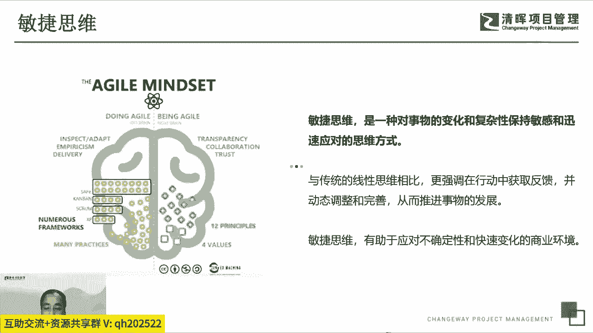
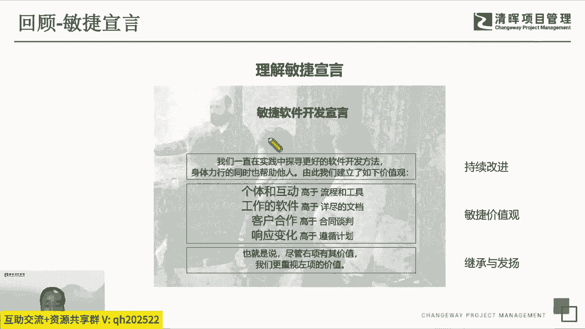
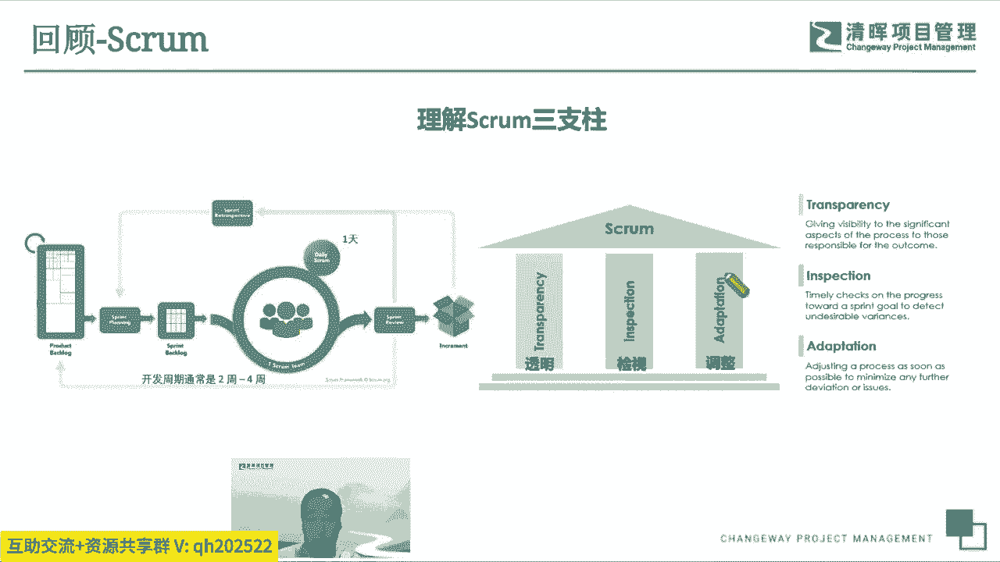
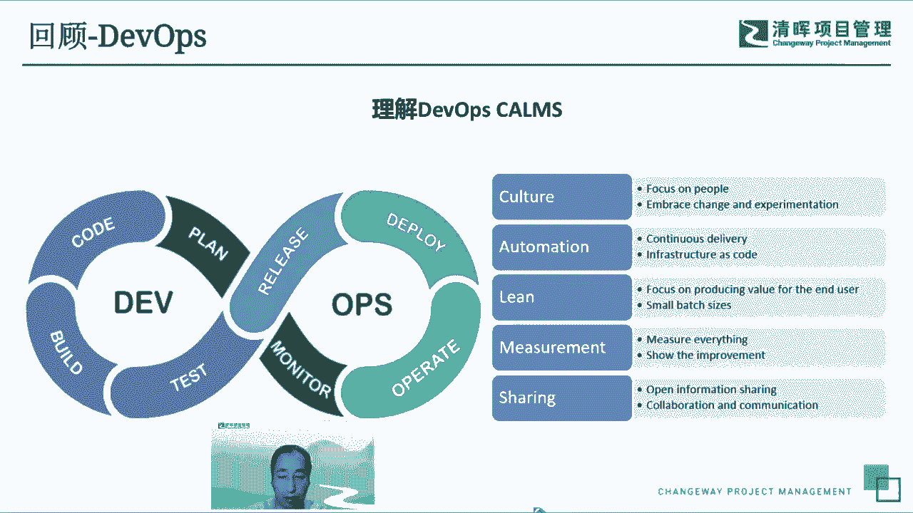
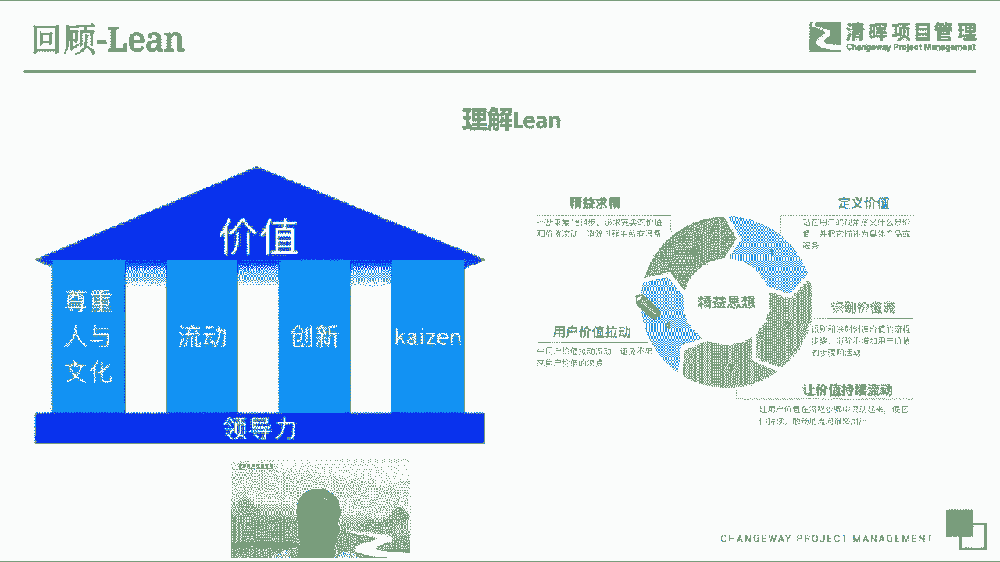
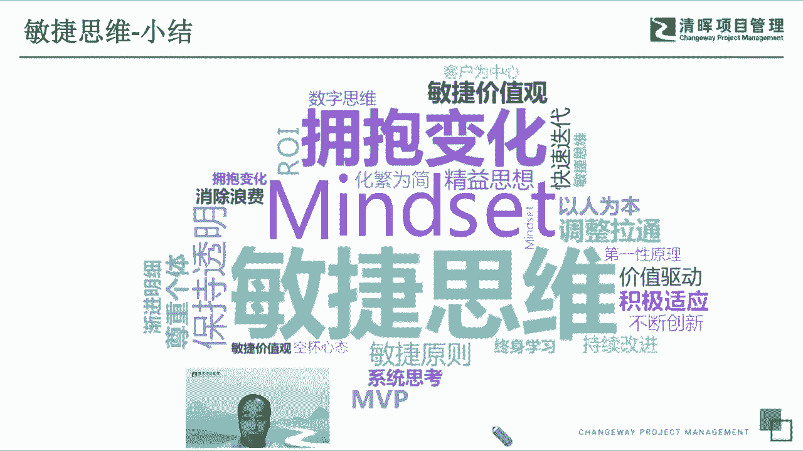
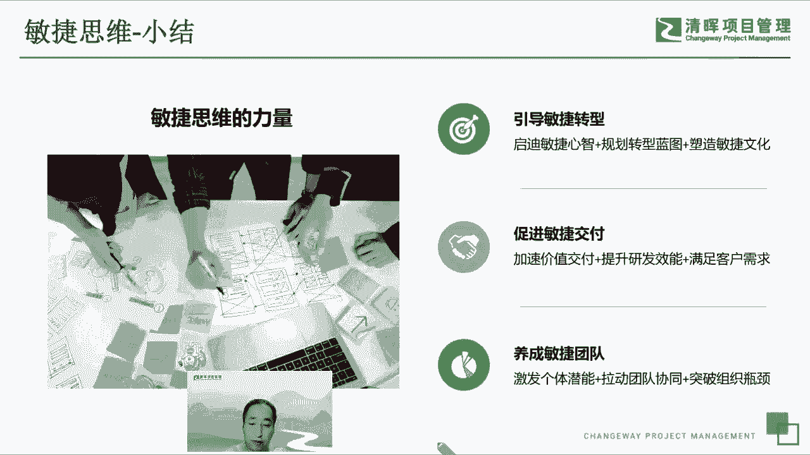

# 打破思维的错--敏捷思维5讲 - P2：2.敏捷思维-小结 - 清晖Amy - BV1HM4m167HM

实际上我们讲敏捷思维，它本质上是一个嗯是一个很很很高层级的一个，精神的精神世界的一个一个理念，我们实际上我们怎么来的这个敏捷思维，实际上它是从无数的敏捷的方法和实践，从前人的这些民间大师们的。

这个给我们留下的宝贵财富里边，总结和抽取出来的，我们回顾一下，说敏捷，实际上最初的敏捷就是来源于我们意见，敏捷宣言啊，我们去看一下，我们2001年发布的这个敏捷宣言。

他提到的很多很多的之后大家讨论了很多，最后精简成四句话啊，然后我们看一下说呃，能够体现出来这个敏捷宣言，代表的持续改进的观点，敏捷的价值观的观的观点，个体的就是个体的观点啊。

然后以及持续改进的观点等等等等，这是我们敏捷宣言，它四句话之外的代表的很多，很多的其他的一些内涵，这是我的敏捷宣言。

同时呢在敏捷宣言之后呢，我们又敏捷的12个原则，其实它也是很多很多思想的一个结晶，然后这里边大家可以看一下，有怎么样让客户更好地满足客户的要求，让客户满意，我们要求积极的拥抱变化，然后怎么样去呃。

以短周期的方式去去做工作，而相互要积极的配合协同，和大家互相信任，然后启发自己的潜能呃，然后呢我们还有精神经常的沟通等等等等吧，包括我们说要追求卓越，要保持简单，大家要自己管理自己组织呃。

经常的回顾反省啊，这个都是我们敏捷12个原则，也是敏捷思维所代表的内涵。

然后我们看一下，在基于这个敏捷宣言和敏捷这个价值观之外呢，我们回顾一下我们经常用的一些敏捷方法，他的一些理念和呃和和一些精华啊，比方说大家现在用的最为广泛的这个SPM，这个这个这个方法呢。

实际上大家看左边AGRAM，大家能看到说它它有很很简洁的一个表达形式，里边有这个基于价值驱动的这种方式，有短迭代，有经常的回顾，有频繁的沟通交流，有增量的交互啊等等等等。

然后敏捷那AGRAM里面它有一个三个支柱啊，就是这个是非常非常核心的一个呃，ram的一个内涵，第一个叫透明，就是所有的事情都要都要公开的透明，让所有人的都知道，信息要保持充分的拉通啊，第二个呢叫检视啊。

或者是经常性的的这个检查啊，啊，这个是说我们要不断的去看，我们的这个当前的状态，不断的去去看我们现在有什么样的障碍，然后我们看现在有什么样的一些额问题啊，然后要需要以很很快的方式去大家交流。

这些这些问题，同时呢及时的去做出一些相应的这个调整，要非常快的响应外部的变化，内部的变化，响应客户的要求，找一个需求的变更，响应这个问题的处理等等等等，而且要及时的做出调整。

这是SCM它之所以非常简单又非常有效，能够让大家用得这么广泛的一个真正的原因，就说它很透明，然后经常的要要去看自己的状态，要看评估自己当前的情况，并及时的做出有效的调整啊。

这是我们gram它的一个核心的这个支柱。

第二个呢，现在我们大家能看到应用的非常广泛的一个，一个方法叫德奥斯DIOS，其实现在是基本上是呃，在工程领域用的最为广泛的一个，一个一个方法论，大家能看到这里边它实际上是一个循环的环。

然后他其实内内在也是代表了说频繁的迭代，然后打通的这个部门这之间的隔阂，然后开发运营的质量要呃紧密的写作啊，他呢也有一个呃呃带旺夫的文化，叫CAMLMS，其实它代表了说要要要有这个呃。

以人为本的这种文化和响应变化，然后经常性的这个呃咳经常性的这个呃调整，然后呢要要追求这个效率最优，要要要尽可能的自动化，要持续的交互，然后呢把把我们的基础的设施要搞得好好的。

让我们的这个工作在这个平台上的这些人呃，效率最优，效率最大化，然后呢要要精益啊，要要要要呃以以区的业余，以这个拉动式的方式，频繁的交互交互这些价值呃，呃呃呃，然后第四个呢要要及时的度量。

所有的事情呢都要可度量，有数字，然后以数字来决策，这也是戴维斯的一个典型的文化，非常非常优秀的一个一个实践，最后一个呢，他的文化里边有一个特别重要的一点，就是叫分享，share啊，就是这也是敏捷。

其他的文化也也比较强调的一点，有大家要经常性的交流信息，要对内的呃沟通，对外的分享，要及时的去拉通这些所有的信息，让我们整个的这个交互也好，团队协作也好，能够变得通畅，这是戴帽子的文化。

大家可以理解一下，其实大家在一边在听的过程中，一边去看这个图，去理解这些经典的这个敏捷方法论，他之所以能提出这些文化也好，理念也好，支柱也好，他都是说经过很多人很多人的实践总结出来，说，从思维的方式。

这些对我们的工作是非常非常有价值，也非常非常有益的。

然后呢，接下来我们回顾一下金翼，金翼呢其实是发展非常年头很很久的一个，它起源很早很早了，比甚至比敏捷宣言的还要早很多年，而金印是我也是，我们这整个从不管是在我们传统的这个呃，这个制造业。

还是我们现代的这个软件研发领域，现在都是呃大家都讲出精益精益，它也有很多很多不同的分支啊，精益创业精英，精益思想，然后精益的这个各种各样的经济开发等等等等，那精英里面。

它实际上左边这个图是我们非常知名的，一个叫金义乌啊，这个大家能看到说他首先上来就强调说，所有的事情要基于价值啊，价值拉动，然后呢中间有金印的屋的四个支柱好，第一个呢首先就就要提倡尊重人和文化。

就是每个人都要去尊重个体，尊重人，然后有建立相应的这个以人为本的文化啊，第二个呢他讲求的是拉动，实际上就是价值拉动啊，也是呃是要尽可能这个效率更优啊，第三个呢是一定要讲究创新啊，我们不光是要价值驱动。

而且要通过创新的方式去，让我们的这个效率变得更加的高效，然后呢最后一个这个是一个，这叫实际上叫开着是一个呃日文的词，实际上他他他提倡的就是持续的改进，不断的改进，让我们的这个整个去基于拉动式交互。

这种这种理念也能够能够持续的变得更好啊，右边这个图大家看一下，这个是现在的啊，最近几年在这个这个，因为现在有很多很多的这个比较大的企业，规模的企业里边在做，这叫规模化。

敏捷的shift到这里边的一个定义呃，他的一个经营思想里面强调说，哎这个首先要精益求精，然后第二个和第，直到后面这几个都是讲求，基于价值拉动式的这种理念啊，然后我们要要关注价值。

要基于价值去做很多的很多的这个的设计啊，然后呢去围绕着用户的价值去做我们的规格，所以它核心的就是一个是追求价值，聚焦价值，第二个呢是说我们要精益求精，不断的改进，这是精益思想的一个原理。

好，那我们又提到了，说我们现在这个用的非常广泛的这个save啊，这个是规模化敏捷，前面就提到提到是一个呃，单排没敏捷的SQUARM啊，啊dio ops啊，这些他提倡的是单核队的啊。

规模敏捷里边也是强调说，首先也要要就比较比较呃，希望大家能够频繁的在对其拉通，这个实际上跟前面的这种我们要频繁的交流，然后呢是是是是内核是一样的啊，第二个呢保持透明，跟前面那个surround。

三个支柱也是也是完全一致的，那第三个就叫以人为本，这个是所有我们民间方法里的，之所以区别于其他的传统的管理方法里边，一个最大的不同，其实我们现在都知道，有有很多经典的传统的管理学啊。

都是呃讲求的就是发挥流程的优势，发挥管理的这个一个价值啊，他但往往呢就比较少关注人，在敏捷里面都特别强调说要去关注人啊，以人为本，要要有要有这个呃尊重人的这个文化，要建立以人以人为本的这个围绕人去做。

做工作的这种这种组织啊和文化，同时呢这个SAF也是一样，强调不懈的改进，这跟这跟这个gram也好，跟这个DOOS也好，跟那个经营也好也好，都是一样一样就一脉相承啊，无论他怎么演进，都是啊都是一样的。

是我们要只要去以人为本，要去保持透明啊，要按价值的去驱动，要不断的改进，好那个save里面他也有，基于这个跟跟敏捷宣言类似啊，就是他也扩展了它它很多的内核啊，就是有一些。

比如说我们要追求的所有的事情都要有价值的，有经济价值，然后要用系统思考，要快速的迭代和学习，然后要得到的量要价值不受干扰的流动，顺畅的流动，拉动式的交付，然后要尊重知识工作者，尊重个体。

然后围绕价值进行组织，大家能看到这里边有很多很多的一些关键词啊，价值啊，系统思考啊，持续改进啊，呃然后那个尊重个体啊等等等等，那都是我们这些方法。

所以我们汇总起来看，我们讲求敏捷思维啊，MAD set这个这个词呢我们可以看一下，它有很多很多的标签，那么我们总结一下，从不同角度来来来汇总这个事情，就我们可以看到敏捷思维讲究的是说我们要用。

首先要有可能要拥抱变化，要注意要要要基于敏捷价值观和敏捷原则，要以人为本，要积极的创新，积极的适应和调整，保持透明，要消除浪费啊，尊重个体啊等等等等吧，然后要化繁为简，把重要复杂的事变得简单。

要要要做这个持续的改进等等等等，这只是一部分的，我们总结出来的这个标签啊，实际上这些都体现了说我们什么是敏敏捷，什么是额敏捷思维啊，这个是实际上是我们的一个集大成，就。

是所有的这些经典的敏捷方法和实践背后，它代表的都是说体现了敏捷的思维，敏捷的理念，敏捷的精神内核，这个是我们敏捷的这个思维的一个小结，大家可以看一眼，非常非常多，然后我们每个人也可以按照自己的理解。

去给敏捷思维，去贴自己的理解的标签，可能还有更多更多的每个人读读到的一些呃，思考啊，都可以好，这个是我们今天讲的第一部分，就先大概呃给大家一个直观的感觉，说敏捷思维是是怎么来的，它的定义是什么啊。

它它它它之所以成为民间思维，它是从那些呃经典的方法，敏捷方法里面抽取出来，大家有一个基本的了解。

那我们讲敏捷思维，我们具备敏捷思维，实际上呃它有非常非常大的力量，非常非常高的价值，我们我我们之所以提倡敏捷敏捷思维，或者是要要训练敏捷思维，我们是希望能够通过敏捷思维这个引导。

能够带领我们引导我们去做敏捷的交互啊，促进我们敏捷交互，更更更好的做价值交互啊，提高我们的研发效能，然后那个能够满足客户的一些需要，满足客户的要求，同时呢如果我们在组织层面的，不管是个体也好，团队也好。

呃，或者是大的企业也好，我们能够积极的通过敏捷思维的这种引导，引导我们去做敏捷转型，让大家有具备这个敏捷的一些呃心态，总结的一些心心智啊，开启思维，开启思路，然后呢，帮助我们通过这种敏捷的规划去去推进。

我们自上而下或者自下而上的这敏捷转型，然后呢我们能够在我们的团队或者组织层面，塑造出来我们独一无二的这种简约化，同时呢特别重要的一点是，我们希望能够通过敏捷思维的这个训练。

它的它的价值体现在让我们每个个体，我们的人围绕着人类这个个体和团队和组织，都能够发挥出比自己更大的力量啊，激发出自己的潜能和突破自己的一些上限，然后能够促进的，拉动我们的团队之间的一个协同。

大家突破这个各各自的一些思考的，在僵化的模式，思考的一些固有的思维和相互之间，怎么样去找到最好的协同方式，协同方式，然后能够突破组织的一些瓶颈啊，打破我们一些呃障碍，让组织变得更高效。

这个是我们敏捷的思维的力量和价值，通过这些方式，我们如果具备了敏捷思维，能够更好的帮助我们个体成长，帮助我们团队交互。

