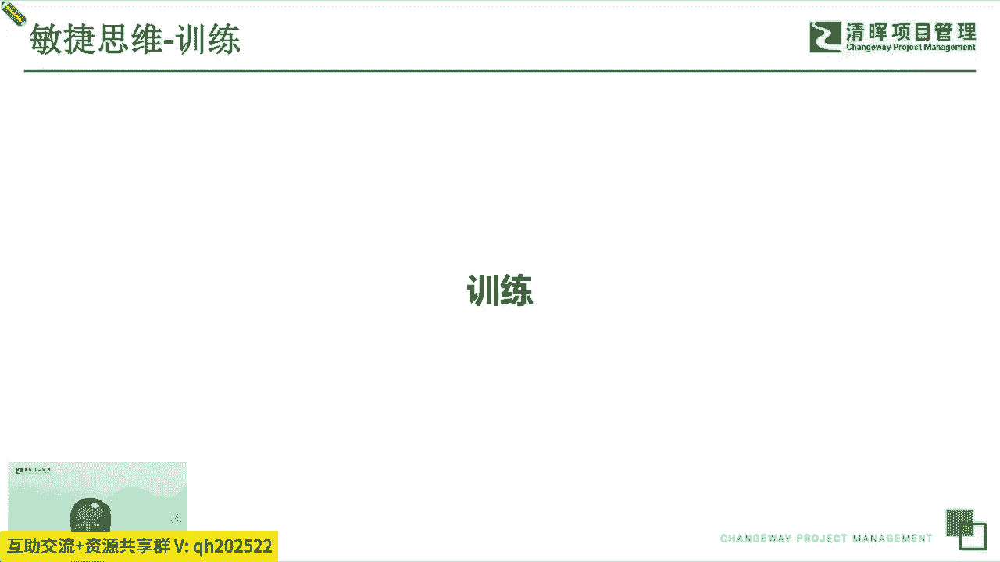
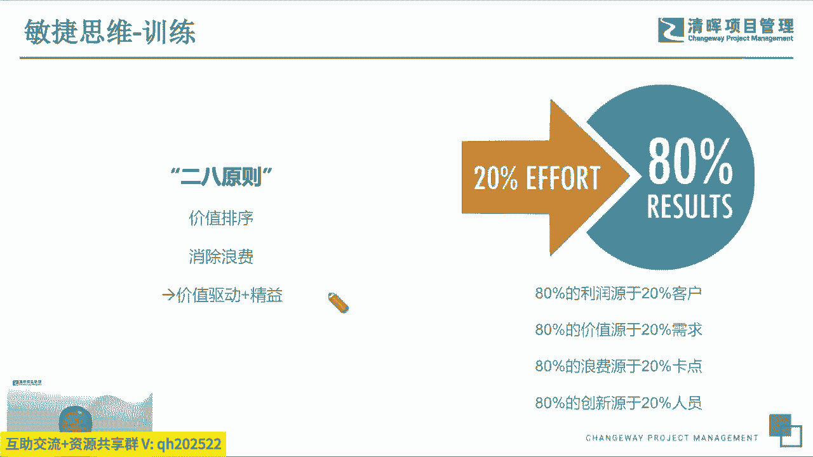
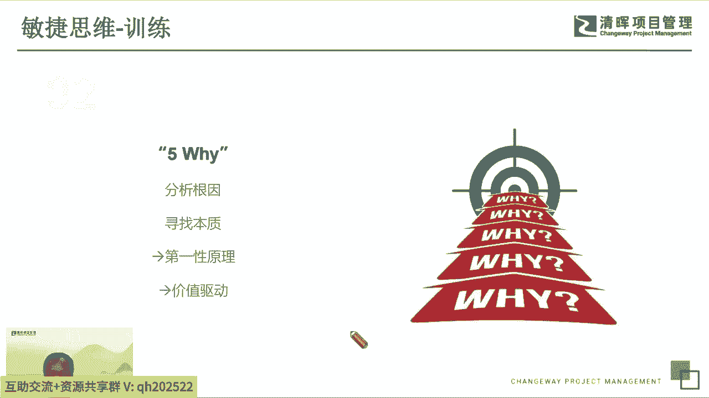
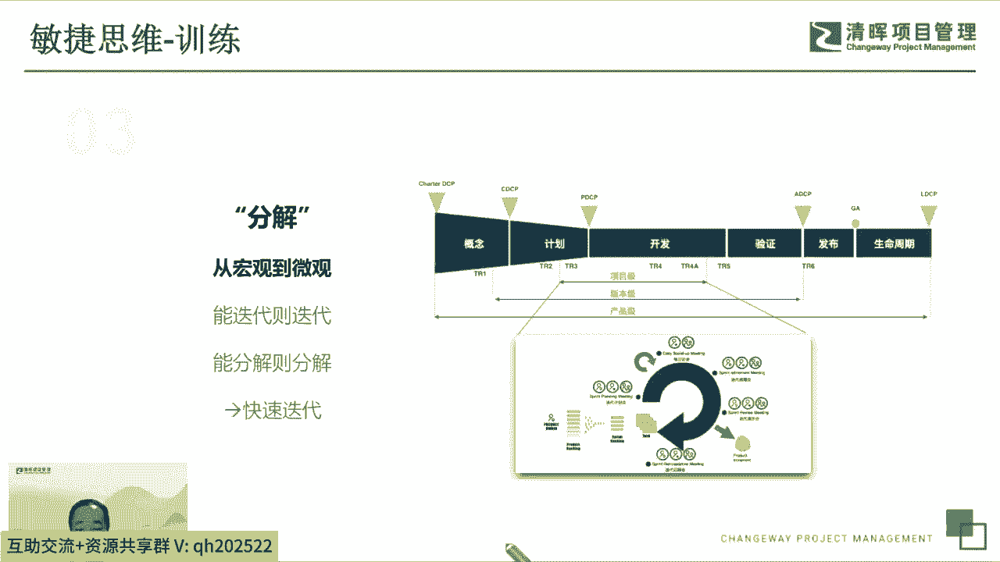
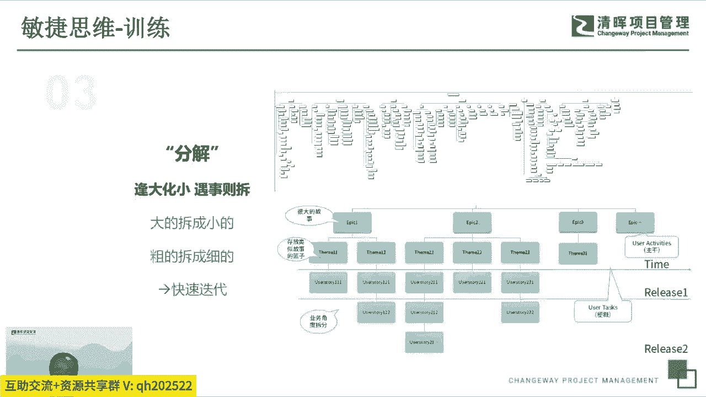
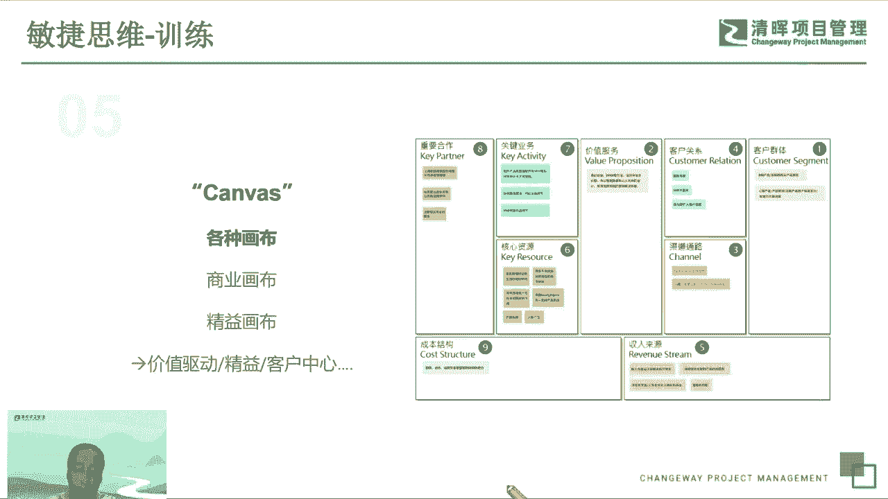
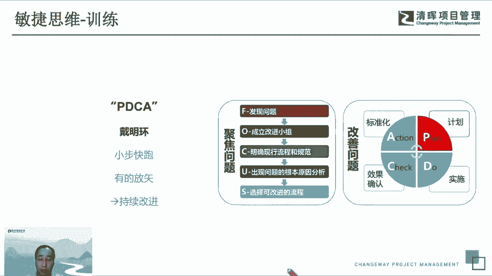
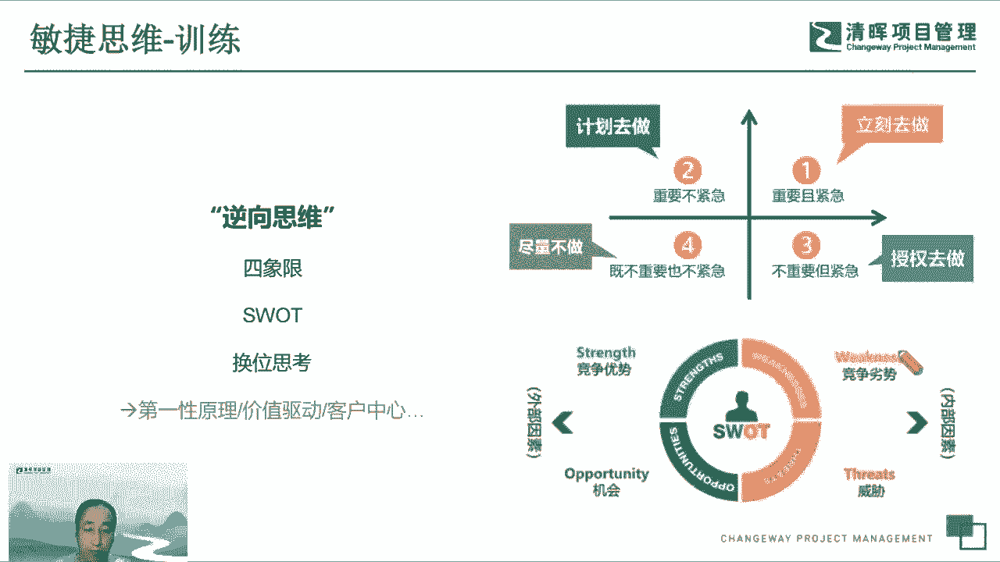
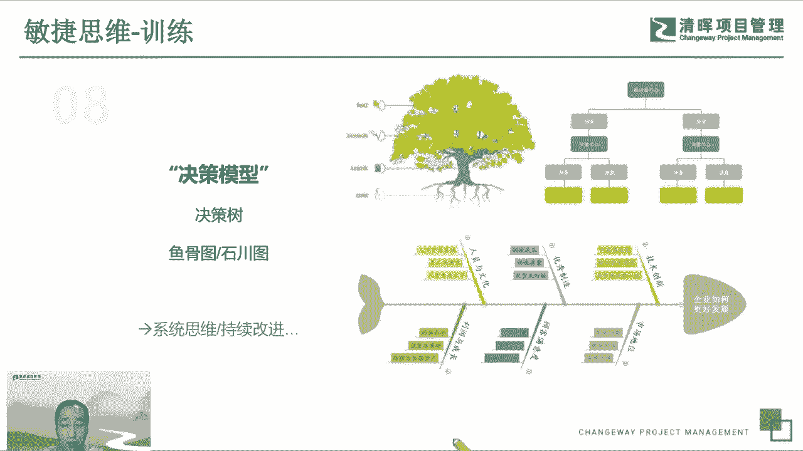
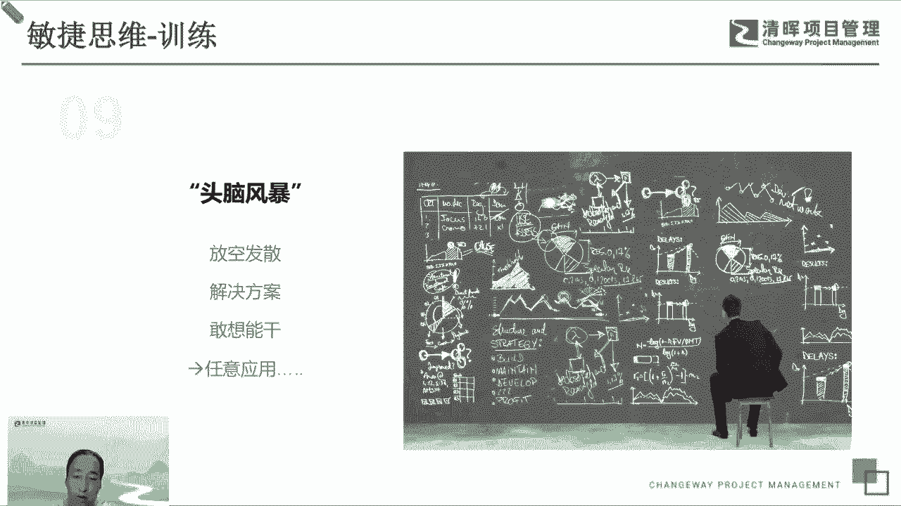

# 打破思维的错--敏捷思维5讲 - P4：4.敏捷思维-训练 - 清晖Amy - BV1HM4m167HM

好这个是前面我们花了很多的时间去讲，这个敏捷的思维在我们工作当中的一些应用，然后呢，我们其实里面也包含了一部分的，这个叫呃训练呃，呃接下来呃我会摘几个重点的思维训练的方式，给大家简单介绍一下。

其实呃大家能看到大家自己去网上搜索。

各种各样的一些工作思维的一些模型啊，方法非常非常多，额这个不就一一阐述了吗，我就简单的讲讲几个点啊，第一个我想讲讲这个二八原则，这个非常简单啊，但是又非常应用的非常广泛，也非常有有有有有用。

比方说我们二班院作，就在我们的这个跟前面我们讲的这个理解思维，这些实践去结合的话，大家能看到它非常有助于我们去做价值排序，去消除浪费，我们都知道好多的，比方说我们一个这个市场当中。

我们很多的客户其实是呃和一些核心的客户，贡献了我们大部分的这个利润啊，所以我们要服务好这些客户，我们做的这个产品或者做的这个系统，有很多的功能其实是是没有价值的或者低效的，甚至有很多功能从来也用不上。

交付给客户之后呢，其实也没有应用应用环节，所以我们那些就是低价值的这个这个这个需求，或者是功能，那个本来在我们的迭代交互当中，应该把他干掉的，所以我们去先去做价值高的，优先级更高的这些一些需求。

这也是二八原理去帮我去识别，哪些是真正的高价值的，哪些是低价值的，能够帮我们去消除浪费啊，能够更好的满足我们，价值驱动和争议的一种思想。

第二个想加强5Y，这个是我们经常用的一个方法，就是呃我们总是会额呃会会会想这个事情，就我们要做一些工作，怎么去改进呢，我们其实好多时候做了很多的改进，但是没有找到根本的原因，这个事呢。

实际上就是帮我们去寻找它本质的东西，去寻找它根本的东西呃，说5万呢不停的追问，然后能够去呃去去找到一些，我们满足第一性原理的，我们企业的存在的根本是什么，我们改进的最核心的这种这种节点在哪里。

这个以外去能够帮助我们去去识别这些东西，包括我说我们可能去看我们这一次的交互的，这些需求，那怎么去判断它有没有价值呢，或者是高价值低价值的，我们去追问，去看看这个这个用户故事。

他真正的这个价值点在什么地方，不断的去追问他满足什么样的场景，满足客户的什么的背后的这个需求。

第三个呢额叫分解，分解是一个额通用的技能，但是又是一个呃挺关键的技能啊，就是我们讲我们第一敏捷的这个思维，第一个就叫迭代的快速迭代，怎么能快速起来，就把大的事情呃拆小了，然后呢能迭代就迭代。

能分解出就分解，然后呃不要去一次性做那种大计划啊，这种这些分解。

然后呢，所有的事情遇到的都是逢大化小，遇事则拆，能拆就拆，大的拆成小的，粗的拆成细的，拆完了之后，我们才能够更快的去分批次的交互，分批次的去去做迭代的计划。

然后呢呃第四个的训练，我们想讲讲这个叫呃关键路径啊，这个实际上是一个传统的这个这个方法，但是它又很有效啊，其实它核心的点是说，帮助我们去去尽可能的，消除我们这个工作流程当中的浪费。

消除我们交付价值当中的一些呃低价值的点，然后然后找到核心的这个逻辑关系，找到相互之间的依赖关系，这样才能帮助我们去识别，哪些是应该先去做的一些功能，哪些是要后做的，哪些是没有价值的。

哪些是更快的能够帮我们去排计划的，这个是一个呃挺挺有用的一个一个方式啊，然后第五个想讲讲画布，当然这里边有很多很多的画布，实际上画布它核心是一个呃结构化的一个东西，就是实际上是让我们去呃去重新思考啊。

重新在大脑里去去，各种重组我们的思维维度的呃，所以我们有各种发布相应化精英化布个人发布，这个有助于我们去从不同的角度去看，我们要关注的点，哪些是有价值的，哪些是可以消除浪费的，哪些是符合第一性原理的。

哪些是可以满足快速交付的，那这个都可以帮我们去呃不断的分解，不断的梳理，能够让我们去去做这些这个呃训练，这个大家可以在网上搜一些这种画布，这个他已经是对这些画布本身，都是一些这个抽象化的模型。

它已经结构化了，非常有作用，然后能够带着我们去思考啊啊这PDC不多讲了。

就是跟前面讲的一样，能够帮我们区区的改进，而我们每个人都要有一个呃，行为习惯或者思维的方式，就是我们做事情先先想一想，有有一点点小计划，然后想想的小小的有一个规划之后，开开始快速的小步快跑快跑。

然后在实践当中一边做一边改，一边去标准化啊，就是这么这么一个逻辑的循环的方式。

还有一个呃就是很有用的一个训练，就我们思维的训练就是逆向思维，这个实际上我们去呃去找我们的这个价值，找我们的客户，找我们的这个第一性原理的时候都用得上，比方说我们去看诶，这个我们的这些你想做的事情。

哪些是要优先做的，哪些是后做的，这个两个这几个方式都都是非常有用的，然后我们四象限，当当然，这个四象限，大家可以按照自己的这个逻辑去组合啊，就组不组不同的象限。

然后那个嗯smart也是一个常用的一个方式，能够帮我们去做这个相互之间的对比，帮我们去逆向的思考和客户在想什么，我们的合作伙伴在想什么，我们自己需要改进哪些地方。

然后决策模型的训练也是一样，大家就可以看这个决策树和这个五骨突破，这个都是很很典型的这个模型抽取出来的一种，其中有方法，思维方方式啊，他还可以，其实他的呃逻辑也都是说分解，分解完了。

我们基于这个分解的节点去去看看，我们在这个节点当中需要去优化哪些局部，要去需要去思考什么是什么，是什么方式，所以这个帮助我们去做一些系统思维，帮助我们去做持续的改进，这个都是啊都是一些很很成型的。

但是也没那么复杂，然后用起来也很快呃，效果还很好的一些这个些些小的方法，训练的方法。

然后最后一个想简单讲讲这个额头脑风暴，这个头脑风暴其实不光是这个呃，大家一起来来来探讨，有的时候可以小范围的搞一搞，甚至自己在自己个人头脑里去去去做一些这个，发散性的思考，让自己就是放空了之后就是发散。

然后再去创新性的，有很多不同的新的idea可能会冒出来，而且我们同时呢需要发散之后呢，要收回来，要提出解决方案，提出解决方案之后呢，我们在工作当中呃，就就有了解决方案，我们要敢想敢干。

并且能把它干好这个，所以我们在头脑风暴是一个万能的一个，因为所以大家都可以在这个当中去训练自己，去多发言。

