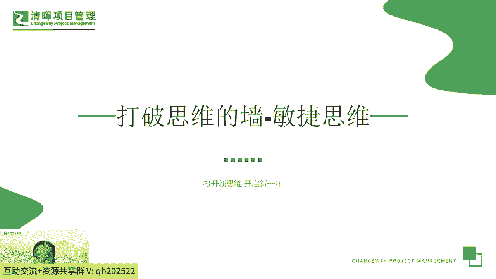
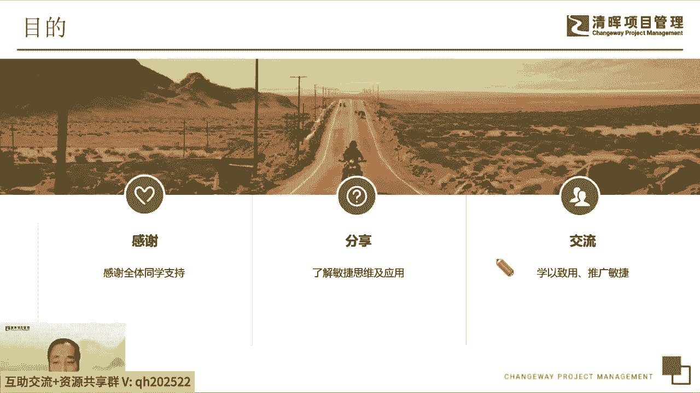
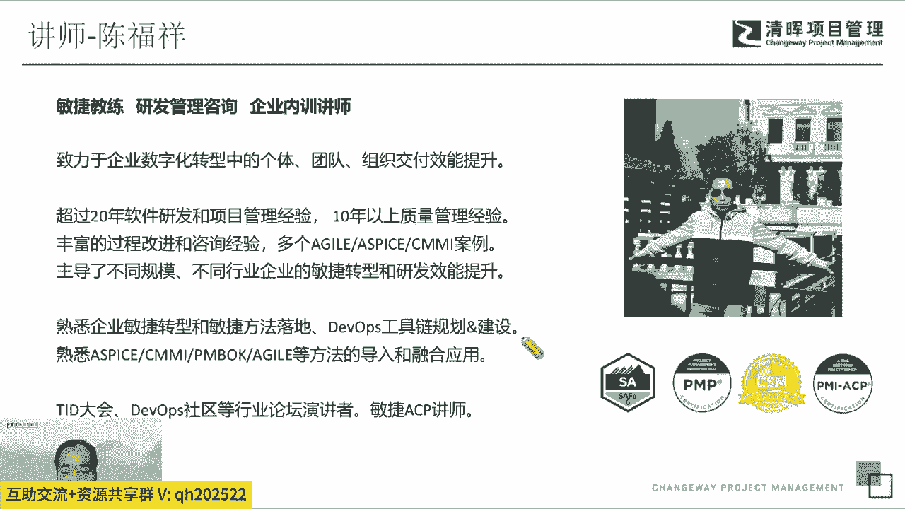
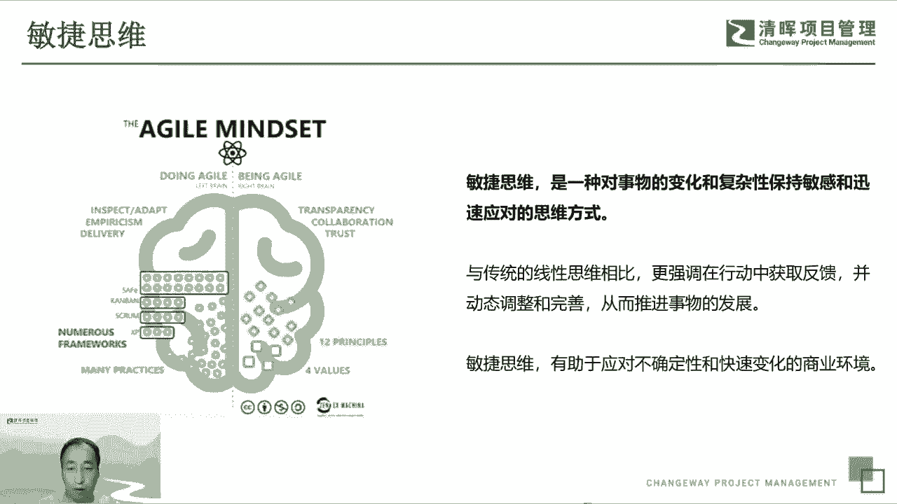

# 打破思维的错--敏捷思维5讲 - P1：1.敏捷思维 - 清晖Amy - BV1HM4m167HM

呃那我们就开始吧，非常高兴在今天晚上呃，在在在能在线上和大家交流啊，非常非常高兴，我看直播间里面已经来了非常多的小伙伴呃，好的好的，谢谢我看到你留言了，非常好，谢谢呃，今天我们的在线上大家一起来交流啊。

这个来来交流一个共同的话题叫做敏捷思维啊，所以就是我们今天晚上的主题起了个名字，叫打破思维的墙，敏捷思维啊，就是正好也是赶在岁末年初吧，我觉得大家都都面临着新的一年是吧，所以我们趁着这个机会呢。

我重新梳理我们每个人的工作和生活，我们通过这这个这个主题呢，我们希望大家能够开拓一些新的思维，然后呢来迎接新的一年，然后然后让我们的这个工作和生活状态，能够更饱满，然后去更好的工作啊，谢谢。

首先非常感谢啊，就是个线上来了这么多的额同学，然后有的是应该是之前陪伴着一起，一起听过几次的这个同学们，然后感谢大家的长期的陪伴。

也感谢新新来的很多的同学，然后呢我们希望今天通过今天的分享，让大家对这个敏捷思维和怎么用敏捷思维，有一些基本的了解，然后呢我们也通过这个机会吧，啊通过这个这个清辉这个平台，我们能够更多的去交流敏捷啊。

学以致用，然后更多的去推广敏捷，每个人都敏捷起来，呃在在主题之前，我先简单的介绍一下我自己，额，我呢是是现在是一个一个敏捷教练，然后同时也从事这个研发管理咨询，包括企业内这个各种的内训讲师吧。

啊整个在这个整个这个工作经历当中，已经有20年多年，一直在软件和i it行业吧，呃从事的这个工作岗位，从最初的这个软件开发出身啊，到后期做项目管理，产品管理以及这个敏捷教练。

到现在也开始转做咨询和呃讲师啊，所以就是整个经历呢是比较算是比较丰富吧，啊做了很多的一个项目，也经历了很多的客户啊，对这个敏捷也好，或者传统的方法都有比较多的了解呃，也也是啊。

借这个借这个星辉这个平台能够呃，希望能够传递给大家更多的关于敏捷，关于项目管理的一些知识的一些呃思考哈，希望通过这个能够大家一起来学习。

今天我们的主题基本上分为三个部分啊，整个时间大概是一个半小时，多一些到两个小时之间，我们先简单介绍一下，我们对这个敏捷这个思维这个主题呃，我们讲讲什么是敏捷的思维，然后敏捷思维的一些来源。

然后以捷敏捷思维它的内涵都是什么，然后呢我们第二部分呢，重点讲讲说我们在实际的工作当中，怎么去实践这些敏捷思维啊，我们怎么去用它，怎么怎么去在我们的工作当中，在在每一天的这个日常生活当中。

群众用敏捷思维怎么样去让它落地啊，第三部分呢，我们留一些时间和大家在线上，做一些互动和交流，首先我们看到这个额敏捷思维这个这个词啊，相信大家可能在在网上或者在在在呃，同事交流当中。

很多人都听说过这个词叫敏捷思维啊，angel mas呃，实际上这个思维大家也都知道，是是一个呃挺挺挺虚无的一个东西，思维呢他是一个形而上的一个一个一个东西，就每个人都有自己的思想，每个人都有不同的个性。

然后呢实际上我们我们觉得我们我们也认为说，只要每个人的成就也好，然后每个人的认知也好，其实是呃都是来源于每个人的思维，思想方式，思维方式的不同，我们常常说也有一句话叫是额选择大于秘密，然后呢。

实际上每个人的选择，其实是是由自己的这个思维决定的啊，所以我们认为说实际上每个人从从长期看啊，每个人的个性决定命运，然后选择大于大于努力等等的，这些东西都是来源于，取决于我们每个人的思考方式。

思维方式的不同，所以我们认为说，敏捷思维能够决定我们未来个体的未来，组织的未来，团队的未来是决定了无限的未来的可能性，不同的思维方式决定了未来能走多远，能走得多广，好大家看一下这个概念啊，敏捷思维呢。

是一种对事物的变化和复杂性保持敏感呃，和应对的方式呃，对外界快速变化的适应的方式呃，实际上是一个应对外部变化的，一个和思维的方式啊，与传统的方式更强调及时的反馈，及时的调整啊，完善自己，提升自己。

能够适应外部的变化，推动个体的呃组织的啊的这个发展啊，所以我们真正真正实际上是个适应能力，是个思考方式的不同，对左边那大家看一下左边这张图呢，主要讲的是说从敏捷思敏捷思锐这个角度来说。

他是他最终的状态叫being in研酒啊，我们从最初的doing in ange到鼻炎研究啊，我们这种左脑和右脑这个逻辑思维都不一样，呃这里面会包含着很多的内涵，比方说我们会，会会讲求说哎这个敏捷思维。

它的来源是敏捷宣言代表的四个价值观啊，敏捷原则，12个敏捷的原则，以及我们常说的各种敏捷的一些具体的方法，实践看板，然后gram和XP等等等等吧，非常非常多，只要这个背后的背后。

代表的就是我们的思考的方式的不同，然后大家从从这些这个不同的理念，价值观原则和具体的方法，背后代表的是说我们怎么样去思考，怎么样去应对我们的工作，怎么样去按照我们的思维方式。

