# 打破思维的错--敏捷思维5讲 - P3：3.敏捷思维-Practice - 清晖Amy - BV1HM4m167HM

好的谢谢我们第一部分先对，就是基本上介绍到这里，然后大家对这个对这个介绍，通过这个介绍呢，对我们敏捷思维有些基本的了解，接下来我们重点就是讲一讲，我们前面介绍了那么多敏捷思维。

它所代表的这些内涵和和和他的这个含义，我们怎么样运用敏捷思维，怎么样训练敏捷思维，通过敏捷思维怎么样去指导工作，我们讲一些呃实际的这种实践性的东西啊，这个当然这只是我个人的一些一些感受吧，分享给大家。

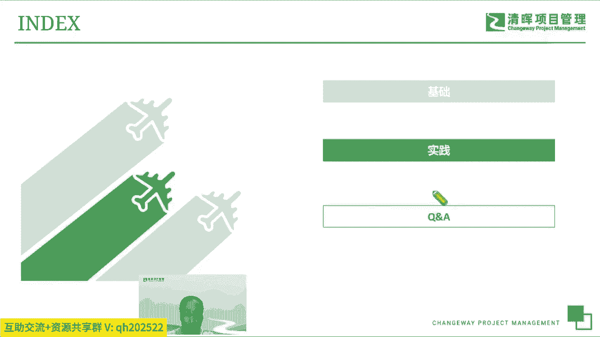

呃我们前面我们贴了很多很多的标签啊，我们只拿其中的一些，我觉得我我我推荐给大家的，需要去关注的一些点，然后找了大概十个点给大家做一些分享，第一个呢我们讲敏捷思源，首先要要注重的就是快速迭代啊。

因为大家都知道现在实际上是一个呃快时代啊，就是所有的事情大家都都都能够感受到啊，就是什么是科技日新月异，行业呢变化也很快，然后每个人的这个呃，周围的环境也变化的非常非常快，那我们在这个快时代呢。

首先要强调快速的迭代啊，这个迭代指的是说个体的迭代，项目的迭代，企业的迭代都要快速的不断的演进和进化，那所以我们我们讲什么是敏捷，其实大家有一个啊经常听说的一个概念，就敏捷就是快，当然这个也对。

也不完全对啊，就是首先敏捷肯定是快，但是它不止是快，但是反过来讲，如果一个企业或者一个团队，它不快，他一定是不敏捷的啊，大家可以这么辩证的理解一下这个事情，那第二个呢就是说实际上快。

某种程度上现在成了一种呃核心的核呃，不能叫核，不一定是核心竞争力，但它一定是一个非常有力的竞争力啊，就是如果你能比别人起步的更快啊，可能别人迭代的更快，那我们其实是非常非常比别人能够拿到的。

更更好的市场，能够得到更多的竞争优势，一定是这样的，所以当当我们现在处于这样一个时代之像，我们不管是企业在商战当中，还是项目在交互当中，还是个体在成长当中，我们能够比别人快走一步。

一定是比别人有更更更好的一个竞争力，所以快的模式下，你也有人能够帮助我们去寻找呃蓝海啊，这个其实是对我们有很很高的现实意义的，就大家现在每个人可能都会呃，每天都在讲一个词叫卷啊啊，为什么卷呢。

因为竞争太激烈了，然后我们现在所处的很多很多的行业呢，现在就是额就是经济也不是很好，然后也卷的厉害啊，这个利润空间也很小，也基于这种情况下，我们能够比别人更早的呃，发现一些新的这个行业的机会。

发现一些新的市场的空间，去寻找一些新的这个创新的这个呃呃业务啊，这个对我们来来说是非常非常有价值的，这个实际上就是首先要快人一步，第二个呢门或在新的这个蓝海里边，快速的迭代，形成我们自己的这个先发优势。

对这个对我们这个个人也好，组织也好，去立足于这个竞争环境当中，是非常非常有帮助的，这是我们只讲第一点叫快速迭代的价值，因为我们大家都要思考，在这个快速迭代，这个时候，我们个体怎么样去做，我们团队怎么去。

企业怎么样去变，怎么能快起来，那个是我们第一个要去想的事情。

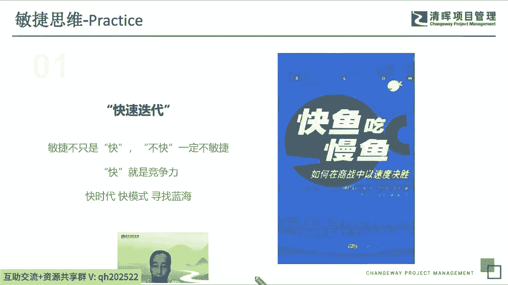

啊仍然延续延续这个话题啊，快呃快速迭代，大家看后边那个图啊，实际上就是我们经常这个举例子当中，就叫敏捷的迭代是个什么方式，我们为什么要提倡这样一种模式啊，就是肯定是第二种方式，能够每一个每一步的。

都能够帮助我们去实现一部分的，我们期望当中的需求，但是又不是不会呃，说是等到最后一次性的交付，这个对客户来说，实际上是一个很糟糕的一个方式，所以我们提倡MVP，就是呃最少可可用的这个产品。

而我们不管怎么样，我们尽早的迭代呃，尽早的交付，哪怕他可能不一定尽善尽美，但是一定是能够更早的交到客户手里，然后能更更早的投放到市场当中，去听听客户的反馈，去看看市场的反应啊。

能够帮我们去快速的收集到一些反馈，能够让我们去哪怕是试错也好啊，所以就是在这样一个环境当中，我们现在提倡能快则快，能找则找啊，所以就是实际上大家也有的时候聊天会讲一个，说哎这个这就出名要趁早。

所以做什么事情都要都要找啊，就包括说我们可能呃就是要要占领市场也要找，然后我们去交互也要尽可能的找，然后我们甚至可能要试错，也要尽可能的他犯了错误也要找，所以就是后面这个呃。

这就在这个有一点点了这个哲学意味的，这这个对话大家可以看一下，其实我们之所以讲快速迭代，讲MVP呃，是说我们客户，很多客户他一开始并不知道自己想要什么，所以就问客户什么时候知道他们想要什么好的。

那就是回答说啊，我们展示了他们不想要的东西之后，他就知道了，那客户客户可能不知道自己要什么，但是他一定知道自己不要什么，然后呢，接下来就说，那什么时候展示他们不想想要的东西呢，也是尽快。

所以尽早的给他们一个对的也好，错的也好的东西都能得到他的反馈，这个都是有很大的帮助的，所以要尽尽早要尽快尽早交付，快速的反馈，快速的迭代是我们第二点。

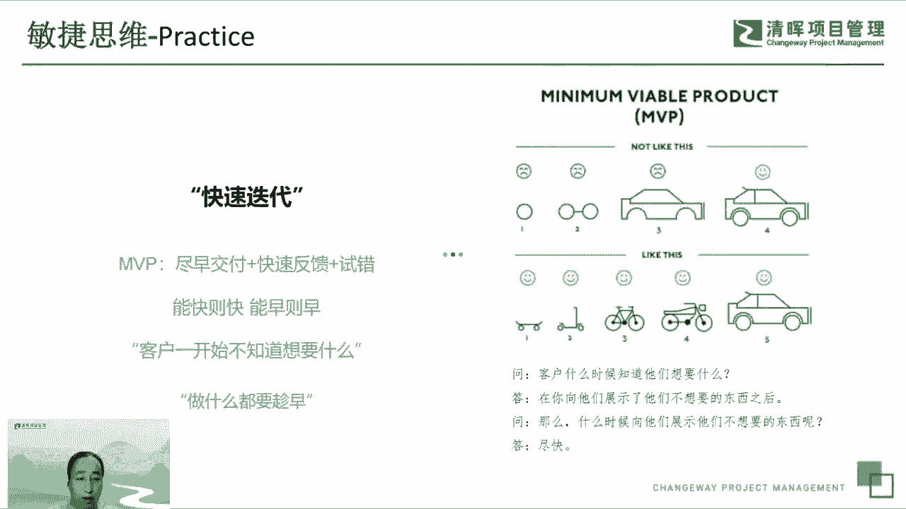

快速迭代，我们接下来仍是仍然想强调说哎，我们做事情不要急着一步追求，一步到位，或者是一次性做完啊，并不是限量，一定不是这样的一个方式啊，这也不是一个最优的方式，呃所以我们更注重在不断的在实践当中。

去去去假设，去验证，去去判断自己的这个这个产品，是不是市场所要需要的，是不是客户所满意的，去去去不断的验证，小步快跑，呃，因为我们是前面客户不知道需要什么，我们自己也开始街道需求，也不知道怎么做。

所以一步一步来不断的验证，不断的假设，不断的迭代这种方式。

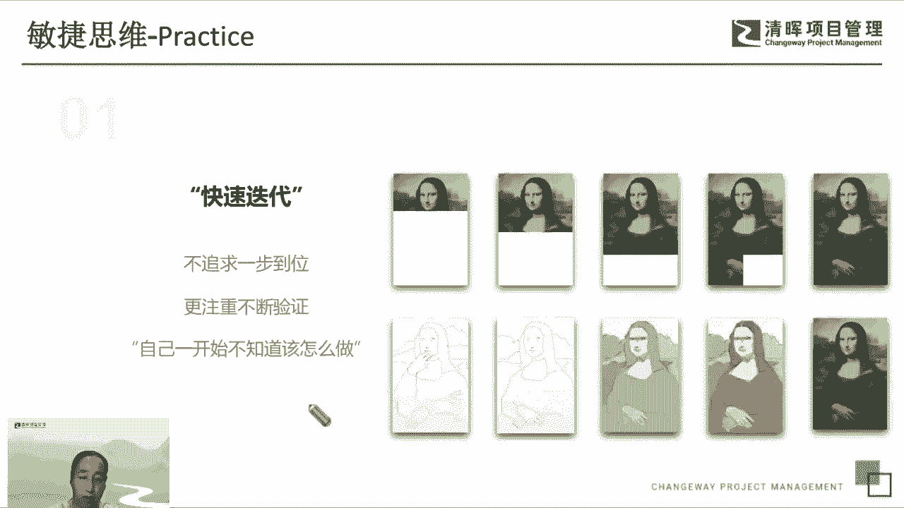

所以我们在真实的工作当中，基本上我们现在用的最最为广泛的是叫SCM，我们能看到s gram或者迭代的方式下，它就是一个典型的快速迭代的模式啊，我们基于这个短的时间周期，然后呢呃基于固定的时间时间箱。

然后去做小的计划，然后分批快速的去交付，然后两周一周甚至更短的时间就交付，交付完了就得到一些反馈，然后持续的优化，那接下来再做第二，而不是像以往那样传统的方式下，我们去做一个自认为非常周密的。

大而全的非常完美的计划，这个计划看起来呃面面俱到啊，什么都想到了，但是一旦开始运转起来，就发现一切都都都都都有问题啊，计划不准了，计划出现变故了呃，然后就交付的时间守不住了，各种情况都会层出不群。

实际上这就是大计划的一个问题，我们十位现在提倡肯定是快速迭代小计划，然后短周期慢慢的呃，去去去去渐进明细的方式去做交互啊，这这是我们所提倡的，所以这个SRM这个模式真的它非常简单，又非常高效。

就是它的核心逻辑就是都是快速迭代，然后呢我们在在我们的工作当中，大家现在在敏捷里面用的非常非常多的这个呃，我们按按这个呃从宏观到微观去做计划的时候，会有这个用户故事，然后把故事拆成好几批。

不断的基于这个一堆一堆的这个用户共识，去做这个计划，分成几次的发布吧，然后我们如果有大的故事呢，会拆成小的小的特性，然后特性再大了，容量大就继续拆，拆成小的公式啊，一步一步的去做交易。

所以我们这样就是在敏捷里边，我非常非常提倡说小颗粒度的交互啊，每次都和小批次的或多批小批次的呃，这个交付啊每次都少交一点，但是我们频繁的交互，这个这个是更有效的一种模式，然后我们是浪费也很少的一个模式。

所以我们基于这种快速迭代的理念下的，我们在前面那个那个领结12个原则里面，也提到说，我们呃只要要怎么样快速就我们设计，不要做那种大而全的计划，不要去做，而专设的这种这种设计，统窗式的设计。

我们要做简单的设计，要支持灵活的发布，所以我们在工程实践里面能看到啊，我们有微服务和容器这样的一些，具体的时间和技术技术实践，这个是帮助我们能够，支撑我们去频繁的小批量的发布的。

这也是我们敏捷里面用的非常非常多的一个，一些工程实践，大家可以去尝试一下，只有有了这些具体的这个技术和方法，才能够很好的去满足我们频繁的交互这个需要，这也是快速迭代的一个一个有力的支撑，然后呢。

这个这个有一点点是希望大家能够去注意起来，就是我们也遇到很多在传统的这个管理模式下，它是他人也是希望把事情做到最好，但是它形成了一种固化的思维或者是模式，就是希望把事情都想的很完美，想得很周到。

然后才开才会开始做，这个是我们现在一定要打破这种固有的一种，思维逻辑或者思维方式，而是说我们先做起来，然后呢呃不要预期去有一个很完美的方案，实际上不存在完美的方案，因为每天都在变化。

外部的客户的需求在变，外部的环境在变，和团队内部的一些进展在变，实际上你准备的再好，没有动起来，不要想像说我我有一个形成一个呃，非常非常完美的一个一个计划，完美的方案，然后等我都弄好了，我再开始做起来。

一定能做好的，不是的，一定是先动起来，动起来呢我们去看看外部的变化，然后积极的响应，然后呢呃行动起来才有价值，行动起来才能交互额，否则就成了空想主义嘛，这个是我们第一点啊，稍微讲的有点多啊。

这个这个快速迭代，因为实际上快了，快速迭代是敏捷的一个非常非常核心的东西，甚至可以成为他的一个呃基本的一个特性啊，第二个呢我们想重点讲讲叫价值驱动啊，前面我们也提到了很多，前面那个小节里面提到。

实际上敏捷思维的一个两个，第一个第一个是讲求快速迭代，第二个是要一定要讲究价值驱动，价值驱动实际上我们是呃做很多事情，我们这么之所以要快，就是尽可能的价值最大化对，所以我们就围绕价值，让价值快速流动。

这样所以在我们的这个整个这个背景下，怎么样去让我们这个组织结构更顺畅，让我们的流程呃呃更便捷，让我们的工具更自动化，让我们的文化更加的呃关注价值，让每个人脑袋里都有这个价值优先那种概念。

所以就是在在在这个这个里面，像我们一定是追求说做有价值的事，然后做有价值的人，不管是我们右边看到大家看到右边这个图，实际上是sap里边的一个一个展示的图，它它背后是讲说我们呃传统的模式下。

是一种管理方式，敏捷的模式下，是另外一种理念完全不一样的的方式，那么这里边更强调说追求价值交互，所以我们在这种情况，不光是我们做事情要追求价值，其实我们每个人不管身处于什么样的环境当中。

身处于什么样的组织结构里面，是在一个传统的企业，而是在一个小创业的公司，我们自己要想办法去找有价值的事啊，去做有价值的人，这个是我们价值这驱动这个概念，对每个人的一个启示。

然后我我们先要形成说首先去关注价值，而不是关注其他，因为我们原来包括我在内也啊，早早几年也都是做这个软件开发嘛，所以那个时候我们角球，所以这个这个呃，上来先看看功能都有多少功能啊，有有什么样的功能。

现在的我们都追求价值啊，是比方比方说大家现在好多人都开了这个呃，这个呃对新的新能源车，然后开了智智能车啊，现在大家去看理想的这个一个理想车的这个，这个这个宣传，以前呢我们车的大家都都讲出诶。

这个这个配置是什么样，功能是什么样的，现在嗯卖车呢其实卖的更多的是价值，说我们理想的车可能是人车一家人，人人和车是以一种家的概念，实际上它是追求的背后的价值价值感，就是所有的企包括IPHONE也是他。

他他也是追求说这个更便利的这个沟通，它实际上它不讲求功能，更注重讲求这个做的事情的价值，所以我们原来讲我们所有的事情，首先要关注价值啊，看一件事情呃，看一个需求也好，看一个这个呃一个交互也好。

首先看看这个价值，他的价值观是什么样的啊，然后呢上次我们讲了，这个在这个敏捷的三角里边，更注重说这个价值价值驱动的范围可变，简单的说就是呃范围代表着需求，需求包含的价值，呃。

我们是我们认为说我们只做这个价值高的事情，然后其他的事情，在这固定的这个时间和资源的情况下，我们可以抛掉一些嗯价值低的事情，这个跟传统的方式是有差别的，前我们可能更多讲究说哎。

这个我们一定要交付这样一些功能，然后呢时间可以调，资源可以调，可以加班，加人可往后仰，往前提，这个都可以，但是我们在敏捷里边，我们就是固定的人，固定的时间周期，但是我们这这个这这一两周的时间能多做。

能多交付价值，我们就多做，如果交付不了那么多，我们就做高价值的事情，我们核心的就是让客户认可，我们做的事情是永远是最高价值的，然后呢并且认可我们这么做的一个价值观，所以我们基于这样。

大家能看到这个是一个SCM的方式，所以我们永远只做高价值的事情，然后呢高优先级的事情，甚至只做高价值的事情，简单讲就是有些事情，我们原来计划当中是要做的一些功能，如果我们做着做着发现它没有价值。

那么就把它丢掉，我们久远去看那些价值池价值最高的事情，因为我们在真实的工作当中，我们那个那个product backlog，大家都都已经做的非常多了，就是肯定是要按价值排序。

按价值分批次的这种迭代的交互，然后不重要的事情往后排，没有价值的事情随时丢掉啊，这种这种这种逻辑，然后呢，这个价值驱动有一件事情是容易被大家忽略了，特别是传统的这个管理模式下。

有很多的这个包括项目经理在内，他可能注重交互，不注重这个价值，不注重做事情的这个成本意识，所以就是呃我们特别讲求这个投入产出要合理，要划算，要值得，就是有很多事情大家都知道说。

他可能长远看确实是很很重要的，很值得的，但是他的付出额和回报是不成比例，如果不是很高的话，那这件事情就要就要考虑一下，并不是说有价值的事情，一定是是这回报最合理的呃，有些反而呢可能价值没那么高。

但是他投入也很小，就是价值投入产出比很高的这种事情，我可以多做一点，因为我们任何人做任何事情，在敏捷里边都要有成本的意识，不追求说做到最好的，一定是做到最合适就够了，做到适适度就可。

而在这个成本的结构下面做到这样，做到80分成本也很好，那这个对对我们来说是算最优的一个方式啊，如果你想多做到100分，可能某某种程度上可能要付出200分的努力，这个时候实质上呃。

就是投入产出会会会会更低一点，这个不是我们的最优解。

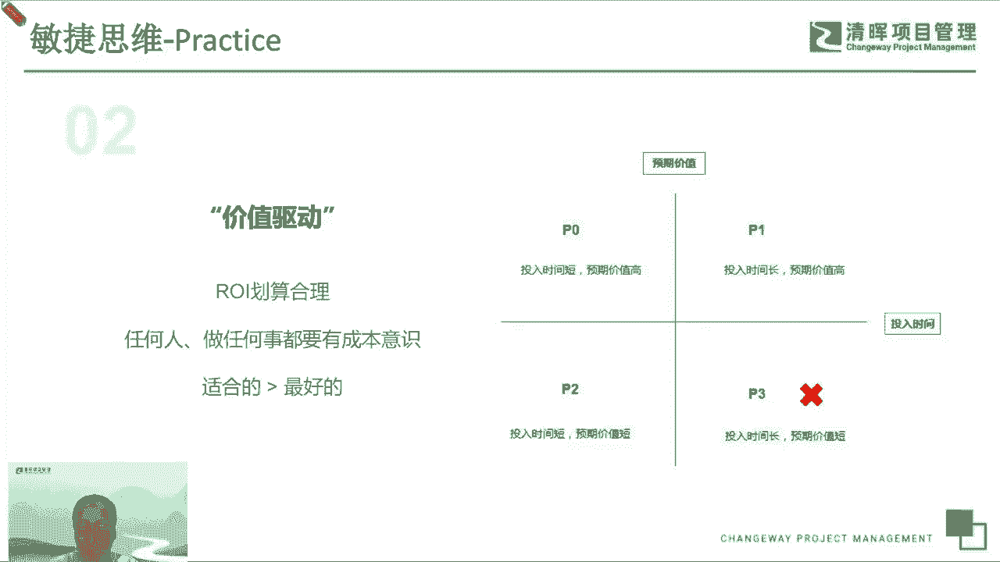

啊这个是我们讲的第二点叫价值啊，价值这件事情怎么强调都不为过，在敏捷里边，所有的事情的逻辑都是价值，价值驱动，价值优先，所以他做的很多流程工具现在都是拉动式啊，基于价值拉动价，价值驱动呃。

怎么样价值流流动的更快，都是围绕这一点去围绕价值去做的一些改进，那第三个呢呃是它不适应，我想强调一下，我我们想讲讲这个拥抱变化啊，这个标这个这个事情呢，实际上在我们这个方法论里面。

它并没有具体的这个实践对应，但是呢我们在做所有的敏捷里边，首先可能要去要去改变的一点，就是要要去积极地拥抱变化，去响应变化，不光是要响应变化，甚至要主动的去拥抱变化。

实际上这个实际上是一个呃挺难的一个事情呃，因为每个人都有自己的这个舒适区，然后呢有的人可能会在舒适区里边不喜欢啊，去去去看到很多的变化，但实际上在我们现在这样一个时代下。

就是一定得得有这种主动的意识去劝阻，被动为主动，然后消除自己的恐惧，消除这个组织的恐惧，消除企业的恐惧呃，然后企业不要害怕竞争，然后团队呢不要害怕去去去跟客户打交道，然后害怕客户有提新的需求，变更了。

那个体呢，也不要害怕说自己去学一些新的东西啊，去呃去做一些新的事情，去做一些新的业务，这些都是我们不需要去害怕的，一定要突破工具，然后自己顶着这个变化去去挑战自己，然后在变化当中才能突破，才能提升啊。

这个这个实际上反过来讲，我们的企业或者是我们的项目，只有在积极的运变融化变好，才能找到这个新的市场啊，每个人都能找到自己最最最更适合的新的位置，然后呢，我们在工作当中能找到更多的一些，流程和方法啊。

这个都是要变化的，而不是守着我们原来的这个固有的这些业务，守着这个正在做的这些项目，守着手里自己这些这这这些这些技能，然后守着原来这个固化的流程一成不变，这个肯定是没办法应对，现在这么一个变化的时代。

变化的时代的，所以要主动的拥抱变化，这致命企业里边特别需要去呃去改变的一个，从思维上要去改变。

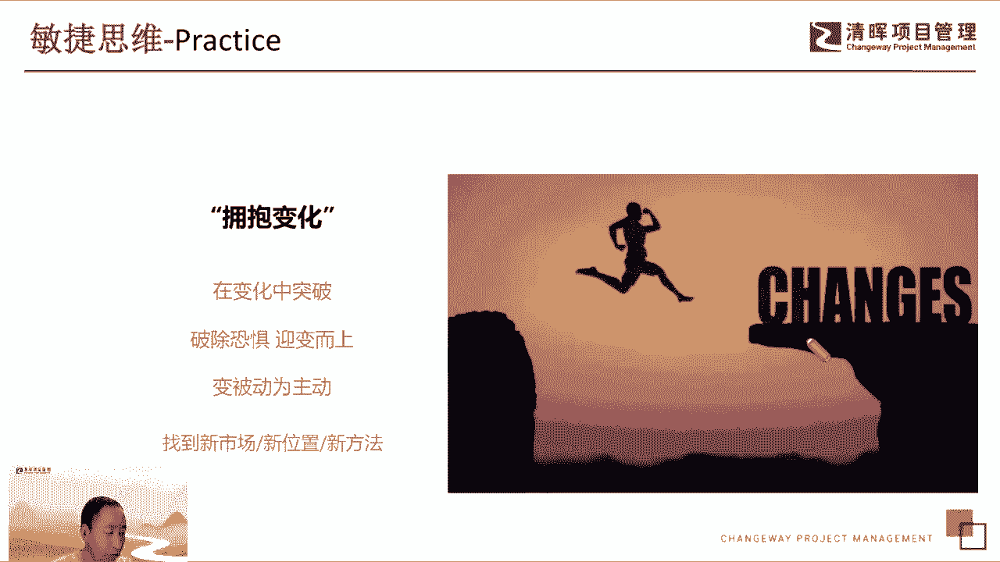

放了，这仍然是强调拥抱变化，实际上我们刚才也提到，实际上现在其实大家都讲经济下行也好，或者是什么，但是中国仍然是一个机会非常非常大的一个，一个呃市场，然后我们还是需要去智慧的去寻找这些机会。

所以在这个变化的环境当中呃，自己去找到机会，甚至自己在变局当中去创造机会呃，有很多行业有很多新的市场，实际上呃一闪而逝啊，就是一定会有这个窗口期和窗口期和机会期。

然后一些传统的这个业务可能会有一些红利期，可能我们要要要抓住红利期，要抓住窗口期，在这个时间窗之内呢，我们尽可能的去主动的拥抱这些变化，然后在变化中去去找到机会，去调整自己，就是如果一成不变的。

就像我们外国的这种好多这个老的企业，就很多年一直没什么变化，那基本上你想往上上升其实也挺难的，包括我原来在一个大的企业里面，大概中间有34年，就基本上就是没有任何的这个职，职位上的这种变化。

收入上也没有变化，这个其实就是太固化了，基本上没有实现的机会了，就只能自己去想办法突破它。

那我们在在这个敏捷的环境下，然后我们要做一场敏捷的变革或者转型当中，我们去拥抱变化，这个是所有人都需要去从思维上去认知到，这一点，就是改变自己的认知，特别是CEO中层管理干部呃。

然后呢要带动我们的一线团队和一线的这些，每一个人都要去去改变自己的思想，不要去害怕变化，然要去积极的去变革，然后每个人都要变改变，只有每个人都都有这种变革的这种思维，和变革的这种决心。

我们才能够取得这个敏捷转型的这个胜利。

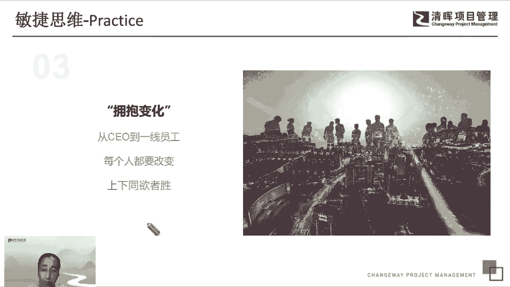

呃第四点想讲讲精益啊，精益实际上呃是是我们敏捷里边的一个，特别重要的一个，甚至就前面也讲了，精益实际上比敏捷的概念出现的更早，但是在敏捷的这个呃大的概念下面，近义是其中的一个非常亮眼的一个点啊。

那精一的核心东西我们在我们可以简化为主，一个是消除浪费，一个是呃减少等待和返工啊，就让我们实际上是跟我们前面讲的价值最优化，是非常非常呃一致的，就是消除掉浪费，消除掉这些等待和返工，能让我们快速的交互。

能让我们更更好的价值交互，所以我们在在真实的过程中当中，其实呃不管大家去看一些日企也好，或者是一些欧美企业，包括我们国内的一些新的创业公司，当然效率很高，实际上就是他们内部的一些这个可见的。

额不可见的一些浪费是很少的啊，比方说我们右边这个图，大家可以看到一个生产生一个车间里面，可能有很多隐含的大家习以为常的一些行为，本身是非常非常浪费的，然后呢下面呢是实际上是一个呃。

大家可能也经常可能会体会到的一种现象，所以这个事情看起来，我们做了很多这个敏捷的改进，而工具也建了，但实际上扭转起来发现诶这个这个这个东西，核心的这个卡点，仍然存在着大量的这种要等待的东西。

流程看起来要做一次，带个要做一次这个呃，这个额需求需求的分析很快，但是需求的审核很慢，要做一次代码的扫描，很快要做一次代码的线上review的呃，线下零售的这种审批很慢。

所以这种都是我们的这个这个要需要去干掉的，一些浪费，然后需要要去提效的这个节点，因为我们在工作当中，大家可以回去看看自己的这个工作环境，是不是有很多这种流程上的，这种有审批的卡点啊。

就是是本身是可以是可以让它变得更优的，工具上也类似啊，把这种审批和卡点都干掉了，自然而然这个效率就提升上来了，这个时候经营能帮我们起到的价值。

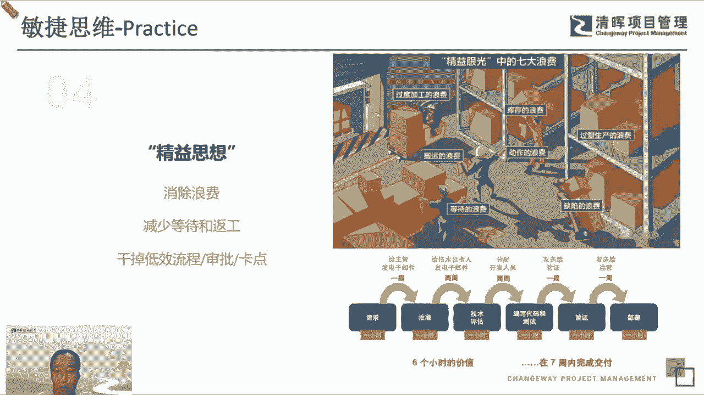

好持续改进，这个不多讲，其实额前面我们讲了，说我们这个敏捷宣言也好，敏捷价值观里面都提到了，要要要追求卓越，要不断的提升，这个实际上我们是要把我们这个这个理念，贯穿到我们的身体。

贯穿我们到我们的行动当中，就是我们每一个人的个体也好，团队也好，组织也好，都要去不断的追求卓越，让自己的能力提高起来，然后持续的改进我们每一个环节的这个，这个不优的点，那我们才能从敏捷的这个角度来说。

我们可以从这个最早的这敏捷这个原始的状态，过渡到团队的敏捷的状态，然后接下来让我们变得整个交互更敏捷，然后我们的业务也能够更敏捷，最后我们面对一个大规模的这个和企业，都说我们仍然很敏捷。

不管我们的组织规模有多大，都能以很敏更敏捷的方式，来来来来给客户提供价值，第六点是我们想强调一下以客户为中心，而这个是这个是在这个敏捷宣言和save里边啊，明确提出来的啊。

就是我们而现在在在敏捷的思维下面，我们其实更呃，尤其是现在越来越多的，我们希望提倡这样的一个演说，我们以前的可能更多的是说哎，这个呃更好的服务客户，现在我们希望把它提升一层，更拔高一层。

说我们跟客户跟我们的这个呃合作伙伴，实际上不光是利益共同体，而且是更多的是利益共同体，说白了就是我们我们要跟客户一起陪伴，一起成长啊，然后大家绑在一起，能够才能呃持续不断的长期的合作。

然后能够变呃一起拓展市场也好，就变成了一个更更更合作，更紧密的一种种共生的关系呃，我们不光要让客户满意，而且要让客户承诺，不管是甚至我们可能要拉动客户一起，通过敏捷的方式去变得更成功。

我们不光是给客户交付一个什么东西，而且要要带动客户和交互的东西，让客户也变得成功，我们自然也就成功起来，因为在敏捷的环境下，我们提倡说构建面向客户的生产力和生产关系，呃简单的讲就是说如果客户是敏捷的。

那我们就追随客户的脚步变得敏捷起来，如果客户是不敏捷的，那我们就要拉动客户一起运接，所以我们要带动客户，要遵循客户，要陪伴客户一起，以客户为中心，想办法让让我们变成他不可或缺的一个部分。

这个是也是很多我们看到的行业里边有很多，比如说汽车行业有很多这个呃一级的供应商，就是常年的跟这个车厂，他建立了这种共生的关系，变成了一个命运命运同同呼吸，共命运的一个关系。

这样的话其实是是一种以客户为中心的，一个导向。

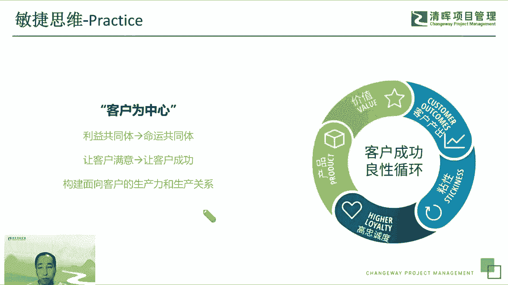

呃第七点呃，这个是怎么强调都不为过，也是前面讲了，就是敏捷里边最值得去呃，去去广为广为宣传的一件事，就叫以人为本啊，这以人为本实际上它有很多很多的内涵，很多很多的含义，我们先简单的讲几点来讲啊。

第一点呢就是说呃首先我们尊重个体，尊重人性，这个实际上回归到每个人的这个本能的东西，就是不要抢，不要去让每个人变成一个螺丝钉，让每个人在一个大的集体当中，是泯灭掉自己的个性，泯灭掉自己的这个这个想法。

然后让让他只只是复仇，只是干活，这个一定是不能最大化的，它的价值的，不能激发他的潜能，也不能让他更好的成长，所以我们希望有一个词，大家都都都现在都耳耳熟能详，叫知识工作者，就是知识工作者。

是跟这个我们传统这个工作，作业方式是完全不一样的，我们传统的方式可能是不同的，优秀的人和普通的人之间可能是几倍，是多了十倍的这个差异，那我知识工作者其实是优秀的人，和普通的人。

可能有上百倍甚至上千倍的这个这个呃价值的，差异的，效率也好，创造的价值也好，它的差异是非常非常大的，所以为了让我们的知识工作呃变得更更有效，我们一定要尊重这些人，让这些人给他一个很好的平台。

给他一个更好的工作环境，让他自己去自发的去想办法提升，去想办法去创新，想办法去创造价值，这个是我们敏捷里边希望给大家强调的，希望大家去去理解和认知的一件事情，然后呢，因为那个还要有一件事情。

我我在这里希望跟大家去去去讲了，一个叫每个人都要有理解领导力，这个不光是这个领导力，不光是说领导才有领导力，而是说每个人都要去能够掌控自己，为什么敏捷里边说自组织自管理的，你有领导力才能治管理，你。

有领导力才能和其他的伙伴一起去更好的协同，我们，有领导力，才能够带动我们和我们的客户，往前一起去突破啊，去去更好的做价值交付，所以这个是我们在以人为本的这个呃，呃这个这个前提下。

我们可以去做的更好的事情，因为大家去培养自己的敏捷领导力，当那这其中可能需要去学习敏捷的一些领，导力的一些技能和方法，这个这个都可以，因为实际上以人为本，强调的是说让每个人呃。

自己意识到自己的这个最大的这个呃，极限在哪里，然后自己朝着这个目标去努力，才能够最大化的去创造出更多的价值，给企业也好，给个人也好，给团队也好，创造出最多的价值，这个是敏捷的倡导的一点。

为什么说我们在一些新兴的这个呃行业，新兴的这个公司里边，那些人几个人就能就能运营一个几亿，几10亿的一个一个一个一个商业啊，那基本上就就就是在这种情况，他让这些人嗯嗯一一在在自由的这个空间里边。

最多的最最对效率最高的去管理自己啊，让他们去创新，让他们去突破。

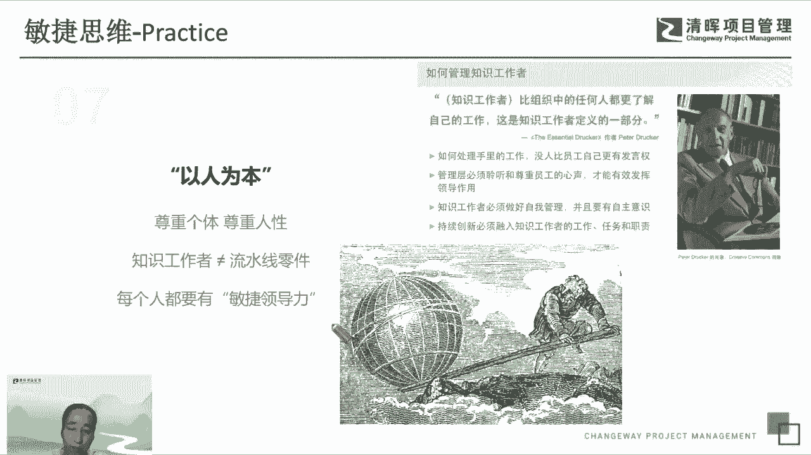

那我们回到我们这个工作场景来的，特别是在一个敏捷转型的这个工作场景下边，我们希望说这些这个呃领导要首先要改变啊，他们既要能去呃喊口号，而我们经常见到说敏捷的这个转型当中，敏领导先是喊口号啊。

说哎这个我们支持这个事情，但实际上一一开始做真实的工作当中，就发现这个敏捷领导喊完口号就不见了，这个肯定是不行的，这个一定是敏捷，对这些在转型过程当中，敏捷领导要以身作则。

要要要主动的去投入到这个事情当中，要引领这些变革，领导的思维，也要去首先要去改变，所以不光要喊耗子耗子，领导也得撸起袖子跟我们一块干，还要很好的降低自己的这个这个姿态，去更好的服务这些呃团队交互的团队。

一线的这些个人，因为敏捷那边有个词叫呃，这个呃服务人士的领导，讲究的就说这个实际上夫人是领导，反而是一种很强的敏捷领导力的一种体现，因为这个我们对领导的要求是这样，就是呃喊口号，能跟我们一起干。

并且能服务好我们的这些这些员工们，我们的团队呢就是想办法尽可能的自己，让我们自己驱动自己去做事情，自己管理自己组织，所以我们能看到说，我们从传统的这指令式的这种模式下，大家控制都给大家分派任务。

变成说我们小团队自己去自管理，自己去认去认领任务，然后变成说我们团队和团队之间，只需要给一个目标或者给一个愿景，大家自己去想办法就可以了，这是我们的整个团队的这个眼界，如果能变成这样的一种团队。

其实就是一个典型的敏捷团队了，可以自己管理，可以自己去提。

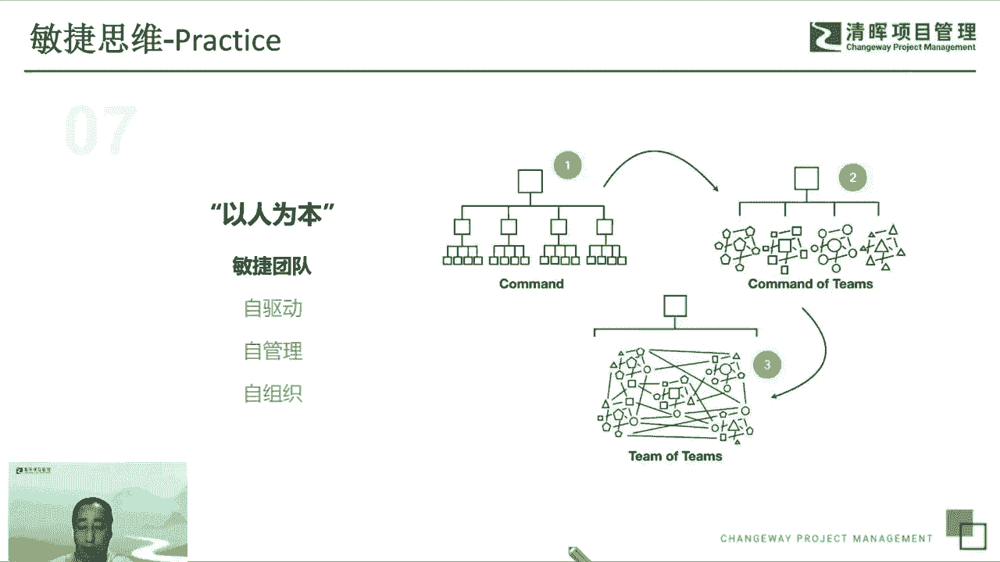

提升价值，而我们每一个个人呢，我们希望做到最终的就守望的敏捷的，最终的呃，最终的一个状态，就是说我们个体和企业一起成长，最终呢个体在这个过程当中，享受到了自己的这个愉悦感和成就感。

然后能够让自己的工作生活和追求都能平衡，然后真正的达到说，我们满足每个人的这个内心的需求，就像那个叫马斯洛那个那个这个模型里面讲的，也，我们到最后面的追追逐的是自己的成就感追求。

而不只是一些简单的一些需求。

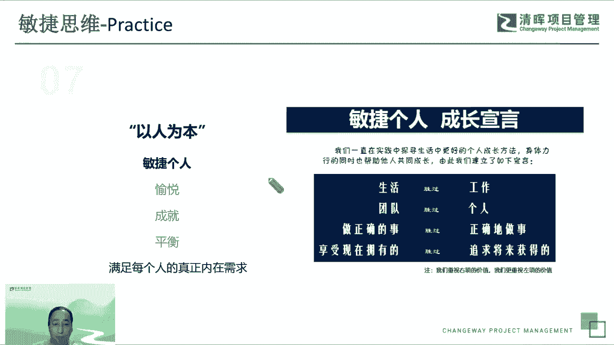

嗯第八个我呃想呃讲讲，其实这个是呃最近也讲的比较多的一个概念，叫第一性原理，这也是敏捷思维里边，其实现在就是呃挺突出的一点，就是我们前面讲到了很多很多的一些，比如价值驱动啊等等等等，要快速交付了。

但实际上都是跟这个第一性原理非常相关的，就是我们现在好多工作场景下面，有很多的很多的浪费，很多很多的这个不相干的一些事情，其实就是做的久了，就会发现就是呃忘记了这这这件事情，这个组织的呃本来的一个本质。

忘记了最初的一些东西，所以我们要丢掉很多很多的管理学上的东西，要要去呃，要去回到我们最初的一个设计呃，呃聚焦到价值，聚焦到我们的工作主线当中，额，然后不要去呃去想着自己去做很多很多的事情。

就就就集中自己的这个优势，就集中自己的核心竞争力，去做自己最擅长的事情，那这个是地域性的原理的一个背后的逻辑，就是找到它本质的东西，然后在这个本质的地方去做到极限，或者做到极致。

然后其他的这个不相干的事情，非第一性原理的这些事情，我要能减则减，能干掉就干掉，就是尽量不去做其他的呃没有价值的事情。

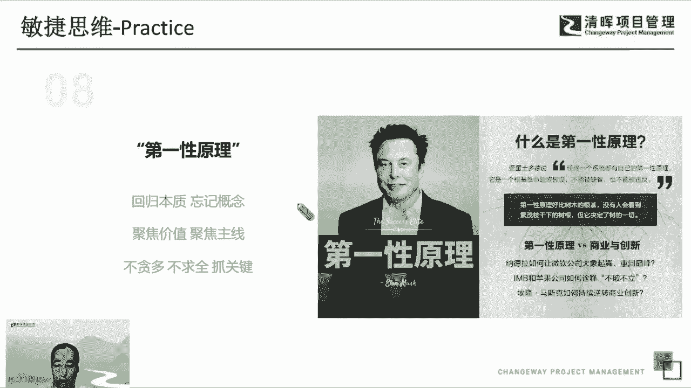

然后在我们我们每个人，其实说白了就是说在敏捷里边，我们自己想办法去练好内功，很多事情自然就水到渠成了，嗯然后我们不要想着说这个呃，为了比如说企业，我可能要想了很多的办法去去盈利。

但是忘了去怎么样去把客户服务好，去去去创造更多的客户，而是把心思花在了说一些其他的事情上，那个人个人也是一样，就是我们每天讲降本增效或者增效提高效能，其实然后自己的基本的能一个能力。

比如说我自己的基本的软件工程的能力，项目管理的能力，写代码的能力，这个没有没有没有变化，然后呃这个其实就不是我们第一性原理，就是我们核心的能力，没有的话，其实做很多无用功都没有意义啊，转型也是啊。

我们不要去呃，讲很多这个敏捷转型的这种概念性的东西，就扎扎实实实解决问题，所有的问题都解决掉了，自然这个企业就变得有钱了。

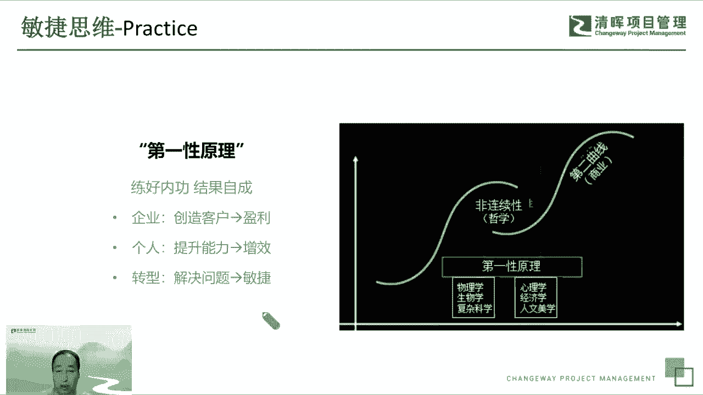

这个是个小例子，大家可以去体会一下这个这个事情，就是这个叫反模式，我们这很多事情就是违背了最初的这个初心，违背了他产生的那个，当时的这个环境下的一些背景，然后变成了一种物化的东西。

包括大家可以可能日常体会到说呃，这个一个公司里边不断的有新的流程产生，然后流程越来越多，效率越来越低，这个其实是跟他的这个流程设计的初衷，是背道而驰的，所以我们去看一下，说呃，他的。

他真正的这个真正的这个基本的东西在哪里，大家可以理解一下，就是不要舍本逐末，不要去去本末倒置的去做一些事情啊，包括说我们现在很常见的说，这个每个企业都在搞激励，实际上我们激励最初的想法是说呃。

做绩效的最初的想法是激励大家，那现在变成了一个反向的一个啊，可能是为了惩罚，可能是为了其他的一些问题，这个就是违反我们的异性原理。

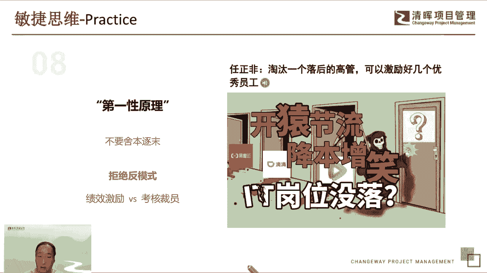

包括说我们在在企业，我我也见过很多企业的这个这个，这个叫组织关系错位，然后这个额叫生产部门和和和和和，这个成本中心和利润中心是倒置的，那有一些企业呢其实本身尾大不掉，很多这个职能部门呃。

没有好好的想去怎么样做好服务，为这个创造性的部门，为销售部门，为研发部门去做服务，而是去做各种各样的一些约束大家的一些事情，违反大家创造力的一些事情。

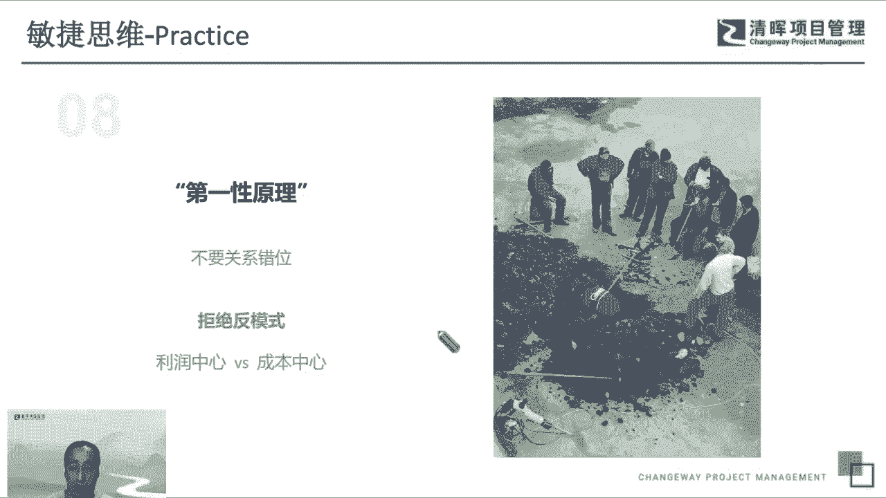

这个是本末倒置的一个一个做法，那这个就不多讲了，其实类似就是嗯讲的都是说，我们不要把这个呃方法和手段当做我们的目的，然后做着做着就忘了我们我们本来要做什么，去找我们本来要做的这个根本性的事情。

嗯接下来我们想讲讲这个系统思考，系统思维，系统思考，实际上我们呃呃在敏捷里面非常非常多的提到，包括其实传统的管理学也也有两种，但是没有像敏捷理这么系统化的去去描述它，系统思考。

它讲求的是说我们整体到局部都要去思考，然后从宏观到微观都要去想到，然后有层次的有有计划性的去规划我们的事业，然后呢局部呢去做各种各样的优化，然后扩展到我们整体，然后让我们的这个整个设计是有逻辑的。

有层次的呃然后呢全局占有最优才是最优，就是呃我们整体的价值最大，是是是我们人所追求的啊，包括我们在敏捷里边，大家都讲敏捷的转型，敏捷组织结构的调整额，然后我们希望在旺季里面把这个开发运营。

这个部门墙打破，也是为了整体最优，就是我们不希望说通过有这种各种各样的一些，我们强了啊，人和人之间的一些隔阂的影响，我们整体的这个效率啊，所以我们就就会重组我们的组织结构，去建立我们的跨职能团队。

去把我们部门之间的一些隔阂打掉，然后调整我们的结构，变成一个能够快速交付价值的，一种跨职能的团队总结的团队，这个是大家看到是save里边的safe，里边它本身是一个呃比较宏大的这个框架。

但是它里边也分了很多的这种不同的角色，帮助我们去呃有目的，有计划的，有层次的去推进一些，我们交互推进网组织的这个敏捷性，让我们组织变得更更加的这个有竞争力啊，所以整个他的核心论是讲要要整体是一盘棋。

从宏观到微观，要都要去拉通，经常性的拉通，所以做到我们每个人呢，首先做好自己的本职工作，同时呢多去做好我们配合工作，然后去去给，就跟我们其他的同事更好的协同，我想想其他的人的工作。

和自己工作是不是相关的，多想想团队的整体目标是什么样的，我个人能在这个目标上去去，去多做一些什么事情，然后数字思维这个是呃，就简单讲就是呃我们要有一个准备，是所有的公司未来都会变成数字化的公司。

呃我们讲敏捷就是没有数字，就不是真正的这个业务敏捷，然后呢不敏捷就达不到真正的数字化转型，因为数字化转型他也是分等级的嘛，就是如果没有敏捷，就没有数字化，所以我们在工作当中去想办法，去去去去做这个流程。

去做度量体系，去做效能的指标，然后可能甚至要搭建一些这个工具和流程，让我们的这些数据能够透明的展示给大家，能够及时的展示给大家，让我们的这个呃所有的效能的数据，能够很很很快的给大家一些支撑。

让大家去更好的去做交互。

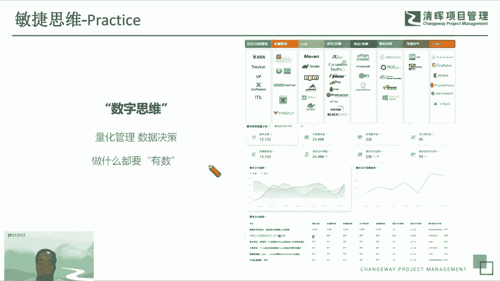