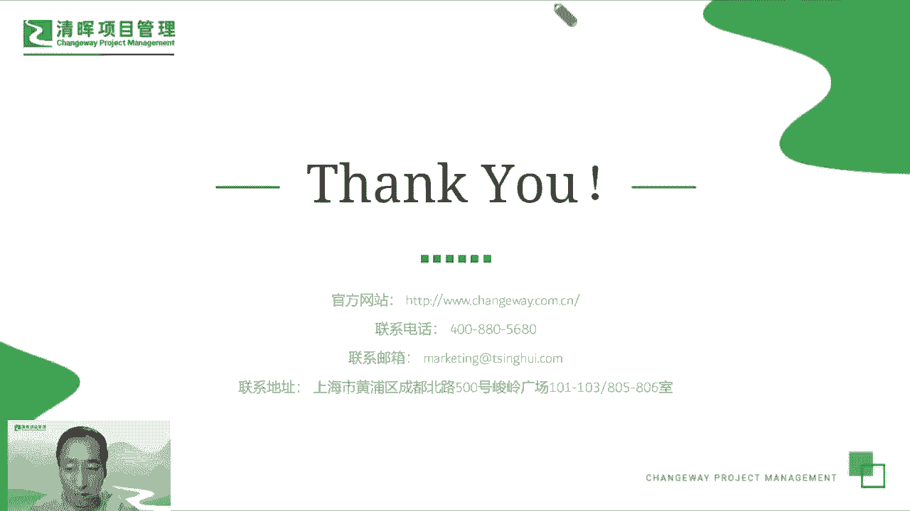

# 打破思维的错--敏捷思维5讲 - P5：5.敏捷思维-回顾 - 清晖Amy - BV1HM4m167HM

好我们基本上我们这个前面那个实践的部分，训练的部分就对，简单的给大家讲这些啊，因为还有很多其他的大家可以自己去去搜，所以我们回顾一下这个敏捷的思维，这个这个部分啊，基本上是呃可以简单讲两点。

第一点呢叫敏捷思维，是以始为终，是起点也是终点，怎么怎么理解这个话呢，就是其实我们讲敏捷的转型也好，敏捷的这个概念也好，从一开始要去变成变的敏捷，首先是从大脑，从思维，从心智上去变成理解。

如果这个思想不改变，后面的很多事情就没办法开展的，然后呢我们做到做到极致之后，做到很成熟之后呢，我们会有一天会变成一个敏捷的人，那每年人的特点是什么呢，就是他的思维模式，思想方式，思考方式都是固化的。

内化的啊，就是他所有的事情和思考的维度都很敏捷，这就是我们冰研究的一个模式，所以思维可以帮助我们提高决策效率，但是如果我们不具备这个敏捷思维，也有可能成为一个很大的障碍，这是第一点回顾总结。

第二点呢是我们还是贴着敏捷，这个我们之所以要提倡敏捷思维，是希望我们通过敏捷思维，能够多快好省的做事情，也让我们的结果变得很好，让我们的过程也也很好，那一方面呢，我们让敏捷思维带着我们去做正确的事情。

也通过敏捷思思维的这种这种指引啊，能能够帮助帮助我们通过流程和改造，通过工具的优化，让我们更正正确的做事情，做事情变得更有效率，好我们的回顾简单讲到这里，然后最后给大家呃留一点时间做一些交流。

同时给大家分呃一些分享的一些书啊，大家可以回去看一眼，这两本书是我个人我觉得非常不错的两本书，一个叫敏捷思维，一个叫敏捷性思维的两本书，都是呃帮助我们去训练，去理解理解思维的一个非常知名的一些著作。

嗯之后我们需要讲一个就是呃，我们我们讲了很多的东西，讲了很多敏捷的思维，或者是改变思维这件事情，其实这可能很难，但是呢我们我们跟跟很这么多人交流下来，大家都觉得，如果能够真正的打破这个思维的。

这个规划的墙啊，大家都觉得这件事情是挺值得的，包括自己去改变也好，去训练也好，去实践也好，都是非常非常值得的，所以从改变思维开始到具备思维结束啊，这件事情是很值得，对个人来说很值，对公司对企业都很值得。

呃我呃稍微时间延展了一点啊，这个感谢大家这个线上来听了这么长时间，然后我们借着这个平台，也希望大家呃，通过我们清辉的这个呃平台去多学敏捷，然后我们多用敏捷，然后我们要要要去呃这个ACP的课程里面。

也有很多很系统的关于敏捷数量啊，敏捷实践方法的一些学知识，大家可以多去学习，呃非常感谢我现在我要讲的东西大概是这些，然后呃非常感谢大家一直这么专心的来听啊，咱们现在留了一些时间，做一些这个互动和交流呃。

看看在线的小伙伴们，有问题可以在直播间里直接打出来啊，咱们可以做一些这个沟通，谢谢，嗯我看到了就是这个课件，课件可以联系我们的这个，大家当时联系的这个呃，都是哪位老师。

可以跟咱们的一个新会的老师去联系一下，应该是可以的，额额那个今天没有PDU啊，这次的活动咱们是讲的这个主题呃，暂时没有PDU的这个积分，但是后续会有这个，咱们几乎这边会有很多的这个呃分享的直播啊。

呃应该会有这个也也是一样，请大家多关注我们的这个新会的一些，发布的一些消息啊，活动啊，这这边还是蛮多的，好谢谢，然后其他的就是如果大家有对这个敏捷，或者ACP，或者是其他的一些。

跟这个敏捷相关的一些呃话题啊，可以可以有兴趣的，咱们可以以后多交流，因为以后我们清货这边也有很多，很多的这个主题，希望大家也多关注，多参与，非常感谢啊，谢谢，呃看一下我们这个其他的这个呃小伙伴。

或者是其他的朋友们呃，有什么感兴趣的话题啊，可以跟我们的这个呃老师们交流一下，然后或者大家有什么需求，可以联系我们的这个小助手，或者是大家的这个呃辅导老师，好的谢谢，谢谢，然后看一下我们的这个。

呃好好好好谢谢谢谢啊，客气呃，没有问题的话，看一下我们这个呃清辉，咱们这边啊，这个啊老师直播间的这个主持人，还有什么呃要跟大家去分享的部分，或者是要给大家展说明的部分，如果没有的话。

咱们基本上今天咱们可以交流到这里，后续咱们再找机会再再沟通再交流，谢谢，好的谢谢咱们，那我们就基本上到这，然后咱们后后会有期，大家回去以后就是多去关注一下，我们清辉的这个线上的一些活动的通知。

然后大家可以去多了解一下，也可以自己去查阅一些这个敏捷的一些资料，敏捷思维的一些学习方法，自己多去用，多去练习啊。

