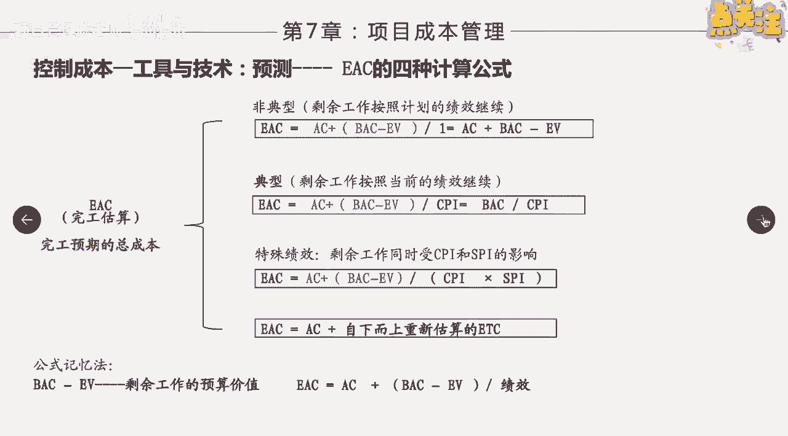
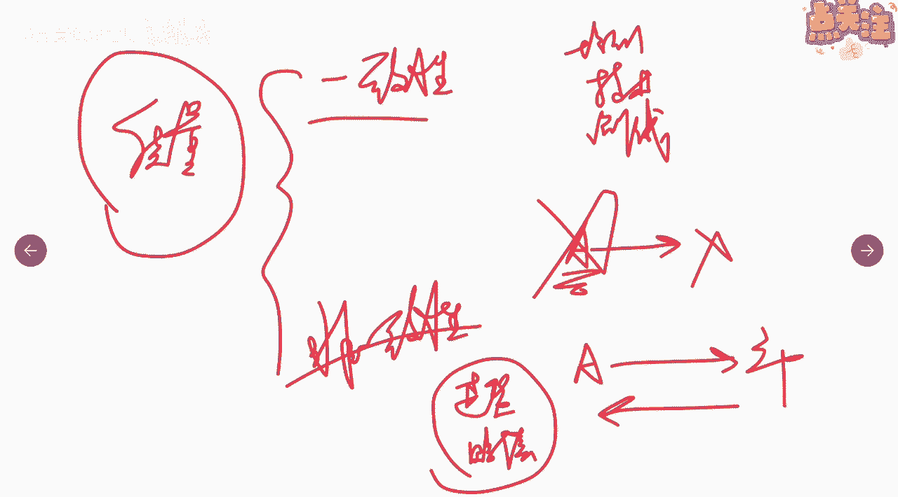
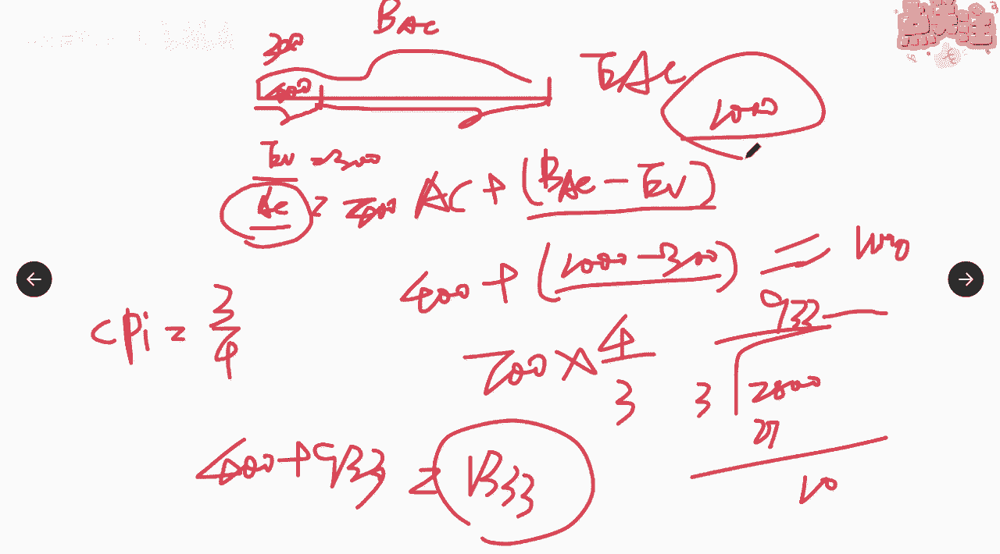

# 挣值分析（3） - P1 - 项目管理陈老师 - BV1Xj411K7rZ

那么接下来我们来介绍一下，除了偏差分析之外，还有一个功能就是增值管理，一个功能叫做预测，预测预测呢我们就要预测什么呢，预测完工的预期估算完工的估算啊，我们本来b a c是多少啊，是完工的这个估算对吧。

计划完工的预算，那么那么实际呢，因为项目当中是有很多的绩效的，是不是你的根据绩效不一样的变化，那么我们要预测一下，比如说在当前这个时间点，我预测完之后，那么未来我到底花多少钱能够完成这项工作啊。

比如说你计划100块钱去玩一天对吧，结果呢你本来计划是到中午的时候呢，你花的这个要花60块钱，但是呢发现到了中午的时候，你已经花了70块钱了，那么你想想你想知道，说到底这一天我把这些景点都逛下来。

我要花多少钱，这就是一个英语测，那也就是什么呢，eac完工估算啊，完工估算啊，那么它有几种情况，我们可以来看一下，第一种呢就叫做非典型的一个情况，好非典型的情况。

意思说呢剩余的工作将按照计划的绩效进行啊，比如说我们在某一个点啊，在这个里面，在这个点去监测的时候啊，发现我们的spi跟cpi是进度有点落后了，进度落后，好那么在这个点我发现了这种情况。

那么要让你求出最终e a c会是怎么样，我们的完工估算是怎么样，那么有一种情况就是什么呢，剩下的这些工作对不对，大家看下这个工作，就是我们已经当前已经完成的工作了，对不对。

剩下的科技工作呢将按照计划的绩效进行，也就是说呢，剩下的工作不会像之前一样出现这种情况啊，不会出现进度落后，成本超支，会按照原有的计划进行，那么我们的完工估算就是什么呀，就是ac加上b a c减ev。

能不能理解我们用这个图来解释一下啊。

解释一下，假如啊这整个是整个完工的，估算是b a c，啊然后呢我们在这个地方进行了一个监测啊，在这个地方啊，前面这一部分是吧，我们已经知道了他的ev，知道了他的ac是不是e v是已经做完的。

已经做完的ac呢是实际已经花掉的，那么要问你说整个整个的项目，它的eac是多少，e a c是多少，那么我们说这种绩效啊，前面这种出现的这种绩效，在后面的情况不会再发生了。

那么剩下这部分要花的钱是不是就是ba，c减去e v，大家想想是不是是不是这样，剩下这部分就是不会再出现这个啊进度落后啊，成本超支的情况了，剩下后面这段就是因为ea是这段嘛。

剩下这段就是e a c减e v，那么这只是后面的那前面这一段呢，很多说前面段就再加1v哦，那不对，前面这段既然出现了成本的超支，那我们就应该加上前面这段实际花费的成本，是不是这样，啊这段实际我花费了。

比如说整个工程要花1000块啊，1000块对吧，前面这边我已经花掉了是吧，已经花掉了400块，但是呢我只做了300块钱的事情，只完成了300，那后面的后面要完成的是不是。

剩下的工作是不是就是1000-300，对不对，这是剩下的需要花的钱，然后呢还要再加上什么，加上你实际已经花掉的400是吧，那算出来等于多少，等于1100，对不对，1100，这个才是我们完工所需的预算啊。

已经实际花费的加上剩下的那这种情况，指的是后面不会再犯这个错误了啊，这个错误以后我绝对不会再犯了啊，后面将按照计划严格按计划进行，指的是这种情况啊，有没有明白嗯，不明白，要赶快提出来啊。

好这是第一种情况，叫做非典型啊，非典型，那么第二种情况呢叫做典型，也就是说在这个点上面，我发现这个呃这个绩效将一直持续下去啊，一直持续将按当前的绩效进行，看看当前的技巧进行啊。

那么这个的公式呢就是怎么样啊，cpi啊，剩下的工作，剩下的工作你看ac是实际已经发生的，加上b a c减ev除以cpi啊，也就是等于b a c除cp i啊，这就是按照当前的绩效去进行当前的绩效。

我们说这个cp i跟s p i都叫什么呀，绩效指数啊，绩效指数是吧，所以我们要除以当前的这个绩效指数，那大家看前面这部分a c是实际已经发生的，b a c减减ev除以cpi，那等于什么意思，我们来看啊。

也是一样的，给大家在用这种方式解解解释一下，大家看一样的，我们这边剩下的工作啊，剩下的工作假如是按多少啊，这个cp i1 v等于多少ev，我们刚才算出来1v等于300，做了300的事，但实际等于多少。

实际花了400块钱是吧，那么我们可以很轻松的算出它的cpi是多少，等于3÷4，对不对，等于3/4好，这是他的cpi，那么我们接下来要算一下，剩下这部分也是按照原有这个cpi哦。

剩下的这700也是按照原有这个cp i去走，那就等于多少啊，剩下的700，这个700怎么来的，我们刚才已经算了对吧，1000减去已经完成的，但用700÷3/4=700乘多少啊，4/3啊。

等于2800÷3除不尽啊，我这个是自己下孤的一个一个数字，所以组不进啊，392 17啊，13啊，930 33333333，一直往下一直往下啊，933啊，剩下的要花933元好，这是剩下的。

那前面的已经花了，这400要不要加进去，当然也要400，要加进去加上多少啊，933，那就实际的完工预算应该是多少，1333，对不对，那就比原来的什么呀，原来的b a c1000 超出了300多啊。

超出了300多。

明白没有啊，这个应该也很好理解，那还有一种情况呢叫做什么呀，剩余的工作同时受c p i和s p i影响啊，就两个同时影响，那就是cp i跟s p i相乘加权啊加权，然后呢用剩余的工作处于他们两个的加权。

再加上实际已完成已花费的就等于特殊绩效啊，啊这个也比较简单，再一个呢就是这些绩效都已经没办法，没办法只用了，我也不知道到底会不会按照这个下去，那就只能什么呀，自下而上重新估算了，自下而上重新估算了啊。

那所以大家发现一定所有这些里面呢，一定都要把ac，就实际有些已花费的成本先加进去，然后再找出剩余的工作，那剩余的工作呢处于相应的绩效，除以相应的迹象啊，你看b a c减ev就是剩余的处于绩效。

那么这个绩效几种情况，一种非典型，一种典型，一种是特殊啊，三种情况啊。