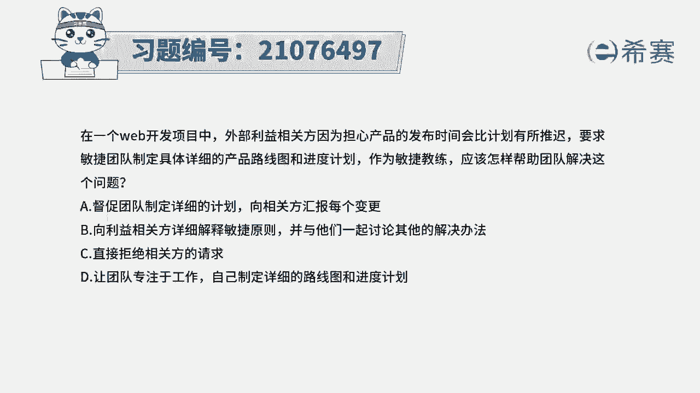
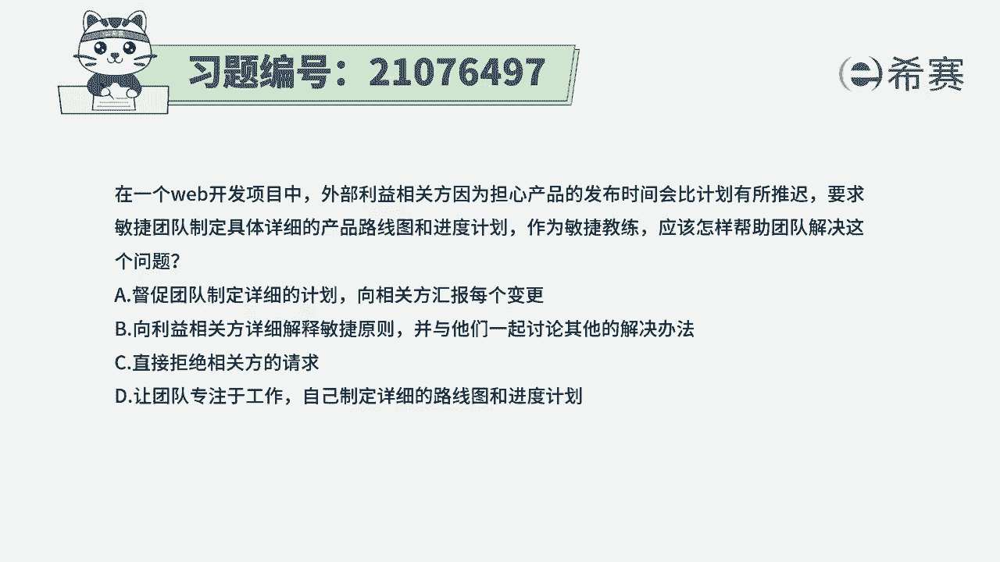
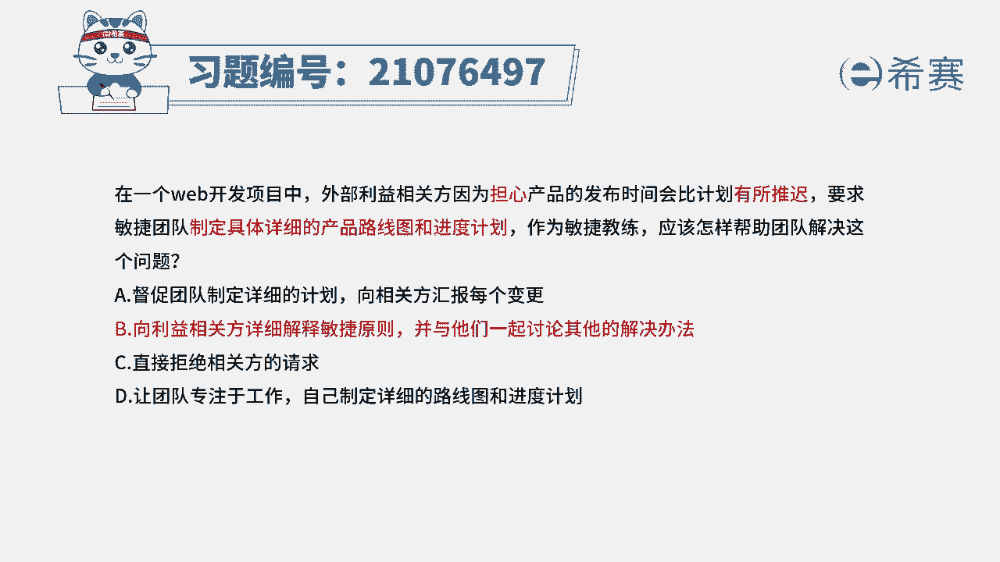
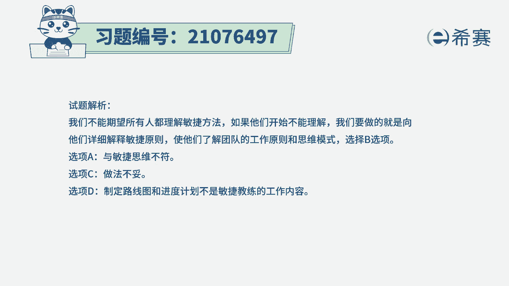
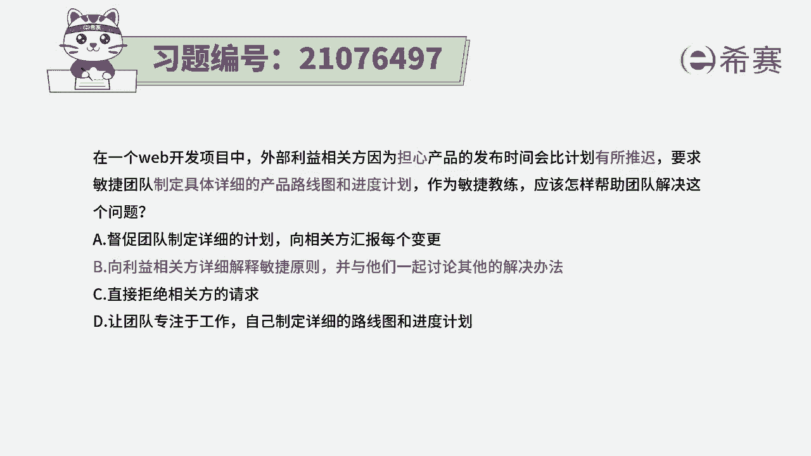

# 搞定PMP考试50%的考点，180道敏捷项目管理模拟题视频讲解，全套免费观看（题目讲解+答案解析） - P10：10 - 冬x溪 - BV1A841167ek

在一个web开发项目中，外部利益相关方，因为担心产品的发布时间会比计划有所推迟。

要求明星团队，制定一个具体详细的产品路线图和进度计划，作为敏捷教练，应该怎样来帮助团队去解决这样一个问题，首先我们知道这是一个敏捷型的项目，然后在敏捷行李的项目中。

要去制定一个详细的产品路线图和进度计划，而制定产品路线图本身是没有问题，但是制定一个具体的进度计划，这是非常有难度的，因为本身敏捷就有太多的不确定，就是会要去拥抱变化的，所以有了这个基本信息以后呢。

我们再来看这四个选项，选项A促进团队制定详细的计划，向相关方汇报每一个变更，那很显然这个选项就是按照对方的要求来进行，可是你知道敏捷中，其实是没有办法按照这种方式来进行的，本身就会有大量的变更。

所以他没有办法做到，选项B向利益相关方详细解释敏捷的原则，与他们一起来讨论其他的解决办法，也就是在敏捷中拥抱变化胜过了遵循计划，那计划不管做的有多么详细，后面都有大概率事件会发生变化。

所以我们可能会是换一种方式来去管理，用敏捷的方式来管理会更好一些，而这个呢是正确答案，选项C直接去拒绝相关方的请求，这非常的不礼貌啊，也不合适，状况很不妥当，选项D让团队专注于工作。

自己来制定一个详细的路线图和进度计划，那选项D和选项A，都是再去制定一个详细的计划，其实你要知道本身敏捷中就是做不出来的，所以用这种方式是不合适的，不管是自己做还是团队做都不合适啊。

所以AD都不合适，那这个题目的解析呢，在这边大家需要可以看一下答案是选。

第二个就是敏捷，没有办法去做出这样一个详细的进度计划，那我们可能会是有这样一个产品路线图啊，产品发布计划呀等这样一些文件，但是他做的时候。

