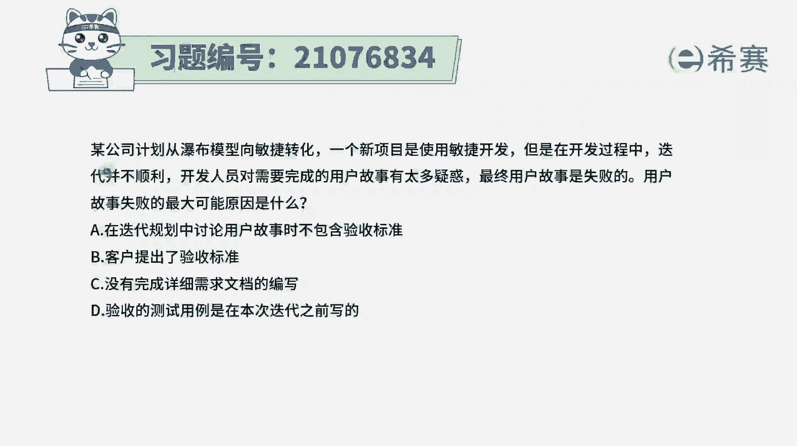
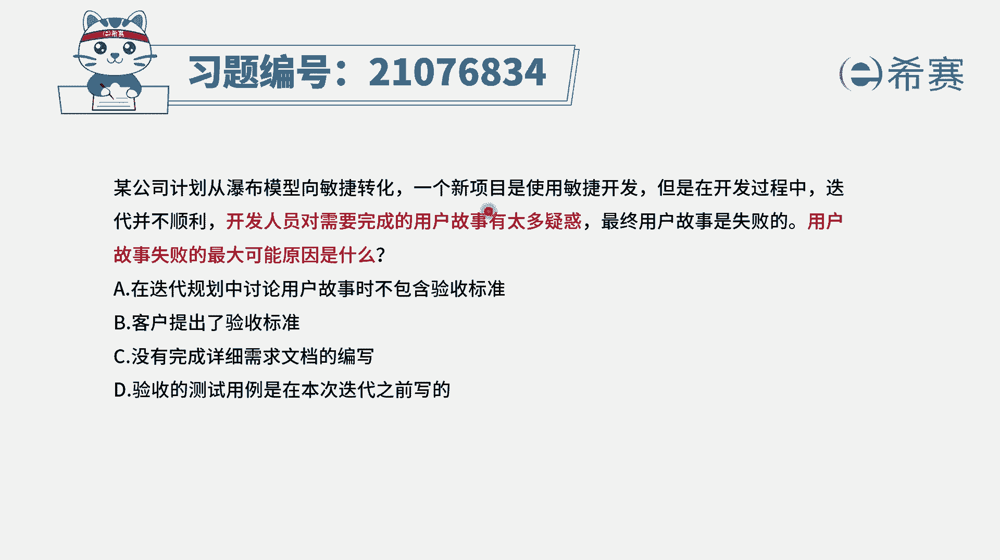
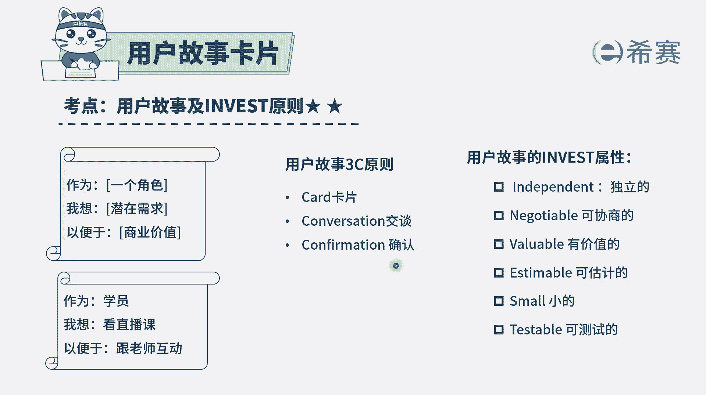
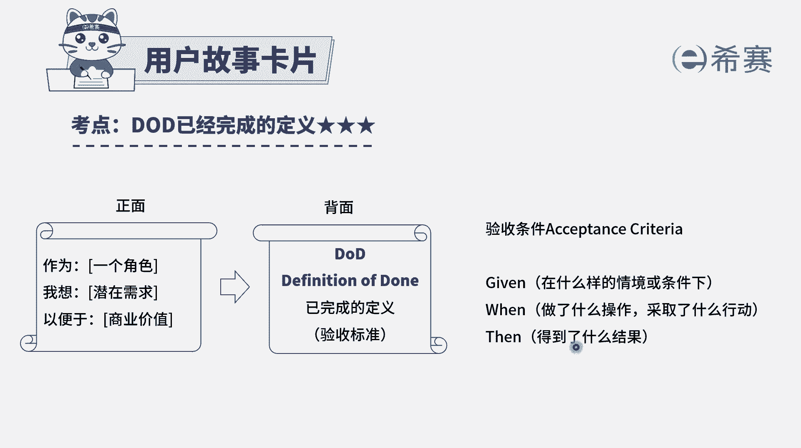
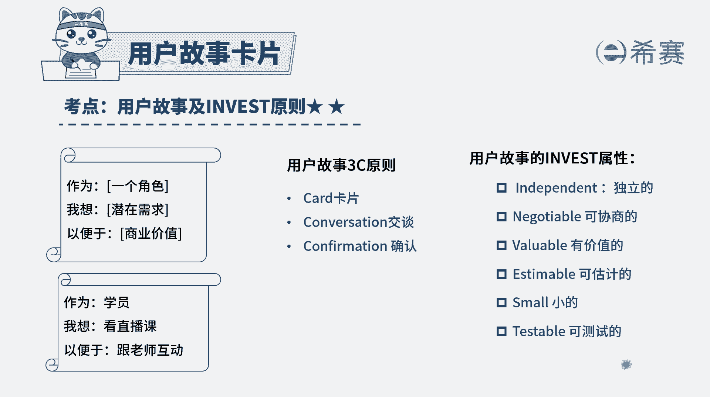
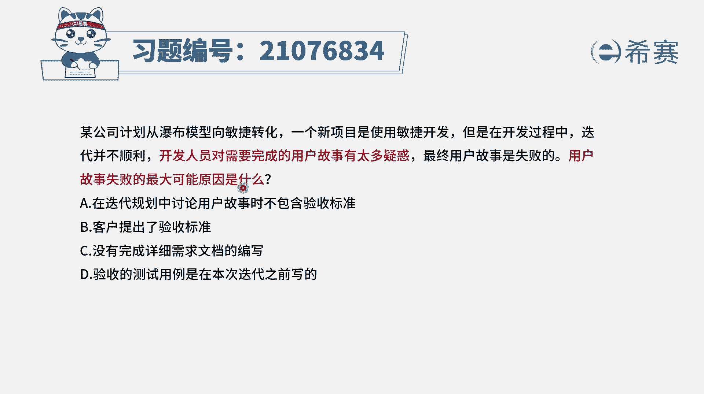
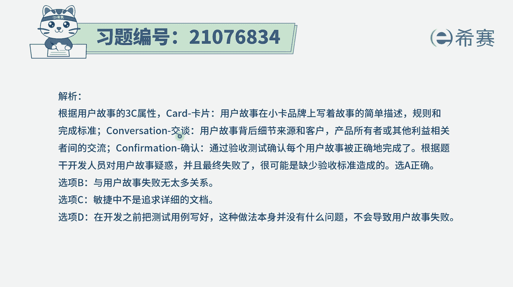
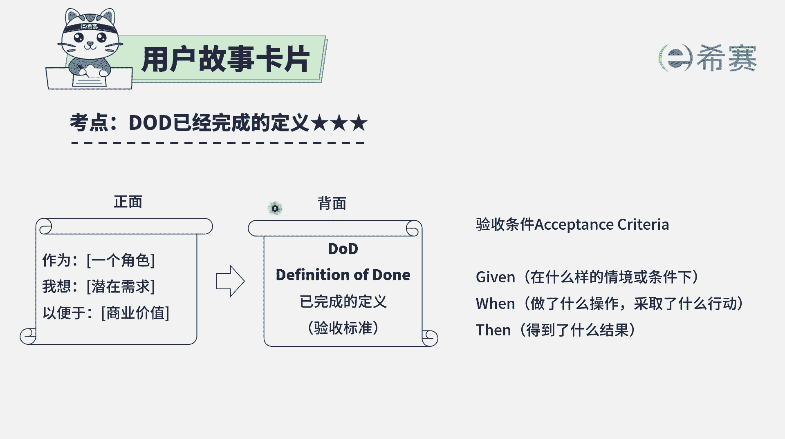
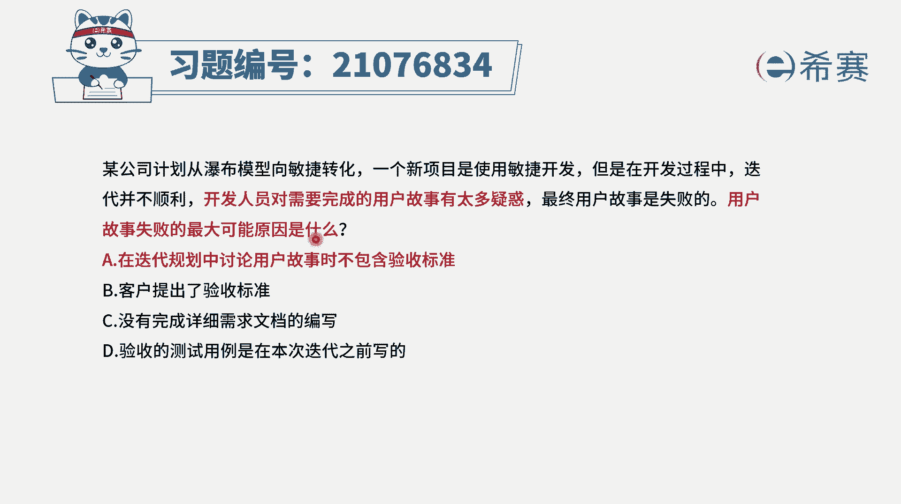

# 搞定PMP考试50%的考点，180道敏捷项目管理模拟题视频讲解，全套免费观看（题目讲解+答案解析） - P13：13 - 冬x溪 - BV1A841167ek

某公司计划从瀑布模型向敏捷转化，一个新项目使用敏捷开发，但是在开发过程中迭代并不顺利，开发人员对于需要完成的用户故事，有太多的疑惑，最终用户故事呢是失败的，用户故事失败的最大的可能性是什么呢。

呃这里的话，其实我们知道就是对于用户故事来讲啊，他虽然说敏捷里面会讲到的说是拥抱变化呀，但是对于具体的这一次迭代中，要做的具体的用户故事，它其实是有要求的，他的要求是什么呢。

就每一个用户故事应该都有一个验收的标准，我们来看一下关于用户故事。

首先呢它会有一个叫3C的原则，就是每一个用户故事，我们都会用卡片的方式来去展现，卡片的正面呢会写上这样一些基本的一些需求，然后卡片的背面呢会有一个叫confirmation，就是确认的这一条。

也就是说验收的标准。

你可以把它简单理解为叫验收的标准，当然我们也经常会用另外一个词叫DOD，叫完成的定义，所以是在卡片的正面写上这样一个用户故事，在背面写上验收标准，验收标准一般怎么写呢，我们来简单认识一下。

一般会是这样的三段论，先说在什么样的一种情景下，或者在什么样的一个条件下，接下来是当我们做什么操作的时候，或是当我们采取什么行动，我们输了什么信息，点了什么按钮的时候。

那第三呢就是能够得到什么样的一个结果，这个系统会给我一个什么样的一个反馈，或是反应，有了这样一个信息，如果说我们的这个用户故事做完了以后，我真的是在这种情况下去做这个操作，他能得到信息。

说明这个用户故事就算是完成了，如果他不能得到对应的信息，说明这个用户故事呢就没有完成，所以它这个验收标准。

其实是一个非常明确的东西，并且呢其实整个用户故事，除了这样一个3C的原则，还有另外一个叫INLESS原则，在INLESS原中也有一条叫可测试的，也就是每一个用户故事我都应该是可以被测试，可以被验证。

所以再来到这个选项中，选项一说是在迭代过程中讨论用户故事时，不包含验收标准，那很显然这可能就是一个问题，你如果说一开始连验收标准都没有清晰的话，那后续到底是该做到什么程度才可以呢。

这个其实就是有问题的呃，选项B说是客户提出了验收标准，如果客户都提出了验收标准，那我们就不会有太多的疑惑了对吧，所以这个是错误选项啊，选项C没有完成详细的需求文档的编写，请注意，在敏捷中。

它会更强调什么可可用的软件，胜过了面面俱到的文档，所以呢并不强调这样一个详细的文档，所以这个选项本身是错误的，不适合于敏捷，选项D验收的测试用例是在本次迭代之前写的，如果说在本次迭代之前都已经写好了。

这个测试用例的话，那么其实我们这个开发就是有据可依，我们这个测试也是有据可依，而题目中说的是，因为大家对于这个要完成的用户故事，有太多的疑惑，原因是什么，原因很有可能是没有这样一个用测试用例。

没有这样一些验收标准，所以答案应该是选A选项啊，那解析呢在后面大家可以查看一下，在解析中是把那个31元的，那个第二个conversation也做了一个解释，给大家简单讲一下啊，com c型说的是。

我们可以通过跟客户有更多的交谈。

去了解关于这个用户故事的一些更多的细节，所以如果说每一个用户故事都已经能够写好了。

这些基本的验收标准，这是一个完整的定义。

那么我们就知道该怎么样去做，那测试的时候。

