# 搞定PMP考试50%的考点，180道敏捷项目管理模拟题视频讲解，全套免费观看（题目讲解+答案解析） - P16：16 - 冬x溪 - BV1A841167ek

敏捷团队正在竭力开发一个产品，产品功能已经实现一半，客户想要了解团队速度，以便知道什么时候能够完成项目，作为敏捷教练，你需要跟踪研究团队速度，团队目标速度保持什么水平会比较合适呢。

那这个关于团队速度这个事情呢，其实呃还真不是你想定就能定的，因为它有的时候只有通过这种实践，才能够知道它的这种水平和速度，在敏捷中，一般来讲对于这种团队速度这一事情呢，其实他真的是不能够主观去臆断。

需要去执行。

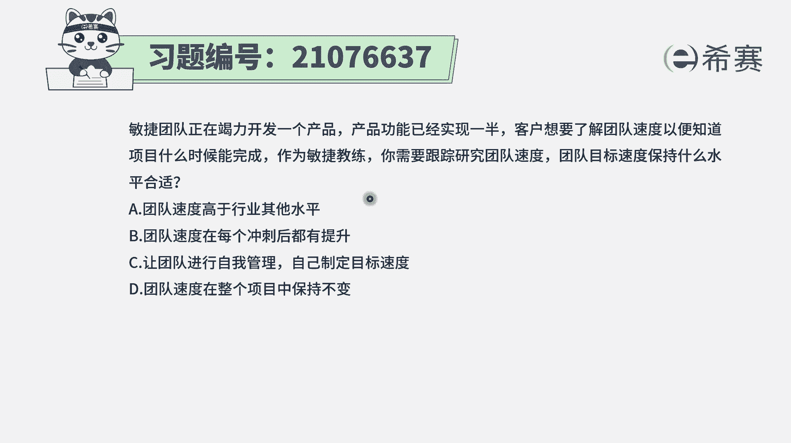

并且呢在敏捷中它会提到一个很重要的信息是，第一个我们要去给团队一种环境和支持，相信他们能够完成，他们都是自我组织，自我管理的角色，他们会主动去完成事情，第二个呢在敏捷中。

它会提倡是一种可持续的开发的方式，会希望团队成员，他是能够保持一个恒久稳定的进展速度，而不会说让今天疯狂加班。

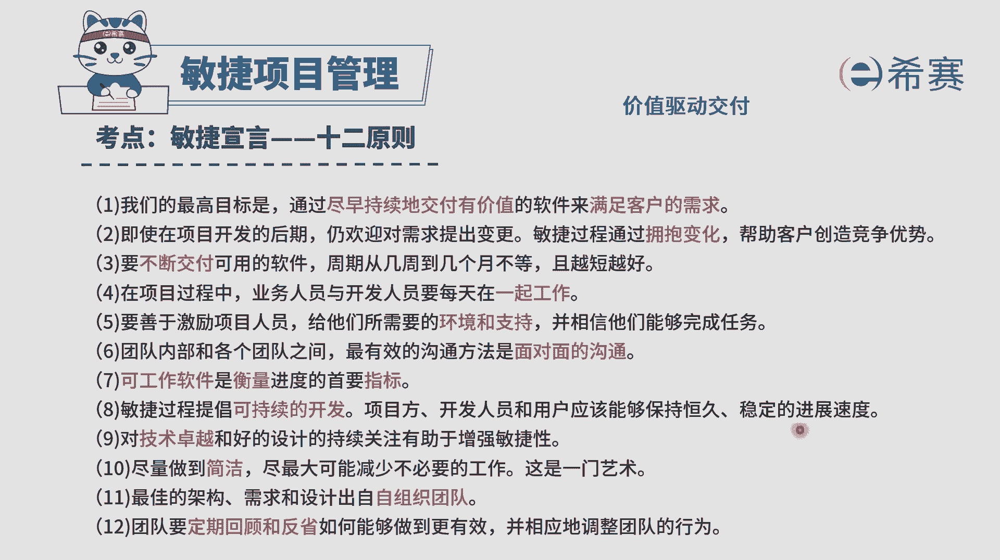

把明天的精力用来干晶片的事情，他不会提倡这种方式，还有这里也提到团队是一个自我组织，自我管理的团队，每个团队成员他们会有非常强的自我管理能力，那不需要有人去提醒他，他其实会自己去非常好的往前进。

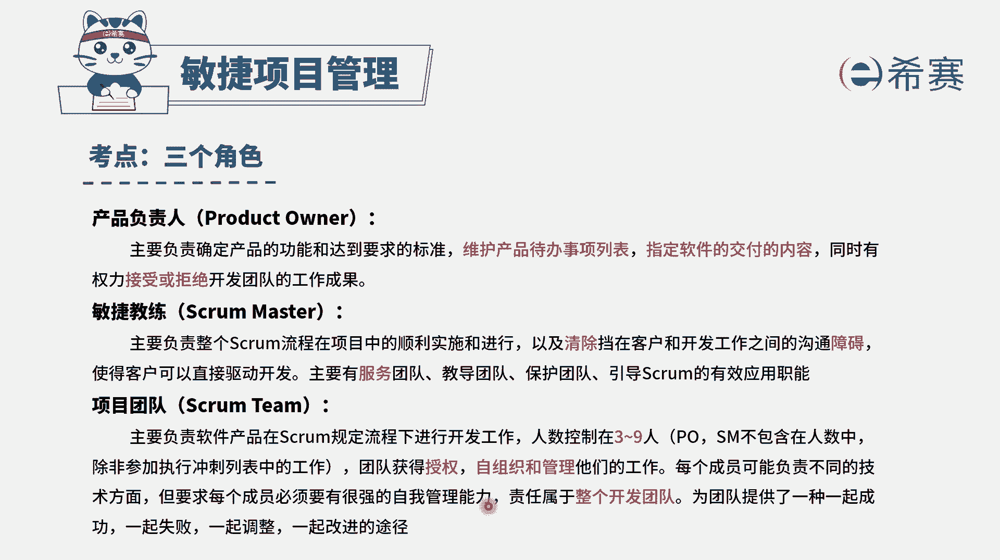

有了这样一些基本信息后，我们来看一下这个题目的四个选项，选项A团队速度要高于行业的其他水平，那这样的话有点强人所难啊，能不能不一定，选项B，团队速度在每一个冲刺后都能够有所提升，那我们刚刚才看到说。

其实希望是一个恒定的速度，希望不要能够去因为是敏捷，所以就疯狂加班，选项C让团队进行自我管理，自己制定这样一个目标速度。

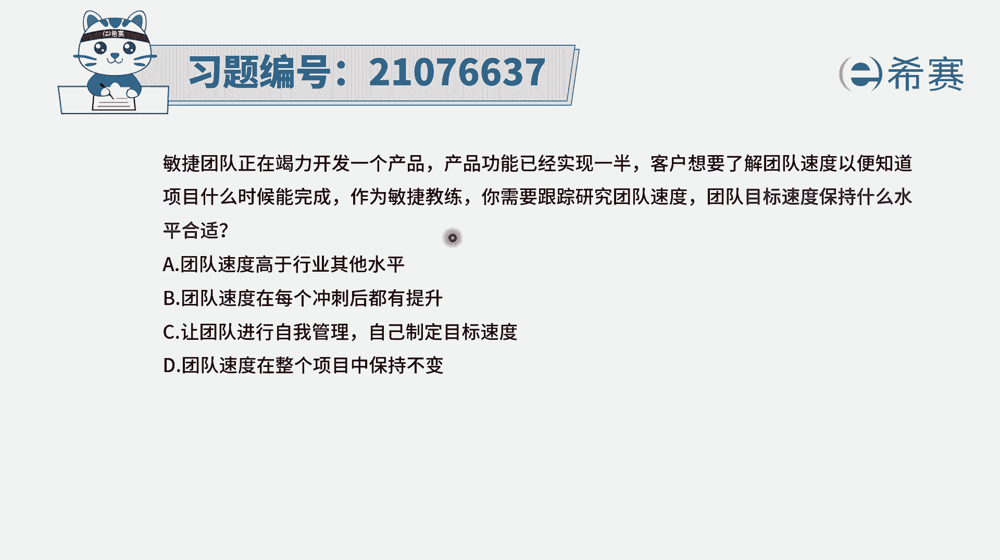

那这个呢相对来讲就会比较合适一点，首先团队他是一个什么样的团队。

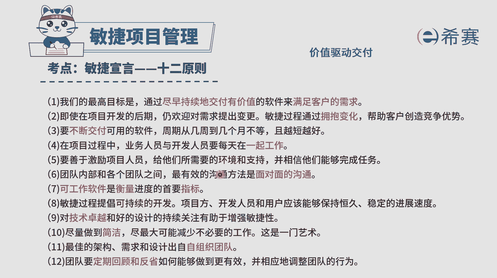

他是一个自我组织做管理的团队，OK所以他能够去主动去解决是事情。

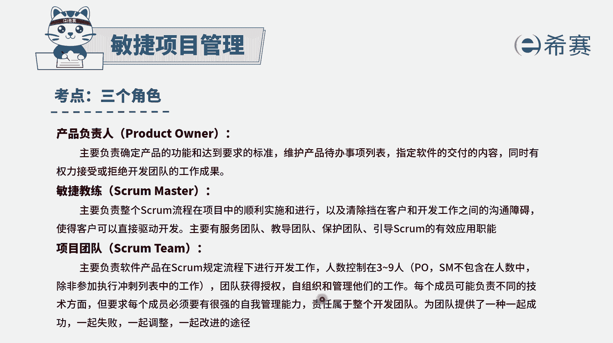

然后并且呢它会自己去制定这个速度，一般来讲速度它不是马上就能够给出的，它是需要去执行一段时间以后才知道，他也需要去试探一下，来测试一下这样一个速度，而最后一个选项，团队速度在整个项目中保持不变。

这个几乎不现实。

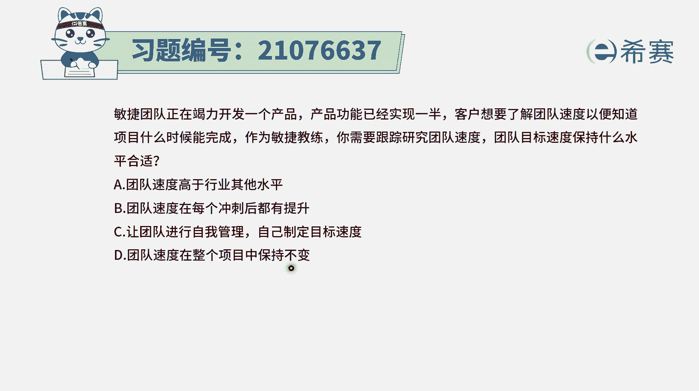

虽然这里有一条说敏捷会提倡是可持续的开发，希望是保持恒久稳定的速度。

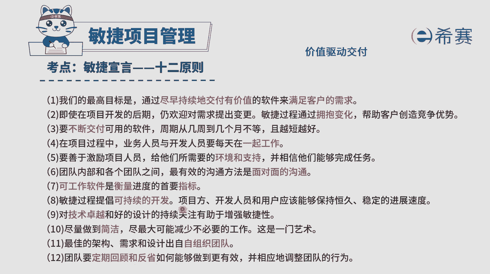

但并不能够保证团队，它整个在项目过程中都保持速度不变，那这一个冲刺中做的速度是可能56个，那下一个同时可能做了53个，再下一个可能做了57个，他可能会让下有浮动，这都是正常的。

只要是保证一个大致的水平之内都是可以的啊，所以这道题目的答案是选C选项。

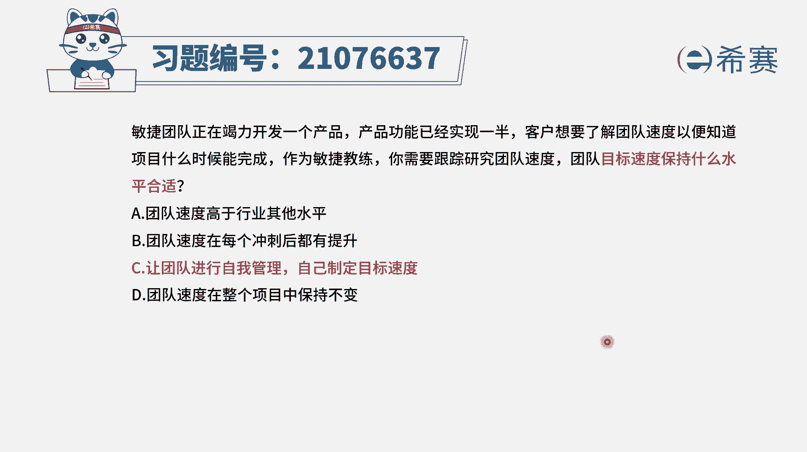

那解析在这边需要的同学可以自行查看。

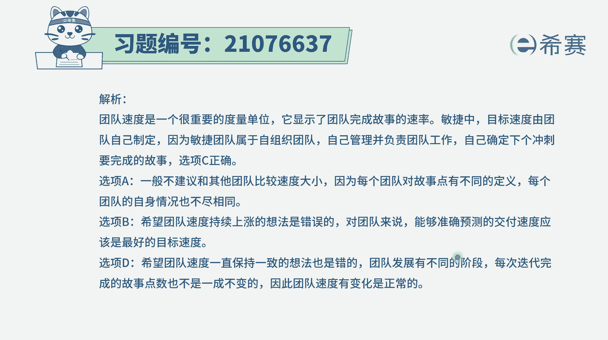

应该是要去让团队成员来自我管理。

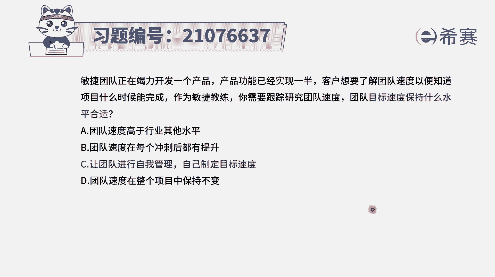