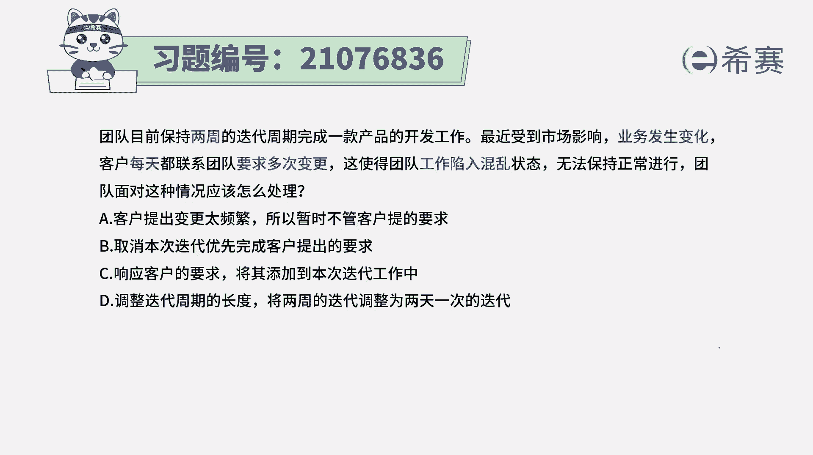
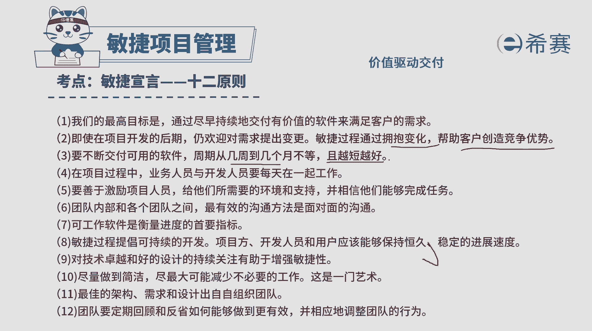
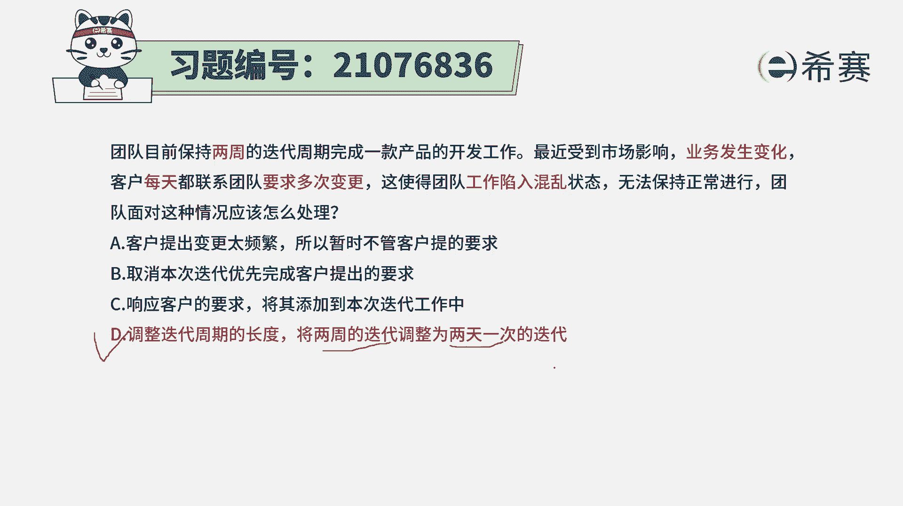

# 搞定PMP考试50%的考点，180道敏捷项目管理模拟题视频讲解，全套免费观看（题目讲解+答案解析） - P18：18 - 冬x溪 - BV1A841167ek

团队目前保持两周的迭代周期，来完成一款产品的开发工作，最近受到市场的影响，业务发生变化，客户每天都联系团队，要求多次变更，这使得团队工作陷入到混乱的状态，无法保持正常的进行，团队面对这种情况的时候。

该怎么处理，请注意，这已经是用一种敏捷的方式来去做项目，每两周就会交付一个版本，在这种情况下，因为客户的这样一些特定的情况，所以导致他每一天都会再提，更多的变更请求过来，导致团队会变得更混乱。

那该怎么做呢。

首先我们需要去知道的一个点，就是在敏捷中其实是会强强调拥抱变化，会通过这种拥抱变化的方式，来帮助客户创造更好的价值，所以所以其实是要去拥抱变化来创造价值，然后第二个呢就是在敏捷的过程中。

它会强调交付的周期呢不要太长，越短越好，几周到几个月越短越好，一般是两到六周，也可以更短，最短的。

甚至可以说一天发布一个版本也是可行的，有了这个基本信息以后，我们再来看一下这四个选项，选项A客户提的这个变更太过于频繁，所以呢就暂时不用管它体的需求，那这种方式肯定是不行的啊。

你本身就是要通过这种拥抱变化的方式，来帮助客户创造价值，这个就跟那个完全相背离，选项B取消本次迭代，优先完成客户的需求，那你完成了客户的需求，那你这一轮迭代事情就没有完成呢。

那这个事情就已经变得更加混乱了，这就完全是一种混乱的状态，尤其是客户的需求，它是什么样的，是每天都可能会提新的东西过来，所以你更加没有办法去完成它，选项C响应客户的要求，将其添加到本次迭代中。

你把这样一些新的东西添加到本次迭代中，那本次迭代本来该做的事情，他能不能完成，它就完不成，所以这种方式肯定也是有问题的，而选项D调整迭代周期的长度，将两周的迭代周期调整为两天一次。

也就是说我把这个迭代周期调的更短一点，这样的话能够更快的去满足你的要求，去响应你的要求，那这也就是这种，对于变更特别特别频繁的情况下是可以用的，虽然我们一般来讲说是，但是两到六周左右。

但是其实很夸张的是，可以一天一变更，两天一变更，就是一天一个版本，一天发布一个版本，两天发布一个版本，这也是可行的啊，所以答案呢是选D选项，就是在这种因为特定的情况下。

导致客户的要求变得特别频繁的情况下呢，我们就可以长更短的时间去发布东西，出来，两天发布一个版本出来，那每两天发布一个版本出来，给到客户去直接去使用，它在使用的过程中发现有什么问题。

然后再提供快速去修改去响应，这也是可行的解析。

