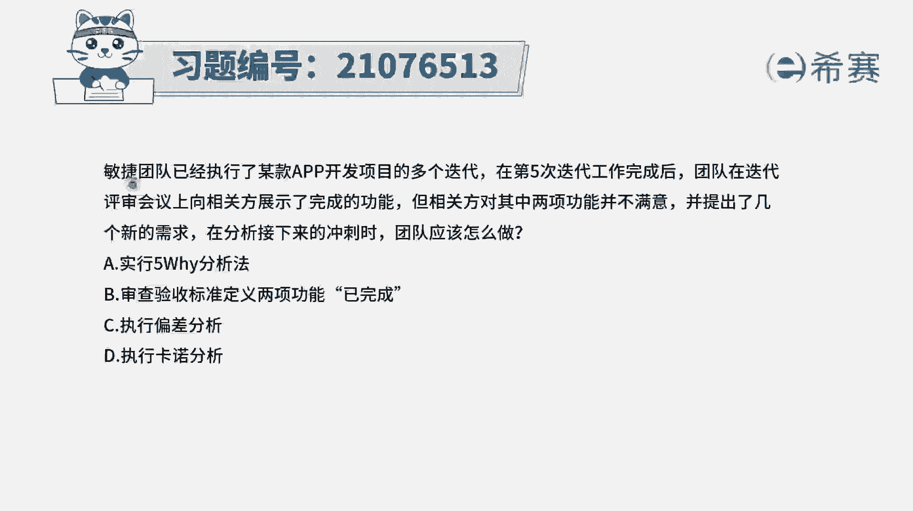
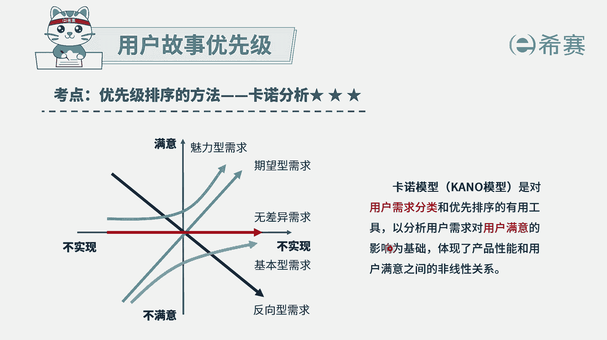
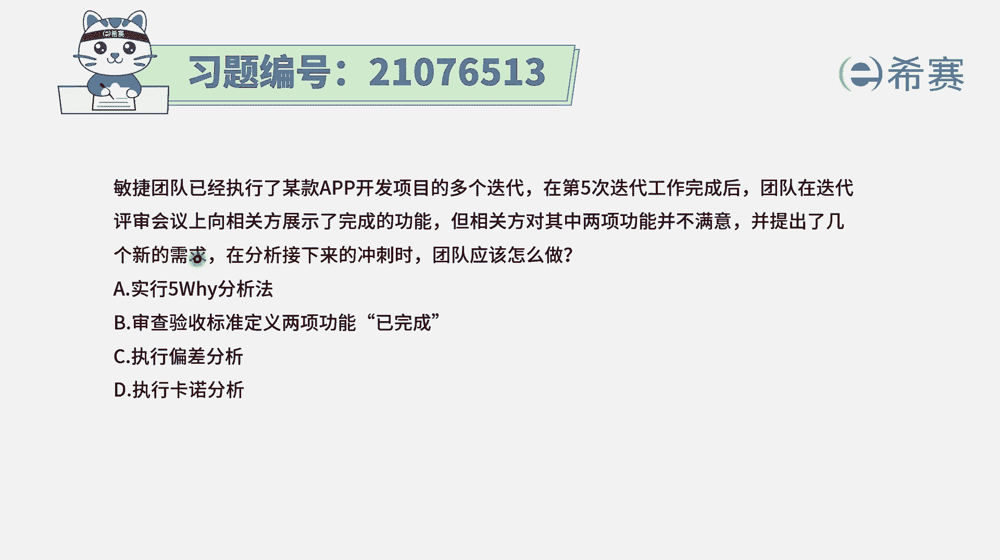
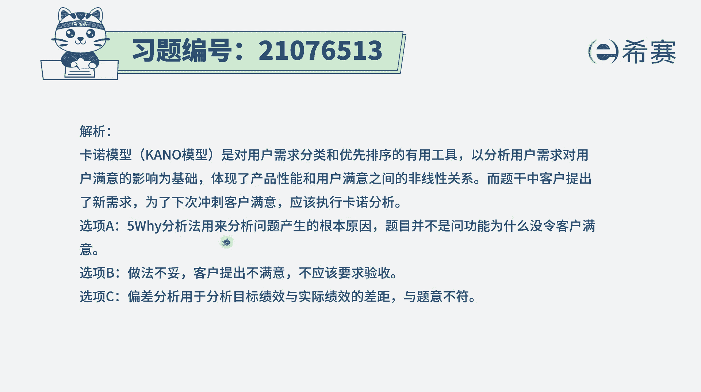
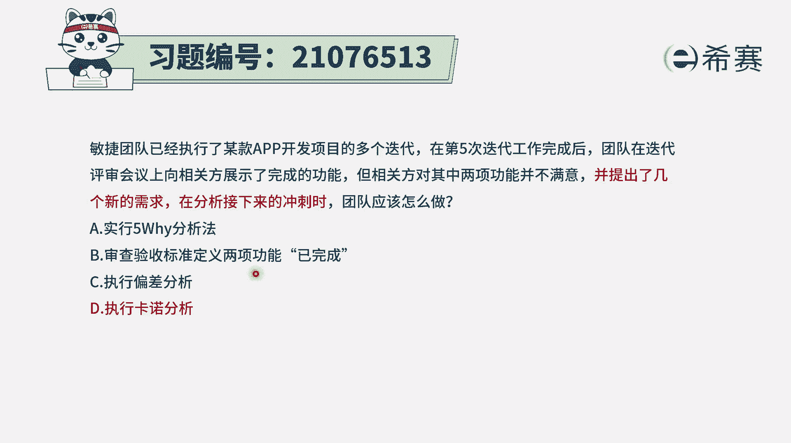

# 搞定PMP考试50%的考点，180道敏捷项目管理模拟题视频讲解，全套免费观看（题目讲解+答案解析） - P20：20 - 冬x溪 - BV1A841167ek

敏捷团队已经执行了某款app开发项目，的多个迭代，在第五次迭代工作完成后，团队在迭代评审会议上，向相关方展示了完整的功能，但相关方对其中两项工人并不满意，并提出了几个新的需求，在分析接下来的冲刺时。

团队应该怎么做，那这种题目的话呢，说实在的，你得要把四个选项都看完，你才知道应该怎么做，因为他要做的事情可能有多种方式都是可行的，好我们来看一下啊，选项A说是实行5Y分析法。

首先五外分析法是探寻根本原因的一种方法，也就是说当有一些事情有问题的时候，不正确的时候，我们可以通过无外分析法的方式，来去找寻它的根本原因，所以一定是要去找到根本原因的时候，才会选到无外法。

那跟题干没有什么关系，形象并审查验收标准，定义两项功能为已完成，这就是错误选项，因为题干中已经明确表示，相关方对其中的两项功能并不满意，他不满意就表示验收没通过，那验收没有通过。

你不能够上至把它变成十叫已完成选项，C是执行偏差分析，那通常执行偏差分析是在执行过程中，我们是在敏捷中的适应阶段，或者说是在啊结构和项目管理中，我们会做监控的阶段的时候来进行偏差分析。

看执行情况和我原来所计划的情况之间，有多大的偏差，从而知道我下一步应该怎么样去做一些调整，选项，D卡洛分析，那反而卡洛分析是可以选的，为什么。

因为卡洛分析，它是对用户故事进行排序的一种方法，它会把我们的建议用户故事，把我们的需求分到这五大类，一类是魅力型需求，一类是7万型需求，一类是无参与需求，一类是基本需求，还一个呢是反向需求。

他会通过分析把这个用户的需求，对用户的这些满意的程度的影响，来去做一个调整，来体现出这些产品性能和用户满意，他们之间的一种非线性的关系。

而题干中说到的是，前面对有些东西是不满意的，那接下来他又提出新的需求，我们怎么样去确保这些新的需求，能够让他更好的满意呢。

我们可以去进行这个卡洛分析，那解析呢在这边需要的同学可以自行查看一下，你得要知道一点，就是通过这种考核分析的方式，能够更清晰地去指导这些产品性能和用户满意，他们之间的这种关系，从而能够对于这样一些需求。

做好更好的一个排序。

