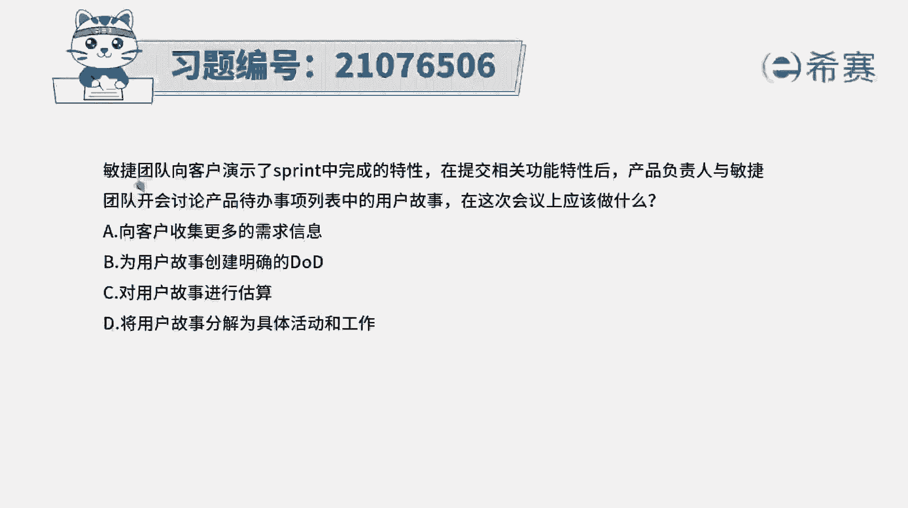
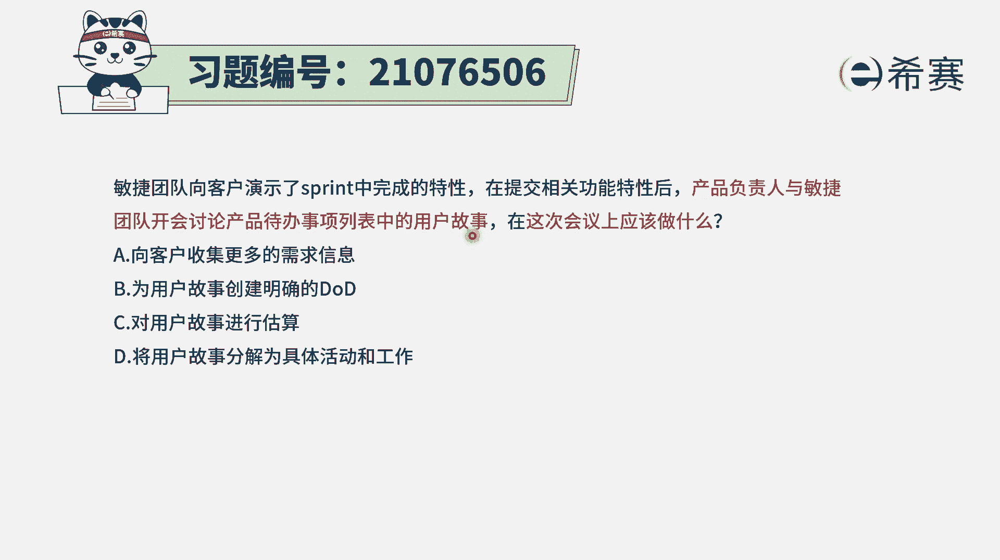
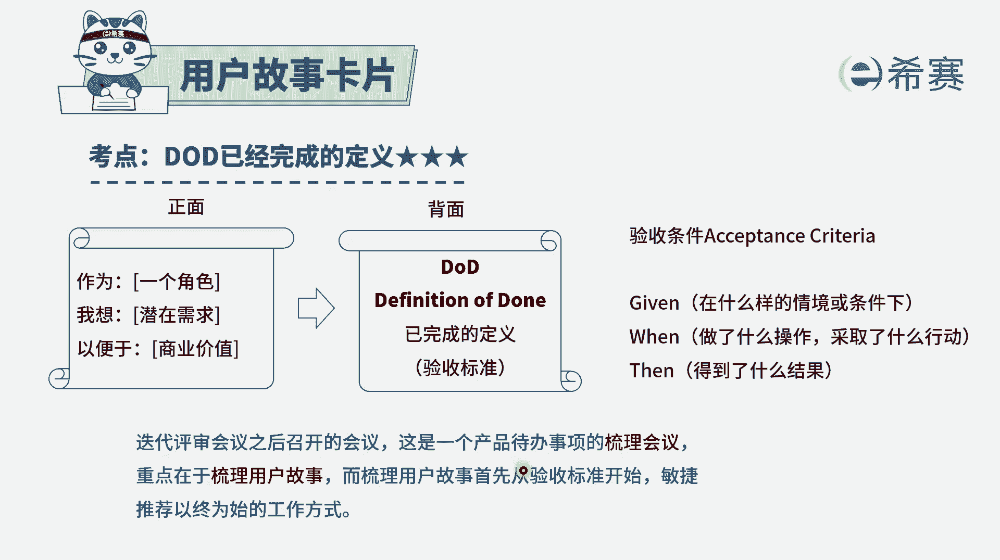
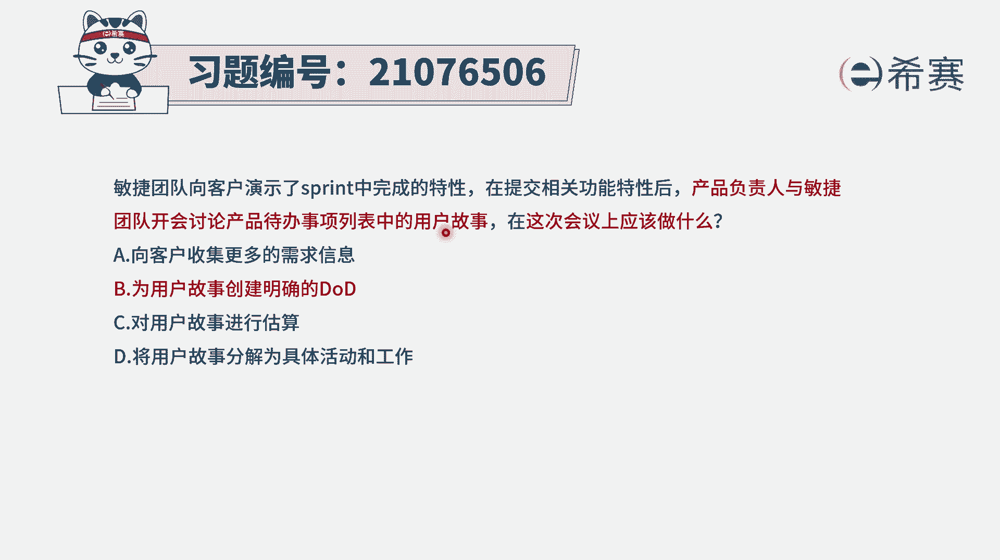
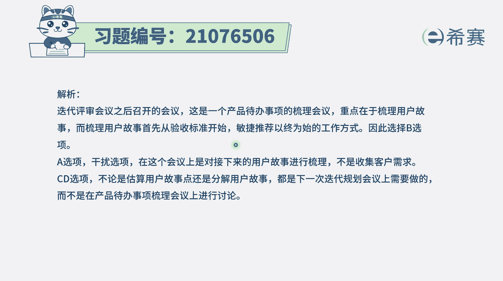
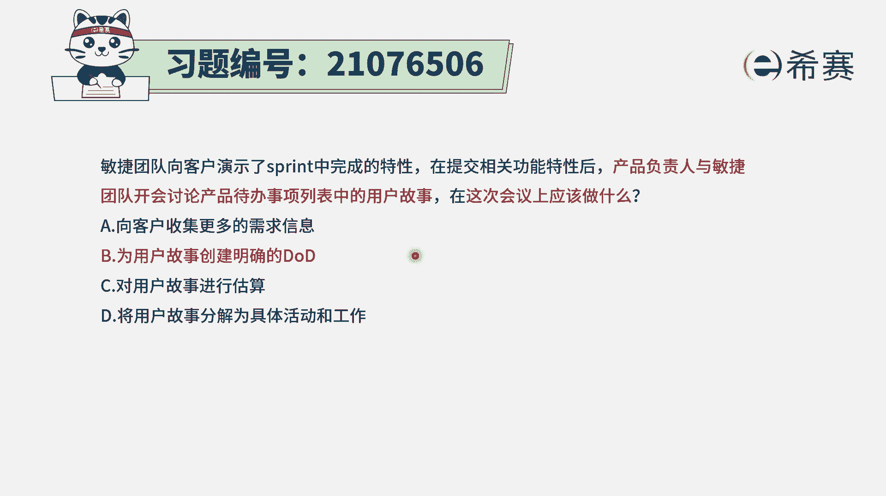

# 搞定PMP考试50%的考点，180道敏捷项目管理模拟题视频讲解，全套免费观看（题目讲解+答案解析） - P21：21 - 冬x溪 - BV1A841167ek

敏捷团队向客户演示了冲刺中的完成的特性，在提交相关功能特性后，产品负责人和敏捷团队开会来讨论，产品待办事项列表中的用户故事，在这一次会议上应该做什么，选项A向客户收集更多的需求信息，选项B。

为用户故事来创建明确的，DOD就是完整的定义选项C，对用户故事进行估算，选项D将用户故事分解为具体的活动和工作，这个题目呢其实是蛮有难度的，因为这个题干中所描述的这样一些信息。

你其实会发现它其实很容易理解到另外一个点，是很容易理解到我们生活中经常会理解的，叫做迭代规划会议上，而事实上题干我们来仔细研读一下啊，敏捷团队向客户演示冲刺中完成特性，这是干什么呀。

这是在做铁迭代评审会议对吧，而在迭代评审会议这个事情完成以后呢，然后产品负责人，他和民团呢又开始来讨论，产品待办事项列表中的这些用户故事。

这是在干什么呢，这是在做一个叫梳理会议，就通常在迭代评审会议之后呢，我们可能还会对这些用户故事来进行一轮梳理，而这人梳理的话其实更重要的，或者说一般来讲就是先从这个用户故事，它是什么。

以及它的验收标准或者完成定义开始，通常用户故事他都会有，就是正面会表现出说我作为一个什么样的角色，我需要一个什么样的功能，为什么需要这样一个功能，讲背后的逻辑，或者是它实现了价值。

然后反面会列出来这样一个用户故事，它对应的完成了标准，OK已完成定义验收的标准，那通常在梳理这个用户故事时，会干这样一些事情，而后来在下一步。

正式来开始下一轮迭代的时候呢，我们会有一个叫迭代的规划会议，而在迭代规划会议上或者叫冲刺规划会议啊，在迭代规划会议或是冲刺规划会议上呢，我们通常要干的事情就确确实实包括了，把这样一个用户故事来做拆分。

要去计算出这些用户故事的时间，要去把事情然后拆分成各个任务项和工作项。

那再回到这样一道题目，题干中所说的，产品负责人和团队，一起来讨论，这样一个迭代办事项列表中的用户故事，如果说他是一个用户故事梳理会呢，那一定是只能够选第二个选项，叫为用户故事来创建明确的完整的定义。

如果说本身它确实就是一个，迭代规划会议的话呢，那么B选项可以选，C选项可以选，D选项也可以选，而我们知道在敏捷里面的话，它经常只有四选一，只有一个选项是最佳的选项，所以在这种情况下。

它这个会议就不是一个迭代规划会议，而反过来变成另外一个叫产品，用户故事的梳理会议。

所以只有第二个选项是可以选，那详细的解析呢，在这边需要的同学可以自行查看一下。

就我们需要去知道一个点，如果说是关于那个迭代规划会议，那么BCD都是可选的，而如果说是这个用户故事的梳理会议的话呢，那么只有B选项是可以选，因为我们对于这用户故事的梳理，首先是用户故事本身的梳理。

