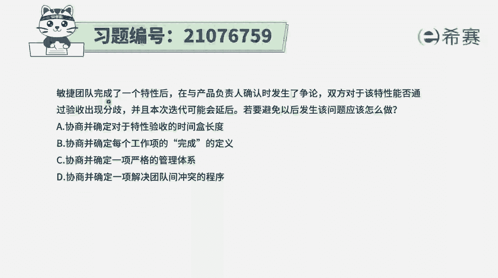
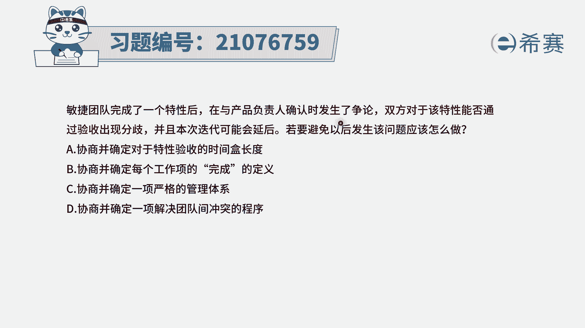
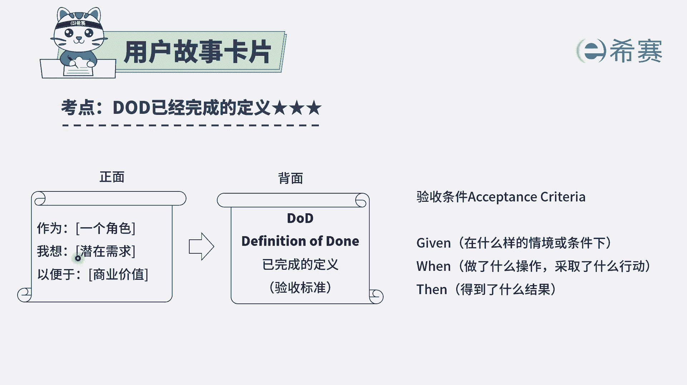
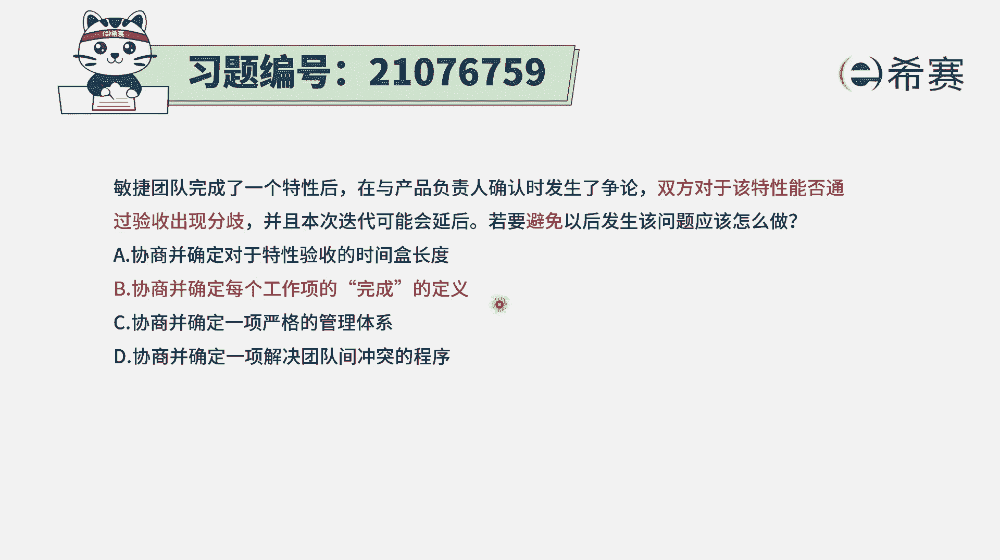
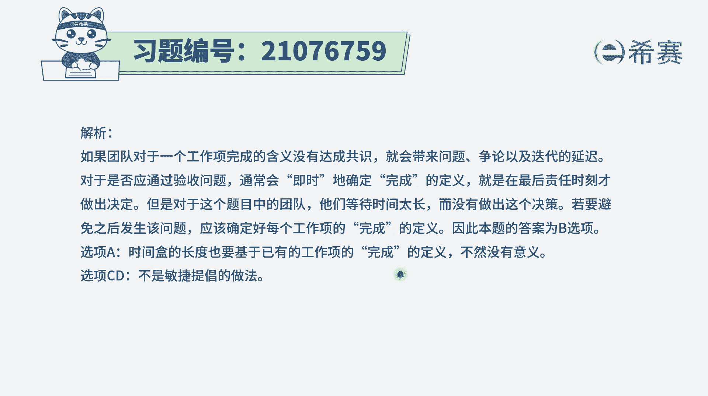

# 搞定PMP考试50%的考点，180道敏捷项目管理模拟题视频讲解，全套免费观看（题目讲解+答案解析） - P32：32 - 冬x溪 - BV1A841167ek

敏捷团队完成了一个特性后，在与产品负责人确认时发生了争论，双方对该特性是否通过验收产生了分歧，并且本次迭代可能会延后，若要避免以后发生该问题，那应该怎么做呃，也就是说我们要如何做。

才能够避免对于特性的验收发生分歧呢，其实很多时候验收之所以会发生分歧，一定是大家对于验收标准的意识度是不一样的，没有达成某种共识，所以如果说要不会发生这种对验收的分歧，那就是提前定义好建议验收的标准。

而提前定义好验收标准呢，专门有一个内容叫definition of down，叫已完成的标准，也就是对这样一些特性或者是用户故事，在正面写上，用户故事在背面写上已完成了定义，这个已完成定义。

你可以把它简单理解就是验收的标准，一般来讲有三段论，就是在什么样的情境下或条件下，当我做了什么样的操作的时候，或者是当我对这个软件，采取什么样的行动的时候，那么这个软件它就会呈现出一种什么样的后果。

或者说我就会得到一个什么样的一个结果，如果做到了，那么说明这个用户故事就已经是完成了，如果没有做到。

说明这个用户故事就是没有完成，有了这样一个信息以后，那么这个题目其实就是很好选，就是既然双方在对于这个特性特性，但是说的是更大的这个呃功能啊，是更多的建议用户是合集叫特性。

你可以把它简单理解为就是若干的用户故事，对于这一批的用户故事，它是否通过验收，如果产生分歧，很多时候就是因为对于这个验收的标准，没有达成共识，而如果避免呢，就是去协商并确定每一项工作项。

它的一个完成的定义，当我们把每一个工作内容，它的完成定义都确定好了以后，那就是按照这个标准来进行，达到了就可以通过验收，没有达到就不能通过验收，好其他几个选项，我们也简单看一下选项。

A协商并确定对于特性验收的时间，河的长度，那时间和其说的是一个固定的时间，比方说我们在做一个迭代评审会议的时候呢，就是三个小时，那么然后他说的时间更长，我四个小时，五个小时能够解决掉这种验收的冲突吗。

其实并不一定，应该是要从源头上一开始就定义好规则，所以这个选项肯定是不可行的，选项C协商并确定一项严格的管理体系，这个刚好跟敏捷就相违背了，敏捷里面是一种拥抱变化的方式，会是一个比较灵活的去处理和应对。

是快速试错的这种方式，所以它不适合于这种非常严格的管控，然后选项D协商，并确定一项解决团队之间冲突的程序，那这个解决冲突程序本身呢也没有错，关键重点是这个冲突就已经摆在这里，我们该怎么办呢。

我们提前可以怎么做实行来避免这个冲突呢，那提前做的就是把每一项工作的完整，定义给确定好了以后。

就可以避免这个事情，所以答案是选B。

