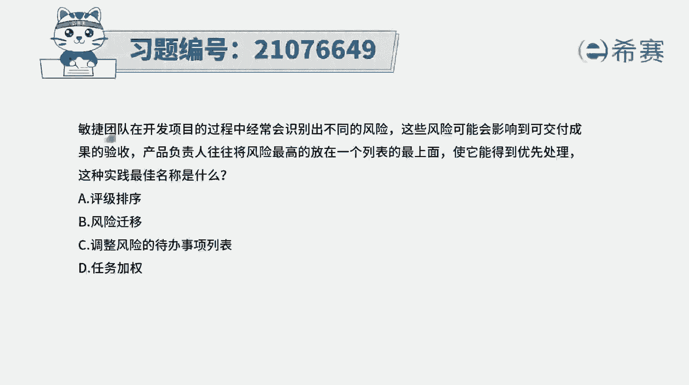
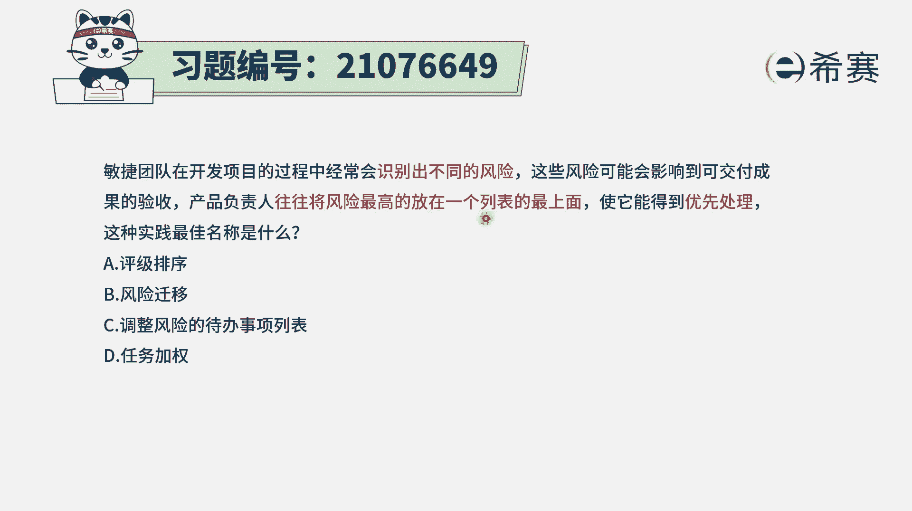
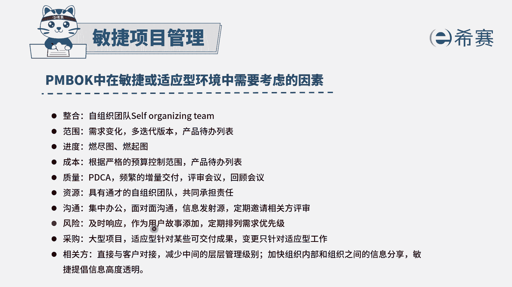
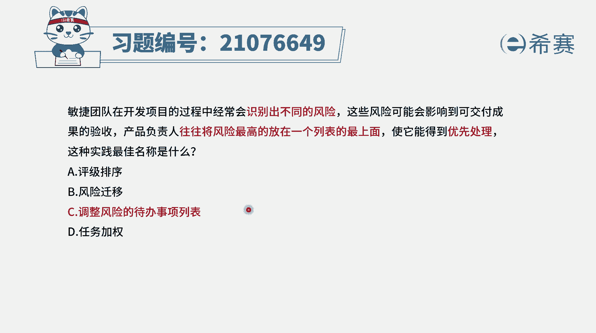
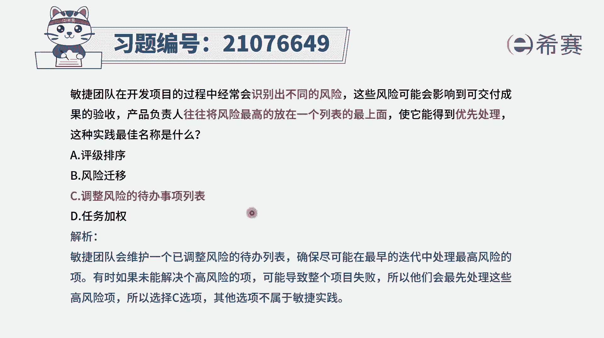

# 搞定PMP考试50%的考点，180道敏捷项目管理模拟题视频讲解，全套免费观看（题目讲解+答案解析） - P36：36 - 冬x溪 - BV1A841167ek

敏捷团队在开发项目的过程中，经常会识别出不同的风险，这些风险可能会影响到可交付成果的验收，产品负责人往往会将风险最高的，放在一个列表的最上面，使他能够得到优先处理，那这种实践的最佳的名称叫什么呃。

这个的话首先你要知道一下那个列表是什么，列表，叫产品待办事项列表对吧，然后产品待办事项列表中放的什么东西，放的用户故事，那同时用户故事它是有价值的，而同时在项目过程中呢会有风险风险，它是反价值。

也就是如果这个风险产生了以后会造成损失，这个损失就是反价值。

所以我们会把这些风险也很重要的去对待，当识别到风险的时候呢，我们是要去去响应它，我们需要去为这个风险添加一个风险，应对的这样一个用户故事，并且呢要进行优先级排序，是根据这个价值和反价值来排序。

比方说如果某一个产品用户故事，它的价值是5000，而如果某个风险它的价值是四分，-4000是反价值，那么这个-4000的房价值呢，也是要重点考虑进来的，所以就是以后他就会排在这个5000的后面。

所以整个这个过程其实就是对产品，待办事项列表来进行排序，那么它的名称代表什么，你看一下哪一个会涉及到产品待办事项列表，只有这一个选项，C是调整风险的待办事项列表，也是对风险代办事项列表来进行排序。

答案就选C，至于说其他几个选项，评级排序，我没有收到评级排序，说的就是按照价值来进行排序，按照价值和那个紧迫程度来进行排序，然后风险迁移没有风险迁移这个说法啊，在风险管理中会有一个叫风险转移，风险转移。

它通常是指的说，由第三方来帮我们去承担这个风险的后果，我们去给他支付一定的费用，比方说啊像买保险的这种方式，选项D任务加权，那任务加权通常是，我们可能会对某一些东西要去做选择的时候，要去做决策的时候。

可能会使用这种加权求和的方式来去做选择，跟这个题干没有什么直接关系，题干中很明显的就是将风险放到一个列表中，并且把它放到一个比较靠上面的，这个就是对整个带班时间列表来进行排序，所以答案是选C。

