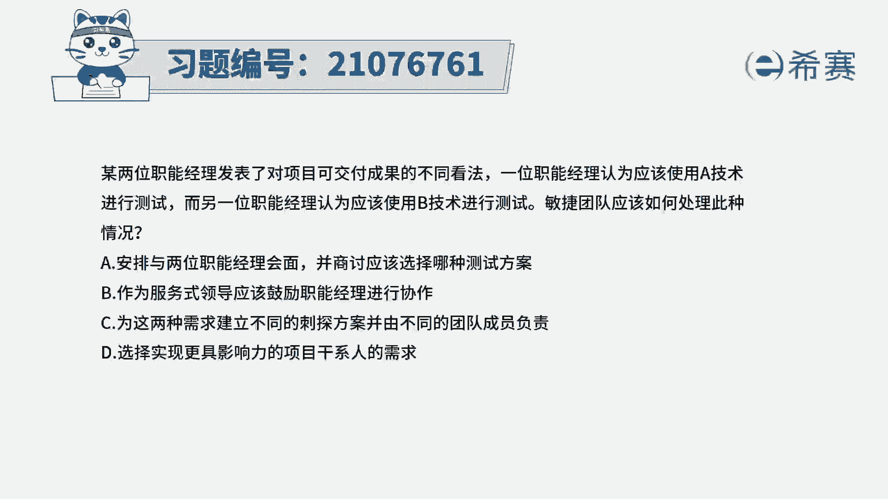
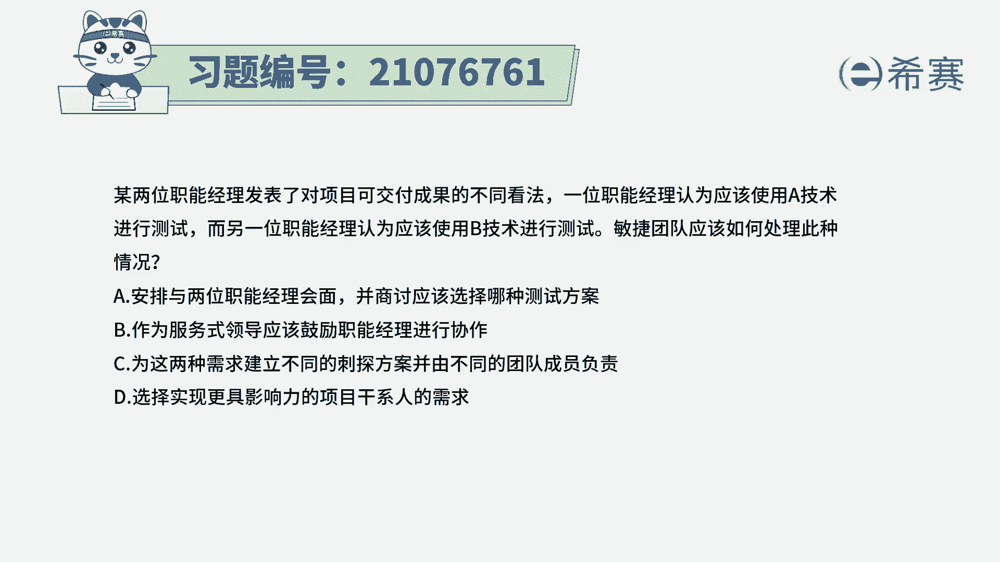
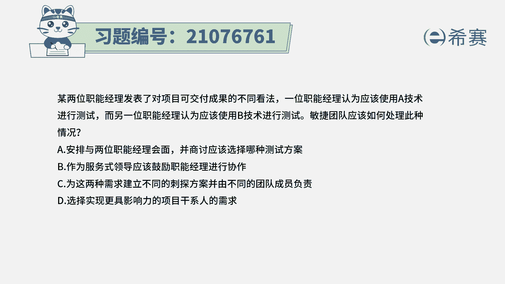
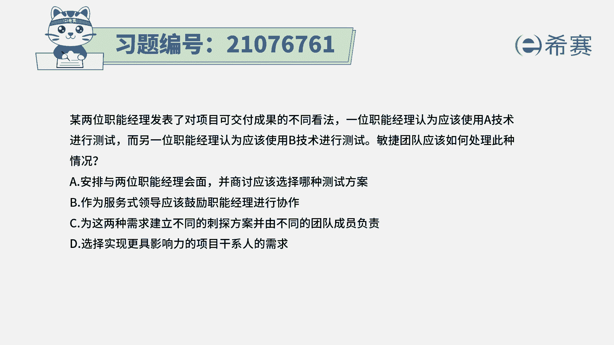
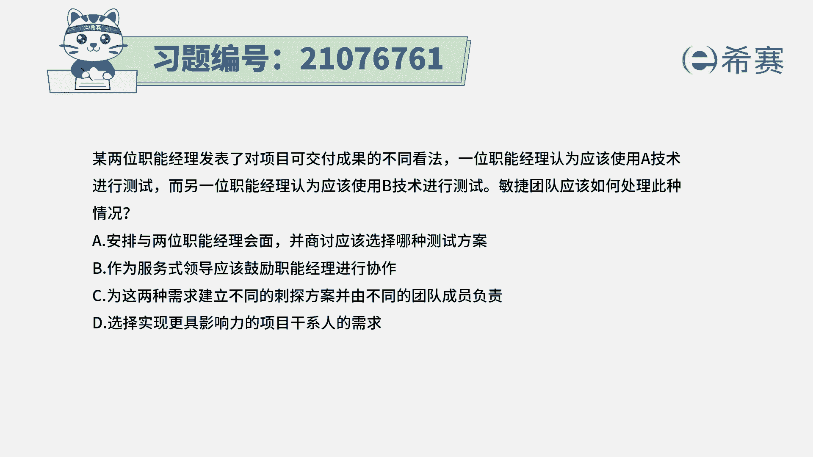
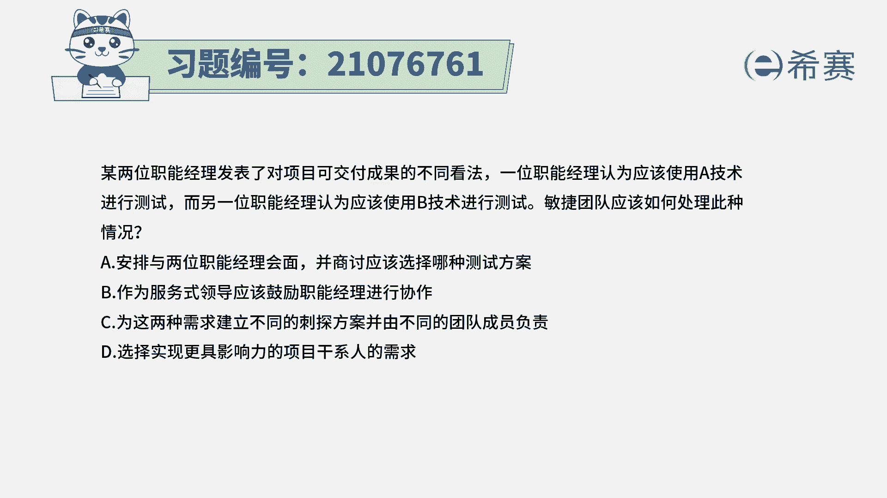
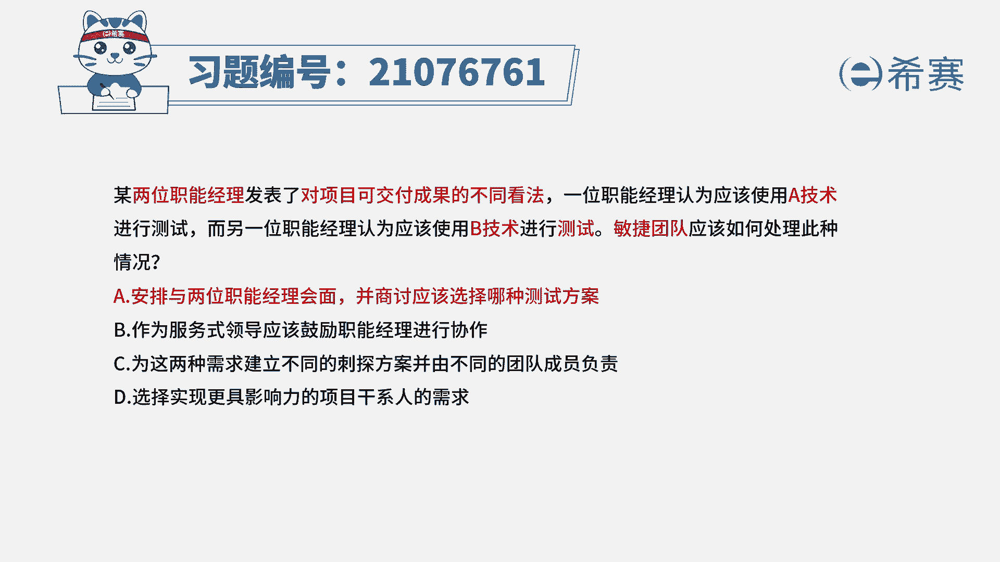
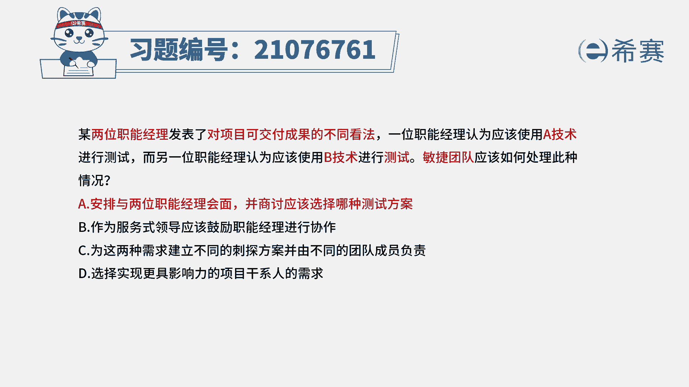

# 搞定PMP考试50%的考点，180道敏捷项目管理模拟题视频讲解，全套免费观看（题目讲解+答案解析） - P37：37 - 冬x溪 - BV1A841167ek

某两位职能经理发表了，对项目可交付成果的不同看法。

一位职能经理认为应该使用A技术进行测试。

而另一位职能经理认为，应该使用B技术进行测试。

敏捷团队应该如何处理这种情况，那请注意。

这里面是两个领导啊，两个职能经理，他们对于这样一个可交不成果的测试方法。

有分歧，那有分歧肯定是要去解决分歧，然后解决分歧最好的方式应该是面对面的沟通。

那我们来看到四个选项，选项A安排与两位职能经理会面。

并商讨应该选择哪一种测试方案，那也就是大家面对面的沟通来解决问题。

既然大家对于测试方式有分歧，我们就一起来讨论解决，这刚好就是符合题干的这个内容，是它的正确答案啊，我们顺便看一下其他的三个选项，选项B作为服务式领导，应该鼓励职能经理进行协作，请注意服务是领导或者仆人。

是领导，他是谁的仆人，谁的那个领导，他是项目团队啊，是敏捷团队的那个仆人式领导，而不是这些职能经理面的符文，是领导啊，所以这里面的话这个这个这个主体问说错了，选项C为这两种需求建立不同的刺探方案。

并由不同的团队成员来负责，这种方式可不可行，其实也不是说不可行，但是呢对于这种测试，如果说遇到的是那种非常难的问题，然后对于一个很艰难的问题，有两种不同的方式来去解决，那是可以分别来试探一下。

去看一下哪种方式可能更好一点，但是题干中，它不能够表达出这个东西有多么的艰难，所以呢用这种姿态的方式呢可能不那么合适，选项D选择实现更具有影响力的项目，干系人的需求。

这就是很典型的这种啊从上往下压的这种方式，它不符合敏捷的这一套思路，敏捷本身就是会受到相对来讲有问题，我们能够通过沟通的方式来解决问题，能够更好的信息同步，对人有更多的这样一份尊重。

能够去养成一个良好的氛围来解决问题，这个试题的解析呢在这里，大家有需要的可以自己看一下，那这里有一个坑需要了解，就是B选项，其实作为服务是领导或者是普通市领导，你是项目团队的普通市领导。

而不是这些职能经理们的仆人式领导，所以当更高层级的见习人群，他们有问题的时候，其实还是一样的。

