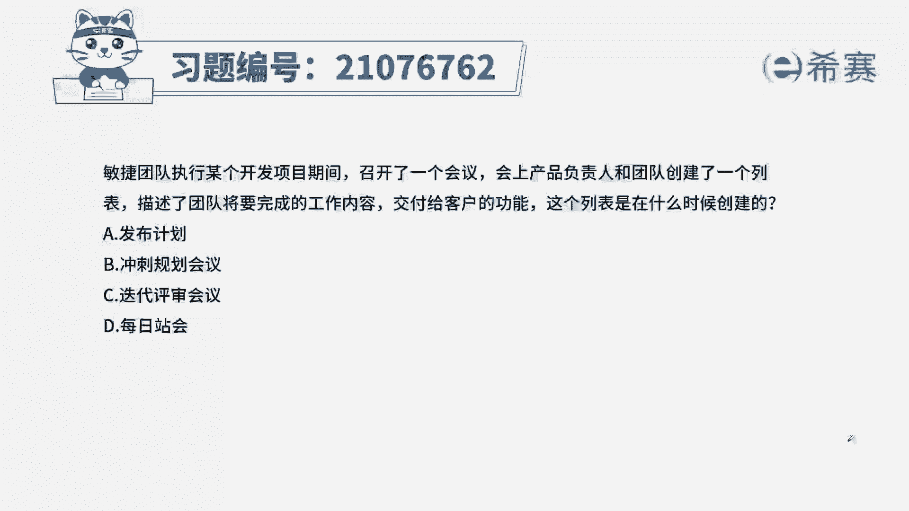
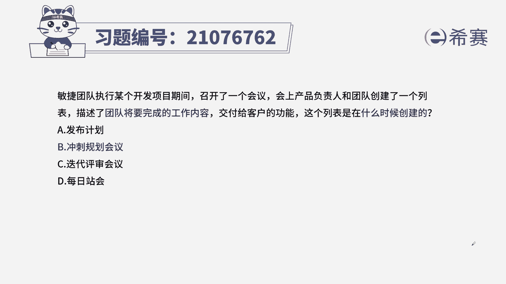
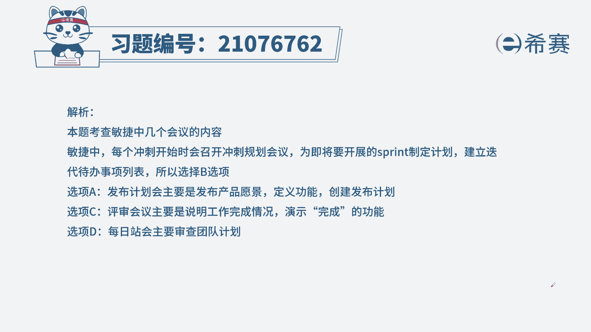
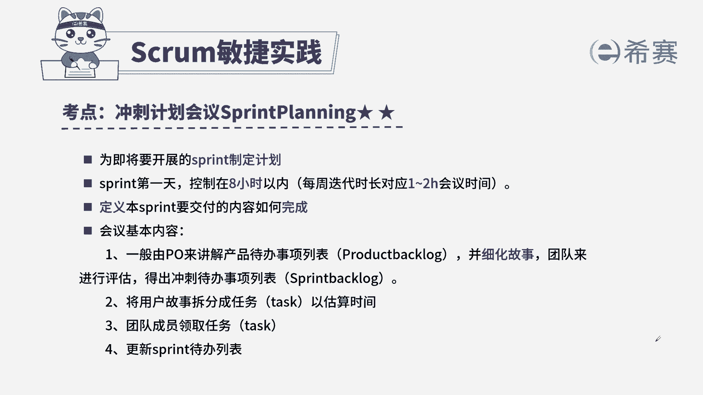

# 搞定PMP考试50%的考点，180道敏捷项目管理模拟题视频讲解，全套免费观看（题目讲解+答案解析） - P42：42 - 冬x溪 - BV1A841167ek

敏捷团队执行某个开发项目期间，召开了一个会议，会上产品负责人和团队创建了一个列表，描述团队将要完成的工作内容，交付给客户的功能，这个列表是在什么时候创建的，A发布计划，B冲刺规划会议。

本题考概念考的内容，首先从题干找到关键信息，团队也将要完成的工作内容，那这个工作内容是在什么时候创建的，我们知道在开展一次迭代的之前，我们要召开一个规划会议，规划会议上，我们要从产品待办事项列表中。

确定我们本次迭代要做哪些内容，这里就是我们题干中所说的，团队将要完成的工作内容，那这个会议是我们的规划会议，所以选出正确选项为B选项，好，我们来看其他三个选项诶，发布计划。

发布计划是确定我们整个项目的愿景啊，一些计划大计划，所以它不会具体到我们本次迭代的工作内容，C迭代批准会议，批准会议是在我们迭代结束的时候，我们叫我们完成的功能或者特性，展示给我们的客户和产品负责人。

而不是确定我们该做什么就已经做完了。

团队自行召开的会议，所以和题干无关，这是本题的解析。

大家可以点开看一下本题考点，冲刺计划，会议这个知识点以内容为主，所以我们一定要内容进行熟悉，它的作用是增加什么时候召开，知道这个知识点后，我们同时还要知道其他三个会议的内容。

