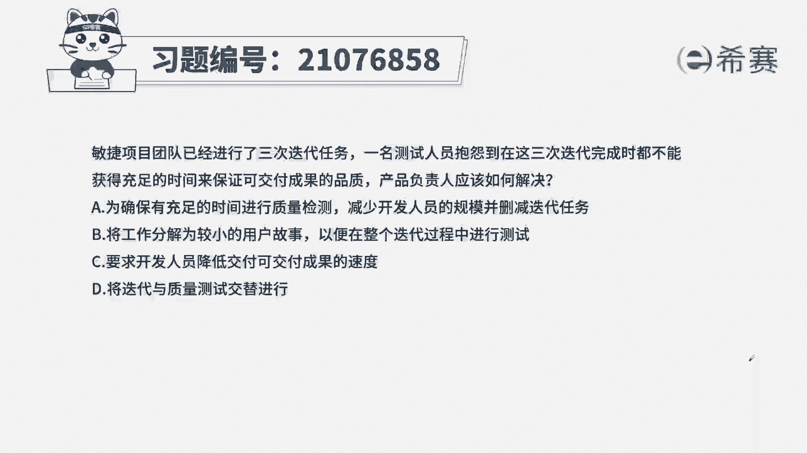
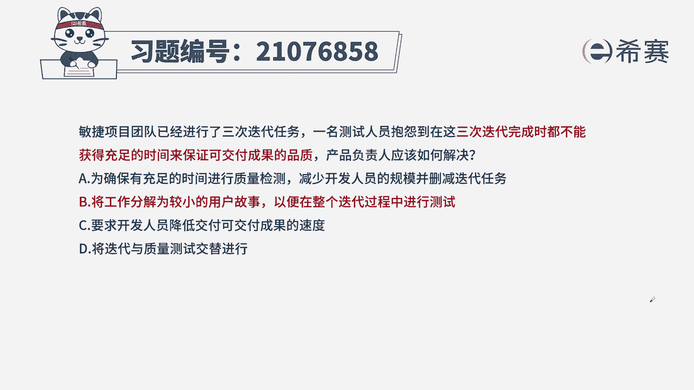
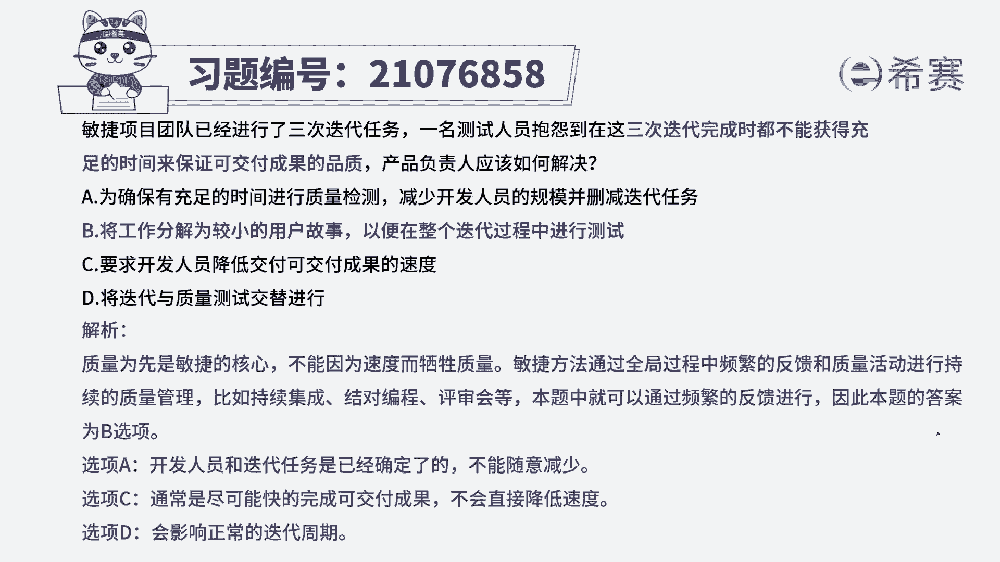

# 搞定PMP考试50%的考点，180道敏捷项目管理模拟题视频讲解，全套免费观看（题目讲解+答案解析） - P48：48 - 冬x溪 - BV1A841167ek

敏捷项目团队已经进行了三次迭代任务，一名测试人员抱怨，党在这三次迭代完成时，都不能获得足够的时间，来保证可交付成果的品质，产品负责人应该如何解决，A为确保有充足的时间进行质量检测，减少开发人员的规模。

并删减迭代任务，将工作分解为较小的用户故事，以便在整个迭代过程中进行测试，C要求开发人员降低交付可交付成果的速度，将迭代与质量测试交替进行，本地的考法，最佳实践，找到关键信息，测试人员抱怨。

没有时间来确保可交付成果的品质，也就是说没有时间得到反馈，不知道做的好不好，也不知道是否满足客户的需求，没有反馈，我就没法保证产品的品质啊，我们如何处理这个需求，一起来看四个选项。

A确保有充足的时间进行质量检测，前半句还没有问题，后半句有问题，减少人员以及迭代任务，迭代任务和人员是不能随便减少的，固定下来了就不能变，B将工作分解为较小的用户故事，以便在整个迭代过程中进行测试。

将工作分解成较小的用户故事，代表了你可以高频次的去交付，高频次交付也代表了客户可以给你反馈，从而保证可交付成果的品质，符合刚才的分析，C要求开发人员降低可交付成果的速度，团队的开发速度尽量趋于稳定。

而不是来降低或提高的，稳定了才能代表团队能持续发展，持续改进，D将迭代与质量测试交替进行，迭代与质量测试交替进行，会影响迭代时间，整个打乱了项目的周期，也不合适，从而选出最佳实验答案B选项。

这是本集的解析。

