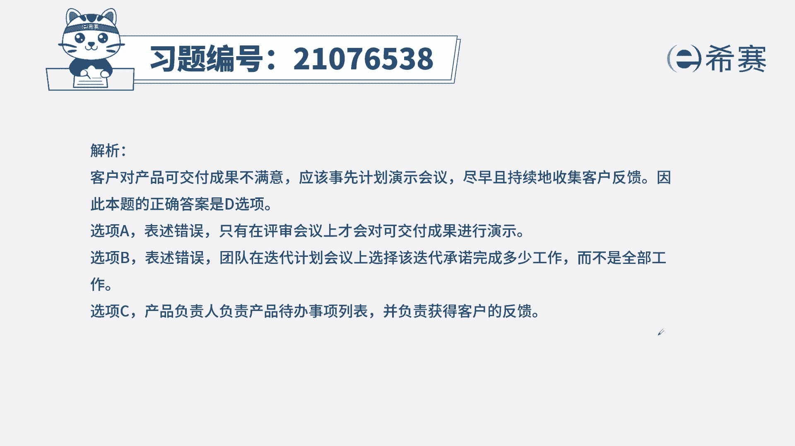

# 搞定PMP考试50%的考点，180道敏捷项目管理模拟题视频讲解，全套免费观看（题目讲解+答案解析） - P50：50 - 冬x溪 - BV1A841167ek

某AIP系统的开发工作已经完成，且已经通过了集成测试，可是客户表示系统的兼容性不强，拒绝验收产品，敏捷团队应该怎么做来避免这种情况，在回顾会议上，按照客户意见对系统进行核实。

B将项目所有的待办事项纳入到本次迭代计划，C要求敏捷教练在验收之前与客户进行交涉，D在计划的演示中收集项目干系人反馈，本题的考法是最佳实践，通过题干我们找到关键词，系统虽然已经完成了。

但是没有得到客户的验收，那我们如何避免这种情况呢，客户没有验收，一定是产品没有满足他的需求，即便你达到了验收标准，但是依然没有给客户提供价值，他也有权拒绝，所以我们来看选项诶。

在回顾会议上按照客户意见对系统进行核实，回顾会议是我们团队内部自己的会议，只是对于工作的复盘，和客户没有关系，B将项目所有的待办事项列表，纳入本次迭代计划中，这种表述是错的。

我们本次迭代不可能把所有的东西都能做完，那我们也不需要迭代了，C要求敏捷教练在验收之前和客户进行交涉，与客户的交涉，第一不是每年教练来做，第二验收成不成功并不是交涉才能解决的。

而是实实在在的你的产品要合格，要满足客户需求，所以正确选项是D选项，我们要收集干型的反馈，D项的表述就告诉我们，我们要定期的邀请我们的客户或相关方，对我们的产品进行评审，也就是给我们反馈。

来确定我们做的是否符合我们的方向。

以及是否符合客户的预期。

这是本题的解析，本题的相关知识点迭代评审会议，首先我们要知道考内容为主，第二我们要知道内容分几个板块，什么时候开，谁参加，说什么事情，最后我们要了解其他会议的内容，这么一来，针对此类型的题目。

