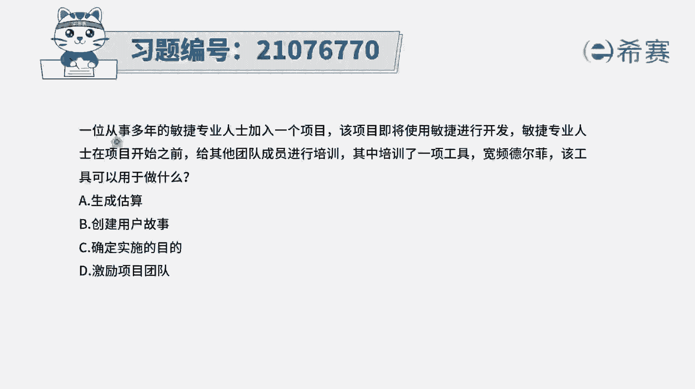
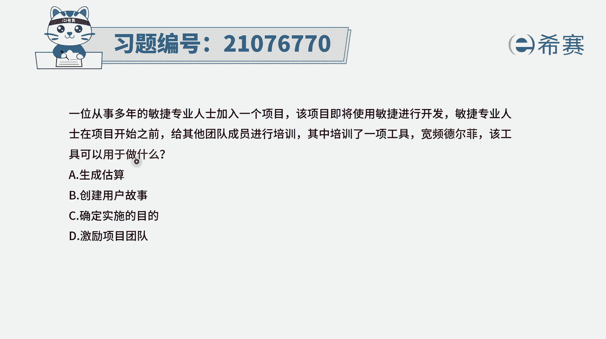
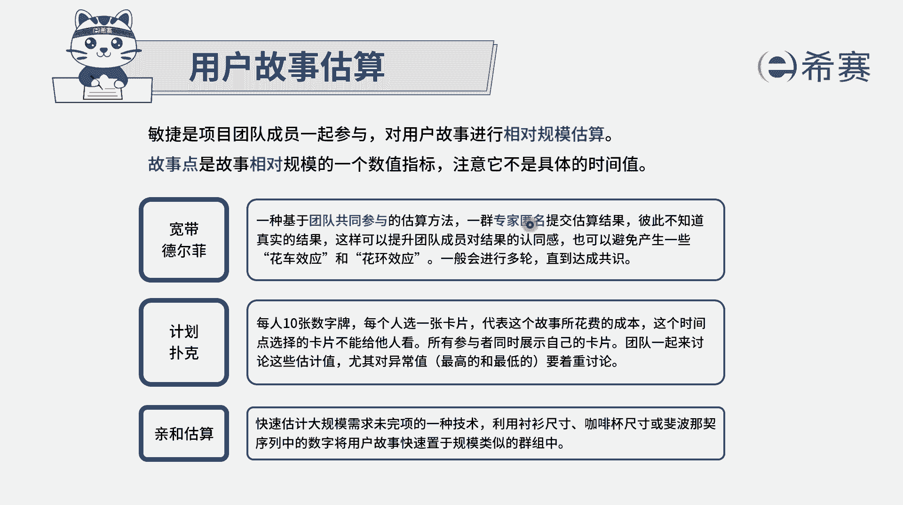
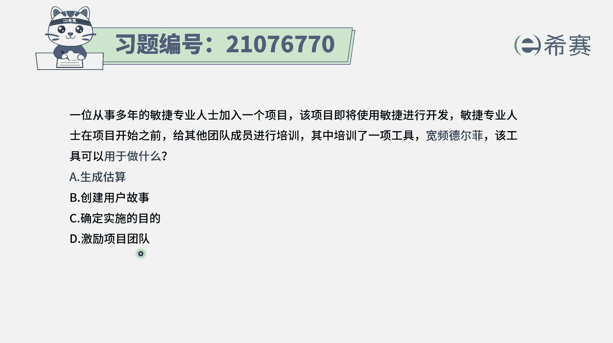
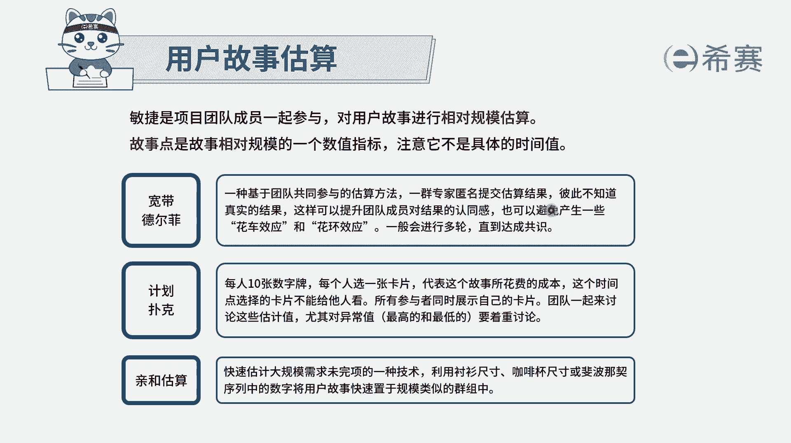
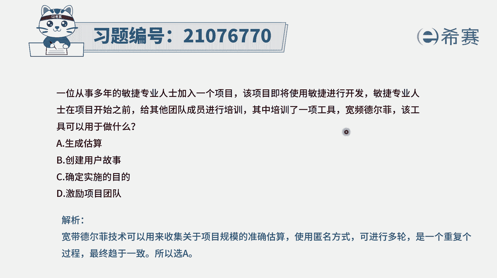

# 搞定PMP考试50%的考点，180道敏捷项目管理模拟题视频讲解，全套免费观看（题目讲解+答案解析） - P52：52 - 冬x溪 - BV1A841167ek

一位从事多年的敏捷专业人士加入到一个项目，该项目即将使用敏捷进行开发，敏捷专业人士在项目开始之前，给其他团队成员进行培训，其中培训了一项工具叫宽屏德尔菲，也就是宽带德尔菲啊，它的翻译会稍微有点不同。

那么该工具可以用来干什么呢，其实这是我们需要去了解一下，关于宽平德尔菲或者宽带德尔菲。

是一个什么工具，它是一个什么工具啊，它是一个估算用户故事的工具，它是可以用来去估算，这样用户故事当然是一种相对估算的方式，它是指团队成员，我们可能会对一些用户故事来进行交流和探讨。

然后每一个人都是匿名的方式来投票，投票完了以后呢，我们可能下一轮还会探讨以后再来投一轮票，所以他比起德尔菲，他会多了一些交流和讨论的环节，而不仅仅只是去投票，它就是这样一种估算用户故事的这个方式。

所以这个题目的答案呢就是选A选项的啊，就是说它是用来去生成估算，就得到这样估算值选项B创建用户故事，那创建用户故事呢，是在我们去梳理这个产品待办事项列表之前，要干的事情。

通常是对于需求来转换成用户故事的，这种方式是由PO带着团队一起来去完成的，然后选项C是确定实施的目的，那这个是在构想阶段要干的事情，就是我们在构想阶段的时候，我们就需要去知道这样一个整个项目的愿景。

然后有了下面的愿景以后呢，我们去啊收集需求，去创建这个用户故事，而对于这一轮的迭代本能实施的目的呢，通常来讲它是其实在早早的就已经规划好了，就是我们在啊构想的阶段去得到了产品的愿景。

然后在后面的这样一个推测阶段，去得到这些发布计划，迭代计划，那在迭代计划中就已经明确列出来，我们要做什么东西，而D选项激励团队，那激励团队其实我们去管理团队的一种工具，就是通过管理团队。

让团队能够更好的去努力往前推进，然后能够更好的去完成这个项目，更好的去面对面的沟通，然后去同步信息而去达成这样一个迭代的目标。

而宽平德尔菲，也就是我们刚刚看到的宽带德尔菲，那它是一种估算的工具，它是用来去估算用户故事点数的工具。

所以答案是选A，选项解析。

