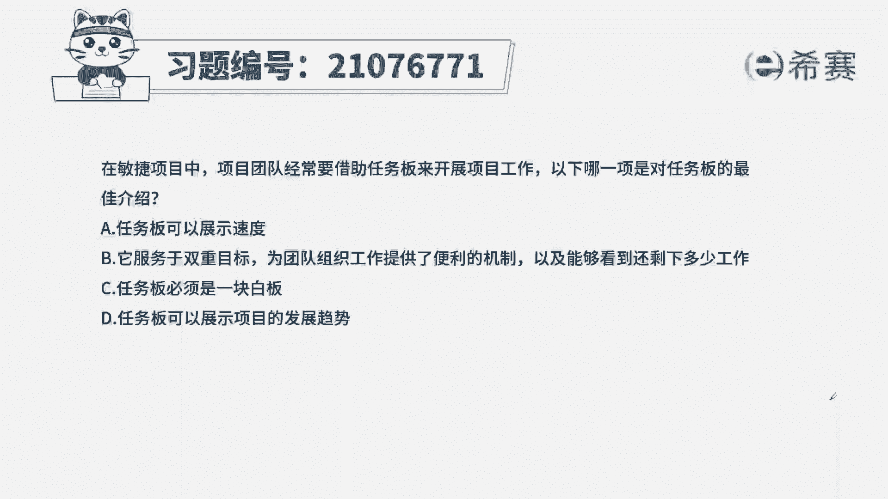
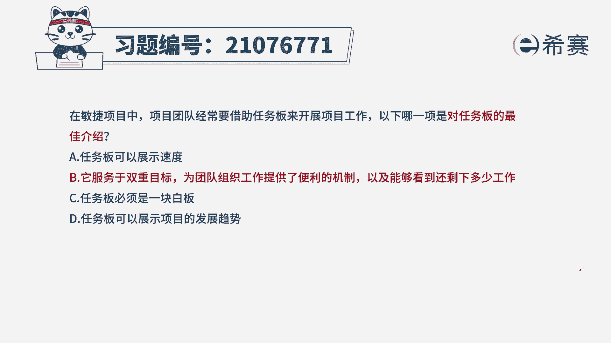
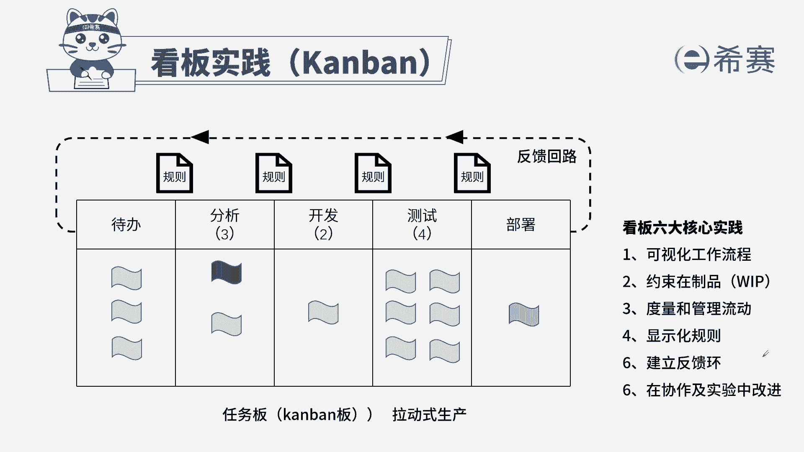

# 搞定PMP考试50%的考点，180道敏捷项目管理模拟题视频讲解，全套免费观看（题目讲解+答案解析） - P57：57 - 冬x溪 - BV1A841167ek

在敏捷项目中。

项目团队经常要借助任务版来开展项目工作，以下哪一项是对任务版的最佳介绍，任务版可以展示速度，它服务于双重目标，为团队组织工作提供便利的机制，以及能够看到还剩下多少工作，任务板必须是一块白板。

D任务板可以展现项目的发展趋势，本题考法最佳实现，首先通过题干找到关键信息，提前告诉我们要对任务版的最佳介绍，来看一下四个选项，A任务版可以展示速度，展示速度是用的燃尽图或燃起图，而不是任务版。

任务版展示的是任务的进展情况，B为团队组织工作提供了便利的机制，可以了解还是想多少工作，通过任务版我们就能了解到，而且可以直观的看到任务的状态，是在代办还是进行中还是已测试还是已完成。

这是一种便利的机制，只有完成了对应的标准，才能进到下一个环节，同时我们能了解到哪些任务在哪种状态下，就知道了哪些还没有做完，所以B项描述了我们任务版的特点，C任务版必须是一块白板，也不一定。

那我们的虚拟白板的啊，它就不是白板，D肉板可以展示项目的进展情况，发展趋势是无法展示的，从而选出最优答案B。

这是本题的解析，本题的相关知识点，看板实践，针对于这个知识点，一定是从内容和作用上下手，我们要了解到什么是看板，它的作用是什么，它的特点是什么，这样针对于此类型的题目。

