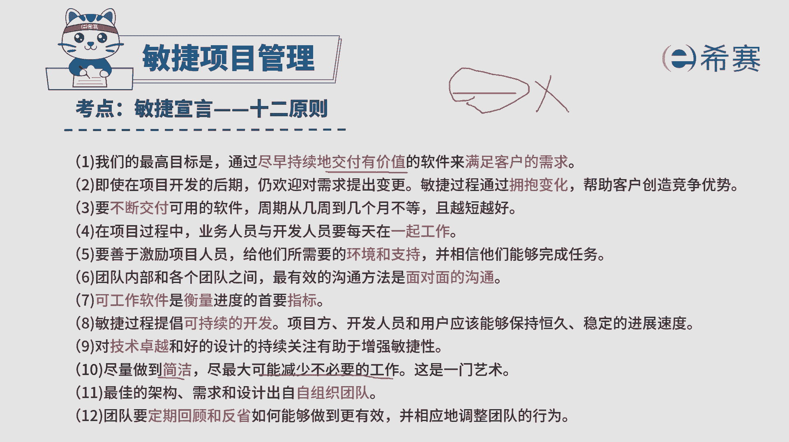

# 搞定PMP考试50%的考点，180道敏捷项目管理模拟题视频讲解，全套免费观看（题目讲解+答案解析） - P63：63 - 冬x溪 - BV1A841167ek

一个大型又复杂的项目正在进行过程中，在第四个迭代周期内，p o product owner就是产品负责人啊，那PO他发现当前迭代工作将会完成，但是完成的是一些不必要的功能。

那PO通知项目经理并讨论该如何解决，项目经理应该怎么样去建议呃，可能有同学会说啊，那敏捷通不是没有项目经理吗，啊你就把它理解为是敏捷教练就好了啊，那PO通知米教练说，遇到这样一个情况。

当前的迭代工作完成将会是不必要的工作，那应该怎么办。

那这里我们需要知道几条原则，首先呢敏捷它是一个价值驱动，交付的这个开发方式，所以它更关注的是交付这种有价值的东西，并且在敏捷中，它这里有一条叫做到简洁，尽量减少不必要的工作。

其实还有一条很重要的信息给大家做一个补充，就敏捷中会有一个他跟精益的思想是一样的，叫消除浪费，什么叫消除浪费呢，就如果说这样一个东西做的是没有价值，那没有价值的东西它就是一种浪费，那我们就不必要去做。

有了这样一个基础信息以后。

我们再来看一下这四个选项，选项A为了不浪费，重新规划，延长该迭代的时间，完成新的需要，那都已经告诉你，这个迭代是会产生一些不必要的功能的话，那是否还需要呢，那你不管延长它的时间还是不延长时间。

做的东西还是没有价值的呀，好像它就不合适对吧，选项B因为还没有交付任何功能，缩短该迭代没有必要进行回顾，那就是说做还是得要做，其实呢花更少的时间做多，并且我们也不去回顾，那这个的话都已经告诉你。

这个东西是做的是不必要的，是否还需要做呢，其实是持保留态度的，选项C防止未来会需要这些功能，所以呢我们继续保持迭代，在这里有一个很重要的点，其实在敏捷中有一个词叫拥抱变化，那每一次新发生的变化。

它会提出这样一个需求点，如果说它是对于原有的需要点做了改变，那么相对来讲一定是新提出的需要点，它更有价值，而此时此刻这些东西是没有价值的，当然不能保证未来就没有价值，但是未来如果真的没有价值呢。

那这样做其实是一种浪费，我们再来看一下第四个选项，不用浪费团队资源，来开发这样一些不必要的功能，那终止该迭代过程，请注意，这就是符合敏捷的这样一个叫消除浪费，然后创造价值。

价值驱动的这种价值驱动的这样一种方式，所以这个最后一个选项，D选项才是它的正确答案，我们再来简单回顾一下啊，如果说敏捷中当前所做的间歇工作，发现是不必要的，那就不做，因为敏捷本身就是要去驱动价值交付。

他就是要去驱动这样一种价值交付，并且呢敏捷会是减少不必要的工作，消除浪费，我们就把这个价值驱动和消除浪费。

记在心里的话，这种题题目里你以后都能解出来解析。

