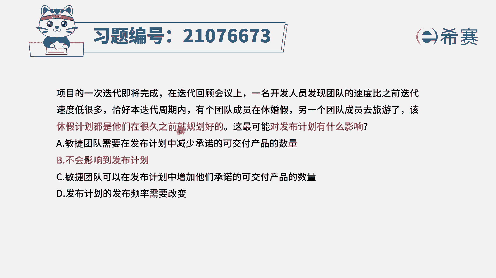

# 搞定PMP考试50%的考点，180道敏捷项目管理模拟题视频讲解，全套免费观看（题目讲解+答案解析） - P66：66 - 冬x溪 - BV1A841167ek

项目的一次迭代即将完成，在迭代回顾会议上，一名开发人员发现，团队的速度比之前迭代速度低了很多，恰好在本地的周期内，有个团队成员是在休婚假，另一个团队成员呢去旅游了，该休假的计划。

都是在他们很久之前就已经规划好的，这可能会对于发布计划有什么样的一些影响，那我们需要去了解一下啊，就是在这一轮迭代中发现速度降了很多，是因为有人去休假去了，有两个人去休假了。

而本身敏捷团队他就是一个小团队，是3~9人的这个小的自组织团队，那你跑了两个人，你肯定是影响还是比较大的，很明显对吧，但是这个休假呢它是提前就规划好的，那么这种情况对于发布计划有什么影响。

我们要知道一下发布计划，它是一个比较大的计划，他可能会是呃，比方说我们嗯在六个月或以上的时间，我们就已经定好了，这个计划在这一轮发布中，可能最终要交付的东西是有哪些，而这个发布计划呢。

最后会专门再拆分成很多个这样一个迭代计划，每一个迭代计划，它是隔了两到四周要做的一些具体事情，而题目中一般来讲，我们这种发布计划。

它都是比较早前就考虑的事情，而这个汽油价呢也是早点考虑事情，所以它的发布计划有什么影响没有，其实应该说没有什么太多影响，所以第二个选项会比较合适，不会影响到发布计划，其他几个选项我们来看一下选项，A。

敏捷团队需要在发布计划中，减少承诺的可交付产品的数量，请注意，这只是一轮迭代，我们整个一个发布计划中会包含了六轮迭代，所以它的影响不会太大，并且呢本身这个计划就是之前就已经规划好的。

所以不太会有这样一个选项，C团队可能会在发布计划中要增加他们承诺的，那当然也不会去增加啊，你现在是有人要去旅行，然后你还要再把这一轮整个大的发布中，还加更多内容，这个就不合适了。

选项D发布计划的发布频率需要去改变，需要改变吗，一般来讲，发布计划它就是会以半年周期来做的这个事情，然后会列出我们在这个半年中，最终要交付的东西是什么。

也就是在这里会要最终要部署给客户的东西，包含哪些内容，中间可能会分到很多轮迭代，每一轮迭代要去交付一部分东西，但是这都是中间产品最后有一个大的一个发布。

所以这道题目中，对于有人暂时休假的这一个小小调整，尤其是之前早就规划好了这一个小小调整，它虽然对于迭代的速度有影响，但是对整个发布来讲，其实影响是不大的，是没有什么太多影响，答案是选第二个好解析。

