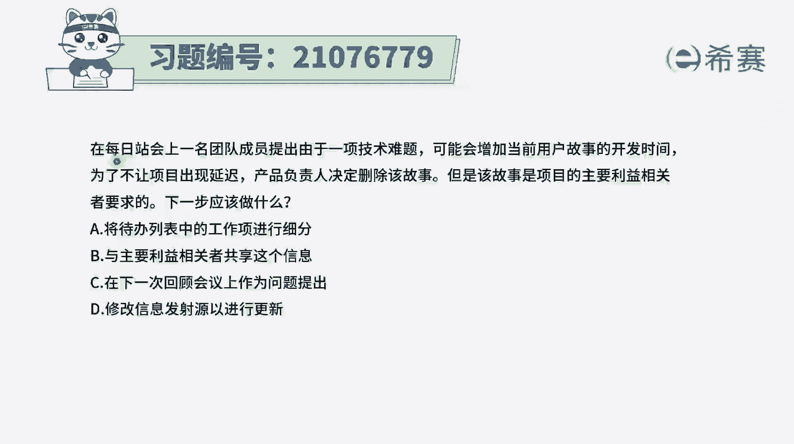
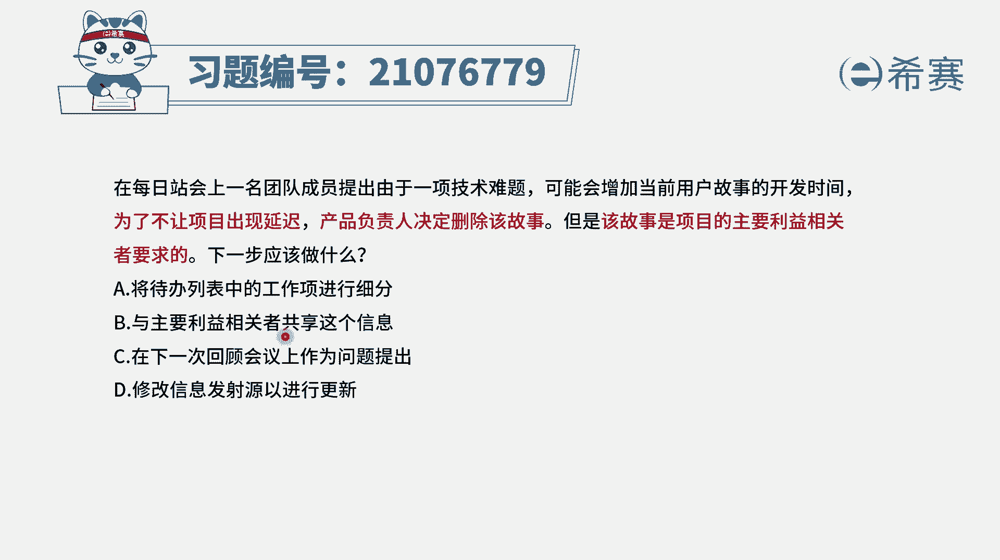
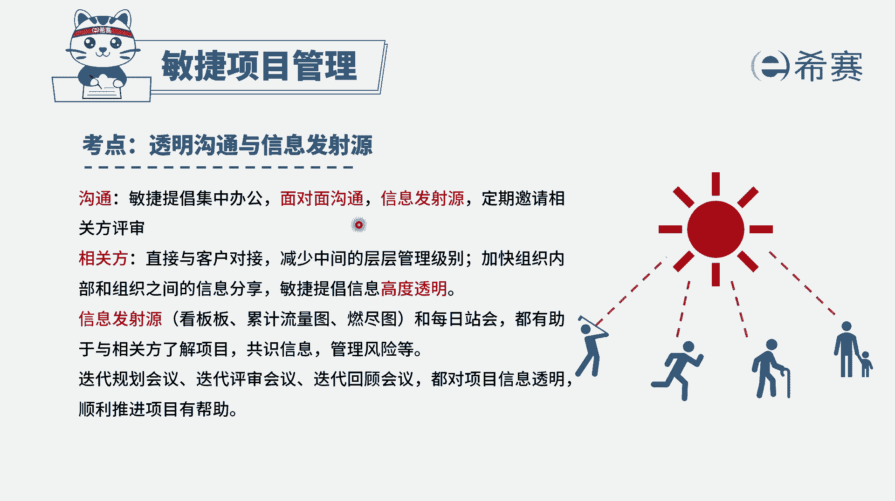
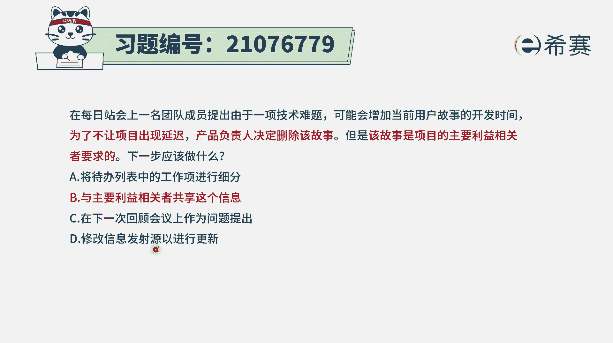
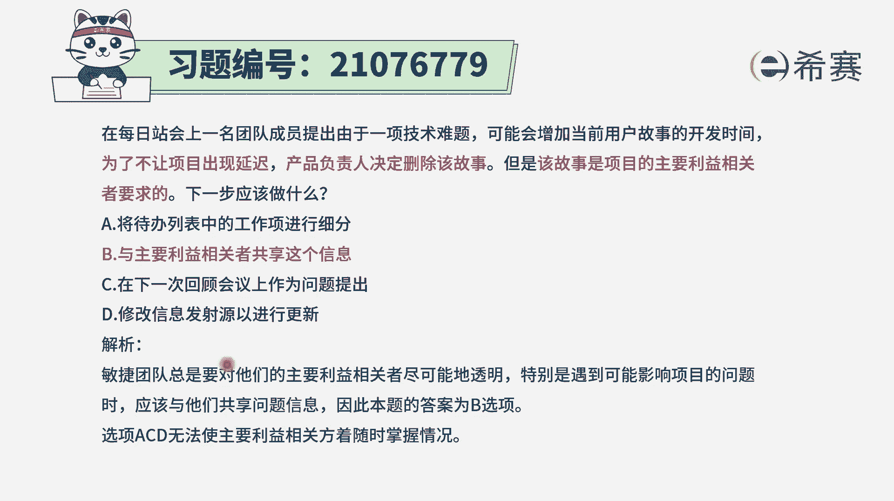

# 搞定PMP考试50%的考点，180道敏捷项目管理模拟题视频讲解，全套免费观看（题目讲解+答案解析） - P67：67 - 冬x溪 - BV1A841167ek

一名团队成员提出，由于一项技术难题，可能会增加当前用户故事的开发时间，为了不让项目出现延迟，产品负责人决定删除该故事，但是该故事是项目的主要利益相关方的要求的，那么下一步应该怎么做，那这里面有一个点。

就说因为这个某一个用户故事太难了，所以呢产品富人就决定把它删除了，但是这个用户故事又是一个重要的相关方，所要的，那么你把它删除以后，下一步应该怎么做呢，其实肯定是要去跟某些重要的相关番，去同步信息。

因为你已经通过这种方式来影响到了他的利益，那我们来看一下选项A，将带档列表中的工作项来进行细分，你这里下面才说的是，把这样一个用户故事给删掉，下一步又是做细分，这个就是直接不相关了啊。

选项B与主要利益相关者共享这个信息，也就是说我删掉了这一用户故事，这个用户故事在这一期中不去做开发，那我要去告诉你，因为这个东西是跟你有关，会影响到你的利益，所以这个选项是可选的。

选项C在下一次回顾会议上作为问题提出来，那这样的话可能就会太晚，通常情况下可能会太晚了，就信息没有及时同步的时候，尤其是当你是你的这种做法，会影响到别人利益的时候，那你还要拖那么久，这肯定是不合适的。

选项D修改信息发射语言已进行更新，这个呢本身没有错没有错，但是它不如B选项，那么直接，B选项是直接把这个信息，同步给这个主要的利益相关者，B选项是修改这个信息源，你什么时候过来看到了。

你什么时候就知道了，你没过来看到你就不知道，而这个是主动跟他知道，因为这个事情是跟他有关，那整个在敏捷中呢。

其实会重点强调是信息透明，而信息怎么样去做了这样一个高度透明，可以用这种信息发射源啊，但是我们要知道一个很重要的信息，沟通的目的是什么，沟通的目的是要去通过交换信息来达成共识。

所以我们这一次的沟通目的是要达成某种共识。

就是让他知道这个事情，所以B选项比B选项会更合适，是直接能够让这个对应的，这个主要的利益相关方，能知道我们当下正在做的这一件事情，那如果说他提出异议，我们还可以就这样一个事情去讨论。

而像D选项这种方式呢，就是他什么时候注意到，他什么时候才会知道。

就显得不够，那么积极主动的去解决问题，好解析呢。

